<!-- Generated by scripts/import-cs61b.mjs. Do not edit. -->


---

## 2.1 海象之谜

在项目 0 中，我们使用数组记录空间中 N 个物体的位置。模拟开始后，有一件事并不容易做到：改变物体的数量。原因是 Java 数组的大小固定，创建之后永远不能改变。

另一种办法是使用列表类型。你以前一定使用过列表这种数据结构。例如在 Python 中：

```python
L = [3, 5, 6]
L.append(7)
```

Java 确实内置了 `List` 类型，不过现在暂时不用它。本章将从零开始构建自己的列表，并在这一过程中学习 Java 的若干关键特性。

### 海象之谜

[视频讲解](https://youtu.be/IRwO_wahcsU)

旅程开始时，我们先来思考深奥的“海象之谜”。

尝试预测运行下面的代码会发生什么。对 `b` 的修改会影响 `a` 吗？提示：如果你来自 Python，Java 的行为与 Python 相同。

```java
Walrus a = new Walrus(1000, 8.3);
Walrus b;
b = a;
b.weight = 5;
System.out.println(a);
System.out.println(b);
```

再预测下面的代码。对 `x` 的修改会影响 `y` 吗？

```java
int x = 5;
int y;
y = x;
x = 2;
System.out.println("x is: " + x);
System.out.println("y is: " + y);
```

可以在[这里查看运行过程与答案](http://cscircles.cemc.uwaterloo.ca/java_visualize/#code=public+class+PollQuestions+%7B%0A+++public+static+void+main%28String%5B%5D+args%29+%7B%0A++++++Walrus+a+%3D+new+Walrus%281000,+8.3%29%3B%0A++++++Walrus+b%3B%0A++++++b+%3D+a%3B%0A++++++b.weight+%3D+5%3B%0A++++++System.out.println%28a%29%3B%0A++++++System.out.println%28b%29%3B++++++%0A%0A++++++int+x+%3D+5%3B%0A++++++int+y%3B%0A++++++y+%3D+x%3B%0A++++++x+%3D+2%3B%0A++++++System.out.println%28%22x+is%3A+%22+%2B+x%29%3B%0A++++++System.out.println%28%22y+is%3A+%22+%2B+y%29%3B++++++%0A+++%7D%0A+++%0A+++public+static+class+Walrus+%7B%0A++++++public+int+weight%3B%0A++++++public+double+tuskSize%3B%0A++++++%0A++++++public+Walrus%28int+w,+double+ts%29+%7B%0A+++++++++weight+%3D+w%3B%0A+++++++++tuskSize+%3D+ts%3B%0A++++++%7D%0A%0A++++++public+String+toString%28%29+%7B%0A+++++++++return+String.format%28%22weight%3A+%25d,+tusk+size%3A+%25.2f%22,+weight,+tuskSize%29%3B%0A++++++%7D%0A+++%7D%0A%7D&mode=edit)。

这个问题看起来细微，但“海象之谜”背后的核心思想会极大影响本课程中各种数据结构的效率。真正理解它，也能帮助你写出更安全、更可靠的代码。

### 比特

[视频讲解](https://youtu.be/UJlfyXRm1ts)

计算机中的所有信息，都以一串 0 和 1 的形式保存在_内存_中。例如：

* 72 常表示为 `01001000`。
* 205.75 常表示为 `01000011 01001101 11000000 00000000`。
* 字母 H 常表示为 `01001000`（与 72 相同）。
* 布尔值 `true` 常表示为 `00000001`。

本课程不会花太多时间讨论具体的二进制表示。例如，为什么 205.75 会被保存成上面那串看似随机的 32 位比特。理解这些具体表示方式属于后续课程 [CS61C](http://www-inst.eecs.berkeley.edu/~cs61c/) 的内容。

虽然我们不会深入学习二进制语言，但应当知道：计算机底层大致就是这样工作的。

一个有趣的现象是，72 与 H 都保存为 `01001000`。于是问题来了：Java 代码怎样知道应当如何解释 `01001000`？

答案是：依靠类型。来看下面的代码：

```java
char c = 'H';
int x = c;
System.out.println(c);
System.out.println(x);
```

运行后得到：

```text
H
72
```

在这个例子中，变量 `x` 与 `c` 保存着相同的比特（严格来说只是几乎相同），但 Java 解释器在输出它们时采用了不同的解释方式。

Java 有 8 种基本类型：`byte`、`short`、`int`、`long`、`float`、`double`、`boolean` 和 `char`。它们各有不同性质，课程会陆续讨论。不过 `short` 与 `float` 很可能永远都用不到。

### 声明变量（简化模型）

可以把计算机想象成拥有海量用于保存信息的内存比特，每个比特都有唯一地址。现代计算机通常拥有数十亿甚至更多这样的比特。

声明某种类型的变量时，Java 会找到一段连续的内存，其比特数量恰好足以保存该类型的值。例如，声明一个 `int` 会得到一块 32 位空间；声明一个 `byte` 会得到一块 8 位空间。Java 的不同数据类型占用不同数量的比特，不过具体数字在本课程中并不十分重要。

为了方便比喻，我们把这样的一块比特称为一个“盒子”。

除了预留内存外，Java 解释器还会在内部表格中创建一项记录，把每个变量名映射到相应盒子第一个比特的位置。

例如，声明 `int x` 和 `double y` 后，Java 可能决定用内存中的第 352 到 383 位保存 `x`，用第 20800 到 20863 位保存 `y`。解释器随后会记录：`int x` 从第 352 位开始，`y` 从第 20800 位开始。也就是说，执行：

```java
int x;
double y;
```

之后，会得到分别为 32 位和 64 位的两个盒子，如下图所示：

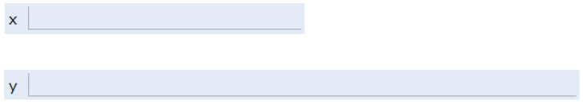

Java 语言不会让你知道这些盒子的实际位置。例如，无法通过 Java 查出 `x` 恰好位于第 352 位。换句话说，精确内存地址低于 Java 向程序员开放的抽象层级。C 等语言则不同，它们允许程序员询问某份数据的准确地址。因此，上图没有标出地址。

Java 的这一特性是一种权衡。向程序员隐藏内存位置会减少控制能力，使某些[优化方式](http://www.informit.com/articles/article.aspx?p=2246428&seqNum=5)无法实现；但它也避免了[大量极其棘手的编程错误](http://www.informit.com/articles/article.aspx?p=2246428&seqNum=1)。在计算资源十分廉价的现代，这种权衡通常非常值得。正如 Donald Knuth 的名言：“大约 97% 的时间里，我们都应忘掉那些微小的效率问题；过早优化是万恶之源。”

打个比方，你不能直接控制自己的心跳。虽然这限制了你在某些情形下对身体进行“优化”的能力，但也避免了不小心把心跳关闭之类的愚蠢错误。

声明变量时，Java 不会立刻向预留的盒子中写入任何内容。换句话说，局部变量没有默认值。因此，在通过 `=` 运算符向盒子中填入比特之前，Java 编译器会阻止你使用该变量。正因为如此，上图的盒子里没有画任何比特。

给内存盒赋值时，它会被填入你指定的比特。例如执行：

```java
x = -1431195969;
y = 567213.112;
```

之后，上面的内存盒会被填成下图所示的样子。我把这种表示方式称为**盒子记法**。

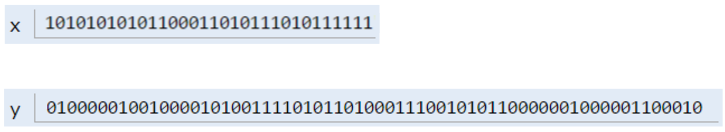

上方的比特表示 -1431195969，下方的比特表示 567213.112。为什么这些特定比特序列能表示这两个数字并不重要，它属于 CS61C 的内容。感兴趣的话，可以阅读维基百科上的[整数表示](https://en.wikipedia.org/wiki/Two%27s_complement)与[双精度浮点数表示](https://en.wikipedia.org/wiki/IEEE_floating_point)。

注意：真实的内存分配比这里描述的更加复杂，也是 CS61C 的主题。不过对于 CS61B 来说，这个模型已经足够接近现实。

#### 简化盒子记法

上一节的盒子记法有助于大致理解底层发生的事情，但在实践中并不好用，因为我们通常不会直接解读二进制比特。

因此，之后不再用二进制写出内存盒的内容，而是改用人类可读的符号。本课程余下部分都会采用这种方式。例如执行：

```java
int x;
double y;
x = -1431195969;
y = 567213.112;
```

后，可以用下面这种我称为**简化盒子记法**的形式表示程序环境：

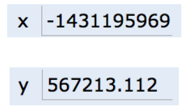

### 等号黄金法则（GRoE）

有了简化盒子记法，我们终于可以开始解开海象之谜。

这个谜题其实有一个简单答案：当你写出 `y = x` 时，你是在要求 Java 解释器把 `x` 中的比特复制到 `y` 中。这个“等号黄金法则”（Golden Rule of Equals，简称 GRoE）是理解海象之谜时最根本的真理。

```java
int x = 5;
int y;
y = x;
x = 2;
System.out.println("x is: " + x);
System.out.println("y is: " + y);
```

在 Java 中，任何使用 `=` 的赋值都遵循“复制比特”这一简单规则。可以通过[这个可视化链接](http://cscircles.cemc.uwaterloo.ca/java_visualize/#code=public+class+PollQuestions+%7B%0A+++public+static+void+main%28String%5B%5D+args%29+%7B%0A++++++int+x+%3D+5%3B%0A++++++int+y%3B%0A++++++y+%3D+x%3B%0A++++++x+%3D+2%3B%0A++++++System.out.println%28%22x+is%3A+%22+%2B+x%29%3B%0A++++++System.out.println%28%22y+is%3A+%22+%2B+y%29%3B++++++%0A+++%7D%0A%7D&mode=display&curInstr=0)观察它。

### 引用类型

前面提到 Java 有 8 种基本类型：`byte`、`short`、`int`、`long`、`float`、`double`、`boolean`、`char`。除此之外的所有类型，包括数组，都不是基本类型，而是`引用类型`。

#### 对象实例化

[视频讲解](https://youtu.be/-eUMI5o31wY)

使用 `new` 实例化一个对象（例如 `Dog`、`Walrus` 或 `Planet`）时，Java 首先为该类的每个实例变量分配一个盒子，并填入默认值。随后，构造方法通常会为每个盒子填入其他值，不过并非所有构造方法都一定这样做。

例如，假设 `Walrus` 类如下：

```java
public static class Walrus {
    public int weight;
    public double tuskSize;

    public Walrus(int w, double ts) {
          weight = w;
          tuskSize = ts;
    }
}
```

如果使用 `new Walrus(1000, 8.3);` 创建一只海象，那么最终会得到一只由两个盒子组成的 `Walrus`，它们分别占 32 位与 64 位：

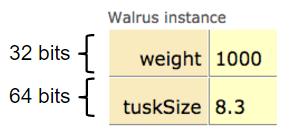

在真实的 Java 实现中，每个对象还会产生一些额外开销，因此一只 `Walrus` 实际占用的空间会略多于 96 位。不过本课程会忽略这些开销，因为我们不会直接与它们交互。

此时创建出的海象是“匿名”的：对象已经存在，却没有保存在任何变量中。下面来看保存对象的变量。

#### 引用变量声明

声明任意引用类型的变量（如 `Walrus`、`Dog`、`Planet` 或数组）时，无论对象类型是什么，Java 都会分配一个 64 位的盒子。

乍看之下，这似乎产生了“海象悖论”：上一节中的 `Walrus` 需要超过 64 位才能保存。而且无论对象是什么类型，变量竟然都只获得 64 位空间，看上去很奇怪。

下面这个事实可以轻松化解问题：64 位盒子里保存的并不是海象本身的数据，而是海象对象在内存中的地址。

例如，假设执行：

```java
Walrus someWalrus;
someWalrus = new Walrus(1000, 8.3);
```

第一行创建一个 64 位盒子。第二行创建新的 `Walrus`，`new` 运算符会返回它的地址。按照 GRoE，这些地址比特随后被复制到 `someWalrus` 的盒子中。

假设海象的 `weight` 从内存第 `5051956592385990207` 位开始保存，`tuskSize` 从第 `5051956592385990239` 位开始，那么 `Walrus` 变量中可能保存数字 `5051956592385990207`。它的 64 位二进制表示为 `0100011000011100001001111100000100011101110111000001111000111111`，盒子记法如下：

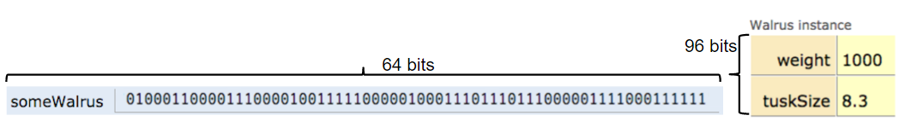

引用变量还可以被赋予特殊值 `null`，它对应全 0 的地址。

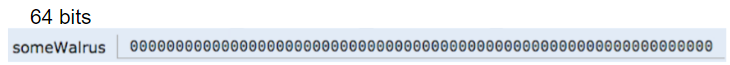

#### 盒子与指针记法

和之前一样，引用变量内部的一串比特不容易解读，因此我们为引用变量定义一种简化记法：

* 地址全部为 0 时，用 `null` 表示。
* 地址非 0 时，用一根指向对象实例的**箭头**表示。

这种表示方式有时也称为“盒子与指针记法”。

上一节的两个例子可以表示为：

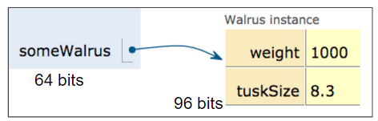

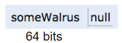

#### 彻底解开海象之谜

现在终于能够完整、彻底地解开海象之谜了。

```java
Walrus a = new Walrus(1000, 8.3);
Walrus b;
b = a;
```

执行第一行后，得到：

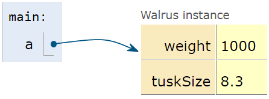

执行第二行后，得到：

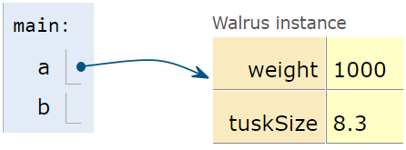

注意，此时 `b` 是未定义的，而不是 `null`。

根据 GRoE，最后一行只是把 `a` 盒子中的比特复制到 `b` 盒子中。用图形比喻来说，`b` 会复制 `a` 中的那根箭头，因此两个变量最终都指向同一个对象。

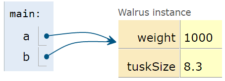

就这么简单，没有更多隐藏的复杂性。

### 参数传递

[视频讲解](https://youtu.be/3hiXeB8rNKA)

向函数传递参数时，同样只是在复制比特。换句话说，GRoE 也适用于参数传递。复制比特通常称为“按值传递”。Java **始终**采用按值传递。

例如，考虑下面的函数：

```java
public static double average(double a, double b) {
    return (a + b) / 2;
}
```

假设这样调用：

```java
public static void main(String[] args) {
    double x = 5.5;
    double y = 10.5;
    double avg = average(x, y);
}
```

执行这个方法的前两行后，`main` 方法的作用域中会有两个名为 `x` 和 `y` 的盒子，内容如下：

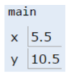

调用函数时，`average` 函数拥有**自己的**作用域，其中有两个新的盒子 `a` 与 `b`，参数的比特只是被_复制_进去。所谓“按值传递”，指的正是这一复制过程。

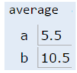

如果 `average` 函数修改了 `a`，`main` 中的 `x` 不会改变。根据 GRoE，我们只是向名为 `a` 的盒子中写入了新的比特。

#### 检验理解

[视频讲解](https://youtu.be/zGdNjPZxIdA)

**练习 2.1.1：** 假设有下面的代码：

```java
public class PassByValueFigure {
    public static void main(String[] args) {
           Walrus walrus = new Walrus(3500, 10.5);
           int x = 9;

           doStuff(walrus, x);
           System.out.println(walrus);
           System.out.println(x);
    }

    public static void doStuff(Walrus W, int x) {
           W.weight = W.weight - 100;
           x = x - 5;
    }
}
```

调用 `doStuff` 会影响 `walrus` 和/或 `x` 吗？提示：只需使用 GRoE 就能解决。

### 数组实例化

[视频讲解](https://youtu.be/t57Xi1G__Vc)

如前所述，保存数组的变量与其他引用变量完全一样。例如下面的声明：

```java
int[] x;
Planet[] planets;
```

两条声明都会创建一个 64 位的内存盒。`x` 只能保存 `int` 数组的地址，`planets` 只能保存 `Planet` 数组的地址。

实例化数组与实例化对象非常相似。例如，按照下面的方式创建一个长度为 5 的整数数组：

```text
x = new int[]{0, 1, 2, 95, 4};
```

`new` 关键字会创建 5 个各占 32 位的盒子，并返回整个数组对象的地址，再将它赋给 `x`。

如果丢失了表示地址的比特，对象也可能随之“丢失”。例如，若某只 `Walrus` 的地址只有一份副本，且保存在 `x` 中，那么执行 `x = null` 后，就会永远失去访问这只海象的能力。这不一定是坏事，因为你经常会确认某个对象已经用完，此时直接丢弃引用完全合理。本章稍后构建列表时就会看到这种情况。

#### 破沙发定律

你可能会问：为什么要用这么多篇幅讨论一件看起来微不足道的事？如果你以前学过 Java，这种感觉可能尤其强烈。原因在于，学生很容易对这一问题形成一种半懂不懂的认识——代码能写出来，却没有真正理解底层究竟发生了什么。

短期内这也许没有问题，但从长期来看，如果总是在没有充分理解的情况下做题，后面可能会因此彻底卡住。关于这个所谓的[“破沙发定律”](https://mathwithbaddrawings.com/2015/04/08/the-math-ceiling-wheres-your-cognitive-breaking-point/)，有一篇值得阅读的博客文章。

### IntList

[视频讲解](https://youtu.be/TzuAiXTZmYo)

真正理解海象之谜后，我们就可以构建自己的列表类了。

事实证明，一个非常基础的列表实现极其简单：

```java
public class IntList {
    public int first;
    public IntList rest;        

    public IntList(int f, IntList r) {
        first = f;
        rest = r;
    }
}
```

你可能记得在 CS61A 中见过类似结构，它称为“链表”。

不过这种列表用起来很难看。例如，要创建包含 5、10、15 的列表，可以这样写：

```java
IntList L = new IntList(5, null);
L.rest = new IntList(10, null);
L.rest.rest = new IntList(15, null);
```

也可以反向构建列表。代码稍微整洁一些，但更难理解：

```java
IntList L = new IntList(15, null);
L = new IntList(10, L);
L = new IntList(5, L);
```

原则上，`IntList` 可以保存任意整数列表，但最终代码会非常丑陋，而且容易出错。我们将采用面向对象编程的常见策略：向类中添加辅助方法，用来完成基本操作。

#### `size` 与 `iterativeSize`

我们希望给 `IntList` 类添加 `size` 方法，使调用 `L.size()` 时能够得到 `L` 中的元素数量。

继续阅读之前，可以尝试自己编写 `size` 和 `iterativeSize`。`size` 应使用递归，而 `iterativeSize` 不使用递归。先自己尝试，再看我的做法，通常能学到更多。下面两个视频演示了可能的实现过程。

[递归实现视频](https://youtu.be/EEaP1oC1CFU)

[迭代实现视频](https://youtu.be/GL9Bg3Ej_94)

我的 `size` 方法如下：

```java
/** Return the size of the list using... recursion! */
public int size() {
    if (rest == null) {
        return 1;
    }
    return 1 + this.rest.size();
}
```

编写递归代码时，最重要的是记住必须有基本情况。在这里，最合理的基本情况是 `rest` 为 `null`，这意味着当前列表长度为 1。

练习：你可能会想，为什么不写成 `if (this == null) return 0;`？这种写法为什么不能工作？

答案：想想调用 `size` 时发生了什么。方法是通过某个对象调用的，例如 `L.size()`。如果 `L` 为 `null`，那么调用方法时就已经产生 `NullPointerException`，根本不可能进入方法内部。

我的 `iterativeSize` 方法如下。编写数据结构的迭代代码时，我建议把指针变量命名为 `p`，提醒自己它保存的是一个指针。必须使用额外指针，是因为 Java 不允许重新给 `this` 赋值。[这篇 Stack Overflow 帖子](https://stackoverflow.com/questions/23021377/reassign-this-in-java-class)中的后续回答对原因作了简要说明。

```java
/** Return the size of the list using no recursion! */
public int iterativeSize() {
    IntList p = this;
    int totalSize = 0;
    while (p != null) {
        totalSize += 1;
        p = p.rest;
    }
    return totalSize;
}
```

#### `get`

[视频讲解](https://youtu.be/qnmxD_21DNk)

`size` 方法可以得到列表长度，但目前还没有方便的方式取得列表中的第 `i` 个元素。

练习：编写方法 `get(int i)`，返回列表的第 `i` 个元素。例如，若 `L` 是 `5 -> 10 -> 15`，那么 `L.get(0)` 应返回 5，`L.get(1)` 应返回 10，`L.get(2)` 应返回 15。对于过大或过小的非法 `i`，代码如何表现都无所谓。

解答请参阅上面的课程视频或 `lectureCode` 仓库。

注意，我们写出的这个方法需要线性时间。也就是说，如果列表长度为 1,000,000，取得最后一个元素所需时间会远多于在短列表中取元素。后续课程会介绍另一种列表实现，从而避免这个问题。

#### 接下来做什么

* [实验环境配置](http://sp19.datastructur.es/materials/lab/lab2setup/lab2setup)
* [实验 2](http://sp19.datastructur.es/materials/lab/lab2/lab2)

---

## 2.2 SLList

在 2.1 节中，我们构建了 `IntList` 类。从技术上说，这种列表数据结构能够完成列表应做的所有事情；但在实际使用中，`IntList` 相当别扭，会导致代码难以阅读和维护。

根本问题在于，`IntList` 是一种我称为**裸递归**的数据结构。为了正确使用 `IntList`，程序员即便只完成简单的列表操作，也必须理解并运用递归。这限制了它对初学者的适用性；而且根据 `IntList` 类提供了哪些辅助方法，还可能引入一整类棘手的新错误。

吸取 `IntList` 的经验后，我们将构建一个新类 `SLList`。它与现代编程语言中程序员真正使用的列表实现更加相似。我们会通过一连串逐步改进完成它。

#### 改进 1：重新命名

[视频讲解](https://youtu.be/1Rh3AdTxcik)

上一节的 `IntList` 类如下，辅助方法已省略：

```java
public class IntList {
    public int first;
    public IntList rest;

    public IntList(int f, IntList r) {
        first = f;
        rest = r;
    }
...
```

第一步只是重命名所有内容，并删掉辅助方法。这看起来也许不像进步，但请相信我，我是专业的。

```java
public class IntNode {
    public int item;
    public IntNode next;

    public IntNode(int i, IntNode n) {
        item = i;
        next = n;
    }
}
```

#### 改进 2：增加一层“行政机构”

[视频讲解](https://youtu.be/63GyeGDLAbw)

既然 `IntNode` 很难直接操作，我们创建一个独立的 `SLList` 类，让用户只与它交互。最基本的类如下：

```java
public class SLList {
    public IntNode first;

    public SLList(int x) {
        first = new IntNode(x, null);
    }
}
```

现在已经能隐约看出 `SLList` 更好的原因。比较创建一个只含一个元素的 `IntList` 和创建一个只含一个元素的 `SLList`：

```java
IntList L1 = new IntList(5, null);
SLList L2  = new SLList(5);
```

`SLList` 向用户隐藏了末尾存在一条 `null` 链接的实现细节。当前的 `SLList` 还不算实用，所以先添加两个简单的热身方法：`addFirst` 和 `getFirst`。继续阅读之前，可以尝试自己实现。

#### `addFirst` 与 `getFirst`

[视频讲解](https://youtu.be/inV6cAEERRI)

如果理解了 2.1 节，`addFirst` 相当直接。使用 `IntList` 时，我们通过 `L = new IntList(5, L)` 在开头加入元素。因此实现为：

```java
public class SLList {
    public IntNode first;

    public SLList(int x) {
        first = new IntNode(x, null);
    }

    /** Adds an item to the front of the list. */
    public void addFirst(int x) {
        first = new IntNode(x, first);
    }
}
```

`getFirst` 更简单，只需返回 `first.item`：

```java
/** Retrieves the front item from the list. */
public int getFirst() {
    return first.item;
}
```

最终的 `SLList` 类用起来容易得多。比较下面的代码：

```java
SLList L = new SLList(15);
L.addFirst(10);
L.addFirst(5);
int x = L.getFirst();
```

与等价的 `IntList` 代码：

```java
IntList L = new IntList(15, null);
L = new IntList(10, L);
L = new IntList(5, L);
int x = L.first;
```

两种数据结构的图形对比如下，上方是 `IntList`，下方是 `SLList`：

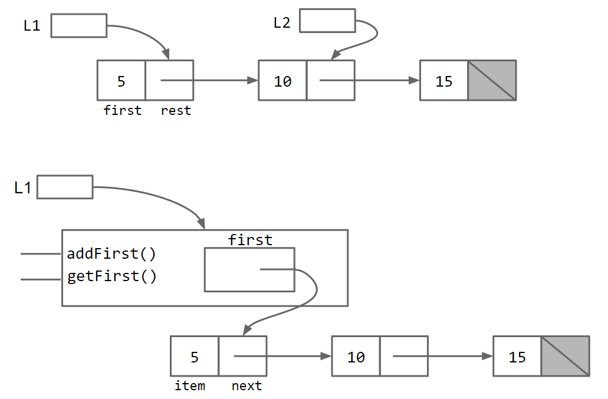

本质上，`SLList` 类充当了列表用户与裸递归数据结构之间的中间人。前面的 `IntList` 版本存在一个不太理想的可能：用户可以让变量直接指向 `IntList` 的中间位置。正如奥维德所说，[凡人直视神明便会死去](https://en.wikipedia.org/wiki/Semele)，因此最好让 `SLList` 担任我们与底层结构之间的中介。

**练习 2.2.1：** 好奇的读者可能会反驳：只要给 `IntList` 写一个 `addFirst` 方法，它也会同样好用。请尝试为 `IntList` 类编写 `addFirst`。你会发现，最终的方法既难写又低效。

#### 改进 3：`public` 与 `private`

[视频讲解](https://youtu.be/SlCnrzn_bfM)

遗憾的是，用户仍能绕过 `SLList`，直接接触裸数据结构的原始力量以及随之而来的危险。程序员可以不经过经过儿童测试、母亲认可的 `addFirst` 方法，而直接修改列表，例如：

```java
SLList L = new SLList(15);
L.addFirst(10);
L.first.next.next = L.first.next;
```

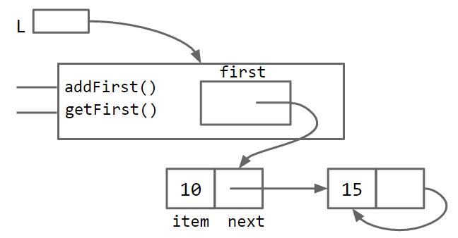

结果是一个包含无限循环的畸形列表。为解决这个问题，可以修改 `SLList`，使用 `private` 关键字声明 `first`：

```java
public class SLList {
    private IntNode first;
...
```

私有变量和私有方法只能由同一个 `.java` 文件中的代码访问；在这里就是 `SLList.java`。因此，下面的 `SLLTroubleMaker` 类无法编译，并会产生 `first has private access in SLList` 错误。

```java
public class SLLTroubleMaker {
    public static void main(String[] args) {
        SLList L = new SLList(15);
        L.addFirst(10);
        L.first.next.next = L.first.next;
    }
}
```

相比之下，`SLList.java` 文件内部的任何代码仍可以访问 `first`。

限制访问权限可能显得有点傻。毕竟，`private` 做的似乎只是让原本能编译的程序无法编译。然而在大型软件工程项目中，`private` 是极其宝贵的信号：它告诉最终用户，某些代码细节可以忽略，因此无需理解。相应地，`public` 应被理解为一种承诺：这个方法可供使用，而且将**永远**像现在这样工作。

可以把类比成汽车。汽车具有一些 `public` 功能，例如油门与刹车踏板；引擎盖下面则藏着它们如何工作的 `private` 细节。燃油车的油门可能控制喷油系统，电动车的油门可能调整电池向电机输送的功率。尽管不同汽车内部实现不同，我们期望所有油门踏板表现一致。随意改变这种公开行为会让用户极度困惑，甚至造成严重事故。

**创建 `public` 成员（方法或变量）时一定要谨慎，因为你实际上是在承诺：今后永远支持它当前的行为。**

#### 改进 4：嵌套类

目前有两个 `.java` 文件：`IntNode` 和 `SLList`。不过 `IntNode` 其实只是 `SLList` 故事中的配角。

Java 正好允许在一个类内部嵌入另一个类的声明。语法直接而自然：

```java
public class SLList {
       public class IntNode {
            public int item;
            public IntNode next;
            public IntNode(int i, IntNode n) {
                item = i;
                next = n;
            }
       }

       private IntNode first; 

       public SLList(int x) {
           first = new IntNode(x, null);
       } 
...
```

嵌套类不会对代码性能产生有意义的影响，它只是组织代码的工具。更多内容请参阅 [Oracle 官方文档](https://docs.oracle.com/javase/tutorial/java/javaOO/nested.html)。

如果嵌套类完全不需要使用 `SLList` 的任何实例方法或实例变量，可以把它声明为 `static`，如下所示。把嵌套类声明为 `static`，意味着静态嵌套类中的方法不能访问外部类的成员。在本例中，`IntNode` 中的任何方法都不能访问 `first`、`addFirst` 或 `getFirst`。

```java
public class SLList {
       public static class IntNode {
            public int item;
            public IntNode next;
            public IntNode(int i, IntNode n) {
                item = i;
                next = n;
            }
       }

       private IntNode first;
...
```

这样可以节省一点内存，因为每个 `IntNode` 不再需要记录如何访问包围它的 `SLList`。

换个角度看，上面的 `IntNode` 类从未使用 `SLList` 的 `first` 变量，也没有使用 `SLList` 的任何方法。因此可以加上 `static`，使 `IntNode` 不必持有对自己“老板”的引用，从而省下一小块内存。

如果这段内容显得过于技术化、不易理解，请尝试练习 2.2.2。一个简单经验法则是：_如果嵌套类不使用外部类的任何实例成员，就把它声明为静态嵌套类。_

**练习 2.2.2：** 尽可能少地删除 `static`，使[这个程序](https://github.com/joshhug/hug61b/tree/e1d84817521747a76f17d2ed077abab493505c3f/chap2/exercises/Government.java)能够编译。点击链接并确认网址发生变化后，请刷新页面。开始练习前务必阅读文件顶部的注释。

#### `addLast()` 与 `size()`

[视频讲解](https://youtu.be/Gxq_LSsOPNc)

为了引出剩余的改进，并展示数据结构实现中的一些常见模式，我们添加 `addLast(int x)` 和 `size()` 方法。建议先下载[起始代码](https://github.com/Berkeley-CS61B/lectureCode/blob/master/lists2/DIY/addLastAndSize/SLList.java)，在继续阅读前自己尝试。尤其建议尝试递归实现 `size`，其中有一个很有意思的挑战。

我会迭代实现 `addLast`，当然也可以递归实现。思路很直接：创建指针变量 `p`，让它沿列表移动到末尾。

```java
/** Adds an item to the end of the list. */
public void addLast(int x) {
    IntNode p = first;

    /* Advance p to the end of the list. */
    while (p.next != null) {
        p = p.next;
    }
    p.next = new IntNode(x, null);
}
```

相对地，我会递归实现 `size`。它与 2.1 节中为 `IntList` 实现的 `size` 有些相似。

`IntList` 的递归调用很直接：`return 1 + this.rest.size()`。但对 `SLList` 来说，这种方式没有意义，因为 `SLList` 没有 `rest` 变量。我们改用中间人类常见的模式：创建一个私有辅助方法，让它直接与底层裸递归数据结构交互。

得到的方法如下：

```java
/** Returns the size of the list starting at IntNode p. */
private static int size(IntNode p) {
    if (p.next == null) {
        return 1;
    }

    return 1 + size(p.next);
}
```

有了它，就能轻松计算整个列表的长度：

```java
public int size() {
    return size(first);
}
```

这里有两个都名为 `size` 的方法。Java 允许这样做，因为它们的参数不同。名称相同但签名不同的方法称为**重载方法**。更多信息请参阅 Java 的[官方文档](https://docs.oracle.com/javase/tutorial/java/javaOO/methods.html)。

另一种做法是在 `IntNode` 类本身中创建一个非静态辅助方法。两种方式都没有问题，不过我个人更喜欢让 `IntNode` 中完全不包含方法。

### 改进 5：缓存

[视频讲解](https://youtu.be/ebUw8fhhpKc)

思考上面写出的 `size` 方法。假设对长度为 1,000 的列表调用 `size` 需要 2 秒，那么对长度为 1,000,000 的列表调用它，预计需要 2,000 秒，因为计算机必须经过 1,000 倍的元素才能抵达末尾。大型列表上的 `size` 如此缓慢是不可接受的，因为我们明明可以做得更好。

可以重写 `size`，让它无论面对多大的列表都花费相同时间。

做法很简单：在 `SLList` 中增加一个 `size` 变量，持续记录当前长度。代码如下。保存重要数据以加快后续读取的做法，有时称为**缓存**。

```java
public class SLList {
    ... /* IntNode declaration omitted. */
    private IntNode first;
    private int size;

    public SLList(int x) {
        first = new IntNode(x, null);
        size = 1;
    }

    public void addFirst(int x) {
        first = new IntNode(x, first);
        size += 1;
    }

    public int size() {
        return size;
    }
    ...
}
```

修改后，无论列表多大，`size` 都快得惊人。当然，这会让 `addFirst` 和 `addLast` 稍微变慢，也会略微增加类的内存占用，但代价微不足道。在这里，为长度建立缓存显然值得。

#### 改进 6：空列表

[视频讲解](https://youtu.be/GaOL52PuYcw)

与 2.1 节中简单的 `IntList` 相比，`SLList` 已经具有许多优点：

* `SLList` 的用户永远不会看到 `IntNode` 类。
  * 使用更简单。
  * `addFirst` 更高效（见练习 2.2.1）。
  * 避免 `IntList` 用户无意犯错或故意破坏结构。
* `size` 可以比 `IntList` 中的实现更快。

另一个自然优势是：很容易实现创建空列表的构造方法。最自然的方案是，空列表令 `first` 为 `null`：

```java
public SLList() {
    first = null;
    size = 0;
}
```

遗憾的是，向空列表插入元素时，这会导致 `addLast` 崩溃。因为 `first` 是 `null`，下面代码在 `while (p.next != null)` 中访问 `p.next` 时，会产生空指针异常。

```java
public void addLast(int x) {
    size += 1;
    IntNode p = first;
    while (p.next != null) {
        p = p.next;
    }

    p.next = new IntNode(x, null);
}
```

**练习 2.2.3：** 修复 `addLast`。起始代码在[这里](https://github.com/Berkeley-CS61B/lectureCode/blob/master/lists2/DIY/fixAddLast/SLList.java)。

#### 改进 6b：哨兵结点

[视频讲解](https://youtu.be/HafzSAm3DPE)

修复 `addLast` 的一种办法是为空列表添加特殊情况：

```java
public void addLast(int x) {
    size += 1;

    if (first == null) {
        first = new IntNode(x, null);
        return;
    }

    IntNode p = first;
    while (p.next != null) {
        p = p.next;
    }

    p.next = new IntNode(x, null);
}
```

这段代码能够工作，但应尽可能避免这样的特殊情况。人的工作记忆容量有限，因此应尽量控制复杂性。对于 `SLList` 这种简单数据结构，特殊情况还不多；而树等更复杂的数据结构一旦充满特殊情况，会变得难看得多。

更整洁但没那么直观的方案，是让所有 `SLList` 即使为空，也具有同一种结构。可以创建一个始终存在的特殊结点，称为**哨兵结点**。哨兵结点会保存一个值，但我们完全不关心这个值是什么。

例如，由 `SLList L = new SLList()` 创建的空列表如下：


包含 5、10、15 的 `SLList` 如下：


图中淡紫色的 `??` 表示我们不关心该位置的值。Java 不允许把问号放进整数变量，所以实际代码中只需选择任意值，例如 -518273、63 或其他数字。

采用哨兵后，`SLList` 不再需要空列表特殊情况，因此可以直接从 `addLast` 中删掉相关分支：

```java
public void addLast(int x) {
    size += 1;
    IntNode p = sentinel;
    while (p.next != null) {
        p = p.next;
    }

    p.next = new IntNode(x, null);
}
```

可以看到，代码整洁得多。

#### 不变量

[视频讲解](https://youtu.be/Y8i0MpxC2yE)

不变量是关于数据结构的一个事实；只要代码没有错误，它就保证始终成立。

带哨兵结点的 `SLList` 至少具有以下不变量：

* `sentinel` 引用始终指向哨兵结点。
* 如果存在第一个实际元素，它始终位于 `sentinel.next.item`。
* `size` 变量始终等于已加入列表的实际元素总数。

不变量让我们更容易对代码进行推理，也为验证代码正确性提供了明确目标。

要真正体会哨兵的便利，需要亲自深入实现。项目 1 会提供大量练习。不过建议完成本书下一节后再开始项目 1。

##### 接下来做什么

本节没有额外任务。如果你正在修读 Berkeley 的正式课程，现在可以开始实验 2。

---

## 2.3 DLList

在 2.2 节中，我们构建了 `SLList` 类。与更早的裸递归 `IntList` 相比，它已经好得多。本节将结束链表部分的讨论，同时开始学习数组的基础知识，为后面基于数组的列表 `AList` 做准备。在这一过程中，我们还会揭晓上一节为什么使用 `SLList` 这个有些别扭的名字。

### `addLast`

[视频讲解](https://youtu.be/P1grp1MDZQo)

回顾上一节的 `addLast(int x)` 方法：

```java
public void addLast(int x) {
    size += 1;
    IntNode p = sentinel;
    while (p.next != null) {
        p = p.next;
    }

    p.next = new IntNode(x, null);
}
```

这个方法的问题是速度较慢。面对很长的列表，`addLast` 必须从头走完整个列表，这和 2.2 节中的 `size` 问题很相似。我们同样可以增加一个 `last` 变量来加速：

```java
public class SLList {
    private IntNode sentinel;
    private IntNode last;
    private int size;    

    public void addLast(int x) {
        last.next = new IntNode(x, null);
        last = last.next;
        size += 1;
    }
    ...
}
```

**练习 2.3.1：** 请观察下面表示该 `SLList` 实现的盒子与指针图，其中包含 `last` 指针。假设我们希望支持 `addLast`、`getLast` 和 `removeLast`。图中的结构能让这三个操作都快速完成吗？如果不能，哪些操作较慢？

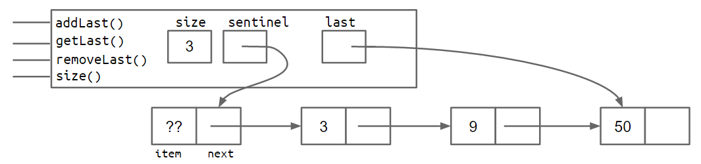

**练习 2.3.1 答案：** `addLast` 与 `getLast` 会很快，但 `removeLast` 很慢。原因是删除最后一个结点后，需要更新 `last`，但当前结构无法方便地找到倒数第二个结点。

### 倒数第二个结点

[视频讲解](https://youtu.be/qqekL43M8FU)

练习 2.3.1 中结构的问题在于：删除列表最后一个元素的方法必然很慢。我们必须先找到倒数第二个元素，再把它的 `next` 指针设为 `null`。增加一个 `secondToLast` 指针也无济于事，因为删除最后一个元素后，又必须找到倒数第三个元素，才能让 `secondToLast` 和 `last` 继续满足相应不变量。

**练习 2.3.2：** 设计一种方案，使 `removeLast` 无论列表多长都能在常数时间内完成。暂时不必写代码，项目 1 会完成实现。只需要思考应如何修改列表的结构，也就是它的实例变量。

答案将在“改进 7”中说明。

### 改进 7：向后看

[视频讲解](https://youtu.be/BspFdzVvYe8)

解决问题最自然的方法，是为每个 `IntNode` 添加一个指向前驱结点的指针：

```java
public class IntNode {
    public IntNode prev;
    public int item;
    public IntNode next;
}
```

也就是说，现在每个结点都有两条链接。这种列表通常称为“双向链表”，简称 `DLList`。与之相对，2.2 节中只有单向链接的列表称为“单向链表”，简称 `SLList`。这就是之前那个名称的由来。

增加额外指针会提高代码复杂度。这里不逐行带你实现，而是留到项目 1 中自行构建双向链表。下面的盒子与指针图分别展示长度为 0 和长度为 2 的双向链表。

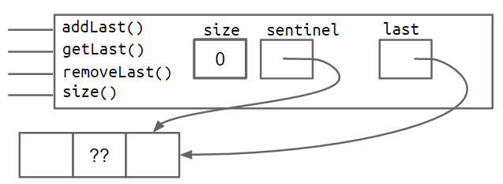


### 改进 8：升级哨兵

后向指针使列表能够在常数时间内完成首尾两端的添加、读取与删除。不过这种设计有一个微妙问题：`last` 有时指向哨兵结点，有时又指向真实结点。和没有哨兵的 `SLList` 一样，这会产生特殊情况，使代码比经过第 8 次、也是最后一次改进后的代码丑陋得多。（你能想到 `DLList` 中哪些方法会出现特殊情况吗？）

一种修复方式是在列表末尾再添加第二个哨兵结点。结构如下：


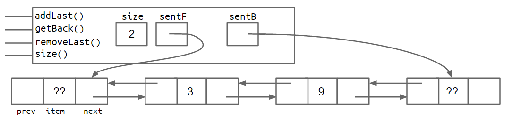

另一种办法是把列表实现为环形结构，让首尾指针共享同一个哨兵结点。


双哨兵和环形哨兵两种方案都能工作，而且都能消除难看的特殊情况。我个人认为环形方案更加整洁、也更美观。这里不讨论具体实现细节，因为项目 1 会让你亲自探索其中一种或两种方案。

### 泛型 DLList

[视频讲解](https://youtu.be/Xt4dKEUokz4)

当前的 `DLList` 有一个严重限制：只能保存整数。例如，假设希望创建一个字符串列表：

```java
DLList d2 = new DLList("hello");
d2.addLast("world");
```

上面的代码会失败，因为 `DLList` 的构造方法和 `addLast` 只接受整数参数。

幸运的是，Java 的设计者在 2004 年为语言加入了**泛型**。泛型的用途之一，就是让我们创建能够保存任意引用类型的数据结构。

泛型语法一开始可能有点奇怪。基本思想是：在类声明的类名后面，用尖括号 `<>` 包住一个任意的类型占位符。之后凡是需要使用这个任意类型的地方，就写这个占位符。

原来的 `DLList` 声明如下：

```java
public class DLList {
    private IntNode sentinel;
    private int size;

    public class IntNode {
        public IntNode prev;
        public int item;
        public IntNode next;
        ...
    }
    ...
}
```

能够保存任意类型的泛型 `DLList` 如下：

```java
public class DLList<BleepBlorp> {
    private IntNode sentinel;
    private int size;

    public class IntNode {
        public IntNode prev;
        public BleepBlorp item;
        public IntNode next;
        ...
    }
    ...
}
```

这里的 `BleepBlorp` 只是我随口编出的名称。你几乎可以换成任意其他名称，例如 `GloopGlop`、`Horse`、`TelbudorphMulticulus` 等。

定义好泛型版本的 `DLList` 后，实例化时也必须使用特殊语法。声明变量时，把实际需要的类型写在尖括号中；实例化时使用空尖括号，也称“菱形运算符”。例如：

```java
DLList<String> d2 = new DLList<>("hello");
d2.addLast("world");
```

泛型只适用于引用类型，因此尖括号中不能写 `int` 或 `double` 等基本类型，例如不能写 `<int>`。必须使用相应的引用类型包装类。`int` 对应 `Integer`：

```java
DLList<Integer> d1 = new DLList<>(5);
d1.insertFront(10);
```

泛型还有更多细节，不过等你亲自使用一段时间后，本书后续章节再进行讨论。现在先遵循以下经验法则：

* 在**实现**数据结构的 `.java` 文件中，只在文件顶部的类名后写一次泛型类型名称。
* 在使用该数据结构的其他 `.java` 文件中，声明变量时写出实际类型，实例化时使用空的菱形运算符。
* 如果需要以基本类型为元素类型实例化泛型，请使用 `Integer`、`Double`、`Character`、`Boolean`、`Long`、`Short`、`Byte` 或 `Float`，而不是对应的基本类型。

一个小细节：实例化时也可以在尖括号中再次写出类型。只要同一行也在声明变量，这并非必要。所以下面这行代码完全合法，只是右侧的 `Integer` 属于重复信息：

```java
DLList<Integer> d1 = new DLList<Integer>(5);
```

现在，你已经掌握项目 1 中实现 `LinkedListDeque` 所需的全部知识。该项目会进一步巩固 2.1、2.2 和 2.3 节的所有内容。

#### 接下来做什么

* [项目 1](https://sp19.datastructur.es/materials/proj/proj1a/proj1a) 的第一部分：实现 `LinkedListDeque.java`。

---

## 2.4 数组

### 数组

[视频讲解](https://youtu.be/0EXjvucFV6I)

到目前为止，我们已经看到如何利用递归类定义创建可以扩展的列表类，包括 `IntList`、`SLList` 和 `DLList`。接下来的两节将讨论如何使用数组构建列表类。

本节默认你已经使用过数组，并不打算成为一份完整的数组语法指南。

### 数组基础

为了最终构建能够保存信息的列表，我们需要一种取得内存盒的方法。此前已经看到，可以通过变量声明和类实例化获得内存盒。例如：

* `int x;` 会得到一个保存 `int` 的 32 位内存盒。
* `Walrus w1;` 会得到一个保存 `Walrus` 引用的 64 位内存盒。
* `Walrus w2 = new Walrus(30, 5.6);` 总共会得到 3 个内存盒：一个保存 `Walrus` 引用的 64 位盒，一个保存海象整数大小的 32 位盒，以及一个保存海象 `double tuskSize` 的 64 位盒。

数组是一种特殊对象，由一串带编号的内存盒组成。类实例中的内存盒有名称，而数组中的内存盒则使用编号。要取得数组的第 `i` 个元素，可以像 HW0 和项目 0 中那样使用方括号记法，例如用 `A[i]` 取得 `A` 的第 `i` 个元素。

数组由以下内容组成：

* 一个固定的整数长度 N。
* N 个内存盒（N = `length`），所有盒子的类型相同，编号从 0 到 N - 1。

与类不同，数组本身没有方法。

#### 创建数组

[视频讲解](https://youtu.be/nToxEh2PO48)

创建数组有三种合法写法。可以运行下面的代码观察结果，也可以打开[交互式可视化](http://pythontutor.com/iframe-embed.html#code=public%20class%20ArrayCreationDemo%20%7B%0A%20%20public%20static%20void%20main%28String%5B%5D%20args%29%20%7B%0A%20%20%20%20int%5B%5D%20x%3B%0A%20%20%20%20int%5B%5D%20y%3B%0A%20%20%20%20x%20%3D%20new%20int%5B3%5D%3B%0A%20%20%20%20y%20%3D%20new%20int%5B%5D%7B1,%202,%203,%204,%205%7D%3B%0A%20%20%20%20int%5B%5D%20z%20%3D%20%7B9,%2010,%2011,%2012,%2013%7D%3B%0A%09%7D%0A%7D&codeDivHeight=400&codeDivWidth=350&cumulative=false&curInstr=0&heapPrimitives=false&origin=opt-frontend.js&py=java&rawInputLstJSON=%5B%5D&textReferences=false)。

* `x = new int[3];`
* `y = new int[]{1, 2, 3, 4, 5};`
* `int[] z = {9, 10, 11, 12, 13};`

三种写法都会创建数组。

第一种写法用于创建 `x`：它会创建指定长度的数组，并用默认值填充每个内存盒。在这里会创建长度为 3 的数组，三个元素都被填入 `int` 的默认值 `0`。

第二种写法用于创建 `y`：数组大小会恰好容纳给出的初始值。因此这里创建长度为 5 的数组，内容正是指定的五个元素。

第三种写法同时**声明并创建** `z`，行为与第二种相同。唯一差别是省略了 `new`，而且只能在声明变量的同时使用。

三种写法没有绝对优劣。

#### 访问与修改数组

下面的代码展示了操作数组时会用到的全部关键语法。建议逐行执行，确认自己理解每一行发生的事情。可以打开[交互式可视化](https://goo.gl/bertuh)。除最后一行外，这些语法此前都已经见过。

```java
int[] z = null;
int[] x, y;

x = new int[]{1, 2, 3, 4, 5};
y = x;
x = new int[]{-1, 2, 5, 4, 99};
y = new int[3];
z = new int[0];
int xL = x.length;

String[] s = new String[6];
s[4] = "ketchup";
s[x[3] - x[1]] = "muffins";

int[] b = {9, 10, 11};
System.arraycopy(b, 0, x, 3, 2);
```

最后一行展示了一种把信息从一个数组复制到另一个数组的方法。`System.arraycopy` 接受五个参数：

* 源数组。
* 从源数组的哪个位置开始。
* 目标数组。
* 从目标数组的哪个位置开始。
* 要复制多少个元素。

对于熟悉 Python 的同学，`System.arraycopy(b, 0, x, 3, 2)` 等价于 Python 中的 `x[3:5] = b[0:2]`。

复制数组的另一种方式是使用循环。`arraycopy` 通常比循环更快，代码也更紧凑；唯一缺点是它可能更难读。注意，Java 数组只在运行时进行边界检查。也就是说，下面的代码能够正常编译，却会在运行时崩溃。

```java
int[] x = {9, 10, 11, 12, 13};
int[] y = new int[2];
int i = 0;
while (i < x.length) {
    y[i] = x[i];
    i += 1;
}
```

请在本地 Java 文件或[可视化工具](https://goo.gl/YHufJ6)中运行。程序崩溃时遇到的错误叫什么？这个错误名称是否合理？

#### Java 中的二维数组

[视频讲解](https://youtu.be/VgKAzTxISPc)

Java 中所谓的二维数组，其实只是“数组的数组”。它们遵循我们已经学过的普通对象规则，不过这里再复习一次，确保理解其工作方式。

数组的数组在语法上可能令人困惑。考虑 `int[][] bamboozle = new int[4][]`。它创建一个名为 `bamboozle` 的整数数组的数组。更准确地说，它创建恰好四个内存盒，每个盒子都可以指向一个长度尚未指定的整数数组。

逐行运行下面的代码，看看结果是否符合直觉。可以打开[交互式可视化](http://goo.gl/VS4cOK)。

```java
int[][] pascalsTriangle;
pascalsTriangle = new int[4][];
int[] rowZero = pascalsTriangle[0];

pascalsTriangle[0] = new int[]{1};
pascalsTriangle[1] = new int[]{1, 1};
pascalsTriangle[2] = new int[]{1, 2, 1};
pascalsTriangle[3] = new int[]{1, 3, 3, 1};
int[] rowTwo = pascalsTriangle[2];
rowTwo[1] = -5;

int[][] matrix;
matrix = new int[4][];
matrix = new int[4][4];

int[][] pascalAgain = new int[][]{{1}, {1, 1},
                                 {1, 2, 1}, {1, 3, 3, 1}};
```

**练习 2.4.1：** 运行下面的代码后，`x[0][0]` 与 `w[0][0]` 分别是什么？可以通过[这里](http://goo.gl/fCZ9Dr)检查答案。

```java
int[][] x = {{1, 2, 3}, {4, 5, 6}, {7, 8, 9}};

int[][] z = new int[3][];
z[0] = x[0];
z[1] = x[1];
z[2] = x[2];
z[0][0] = -z[0][0];

int[][] w = new int[3][3];
System.arraycopy(x[0], 0, w[0], 0, 3);
System.arraycopy(x[1], 0, w[1], 0, 3);
System.arraycopy(x[2], 0, w[2], 0, 3);
w[0][0] = -w[0][0];
```

#### 数组与类

[视频讲解](https://youtu.be/WMfYfCfuwNs)

数组与类都可以用来组织一组内存盒。在两种情况下，内存盒数量都是固定的：数组长度无法改变，就像类中的字段不能在运行时随意增加或删除一样。

数组内存盒与类内存盒的关键区别如下：

* 数组中的盒子使用编号，并通过 `[]` 访问；类中的盒子具有名称，并通过点号访问。
* 数组中的所有盒子必须是相同类型；类中的盒子可以具有不同类型。

这些差异产生的一个重要影响是：使用 `[]` 时，可以在运行时决定要访问哪个下标。例如：

```java
int indexOfInterest = askUserForInteger();
int[] x = {100, 101, 102, 103};
int k = x[indexOfInterest];
System.out.println(k);
```

运行时可能得到：

```text
$ javac arrayDemo
$ java arrayDemo
What index do you want? 2
102
```

相比之下，我们通常不能在运行时动态指定类字段。例如：

```java
String fieldOfInterest = "mass";
Planet p = new Planet(6e24, "earth");
double mass = p[fieldOfInterest];
```

尝试编译会得到语法错误：

```text
$ javac classDemo
FieldDemo.java:5: error: array required, but Planet found
        double mass = earth[fieldOfInterest];        
                               ^
```

改用点号记法也有同样问题：

```java
String fieldOfInterest = "mass";
Planet p = new Planet(6e24, "earth");
double mass = p.fieldOfInterest;
```

编译结果为：

```text
$ javac classDemo
FieldDemo.java:5: error: cannot find symbol
        double mass = earth.fieldOfInterest;        
                           ^
  symbol:   variable fieldOfInterest
  location: variable earth of type Planet
```

实际编程中不常遇到这一限制，但为了知识完整，值得指出。Java 确实有一种在运行时指定字段的机制，称为_反射_，不过在普通程序中使用反射通常被视为非常糟糕的代码风格。可以在[这里](https://docs.oracle.com/javase/tutorial/reflect/member/fieldValues.html)了解更多。**任何 CS61B 程序都绝对不应使用反射**，课程也不会讨论它。

一般来说，编程语言的设计目标之一，就是限制程序员的某些选择，从而让代码更容易推理。把这类能力限制在专门的反射 API 中，可以使普通 Java 程序更容易阅读与理解。

#### 附录：Java 数组与其他语言的数组

与其他语言中的数组相比，Java 数组：

* 没有“切片”的专门语法（Python 有）。
* 不能缩小或扩展（Ruby 的数组可以）。
* 没有成员方法（JavaScript 的数组有）。
* 只能保存同一种类型的值（Python 列表没有这一限制）。

---

## 2.5 AList

本节将构建一个名为 `AList` 的新类。它与 `DLList` 类似，可以保存任意长度的数据列表；不同之处在于，`AList` 使用数组而不是链表保存数据。

#### 链表性能谜题

[视频讲解](https://youtu.be/lrK07ed_Yqo)

假设要为 `DLList` 编写一个新方法 `int get(int i)`。与 `getLast` 相比，为什么长列表上的 `get` 会很慢？哪些输入会尤其慢？

下面的图可能有助于思考：


#### 链表性能谜题答案

事实证明，如果使用 2.3 节描述的双向链表结构，那么无论设计得多么聪明，`get` 通常都会比 `getBack` 慢。

原因是我们只持有列表第一个和最后一个元素的引用。要取得中间某个元素，始终必须从前端或后端沿着列表逐个移动。例如，要取得长度为 10,000 的列表中编号 417 的元素，就必须经过 417 条向前链接。

最坏情况下，目标元素恰好位于正中间，需要经过与列表长度成比例的元素数量，具体约为总元素数的一半。也就是说，`get` 的最坏运行时间与整个列表的大小呈线性关系。相比之下，`getBack` 无论列表多大都只需要常数时间。课程后面会使用大 O 和大 Θ 记号正式定义运行时间；现在先采用直观理解。

#### 第一次尝试：朴素的数组列表

在现代计算机上，访问数组的第 `i` 个元素只需要常数时间。因此，基于数组的列表在 `get` 操作上应当比链表实现快得多，因为它可以直接通过方括号取得目标元素。

想知道数组访问**为什么**是常数时间，可以阅读[这篇 Quora 回答](https://www.quora.com/Why-does-accessing-an-array-element-take-constant-time)。

**可选练习 2.5.1：** 尝试构建一个支持 `addLast`、`getLast`、`get` 和 `size` 的 `AList` 类。它应能够处理长度不超过 100 的任意列表。起始代码见 [这里](https://github.com/Berkeley-CS61B/lectureCode/tree/master/lists4/DIY)。

[解答视频](https://youtu.be/2FmIfaHl2G4)

[我的解答](https://github.com/Berkeley-CS61B/lectureCode/tree/master/lists4/naive)具有以下几个方便的不变量：

* 下一个通过 `addLast` 插入的元素位置始终是 `size`。
* `AList` 中的元素数量始终是 `size`。
* 列表最后一个元素的位置始终是 `size - 1`。

其他解法可能略有不同。

#### `removeLast`

最后还需要支持 `removeLast`。开始之前，先做一个关键观察：对列表进行的任何改变，都必须体现为实现中一个或多个内存盒的改变。

这看似显而易见，却有更深含义。“列表”是抽象概念，而 `size`、`items` 和 `items[i]` 这些内存盒则是这一概念的具体表示。用户通过我们提供的抽象操作（`addLast`、`removeLast`）改变列表时，必须以符合用户预期的方式修改这些内存盒。不变量为我们指明了应当怎样修改。

[视频讲解](https://youtu.be/ptILllgNNGo)

**可选练习 2.5.2：** 尝试编写 `removeLast`。开始前先判断：为了在操作后继续满足不变量，`size`、`items` 和 `items[i]` 中哪些需要改变？换句话说，怎样修改才能保证用户以后调用方法时仍得到预期行为？

[解答视频](https://youtu.be/WK1Fg-bNoU8)

#### 朴素的数组扩容

**可选练习 2.5.3：** 假设 `AList` 处于下图所示状态。调用 `addLast(11)` 会发生什么？应当如何处理？

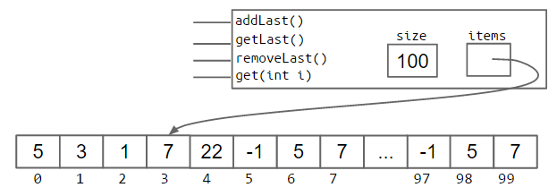

[视频讲解](https://youtu.be/IonBhRlyIPk)

在 Java 中，答案是直接创建一个足够大的新数组来容纳新数据。例如，可以这样添加新元素：

```java
int[] a = new int[size + 1];
System.arraycopy(items, 0, a, 0, size);
a[size] = 11;
items = a;
size = size + 1;
```

创建新数组并把元素复制过去的过程通常称为“调整大小”或“扩容”。严格来说，这个名称并不准确，因为原数组的大小并没有改变；我们只是创建了一个尺寸更大的**新**数组。

**练习 2.5.4：** 尝试实现能够通过数组扩容工作的 `addLast(int i)`。

[解答视频](https://youtu.be/tLcinQx5VnY)

#### 分析朴素扩容数组

[视频讲解](https://youtu.be/oysadh63NxY)

上一节尝试的方案性能非常糟糕。进行一个简单计算实验，调用 `addLast` 100,000 次：`SLList` 完成得快到几乎无法计时，而基于数组的朴素列表却需要数秒。

要理解原因，请思考下面的练习。

**练习 2.5.5：** 假设当前数组长度为 100。连续调用两次 `insertBack`，整个过程中总共需要创建并填充多少个内存盒？假设一旦数组的最后一个引用丢失，垃圾回收便立刻发生，那么任意一个时刻最多同时存在多少个内存盒？

[解答视频](https://youtu.be/pFWS1pGVn9w)

**练习 2.5.6：** 从长度为 100 的数组开始，如果调用 `addLast` 1,000 次，大约需要创建并填充多少个内存盒？

创建大量内存盒并反复复制内容需要时间。下图展示总时间与操作次数的关系：上方是 `SLList`，下方是朴素数组列表。`SLList` 的曲线是一条直线，说明每次 `add` 都增加相同的时间，也就是单次操作为常数时间。也可以这样理解：图像是线性的，因为常数的积分是一条直线。

相比之下，朴素数组列表的图像是抛物线，说明每次操作需要线性时间，因为直线的积分是抛物线。这在现实中影响巨大。插入 100,000 个元素时，可以通过 N²/N 粗略计算时间倍率：数组列表需要 `(100,000²) / 100,000`，也就是大约 100,000 倍的时间。这显然无法接受。


#### 几何扩容

[视频讲解](https://youtu.be/8WtcaXATB-Y)

可以通过让数组大小按乘法比例增长，而不是按加法增长，来解决性能问题。也就是说，不再每次**增加**固定数量 `RFACTOR` 的内存盒：

```java
public void insertBack(int x) {
    if (size == items.length) {
           resize(size + RFACTOR);
    }
    items[size] = x;
    size += 1;
}
```

而是把内存盒数量**乘以** `RFACTOR`：

```java
public void insertBack(int x) {
    if (size == items.length) {
           resize(size * RFACTOR);
    }
    items[size] = x;
    size += 1;
}
```

重复之前的计算实验后，新 `AList` 完成 100,000 次插入所需时间短到几乎察觉不到。为什么这种方法如此高效，将留到本书最后一章进行完整分析。

#### 内存性能

`AList` 几乎完成了，但还存在一个重要问题。假设先插入 1,000,000,000 个元素，之后删除 990,000,000 个。此时只使用 10,000,000 个内存盒，另外 99% 的空间完全闲置。

为解决这一问题，当数组显得过于空时，也可以缩小它。具体来说，定义“使用率” R，等于列表的 `size` 除以 `items` 数组的长度。例如，下图中的使用率是 0.04。

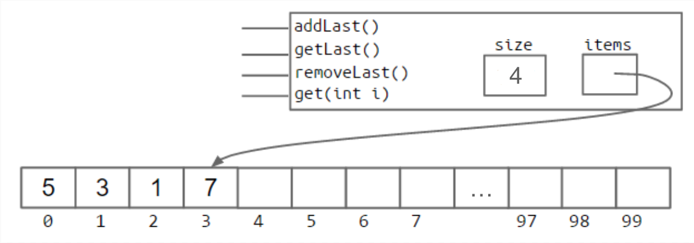

典型实现中，当 R 低于 0.25 时，把数组长度减半。

#### 泛型 AList

[视频讲解](https://youtu.be/Qcrd80To-TM)

和之前一样，可以修改 `AList`，使它能够保存任意数据类型，而不仅是整数。仍然在类声明中使用尖括号语法，并在适当位置用任意类型参数替换整数类型。下面使用 `Glorp` 作为类型参数。

这里有一个重要的语法差异：由于 Java 泛型实现方式中的一个隐晦问题，Java 不允许直接创建泛型对象数组。也就是说，不能写：

```java
Glorp[] items = new Glorp[8];
```

必须使用下面这种不太自然的写法：

```java
Glorp[] items = (Glorp []) new Object[8];
```

这会产生编译警告，但只能接受。后续章节会更详细地讨论这个问题。

另一个变化是：对于被“删除”的元素，要把相应位置设为 `null`。以前保存整数时，没有必要把已删除位置清零；但保存泛型对象时，需要清除对对象的引用，以避免“对象滞留”。回忆一下，Java 只会在对象的最后一个引用消失后销毁它。如果没有把这个引用设为 `null`，Java 就不会垃圾回收曾经加入列表、但逻辑上已经删除的对象。

这是一个微妙的性能错误，除非专门检查，否则可能很难观察到；但在某些情况下，它会造成严重的内存浪费。

### 接下来做什么

* [讨论课 3](http://sp19.datastructur.es/materials/discussion/disc03.pdf)
* [实验 2](http://sp19.datastructur.es/materials/lab/lab2/lab2)
* [项目 1A](http://sp19.datastructur.es/materials/proj/proj1a/proj1a)

---

> 原作：Josh Hug，UC Berkeley CS61B Spring 2021 配套读本。<br>
> 中文翻译版，仅供非商业学习；采用 CC BY-NC-SA 4.0 许可。<br>
> 原始网站：https://joshhug.gitbooks.io/hug61b/content/
