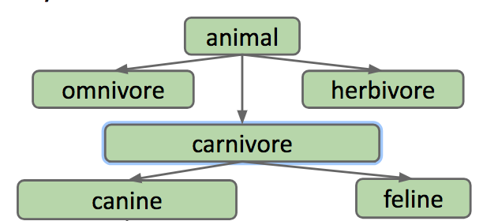
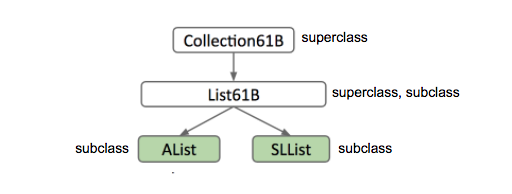
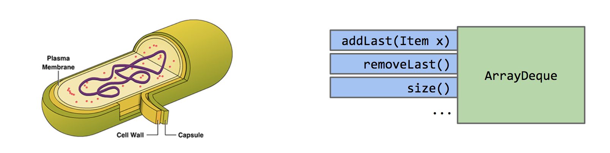
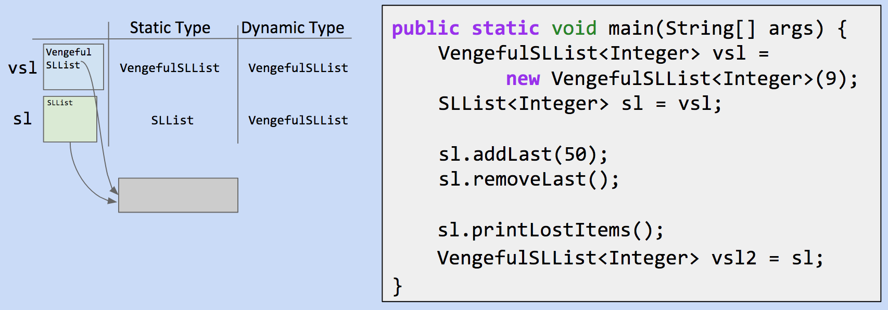
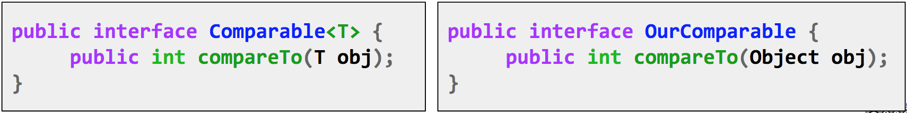
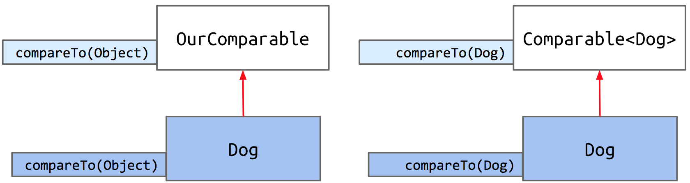
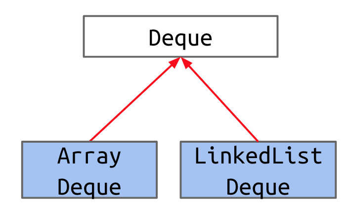
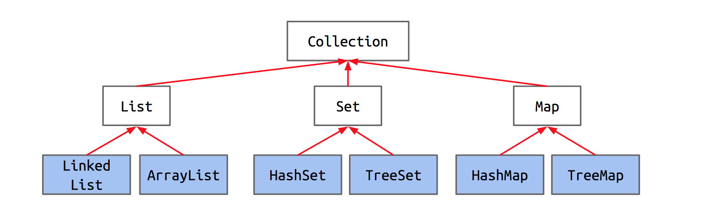
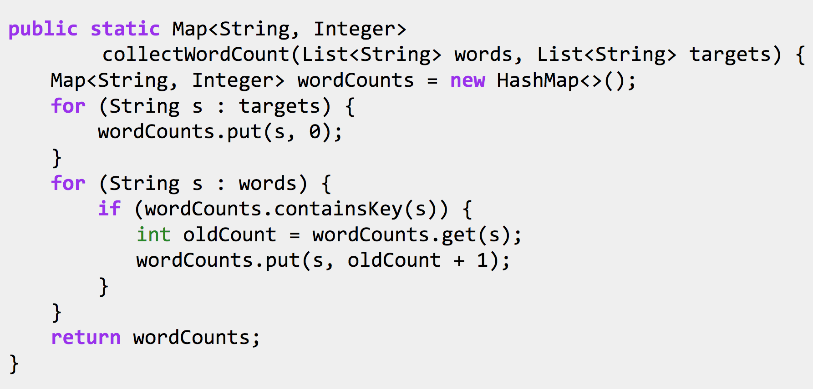
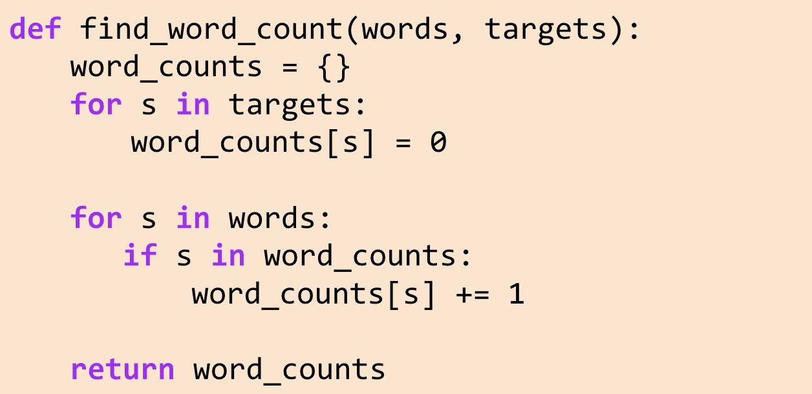

<!-- Generated by scripts/import-cs61b.mjs. Do not edit. -->


---

## 4.1 导论与接口

#### 问题

回忆上周创建的两个列表类：`SLList` 和 `AList`。查看它们的文档会发现，两者非常相似。事实上，它们提供的辅助方法完全一样。

假设要编写一个 `WordUtils` 类，其中包含可以对单词列表执行的函数，例如计算一个 `SLList` 中最长字符串的方法。

**练习 4.1.1：** 尝试自己编写该方法。它应接收一个字符串 `SLList`，并返回列表中最长的字符串。

[视频讲解](https://www.youtube.com/watch?v=IaEq_fogI08&list=PL8FaHk7qbOD5zNY2dTJdL9R4Q2qKN98kN)

我们得到的方法如下：

```java
public static String longest(SLList<String> list) {
    int maxDex = 0;
    for (int i = 0; i < list.size(); i += 1) {
        String longestString = list.get(maxDex);
        String thisString = list.get(i);
        if (thisString.length() > longestString.length()) {
            maxDex = i;
        }
    }
    return list.get(maxDex);
}
```

怎样让它也适用于 `AList`？

实际上，只需修改方法签名中的参数。把：

```java
SLList<String> list
```

改成：

```java
AList<String> list
```

这样，`WordUtils` 中就有两个名称完全相同的方法：

```java
public static String longest(SLList<String> list)
```

以及：

```java
public static String longest(AList<String> list)
```

Java 允许这样做，这称为_方法重载_。调用 `WordUtils.longest` 时，Java 会根据你传入的参数类型决定运行哪个方法。传入 `AList` 就调用 `AList` 版本；传入 `SLList` 就调用 `SLList` 版本。

Java 能够处理名称相同、参数类型不同的方法确实很方便，但重载有几个缺点：

* 非常重复而且难看，因为现在有两段几乎完全相同的代码。
* 需要维护更多代码。若要对 `longest` 做一个小修改，例如修复错误，必须在每种列表类型对应的方法中都修改一次。
* 如果以后增加更多列表类型，每创建一个新列表类就必须再复制一份方法。

#### 上位词、下位词与接口继承

[视频讲解](https://www.youtube.com/watch?v=S-wcA94Oekc&t=9s)

无论在英语中还是现实生活中，词语与对象之间都存在逻辑层级。

“狗”是贵宾犬、阿拉斯加犬、哈士奇等的_上位词_；反过来，贵宾犬、阿拉斯加犬和哈士奇都是“狗”的_下位词_。

这些词构成一组“是一个（is-a）”关系：

* 贵宾犬是一种狗。
* 狗是一种犬科动物。
* 犬科动物是一种食肉动物。
* 食肉动物是一种动物。



[视频讲解](https://www.youtube.com/watch?v=hoYMyvWjCTg)

`SLList` 和 `AList` 也有相同层级：两者都是更一般的“列表”的下位类型。

我们将在 Java 中正式表示这种关系。如果 `SLList` 是 `List61B` 的下位类型，那么 `SLList` 类是 `List61B` 的**子类**，`List61B` 则是 `SLList` 的**超类**。

**图 4.1.1**



要在 Java 中_表达_这种层级关系，需要完成两步：

* 第 1 步：为一般意义上的列表上位类型定义一种类型，命名为 `List61B`。
* 第 2 步：声明 `SLList` 和 `AList` 是该类型的下位类型。

新的 `List61B` 在 Java 中称为**接口**。接口本质上是一份契约，规定一个列表必须能做什么，但不提供这些行为的具体实现。你能想到为什么吗？

下面是 `List61B` 接口。此时已经完成建立层级关系的第一步，也就是创建上位类型。

```java
public interface List61B<Item> {
    public void addFirst(Item x);
    public void add Last(Item y);
    public Item getFirst();
    public Item getLast();
    public Item removeLast();
    public Item get(int i);
    public void insert(Item x, int position);
    public int size();
}
```

接着完成第 2 步：声明 `AList` 与 `SLList` 是 `List61B` 的下位类型。在 Java 中，这种关系写在类定义中。

原本的：

`public class AList<Item> {...}`

加入表示关系的关键字 `implements` 后变为：

`public class AList<Item> implements List61B<Item> {...}`

`implements List61B<Item>` 本质上是一项承诺。`AList` 在说：“我保证拥有并定义 `List61B` 接口中规定的全部属性和行为。”

现在可以修改 `WordUtils` 中的 `longest`，让它接收 `List61B`，因为 `AList` 与 `SLList` 都和 `List61B` 具有“是一个”关系。

#### 重写

[视频讲解](https://www.youtube.com/watch?v=iOiNQ68H3Gk)

我们已经承诺在 `AList` 与 `SLList` 中实现 `List61B` 规定的方法，下面就来履行承诺。

在子类中实现要求的方法时，最好在方法签名正上方加入 `@Override` 标签；在 CS61B 中，这实际上是强制要求。下面只为其中一个方法添加了该标签：

```java
@Override
public void addFirst(Item x) {
    insert(x, 0);
}
```

需要注意，即使没有写这个标签，你依然是在重写方法。因此从纯语法角度说并非必须添加。不过，标签会像安全装置一样告诉编译器：“我打算重写这个方法。”这样有什么用？它有点像一位校对员：如果重写过程出了问题，编译器会提醒你。

假设你想重写 `addLast`，却不小心拼成了 `addLsat`。如果没有 `@Override`，可能很久都发现不了错误，调试会更加痛苦；如果写了 `@Override`，程序运行前编译器就会停止并要求修正。

#### 接口继承

[视频讲解](https://www.youtube.com/watch?v=Z2EAsOKSj2M)

接口继承指的是：子类继承超类所规定的全部方法和行为。在“上位词与下位词”部分定义的 `List61B` 中，接口包含所有方法签名，却没有具体实现；真正的实现由子类提供。

这种继承还可以跨越多代。假设存在图 4.1.1 那样很长的超类/子类链，那么 `AList` 不仅继承 `List61B` 的方法，还继承它上方一直到最高超类的所有内容。换句话说，`AList` 也从 `Collection` 继承。

### 等号黄金法则（GRoE）

回忆第 2 章中的等号黄金法则：每当执行赋值 `a = b`，都会把 `b` 中的比特复制到 `a` 中，并要求 `b` 的类型与 `a` 兼容。不能写 `Dog b = 1` 或 `Dog b = new Cat()`，因为 `1` 不是 `Dog`，`Cat` 也不是 `Dog`。

把这条规则应用到本章之前的 `longest` 方法。

`public static String longest(List61B<String> list)` 接收一个 `List61B`。我们说它也能接收 `AList` 和 `SLList`，但 `AList` 与 `List61B` 明明是不同的类，为什么可行？因为 `AList` 与 `List61B` 具有“是一个”关系，所以一个 `AList` 应当能够放入 `List61B` 类型的盒子中。

**练习 4.1.2：** 下面的代码会编译吗？如果会，运行时会发生什么？

```java
public static void main(String[] args) {
    List61B<String> someList = new SLList<String>();
    someList.addFirst("elk");
}
```

可能答案如下：

* 无法编译。
* 能够编译，但会在 `new` 那一行产生错误。
* 运行后创建一个 `SLList`，其地址保存在 `someList` 中；但调用 `someList.addFirst()` 时崩溃，因为 `List` 类没有实现 `addFirst`。
* 运行后创建一个 `SLList`，其地址保存在 `someList` 中；随后字符串 `"elk"` 被插入 `someList` 所引用的 `SLList`。

#### 实现继承

[视频讲解](https://www.youtube.com/watch?v=Z2Z1LHPGsdk)

之前的 `List61B` 接口只有方法头，用于规定 `List61B` **应该做什么**。现在将看到，也可以直接在 `List61B` 中编写已经包含实现的方法。这些方法会规定 `List61B` 的下位类型**应该怎样做**。

要做到这一点，必须在方法签名中加入 `default` 关键字。

例如在 `List61B` 中定义：

```java
default public void print() {
    for (int i = 0; i < size(); i += 1) {
        System.out.print(get(i) + " ");
    }
    System.out.println();
}
```

那么所有实现 `List61B` 的类都能直接使用该方法。

不过这个方法有一个小小的低效之处。你能发现吗？

[视频讲解](https://www.youtube.com/watch?v=9M9exmhsjmc)

对于 `SLList`，每次调用 `get` 都需要沿列表跳过许多结点。更好的办法是在沿链表前进的同时直接输出。

我们希望 `SLList` 采用不同于接口默认实现的输出方式，因此需要重写。在 `SLList` 中实现：

```java
@Override
public void print() {
    for (Node p = sentinel.next; p != null; p = p.next) {
        System.out.print(p.item + " ");
    }
}
```

此后，在 `SLList` 上调用 `print()` 时，会运行这个方法，而不是 `List61B` 中的默认方法。

[视频讲解](https://www.youtube.com/watch?v=eNtItRCIkBg)

你可能会问：Java 怎样知道该调用哪个 `print()`？这是个好问题。Java 依靠**动态方法选择**完成这一点。

我们知道，Java 变量具有类型：

`List61B<String> lst = new SLList<String>();`

在上面的声明与实例化中，变量 `lst` 的类型是 `List61B`，这称为它的“静态类型”。

对象本身也具有类型。`lst` 指向的对象类型是 `SLList`。这个对象本质上是 `SLList`，因为通过 `SLList` 构造方法创建；同时由于前面讨论的“是一个”关系，它也是 `List61B`。对象实例化时真正使用的类型称为它的“动态类型”。

补充说明：“动态类型”这个名称非常贴切。如果以后把 `lst` 重新赋值为另一个类型的对象，例如一个 `AList`，那么 `lst` 的动态类型就会从 `SLList` 变成 `AList`。之所以称为动态，是因为它会随着变量当前引用的对象类型而改变。

Java 运行一个被重写的方法时，会在对象的**动态类型**中寻找合适的方法签名并执行。

**重要：这条规则不适用于重载方法。**

[视频讲解](https://www.youtube.com/watch?v=WHYaqzTFh8A)

假设同一个类中有两个方法：

```java
public static void peek(List61B<String> list) {
    System.out.println(list.getLast());
}
public static void peek(SLList<String> list) {
    System.out.println(list.getFirst());
}
```

并运行：

```java
SLList<String> SP = new SLList<String>();
List61B<String> LP = SP;
SP.addLast("elk");
SP.addLast("are");
SP.addLast("cool");
peek(SP);
peek(LP);
```

第一次调用 `peek()` 会使用第二个、参数为 `SLList` 的版本。第二次调用会使用第一个、参数为 `List61B` 的版本。原因是两个重载方法之间的区别只在参数类型。Java 判断调用哪个重载方法时，查看的是参数变量的**静态类型**，并选择具有相同参数类型的方法。

[视频讲解](https://www.youtube.com/watch?v=9KuVnIje2Ys)

#### 接口继承与实现继承

怎样区分“接口继承”和“实现继承”？可以使用下面这个简单标准：

* 接口继承（做什么）：只说明子类应当具备哪些能力。
  * 例如：所有列表都应能够输出自己，但具体怎样输出由各自决定。
* 实现继承（怎么做）：直接告诉子类应当怎样表现。
  * 例如：列表必须按照这种特定方式输出——按顺序取得每个元素，再逐个输出。

创建这些层级时，请记住子类与超类之间应当是“是一个”关系。`Cat` 只有在猫**是一种**动物的意义上才应实现 `Animal`。不要使用“有一个”关系建立继承。猫**有一只**爪子，但 `Cat` 显然不应实现 `Claw`。

最后，实现继承虽然听起来很方便，也存在一些缺点：

* 人会犯错，也无法记住一切；你可能重写过某个方法，却忘记自己这样做过。
* 如果两个接口提供互相冲突的默认方法，冲突可能很难解决。
* 它容易鼓励过度复杂的代码。

**接下来做什么**

* [讨论课 4：继承](https://sp19.datastructur.es/materials/discussion/disc04.pdf)

---

## 4.2 `extends`、类型转换与高阶函数

### `extends`

前面我们已经看到，怎样使用 `implements` 关键字与接口建立层次关系。那么，如果我们希望在两个类之间建立层次关系，该怎么做呢？

假设我们想构建一个 `RotatingSLList`。它拥有 `SLList` 的所有功能，例如 `addFirst`、`size` 等，同时还增加一个 `rotateRight` 操作：把最后一个元素移到列表最前面。

一种做法是复制并粘贴 `SLList` 的所有方法，然后再写一个 `rotateRight`。但这样就没有利用继承的力量。继承允许子类复用已经定义好的类中的代码。因此，我们让 `RotatingSLList` 继承 `SLList`。

我们可以在类声明中使用 `extends` 关键字建立这种继承关系：

```java
public class RotatingSLList<Item> extends SLList<Item>
```

就像 `AList` 与 `List61B` 之间存在“是一种（is-a）”关系一样，`RotatingSLList` 也是一种 `SLList`。`extends` 让我们保留 `SLList` 原有的功能，同时还可以修改它并添加新的能力。


现在既然 `RotatingSLList` 已经继承了 `SLList`，就来赋予它独有的旋转能力。

**练习 4.2.1。** 定义 `rotateRight` 方法。它应当把现有列表中的每个元素向右移动一位，并把最后一个元素移到最前面。

例如，对 `[5, 9, 15, 22]` 调用 `rotateRight` 后，应得到 `[22, 5, 9, 15]`。

_提示：是否有某些继承而来的方法可以帮助你完成它？_

[视频讲解](https://www.youtube.com/watch?v=990kImS-_nA)

一种实现如下：

```java
public void rotateRight() {
    Item x = removeLast();
    addFirst(x);
}
```

你可能已经注意到，我们能够直接使用在 `RotatingSLList` 之外定义的方法，因为 `extends` 使它从 `SLList` 继承了这些方法。这也引出了一个问题：子类究竟继承了什么？

使用 `extends` 后，子类会继承父类的所有**成员**。成员包括：

- 所有实例变量和静态变量；
- 所有方法；
- 所有嵌套类。

但要注意：构造方法不会被继承，而且子类不能直接访问父类的私有成员。

#### `VengefulSLList`

当有人对 `SLList` 调用 `removeLast` 时，被移除的值会被直接丢弃，再也看不到了。但假如这些被放逐的元素离开之后，开始策划一场针对我们的巨大叛乱呢？这种情况下，我们就需要记住所有被 `removeLast` 移除的元素，以便以后找到并处理它们。

于是，我们创建一个新类 `VengefulSLList`，用于记住所有被 `removeLast` 放逐的元素。

和前面一样，我们在类声明中写明 `VengefulSLList` 继承自 `SLList`：

```java
public class VengefulSLList<Item> extends SLList<Item>
```

接下来，为 `VengefulSLList` 添加一个 `printLostItems()` 方法，用于打印所有被 `removeLast` 移除的元素。我们可以增加一个实例变量，保存所有已删除的元素。如果使用一个 `SLList` 来记录它们，就可以直接调用 `print()` 输出全部元素。

目前的代码如下：

```java
public class VengefulSLList<Item> extends SLList<Item> {
    SLList<Item> deletedItems;

    public void printLostItems() {
        deletedItems.print();
    }
}
```

`VengefulSLList` 的 `removeLast` 应当完成和 `SLList.removeLast` 完全相同的工作，但还要多做一步：把刚刚移除的元素加入 `deletedItems`。为了复用代码，我们可以**重写** `removeLast`，并通过 `super` 关键字调用父类 `SLList` 中定义的 `removeLast`。

**练习 4.2.2。** 重写 `removeLast`：移除最后一个元素，把它加入 `deletedItems`，最后再返回该元素。

[视频讲解](https://www.youtube.com/watch?v=RJ_OpzLeHeQ)

完整实现如下：

```java
public class VengefulSLList<Item> extends SLList<Item> {
    SLList<Item> deletedItems;

    public VengefulSLList() {
        deletedItems = new SLList<Item>();
    }

    @Override
    public Item removeLast() {
        Item x = super.removeLast();
        deletedItems.addLast(x);
        return x;
    }

    /** Prints deleted items. */
    public void printLostItems() {
        deletedItems.print();
    }
}
```

#### 构造方法不会被继承

如前所述，子类会继承父类的所有成员，包括实例变量、静态变量、方法和嵌套类，但**不会继承构造方法**。

虽然构造方法不会被继承，但 Java 要求：**每个子类构造方法都必须先调用某个超类构造方法。**

为什么会这样？回忆一下，`extends` 定义的是子类与父类之间的“是一种”关系。如果 `VengefulSLList` 是一种 `SLList`，那么每个 `VengefulSLList` 首先都必须按照 `SLList` 的规则完成初始化。

再看一个更直观的例子。假设有两个类：

```java
public class Human {...}
```

```java
public class TA extends Human {...}
```

让 `TA` 继承 `Human` 是合理的，因为所有助教都是人。我们希望 `TA` 继承人的属性和行为。

如果运行：

```java
TA christine = new TA();
```

那么首先必须构造一个 `Human` 部分，然后才能在此基础上赋予它 `TA` 的特征。跳过人的构造过程，直接构造助教，在逻辑上是不完整的。

因此，我们可以使用 `super` 显式调用超类构造方法：

```java
public VengefulSLList() {
    super();
    deletedItems = new SLList<Item>();
}
```

如果我们没有显式书写，Java 会自动调用超类的**无参数构造方法**。

在这个例子中，写出 `super()` 与省略它没有区别；它只是把 Java 原本隐式完成的操作明确写出来。但如果我们为 `VengefulSLList` 定义另一个构造方法，Java 自动调用的无参构造方法就可能不是我们真正需要的。

假设有一个接收初始元素的单参数构造方法。如果仍依赖 Java 隐式调用 `super()`，传入的元素就不会被放入父类结构中。因此，必须把该元素显式传给正确的超类构造方法：

```java
public VengefulSLList(Item x) {
    super(x);
    deletedItems = new SLList<Item>();
}
```

#### `Object` 类

Java 中的每个类都是 `Object` 类的后代，也就是说，每个类都会继承 `Object`。即使类声明中没有显式写出 `extends Object`，它也会隐式继承 `Object`。

例如：

- `VengefulSLList` 在类声明中显式 `extends SLList`；
- `SLList` 隐式 `extends Object`。

所以，`SLList` 会继承 `Object` 的全部成员，而 `VengefulSLList` 又会传递性地继承 `SLList` 和 `Object` 的成员。

根据 [`Object` 类文档](https://docs.oracle.com/javase/8/docs/api/java/lang/Object.html)，`Object` 提供了每个对象都应具备的操作，例如 `.equals(Object obj)`、`.hashCode()` 和 `toString()`。

#### “是一种”与“拥有一个”

**重要提醒：** `extends` 关键字定义的是“是一种（is-a）”关系，也就是上下位关系。一个常见错误，是把它用于“拥有一个（has-a）”关系，也就是整体与部分的关系。

决定是否继承一个类时，最好先问自己：“是一种”这个说法是否成立。

- `Shower`（淋浴器）是一种 `Bathroom`（浴室）吗？不是。
- `VengefulSLList` 是一种 `SLList` 吗？是。

### 封装

封装是面向对象编程的基本原则之一，也是程序员抵抗最大敌人——**复杂性**——的重要手段。编写大型程序时，管理复杂性是我们必须面对的主要挑战之一。

我们可以使用很多工具对抗复杂性，例如分层抽象（也就是建立抽象屏障）以及“为变化而设计”。后者强调：程序应当由模块化、可替换的组件构成，从而可以替换某一部分而不破坏整个系统。此外，**隐藏其他人不需要知道的信息**，也是管理大型系统的基本方法。

封装的根本思想，就是把内部信息隐藏起来。可以把它类比成人体细胞：细胞内部可能极其复杂，包含染色体、线粒体、核糖体等结构，但这些复杂性被完整地封装在一个模块中，对外呈现为一个整体。



在计算机科学中，模块可以理解为一组协同工作的、共同完成某项任务或一组相关任务的方法。例如，一个表示列表的类就是一个模块。如果模块的实现细节被隐藏在内部，而外界只能通过有文档说明的接口与它交互，我们就说这个模块是封装良好的。

以 `ArrayDeque` 类为例。外部代码可以通过 `addLast`、`removeLast` 等公开方法使用它，但无需理解该数据结构内部复杂的实现细节。

#### 抽象屏障

理想情况下，用户不应观察到所使用的数据结构的内部工作方式。幸运的是，Java 很容易强制建立抽象屏障。通过 `private` 关键字，我们几乎可以阻止外部代码查看对象内部，从而避免底层复杂性暴露给外界。

#### 继承怎样破坏封装

假设 `Dog` 类中有下面两个方法。一种实现是：

```java
public void bark() {
    System.out.println("bark");
}

public void barkMany(int N) {
    for (int i = 0; i < N; i += 1) {
        bark();
    }
}
```

另一种实现是：

```java
public void bark() {
    barkMany(1);
}

public void barkMany(int N) {
    for (int i = 0; i < N; i += 1) {
        System.out.println("bark");
    }
}
```

从普通用户的角度看，这两种实现提供的功能完全相同。然而，假设我们定义一个 `Dog` 的子类 `VerboseDog`，并重写它的 `barkMany`：

```java
@Override
public void barkMany(int N) {
    System.out.println("As a dog, I say: ");
    for (int i = 0; i < N; i += 1) {
        bark();
    }
}
```

**练习 4.2.3。** 对一个 `VerboseDog vd`，在第一种 `Dog` 实现下，`vd.barkMany(3)` 会输出什么？在第二种实现下又会怎样？

- A：`As a dog, I say: bark bark bark`
- B：`bark bark bark`
- C：其他结果

在第一种实现中，输出是 A；而在第二种实现中，程序会陷入无限递归。`barkMany` 调用 `bark()`，`bark()` 又调用 `barkMany(1)`，后者再次调用 `bark()`，如此无限重复。

这说明：继承会让子类的重写行为影响父类内部的方法调用，从而使父类实现细节不再完全隐藏。看似等价的两种父类实现，在存在子类重写时可能产生截然不同的结果。

### 类型检查与类型转换

在讨论类型与转换之前，先回顾动态方法选择。动态方法查找指的是：程序运行时，根据对象的动态类型决定实际执行哪个方法。具体来说，如果 `VengefulSLList` 重写了 `SLList` 中的某个方法，那么运行时调用哪一个版本，取决于变量所引用对象的运行时类型，也就是动态类型。

**练习 4.2.4。** 对下面代码中的每一行，判断：

- 该行是否导致编译错误？
- 哪些方法调用使用了动态方法选择？



逐行分析这个程序：

```java
VengefulSLList<Integer> vsl = new VengefulSLList<Integer>(9);
SLList<Integer> sl = vsl;
```

这两行都可以正常编译。由于 `VengefulSLList` 是一种 `SLList`，所以可以把 `VengefulSLList` 实例放进静态类型为 `SLList` 的变量中。

```java
sl.addLast(50);
sl.removeLast();
```

这两行也能编译。`VengefulSLList` 没有重写 `addLast`，所以调用的是 `SLList` 中的方法。`removeLast` 则被 `VengefulSLList` 重写了；`sl` 的动态类型是 `VengefulSLList`，因此动态方法选择会调用 `VengefulSLList` 中的重写版本。

```java
sl.printLostItems();
```

这一行会产生编译错误。编译器根据对象的**静态类型**判断某个操作是否合法。`sl` 的静态类型是 `SLList`，而 `SLList` 中没有定义 `printLostItems`，所以即使 `sl` 在运行时确实指向一个 `VengefulSLList`，编译器也不允许调用该方法。

```java
VengefulSLList<Integer> vsl2 = sl;
```

这一行同样会产生编译错误。编译器只看到 `sl` 的静态类型是 `SLList`，而并非每一个 `SLList` 都一定是 `VengefulSLList`，因此不能直接把它装进静态类型为 `VengefulSLList` 的变量。

#### 表达式的静态类型

和变量一样，使用 `new` 得到的表达式也有编译期类型。

```java
SLList<Integer> sl = new VengefulSLList<Integer>();
```

右侧表达式的编译期类型是 `VengefulSLList`。编译器检查到 `VengefulSLList` 是一种 `SLList`，因此允许赋值。

```java
VengefulSLList<Integer> vsl = new SLList<Integer>();
```

右侧表达式的编译期类型是 `SLList`。编译器检查 `SLList` 是否一定是一种 `VengefulSLList`，答案是否定的，因此产生编译错误。

方法调用表达式的编译期类型，等于该方法声明的返回类型。假设有：

```java
public static Dog maxDog(Dog d1, Dog d2) { ... }
```

由于 `maxDog` 的返回类型声明为 `Dog`，所以任何对 `maxDog` 的调用表达式，其编译期类型都是 `Dog`。

```java
Poodle frank = new Poodle("Frank", 5);
Poodle frankJr = new Poodle("Frank Jr.", 15);

Dog largerDog = maxDog(frank, frankJr);
Poodle largerPoodle = maxDog(frank, frankJr); // 无法编译：右侧编译期类型是 Dog
```

把 `Dog` 类型的表达式赋给 `Poodle` 变量会产生编译错误。`Poodle` 是一种 `Dog`，但一般的 `Dog` 不一定是 `Poodle`。即使我们作为读者清楚地知道 `frank` 与 `frankJr` 都是 `Poodle`，编译器仍然只按照方法签名判断。

#### 强制类型转换

Java 提供了一种特殊语法，让程序员告诉编译器：应把某个表达式视为特定的编译期类型。这称为**类型转换（casting）**，通常也叫强制类型转换。

回到前面的失败代码。因为我们知道 `frank` 和 `frankJr` 都是 `Poodle`，可以写：

```java
Poodle largerPoodle = (Poodle) maxDog(frank, frankJr);
```

转换后，右侧表达式的编译期类型变为 `Poodle`，因此代码可以通过编译。

**警告：** 强制类型转换功能强大，但也很危险。它本质上是在告诉编译器：“暂时不要履行完整的类型检查职责，请相信我。”例如：

```java
Poodle frank = new Poodle("Frank", 5);
Malamute frankSr = new Malamute("Frank Sr.", 100);

Poodle largerPoodle = (Poodle) maxDog(frank, frankSr); // 运行时异常
```

这里比较的是一只 `Poodle` 和一只 `Malamute`。如果没有强制转换，编译器不会允许把返回类型为 `Dog` 的表达式直接赋给 `Poodle`。强制转换让代码通过编译，但如果 `maxDog` 在运行时返回的是 `Malamute`，程序就会尝试把 `Malamute` 当成 `Poodle`，最终抛出 `ClassCastException`。

### 高阶函数

下面稍微偏离主线，介绍高阶函数。**高阶函数**是把其他函数当作数据处理的函数。例如，下面的 Python 程序中，`do_twice` 接收另一个函数作为输入，并把它连续应用到 `x` 两次：

```python
def tenX(x):
    return 10*x

def do_twice(f, x):
    return f(f(x))
```

调用 `print(do_twice(tenX, 2))` 时，程序先把 `tenX` 应用于 2，得到 20；再把 `tenX` 应用于 20，最终得到 200。那么，在 Java 中怎样实现类似行为呢？

在旧版 Java（Java 7 及更早版本）中，变量不能直接保存函数指针。也就是说，我们不能简单声明一个“函数类型”的变量，因为语言中没有直接对应的函数类型。

为了解决这个问题，可以利用接口继承。先定义一个接口，表示所有“接收一个整数并返回一个整数”的函数，称为 `IntUnaryFunction`：

```java
public interface IntUnaryFunction {
    int apply(int x);
}
```

然后编写一个实现该接口的类，表示具体函数。下面的函数把输入整数乘以 10：

```java
public class TenX implements IntUnaryFunction {
    /* Returns ten times the argument. */
    public int apply(int x) {
        return 10 * x;
    }
}
```

到这里，我们已经用 Java 表示出了 Python 中的 `tenX`。接着实现 `do_twice`：

```java
public static int do_twice(IntUnaryFunction f, int x) {
    return f.apply(f.apply(x));
}
```

Java 中对应的调用写作：

```java
System.out.println(do_twice(new TenX(), 2));
```

### 继承速查表

`VengefulSLList extends SLList` 表示：`VengefulSLList` **是一种** `SLList`，并继承 `SLList` 的成员：

- 变量；
- 方法；
- 嵌套类；
- **不包括构造方法。**

子类构造方法必须先调用超类构造方法。`super` 关键字可以用于调用超类构造方法，也可以调用被子类重写的超类方法。

重写方法的调用遵循两条核心规则：

- 编译器采取保守策略，只根据表达式的**静态类型**允许操作；
- 对于被重写的方法（不是重载方法），运行时实际调用哪个版本，由调用表达式所引用对象的**动态类型**决定；
- 可以通过强制类型转换覆盖编译器的静态类型判断，但错误的转换可能导致运行时异常。

---

## 4.3 子类型多态与高阶函数

### 子类型多态

我们已经看到，继承使我们能够复用超类中的现有代码，同时通过重写超类方法或在子类中编写新方法，实现少量修改。继承还使我们能够利用**多态**设计通用的数据结构和方法。

“多态”的字面含义是“多种形态”。在 Java 中，多态指一个对象可以具有多种身份或类型。在面向对象编程中，一个对象既可以被看作自身类的实例，也可以被看作其超类、超类的超类等类型的实例。

假设变量 `deque` 的静态类型是 `Deque`。调用 `deque.addFirst()` 时，真正执行的方法会在运行时确定，取决于调用时 `deque` 所引用对象的运行时类型，也就是动态类型。上一节已经介绍过，Java 使用动态方法选择决定调用哪个被重写的方法。

假设我们想写一个 Python 程序，输出两个对象中较大者的字符串表示。可以采用两种方式。

1. 显式高阶函数方式：

```python
def print_larger(x, y, compare, stringify):
    if compare(x, y):
        return stringify(x)
    return stringify(y)
```

2. 子类型多态方式：

```python
def print_larger(x, y):
    if x.largerThan(y):
        return x.str()
    return y.str()
```

在显式高阶函数方案中，我们把比较函数和字符串转换函数明确传入，从而以统一方式输出较大对象。相较之下，在子类型多态方案中，由对象**自身**决定应该怎样比较和转换。实际调用的 `largerThan` 实现取决于 `x` 和 `y` 究竟是什么对象。

### 通用 `max` 函数

假设我们希望编写一个 `max` 函数：它接收任意类型的数组，并返回数组中的最大元素。

**练习 4.3.1。** 判断下面代码中有多少处编译错误。

```java
public static Object max(Object[] items) {
    int maxDex = 0;
    for (int i = 0; i < items.length; i += 1) {
        if (items[i] > items[maxDex]) {
            maxDex = i;
        }
    }
    return items[maxDex];
}

public static void main(String[] args) {
    Dog[] dogs = {new Dog("Elyse", 3), new Dog("Sture", 9), new Dog("Benjamin", 15)};
    Dog maxDog = (Dog) max(dogs);
    maxDog.bark();
}
```

上面的代码只有一处错误：

```java
if (items[i] > items[maxDex]) {
```

它会产生编译错误，因为这行代码假设 `>` 运算符可以用于任意 `Object`，而事实并非如此。

一种退让方案是在 `Dog` 类中定义专门的 `maxDog`，放弃编写一个能够接收任意类型数组的“唯一通用最大值函数”。例如：

```java
public static Dog maxDog(Dog[] dogs) {
    if (dogs == null || dogs.length == 0) {
        return null;
    }
    Dog maxDog = dogs[0];
    for (Dog d : dogs) {
        if (d.size > maxDog.size) {
            maxDog = d;
        }
    }
    return maxDog;
}
```

这段代码眼下可以工作，但如果我们放弃通用 `max`，让每个类自行定义最大值方法，以后每增加一种类，就要重复编写 `maxCat`、`maxPenguin`、`maxWhale` 等方法。这会产生大量重复劳动和冗余代码。

根本问题是：`Object` 之间不能直接使用 `>` 比较。这很合理，因为 Java 无法知道你究竟想按对象的字符串表示、大小，还是其他指标比较。在 Python 或 C++ 中，可以为不同类型重新定义 `>` 的含义；Java 不允许直接重载运算符，因此我们要借助接口继承。

可以创建一个接口，保证所有实现类（例如 `Dog`）都提供一个比较方法，我们称之为 `compareTo`。


先定义接口：

```java
public interface OurComparable {
    public int compareTo(Object o);
}
```

规定 `compareTo` 的行为：

- 如果 `this < o`，返回 -1；
- 如果 `this` 与 `o` 相等，返回 0；
- 如果 `this > o`，返回 1。

创建 `OurComparable` 后，我们可以要求 `Dog` 实现 `compareTo`。先在 `Dog` 的类声明中加入 `implements OurComparable`，再按照上述约定实现方法。

**练习 4.3.2。** 为 `Dog` 类实现 `compareTo`。

下面使用实例变量 `size` 进行比较：

```java
public class Dog implements OurComparable {
    private String name;
    private int size;

    public Dog(String n, int s) {
        name = n;
        size = s;
    }

    public void bark() {
        System.out.println(name + " says: bark");
    }

    public int compareTo(Object o) {
        Dog uddaDog = (Dog) o;
        if (this.size < uddaDog.size) {
            return -1;
        } else if (this.size == uddaDog.size) {
            return 0;
        }
        return 1;
    }
}
```

注意：由于 `compareTo` 接收的是任意 `Object o`，为了访问 `size` 实例变量，我们必须先把输入**强制转换**为 `Dog`。

现在可以把练习 4.3.1 中的 `max` 泛化。它不再接收任意 `Object` 数组，而是接收 `OurComparable` 数组；我们可以确定，这些对象都实现了 `compareTo`。

```java
public static OurComparable max(OurComparable[] items) {
    int maxDex = 0;
    for (int i = 0; i < items.length; i += 1) {
        int cmp = items[i].compareTo(items[maxDex]);
        if (cmp > 0) {
            maxDex = i;
        }
    }
    return items[maxDex];
}
```

很好。现在 `max` 可以接收任意 `OurComparable` 类型的对象数组，并返回其中的最大对象。不过，前面的 `compareTo` 实现略显冗长。可以把约定修改为：

- 如果 `this < o`，返回负数；
- 如果两者相等，返回 0；
- 如果 `this > o`，返回正数。

于是可以直接返回大小之差。若当前对象大小为 2，另一个对象大小为 5，`compareTo` 返回 -3；负数就表示当前对象更小。

```java
public int compareTo(Object o) {
    Dog uddaDog = (Dog) o;
    return this.size - uddaDog.size;
}
```

借助继承，我们成功泛化了求最大值的函数。这种方案的优点包括：

- 不必在每个类中重复编写最大值代码，例如无需 `Dog.maxDog(Dog[])`；
- 同一段代码可以较为优雅地处理多种类型。

#### 接口小测验

**练习 4.3.3。** 已知 `Dog` 类、`DogLauncher` 类、`OurComparable` 接口和 `Maximizer` 类。如果从 `Dog` 中删去 `compareTo()`，哪个文件无法编译？

```java
public class DogLauncher {
    public static void main(String[] args) {
        ...
        Dog[] dogs = new Dog[]{d1, d2, d3};
        System.out.println(Maximizer.max(dogs));
    }
}

public class Dog implements OurComparable {
    ...
    public int compareTo(Object o) {
        Dog uddaDog = (Dog) o;
        if (this.size < uddaDog.size) {
            return -1;
        } else if (this.size == uddaDog.size) {
            return 0;
        }
        return 1;
    }
    ...
}

public class Maximizer {
    public static OurComparable max(OurComparable[] items) {
        ...
        int cmp = items[i].compareTo(items[maxDex]);
        ...
    }
}
```

这种情况下，`Dog` 类会编译失败。声明 `implements OurComparable` 就等于声称 `Dog` 是一种 `OurComparable`。编译器会检查这个承诺是否成立，并发现 `Dog` 没有实现必需的 `compareTo`。

如果改为从 `Dog` 类声明中删去 `implements OurComparable`，那么编译错误会出现在 `DogLauncher` 的这一行：

```java
System.out.println(Maximizer.max(dogs));
```

如果 `Dog` 没有实现 `OurComparable`，编译器就不会允许把 `Dog[]` 传给 `Maximizer.max`，因为 `max` 只接受 `OurComparable[]`。

### `Comparable`

我们刚刚设计的 `OurComparable` 可以工作，但并不完美：

- 在 `Object` 与具体类型之间强制转换很别扭；
- 这是我们自己发明的接口：
  - 现有类（例如 `String`）不会实现它；
  - 现有库也不会使用它，例如没有内置的 `max` 专门接收 `OurComparable`。

解决办法是使用 Java 已经提供的 `Comparable` 接口。`Comparable` 被 Java 标准库和大量第三方库广泛使用。

`Comparable` 与 `OurComparable` 很相似，但有一个关键差异：



`Comparable<T>` 带有泛型参数。这样可以避免先接收 `Object`，再把它强制转换为具体类型。我们把 `Dog` 改为实现 `Comparable<Dog>`：

```java
public class Dog implements Comparable<Dog> {
    ...
    public int compareTo(Dog uddaDog) {
        return this.size - uddaDog.size;
    }
}
```

接下来，只需把 `Maximizer` 中的 `OurComparable` 全部改为 `Comparable`。此时，最大的狗就可以发出叫声了。

我们不再使用自创接口，而是使用真正的内置接口 `Comparable`。这样便可以直接利用所有已经围绕 `Comparable` 构建好的库。



### `Comparator`

刚刚介绍的 `Comparable` 接口，把“与另一只狗比较”的能力嵌入每个 `Dog` 对象中。接下来介绍一个非常相似的接口：`Comparator`。

先定义一个术语：

- **自然顺序（natural order）**：某个类的 `compareTo` 方法所规定的默认排序方式。

在前面的例子中，我们按 `size` 定义了狗的自然顺序。但如果希望使用其他方式排序，例如按名字的字母顺序，该怎么办？

Java 的做法是使用 `Comparator`。比较器本身是一个对象。我们可以在 `Dog` 内部编写一个实现 `Comparator` 的嵌套类。

`Comparator` 接口大致如下：

```java
public interface Comparator<T> {
    int compare(T o1, T o2);
}
```

任何实现 `Comparator` 的类都必须实现 `compare`。它的约定与 `compareTo` 一样：

- 如果 `o1 < o2`，返回负数；
- 如果二者相等，返回 0；
- 如果 `o1 > o2`，返回正数。

下面给 `Dog` 添加一个 `NameComparator`。可以直接复用 `String` 已经定义好的 `compareTo`：

```java
import java.util.Comparator;

public class Dog implements Comparable<Dog> {
    ...
    public int compareTo(Dog uddaDog) {
        return this.size - uddaDog.size;
    }

    private static class NameComparator implements Comparator<Dog> {
        public int compare(Dog a, Dog b) {
            return a.name.compareTo(b.name);
        }
    }

    public static Comparator<Dog> getNameComparator() {
        return new NameComparator();
    }
}
```

我们把 `NameComparator` 声明为静态嵌套类，因为获取一个名字比较器并不需要先实例化某只 `Dog`。

可以这样获得比较器：

```java
Comparator<Dog> nc = Dog.getNameComparator();
```

最终，`Dog` 类内部拥有一个私有的 `NameComparator` 类，并提供一个返回该比较器的方法。调用者可以使用它按名字的字母顺序比较狗。

从继承层次看，Java 内置了 `Comparator` 接口；我们可以在 `Dog` 中实现多种自己的比较器，例如 `NameComparator`、`SizeComparator` 等。


总结来说，Java 接口使我们能够实现**回调**。有时，一个函数需要另一个尚未编写的函数提供帮助，例如 `max` 需要 `compareTo`。这个辅助函数就是回调函数。在一些语言中，可以直接把函数作为参数传递；在 Java 中，我们可以把所需函数包装在一个接口实现对象中。

`Comparable` 表达的是：“我能够把自己与另一个同类型对象比较。”它嵌入对象自身，并定义该类型的**自然顺序**。`Comparator` 则更像一个独立的第三方机器，负责比较两个对象。一个类只能有一种 `compareTo` 自然顺序；如果需要多种比较方式，就应使用多个 `Comparator`。

---

## 4.4 Java 库与包

### 抽象数据类型（ADT）

虽然此前没有一直明确使用这个名称，但我们实际上已经见过若干**抽象数据类型**，例如 `List61B` 和 `Deque`。这里重点观察 `Deque`。



我们有一个 `Deque` 接口，`ArrayDeque` 和 `LinkedListDeque` 都实现了它。`Deque` 与这些实现类之间是什么关系？`Deque` 只提供了一组方法，也就是行为：

```java
public void addFirst(T item);
public void addLast(T item);
public boolean isEmpty();
public int size();
public void printDeque();
public T removeFirst();
public T removeLast();
public T get(int index);
```

这些方法的具体代码由 `ArrayDeque` 和 `LinkedListDeque` 提供。

在 Java 语法中，`Deque` 是一个接口；从概念上说，它是一种**抽象数据类型（Abstract Data Type，ADT）**。`Deque` 只规定应具备哪些行为，却没有规定实现这些行为的具体方式，因此它是“抽象”的。

### Java 标准库

Java 内置了很多可直接使用的抽象数据类型，它们被组织在 Java 标准库中。

`java.util` 中最重要的三类 ADT 是：

- [`List`](https://docs.oracle.com/javase/8/docs/api/java/util/List.html)：有顺序的元素集合；
  - 常用实现是 [`ArrayList`](https://docs.oracle.com/javase/8/docs/api/java/util/ArrayList.html)。
- [`Set`](https://docs.oracle.com/javase/7/docs/api/java/util/Set.html)：无顺序且元素严格唯一的集合，不允许重复；
  - 常用实现是 [`HashSet`](https://docs.oracle.com/javase/7/docs/api/java/util/HashSet.html)。
- [`Map`](https://docs.oracle.com/javase/8/docs/api/java/util/Map.html)：键值对集合，通过键访问对应的值；
  - 常用实现是 [`HashMap`](https://docs.oracle.com/javase/8/docs/api/java/util/HashMap.html)。

请使用这三种 ADT 完成下面练习。阅读上面链接的 API 文档会非常有帮助。

**练习 4.4.1。** 编写 `getWords`，接收 `String inputFileName`，把输入文件中的每个单词放入一个列表。回忆项目 0 中读取文件单词的方法。_提示：使用 `In`。_

**练习 4.4.2。** 编写 `countUniqueWords`，接收一个 `List<String>`，计算文件中有多少个**不同的**单词。

第一个练习使用列表，第二个练习使用集合：

```java
public static List<String> getWords(String inputFileName) {
    List<String> lst = new ArrayList<String>();
    In in = new In();
    while (!in.isEmpty()) {
        lst.add(in.readString()); // 也可以先定义 cleanString() 清理字符串
    }
    return lst;
}

public static int countUniqueWords(List<String> words) {
    Set<String> ss = new HashSet<>();
    for (String s : words) {
        ss.add(s);
    }
    return ss.size();
}
```

**练习 4.4.3。** 编写 `collectWordCount`，接收 `List<String> targets` 和 `List<String> words`，找出每个目标单词在单词列表中出现的次数。

```java
public static Map<String, Integer> collectWordCount(List<String> words) {
    Map<String, Integer> counts = new HashMap<String, Integer>();
    for (String t : target) {
        counts.put(s, 0);
    }
    for (String s : words) {
        if (counts.containsKey(s)) {
            counts.put(word, counts.get(s) + 1);
        }
    }
    return counts;
}
```

这里使用 `Map`，因为它能够建立两个对象之间的对应关系。在本例中，我们需要把“单词”与“出现次数”关联起来。

这三种 ADT 都继承自 `Collection` 接口。`Collection` 的定义非常宽泛：Java 文档说，集合“表示一组被称为元素的对象”。



上图中，白色方框表示接口，蓝色方框表示具体类。

### Java 与 Python

Java 的语法相当冗长。下面的 Java 代码看起来比对应的 Python 代码笨重得多。





不过，Java 也有自己的优势：它提供了更多选择和工程控制。例如，Python 通常只有一种主要的字典类型，使用 `{}` 创建；在 Java 中，如果要使用 `Map` 这种 ADT，可以根据需求选择不同实现，例如 `HashMap`、`TreeMap` 等。

CS61B 选择 Java，主要有以下原因。

- 从整个开发过程看，编写程序可能反而更省时间，原因包括：
  - 静态类型提供类型检查，并引导程序员正确使用代码；
  - 偏向接口继承，使子类型多态更清晰；
  - 访问控制修饰符能建立更牢固的抽象屏障。
- 代码通常更加高效，原因包括：
  - 程序员可以更精细地控制工程权衡；
  - 数组中的元素类型统一，有利于性能。
- 基础数据结构更接近底层硬件：
  - 在 Python 中亲手实现 `ArrayDeque` 会显得奇怪，因为语言已经隐藏了数组扩容；但真实硬件中并不存在可以自动改变长度的数组，这一点会在 CS61C 中进一步学习。

### 抽象类

接口能够完成很多工作，它既支持接口继承，也可以通过 `default` 方法提供实现继承。先回顾接口的特点：

- 所有方法都必须是公开的；
- 所有变量都必须是 `public static final`；
- 接口不能被实例化；
- 除非声明为 `default`，否则方法默认是抽象的；
- 一个类可以实现多个接口。

接下来介绍介于接口和具体类之间的结构：**抽象类**。抽象类具有以下特点：

- 方法可以是 `public` 或 `private`；
- 可以拥有任意类型的变量；
- 不能被实例化；
- 方法默认有具体实现，除非显式声明为 `abstract`；
- 一个类只能继承一个抽象类。

从能力上看，抽象类可以完成接口能做的事，并且还能做更多。

但**当你拿不准时，优先尝试接口**，这样通常更有利于控制复杂性。

### 包

包名为程序中的对象提供**规范名称（canonical name）**。“规范”意味着某个对象拥有唯一、明确的表示。

为什么需要包名？Java 中可以存在多个同名类，我们必须区分它们。在工业项目里，常用做法是把组织的网站域名反向书写，再接上类所在的层次。例如，一个类的完整名称可能是：

```text
ug.joshh.animal.Dog
```

但这意味着每次实例化时都要输入完整名称：

```java
ug.joshh.animal.Dog d = new ug.joshh.animal.Dog();
```

这非常麻烦。可以通过导入包来解决：

```java
import ug.joshh.animal.Dog;
```

导入后，就可以直接使用简短的类名 `Dog`。

这里只是对包的简要预览，课程后续还会继续讨论。

---

> 原作：Josh Hug，UC Berkeley CS61B Spring 2021 配套读本。<br>
> 中文翻译版，仅供非商业学习；采用 CC BY-NC-SA 4.0 许可。<br>
> 原始网站：https://joshhug.gitbooks.io/hug61b/content/
