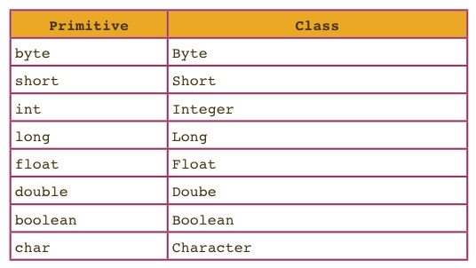

<!-- Generated by scripts/import-cs61b.mjs. Do not edit. -->


---

## 5.1 自动装箱

### 工业级 Java 语法

在前面的章节中，我们讨论了多种数据结构，以及 Java 怎样支持这些数据结构的实现。本章将补充介绍一些在工业级 Java 程序中经常出现的语言特性。

这里并不打算完整讲解 Java，而是挑选最可能在本课程中用到的功能。

### 自动类型转换

#### 自动装箱与拆箱

上一章已经看到，我们可以使用 `<>` 定义带有泛型类型变量的类，例如 `LinkedListDeque<Item>` 和 `ArrayDeque<Item>`。实例化泛型类时，必须用一个具体类替换泛型参数，也就是明确该数据结构将存放什么类型的元素。

Java 有 8 种基本类型，除此之外的类型都是引用类型。Java 的一个限制是：基本类型不能直接作为泛型的实际类型参数。例如，`ArrayDeque<int>` 是语法错误，必须写成 `ArrayDeque<Integer>`。每种基本类型都有一个对应的引用类型，如图所示；这些引用类型称为**包装类**。



乍看之下，这似乎意味着使用泛型数据结构时，必须手动在基本类型和引用类型之间转换。例如，我们可能以为需要这样写：

```java
public class BasicArrayList {
    public static void main(String[] args) {
        ArrayList<Integer> L = new ArrayList<Integer>();
        L.add(new Integer(5));
        L.add(new Integer(6));

        /* 把 Integer 转换为 int。 */
        int first = L.get(0).intValue();
    }
}
```

这样写很麻烦。幸运的是，Java 可以在基本类型与包装类型之间隐式转换，所以下面的代码完全合法：

```java
public class BasicArrayList {
    public static void main(String[] args) {
        ArrayList<Integer> L = new ArrayList<Integer>();
        L.add(5);
        L.add(6);
        int first = L.get(0);
    }
}
```

它能够工作，是因为 Java 会在基本类型与对应引用类型之间自动进行“装箱”和“拆箱”。当 Java 期待包装类型（如 `Integer`），而你提供基本类型（如 `int`）时，它会自动把该整数装箱。

例如，定义：

```java
public static void blah(Integer x) {
    System.out.println(x);
}
```

然后调用：

```java
int x = 20;
blah(x);
```

Java 会隐式把 `int` 值 20 包装成 `Integer`。其效果近似于调用 `blah(Integer.valueOf(20))`。这个过程称为**自动装箱（autoboxing）**。

反过来，如果 Java 期待基本类型：

```java
public static void blahPrimitive(int x) {
    System.out.println(x);
}
```

而你提供对应的包装类型：

```java
Integer x = Integer.valueOf(20);
blahPrimitive(x);
```

Java 会自动取出包装对象中的基本类型值，这称为**自动拆箱（unboxing）**。

##### 注意事项

使用自动装箱和拆箱时，需要记住以下几点：

- 数组不会自动装箱或拆箱。例如，`int[]` 不能赋给 `Integer[]` 变量；编译器不会允许这种转换。
- 自动装箱和拆箱会带来可测量的性能开销。依赖自动转换的代码，通常比直接使用基本类型的代码慢。
- 包装类型占用的内存远多于基本类型。在多数现代计算机上，不仅要保存一个 64 位对象引用，每个对象本身通常还需要额外的对象头，用于记录动态类型等信息。
  - 关于内存占用，可以参考[这篇资料](http://www.javamex.com/tutorials/memory/object_memory_usage.shtml)或[这篇资料](http://blog.kiyanpro.com/2016/10/07/system_design/memory-usage-estimation-in-java/)。

#### 拓宽转换

与自动装箱和拆箱类似，Java 也会在需要时自动把基本类型**拓宽（widening）**。具体来说，如果程序需要类型 `T2`，实际得到类型 `T1`，并且 `T2` 能表示比 `T1` 更大的取值范围，那么 Java 会把 `T1` 隐式转换为 `T2`。

例如，Java 中 `double` 的表示范围比 `int` 更宽。若有：

```java
public static void blahDouble(double x) {
    System.out.println("double: " + x);
}
```

可以用一个 `int` 调用它：

```java
int x = 20;
blahDouble(x);
```

其效果等价于 `blahDouble((double) x)`。

如果要从更宽的类型转换为更窄的类型，则必须显式强制转换。例如：

```java
public static void blahInt(int x) {
    System.out.println("int: " + x);
}
```

若用 `double` 调用，就要写：

```java
double x = 20;
blahInt((int) x);
```

更完整的拓宽规则见 [Java 语言规范](http://docs.oracle.com/javase/specs/jls/se8/html/jls-5.html)。

---

## 5.2 不可变性

“不可变性”可能是一个你以前从未意识到存在的概念，但一旦理解它，就会发现它能显著简化编程生活。

**不可变数据类型**是指：其实例在创建后，不能以任何可观察的方式发生变化。

例如，Java 的 `String` 对象是不可变的。无论对某个 `String` 调用什么方法，原字符串对象都不会发生改变。因此，连接两个字符串时，两个原字符串都保持不变，程序会返回一个全新的 `String` 对象。

可变数据类型包括 `ArrayDeque` 和 `Planet`。我们可以向 `ArrayDeque` 添加或删除元素，这些变化可以被外界观察到；同样，`Planet` 的速度和位置也可能随时间改变。

只要一个数据类型包含非私有变量，并且这些变量没有声明为 `final`，它就是可变的。不过，这并不是可变性的唯一来源；还有很多其他方式也会让数据类型可变。非私有变量可以被外部方法修改，从而产生可观察变化。

`final` 关键字可以用于变量，阻止它在第一次赋值后再次被赋值。例如：

```java
public class Date {
    public final int month;
    public final int day;
    public final int year;
    private boolean contrived = true;

    public Date(int m, int d, int y) {
        month = m;
        day = d;
        year = y;
    }
}
```

这个类是不可变的。创建一个 `Date` 后，没有办法改变它的年月日属性。

不可变数据类型的优点：

- 属性永远不会改变，因此可以预防一类错误，也更容易调试；
- 可以可靠地依赖对象长期保持某种行为或特征。

缺点：

- 若要“改变”某个属性，必须创建一个新对象。

注意事项：

- 把一个**引用**声明为 `final`，并不会让它指向的对象变成不可变对象。例如：

  ```java
  public final ArrayDeque<String> deque = new ArrayDeque<String>();
  ```

  `deque` 变量不能被重新赋值为另一个引用，但它指向的 `ArrayDeque` 仍然可以增加、删除元素。`ArrayDeque` 本身始终是可变的。

- 使用反射 API，甚至可以修改私有变量。这里讨论的不可变性，默认程序没有使用这些特殊能力。

---

## 5.3 泛型

### 创建另一个泛型类

前面已经创建过泛型列表，例如 `DLList` 和 `AList`。现在转向另一种数据类型：映射（Map）。映射把键与值关联起来。例如，“Josh 的考试成绩是 0”可以存储在一个把学生映射到考试成绩的结构中。Java 的 `Map` 大致对应 Python 的字典。

我们将创建 `ArrayMap` 类，它实现 `Map61B` 接口。`Map61B` 是 Java 内置 `Map` 接口的精简版本，包含以下方法：

```text
put(key, value)：把键与值关联起来。
containsKey(key)：检查映射中是否存在该键。
get(key)：在键存在的前提下返回对应值。
keys()：返回所有键的列表。
size()：返回键的数量。
```

本练习暂时忽略扩容。需要注意，`Map61B`（以及 Java 的 `Map`）规定：每个键在同一时刻只能对应一个值。如果 Josh 当前映射到 0，后来发现成绩应为 100，那么原来的 0 会被覆盖为 100。

你可以先自行尝试实现 `ArrayMap`。下面给出完整参考实现：

```java
package Map61B;

import java.util.List;
import java.util.ArrayList;

/**
 * Map61B 的数组实现。
 */
public class ArrayMap<K, V> implements Map61B<K, V> {

    private K[] keys;
    private V[] values;
    int size;

    public ArrayMap() {
        keys = (K[]) new Object[100];
        values = (V[]) new Object[100];
        size = 0;
    }

    /**
     * 如果键存在，返回它的索引；否则返回 -1。
     */
    private int keyIndex(K key) {
        for (int i = 0; i < size; i++) {
            if (keys[i].equals(key)) {
                return i;
            }
        }
        return -1;
    }

    public boolean containsKey(K key) {
        int index = keyIndex(key);
        return index > -1;
    }

    public void put(K key, V value) {
        int index = keyIndex(key);
        if (index == -1) {
            keys[size] = key;
            values[size] = value;
            size += 1;
        } else {
            values[index] = value;
        }
    }

    public V get(K key) {
        int index = keyIndex(key);
        return values[index];
    }

    public int size() {
        return size;
    }

    public List<K> keys() {
        List<K> keyList = new ArrayList<>();
        for (int i = 0; i < keys.length; i++) {
            keyList.add(keys[i]);
        }
        return keyList;
    }
}
```

把泛型命名为 `K` 和 `V` 只是约定，并不是语法要求。完全可以改成 `Potato`、`Sauce` 或其他名字。但在 Java 中，用单个大写字母表示泛型参数十分常见。

代码开头的 `package Map61B;` 表示把 `ArrayMap` 放入名为 `Map61B` 的包。我们还从 `java.util` 导入了 `List` 和 `ArrayList`。

**练习 5.3.1。** 当前 `ArrayMap` 实现中有一个错误，你能找到吗？

**答案：** `keys` 方法中的循环应在 `i == size` 时结束，而不是遍历到 `keys.length`。否则会把未使用位置中的 `null` 也加入结果。

### `ArrayMap` 与自动装箱谜题

考虑下面的测试：

```java
@Test
public void test() {
    ArrayMap<Integer, Integer> am = new ArrayMap<Integer, Integer>();
    am.put(2, 5);
    int expected = 5;
    assertEquals(expected, am.get(2));
}
```

这段代码会产生编译错误：

```text
ArrayMapTest.java:11: error: reference to assertEquals is ambiguous
    assertEquals(expected, am.get(2));
    ^
both method assertEquals(long, long) in Assert
and method assertEquals(Object, Object) in Assert match
```

原因是 JUnit 的 `assertEquals` 被重载了，例如有 `assertEquals(long expected, long actual)` 和 `assertEquals(Object expected, Object actual)`。调用 `assertEquals(expected, am.get(2))` 时，Java 需要对一个参数执行装箱或拆箱，却无法唯一确定应该选哪个重载版本。

**练习 5.3.2。** 怎样才能明确调用 `assertEquals(long, long)`？

A. 把 `expected` 拓宽为 `long`；  
B. 把 `expected` 自动装箱为 `Long`；  
C. 把 `am.get(2)` 拆箱；  
D. 将拆箱后的 `am.get(2)` 再拓宽为 `long`。

**答案：** A、C、D 都可行。

**练习 5.3.3。** 怎样让它调用 `assertEquals(Object, Object)`？

**答案：** 把 `expected` 装箱为 `Integer`，因为 `Integer` 是一种 `Object`。

**练习 5.3.4。** 怎样使用显式类型转换让代码通过编译？

**答案：** 把 `expected` 转换为 `Integer`。

### 泛型方法

下一步创建 `MapHelper` 类，包含两个方法：

- `get(Map61B, key)`：若键存在，返回对应值；否则返回 `null`。
  - 这很有用，因为当前 `ArrayMap.get` 在键不存在时会用索引 -1 访问数组，从而抛出 `ArrayIndexOutOfBoundsException`。
- `maxKey(Map61B)`：返回映射中的最大键；仅适用于键可以比较的情况。

#### 实现 `get`

`get` 是一个静态方法，接收 `Map61B` 实例和一个键。若键存在，返回对应值，否则返回 `null`。

**练习 5.3.5。** 尝试自己实现这个方法。

一种非常受限的写法是把类型固定为 `String` 和 `Integer`：

```java
public static Integer get(Map61B<String, Integer> map, String key) {
    ...
}
```

这使方法只能接收 `Map61B<String, Integer>`，显然不够通用。我们希望它能接收任意具体泛型参数的 `Map61B`。但下面的声明无法编译：

```java
public static V get(Map61B<K, V> map, K key) {
    ...
}
```

类声明中的泛型参数，会在用户实例化该类时确定。但这里需要的是只属于这个方法的泛型参数。我们不关心 `K` 与 `V` 究竟是哪种类型，只需要保证：输入映射使用某种 `K` 作为键，并返回与之对应的 `V`。

因此需要**泛型方法**。声明泛型方法时，要把形式类型参数写在返回类型之前：

```java
public static <K, V> V get(Map61B<K, V> map, K key) {
    if (map.containsKey(key)) {
        return map.get(key);
    }
    return null;
}
```

调用示例：

```java
ArrayMap<Integer, String> isMap = new ArrayMap<Integer, String>();
System.out.println(MapHelper.get(isMap, 5));
```

不需要显式写出本次调用的 `K` 与 `V`。Java 可以从 `isMap` 推断出：键是 `Integer`，值是 `String`。

### 实现 `maxKey`

**练习 5.3.6。** 尝试自己实现这个方法。

下面这段代码看似合理，但并不正确：

```java
public static <K, V> K maxKey(Map61B<K, V> map) {
    List<K> keyList = map.keys();
    K largest = keyList.get(0);
    for (K k : keyList) {
        if (k > largest) {
            largest = k;
        }
    }
    return largest;
}
```

**练习 5.3.7。** 错在哪里？

**答案：** `>` 不能用于比较任意 `K` 对象。它只直接适用于某些基本类型，而泛型不能保证 `K` 支持 `>`。

于是尝试改写为：

```java
public static <K, V> K maxKey(Map61B<K, V> map) {
    List<K> keyList = map.keys();
    K largest = keyList.get(0);
    for (K k : keyList) {
        if (k.compareTo(largest) > 0) {
            largest = k;
        }
    }
    return largest;
}
```

**练习 5.3.8。** 这仍然不正确，为什么？

**答案：** 并不是所有对象都有 `compareTo` 方法。

因此，要在方法声明中为泛型参数增加约束：

```java
public static <K extends Comparable<K>, V>
K maxKey(Map61B<K, V> map) {
    ...
}
```

`K extends Comparable<K>` 表示：键类型必须实现 `Comparable<K>`，也就是能够与其他 `K` 比较。`Comparable` 本身也是泛型接口，所以必须写出 `<K>`，明确我们希望 `K` 与 `K` 比较。

### 类型上界

你可能会问：`Comparable` 明明是接口，为什么这里使用 `extends`，而不是 `implements`？

这里的 `extends` 与普通继承语境中的含义不同。

当我们说 `Dog extends Animal` 时，是在让 `Dog` 获得 `Animal` 的能力，即建立真正的继承关系。而当我们说 `K extends Comparable<K>` 时，只是在陈述约束：`K` **必须是** `Comparable<K>` 的子类型。我们不是在这里给 `K` 添加能力，而是在限制可以作为 `K` 的类型范围。

这种用法称为**类型上界（type upper bound）**。请记住：

- 在类继承中，`extends` 建立继承并让子类获得超类能力；
- 在泛型声明中，`extends` 施加约束，要求类型参数必须属于某个上界。

**用于泛型时，`extends` 是限制条件，而不是赋予新能力。**

### 总结

本章介绍了四项增强 Java 泛型能力的特性：

- 基本类型与包装类型之间的自动装箱和自动拆箱；
- 基本类型之间的提升或拓宽转换；
- 在返回类型前声明方法自己的泛型参数；
- 在泛型方法中使用类型上界，例如 `K extends Comparable<K>`。

---

> 原作：Josh Hug，UC Berkeley CS61B Spring 2021 配套读本。<br>
> 中文翻译版，仅供非商业学习；采用 CC BY-NC-SA 4.0 许可。<br>
> 原始网站：https://joshhug.gitbooks.io/hug61b/content/
