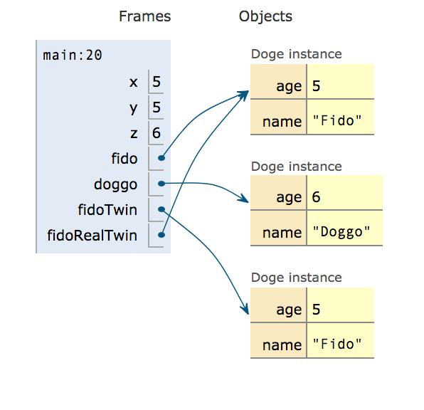
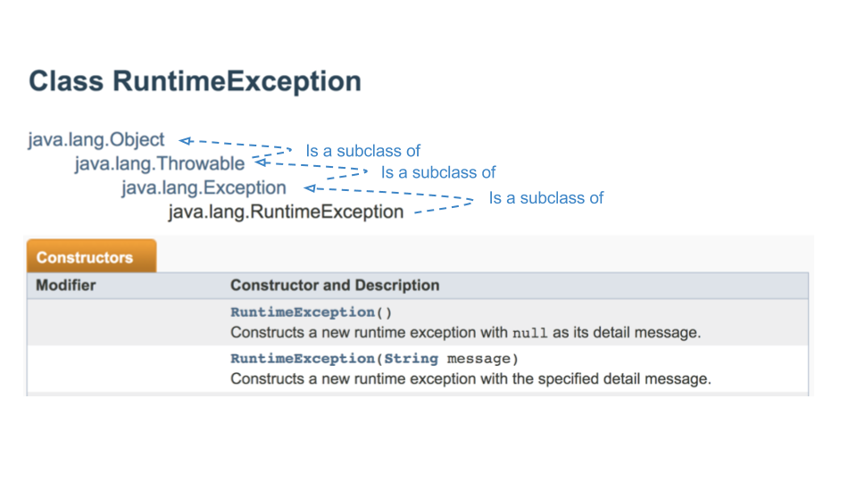
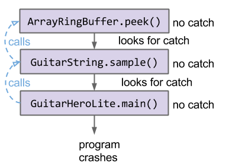
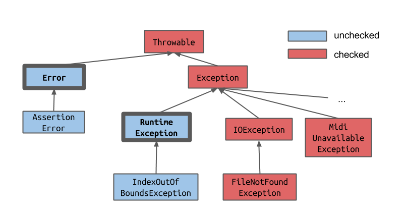

<!-- Generated by scripts/import-cs61b.mjs. Do not edit. -->


---

## 6.1 `List`、`Set` 与 `ArraySet`

本节将学习怎样使用 Java 内置的 `List` 和 `Set` 数据结构，并亲手构建一个 `ArraySet`。

课程中已经实现过两种列表：`AList` 和 `SLList`。我们还创建了 `List61B` 接口，用来规定二者必须实现的列表方法。代码见：

- [List61B](https://github.com/Berkeley-CS61B/lectureCode-sp19/blob/master/inheritance2/List61B.java)
- [AList](https://github.com/Berkeley-CS61B/lectureCode-sp19/blob/master/inheritance1/AList.java)
- [SLList](https://github.com/Berkeley-CS61B/lectureCode-sp19/blob/master/inheritance2/SLList.java)

`List61B` 的使用方式可能如下：

```java
List61B<Integer> L = new AList<>();
L.addLast(5);
L.addLast(10);
L.addLast(15);
L.print();
```

### 实际 Java 程序中的列表

我们从零实现了列表，但 Java 已经提供内置的 `List` 接口以及多种实现，例如 `ArrayList`。请记住：`List` 是接口，不能直接实例化，必须实例化它的某个实现类。

可以使用类和接口的完整规范名称：

```java
java.util.List<Integer> L = new java.util.ArrayList<>();
```

不过这样很冗长。和导入 JUnit 类似，我们可以导入 Java 标准库中的类型：

```java
import java.util.List;
import java.util.ArrayList;

public class Example {
    public static void main(String[] args) {
        List<Integer> L = new ArrayList<>();
        L.add(5);
        L.add(10);
        System.out.println(L);
    }
}
```

### 集合

集合（Set）保存互不重复的元素，每个元素最多出现一次，而且集合本身不强调顺序。

#### Java

Java 提供 `Set` 接口以及 `HashSet` 等实现。如果不想每次写完整名称，需要先导入：

```java
import java.util.Set;
import java.util.HashSet;
```

使用示例：

```java
Set<String> s = new HashSet<>();
s.add("Tokyo");
s.add("Lagos");
System.out.println(s.contains("Tokyo")); // true
```

#### Python

Python 中可以直接调用 `set()`。检查是否包含某元素时，不使用方法，而使用关键字 `in`：

```python
s = set()
s.add("Tokyo")
s.add("Lagos")
print("Tokyo" in s)  # True
```

### `ArraySet`

我们的目标是实现自己的集合 `ArraySet`，提供以下方法：

- `add(value)`：若值尚不存在，就把它加入集合；
- `contains(value)`：检查集合是否包含该值；
- `size()`：返回集合中的值数量。

可以从[练习起始代码](https://github.com/Berkeley-CS61B/lectureCode-sp19/blob/af2325c600010a8894a6ce3a3ccf517547145ec1/exercises/DIY/inheritance4/ArraySet.java)开始自行实现。

目前的代码如下：

```java
import java.util.Iterator;

public class ArraySet<T> implements Iterable<T> {
    private T[] items;
    private int size; // 下一个元素会被加入位置 size

    public ArraySet() {
        items = (T[]) new Object[100];
        size = 0;
    }

    /** 如果集合包含 x，返回 true。 */
    public boolean contains(T x) {
        for (int i = 0; i < size; i += 1) {
            if (items[i].equals(x)) {
                return true;
            }
        }
        return false;
    }

    /** 把 x 加入集合。 */
    public void add(T x) {
        if (contains(x)) {
            return;
        }
        items[size] = x;
        size += 1;
    }

    /** 返回集合中的元素数。 */
    public int size() {
        return size;
    }
}
```

---

## 6.2 抛出异常

上一节的 `ArraySet` 实现有一个小问题：如果把 `null` 加入集合，之后可能出现 `NullPointerException`。

问题出在 `contains` 中的 `items[i].equals(x)`。如果 `items[i]` 是 `null`，代码实际上会调用 `null.equals(x)`，从而抛出空指针异常。

异常会中断正常控制流。我们也可以主动抛出自己的异常。Python 使用 `raise`；Java 中异常本身是对象，抛出异常的一般形式为：

```java
throw new ExceptionType(parameter1, ...);
```

当用户试图向 `ArraySet` 添加 `null` 时，可以抛出 `IllegalArgumentException`。它的构造方法接收一条字符串消息。

更新后的 `add`：

```java
/**
 * 把 x 加入集合；如果 x 为 null，则抛出 IllegalArgumentException。
 */
public void add(T x) {
    if (x == null) {
        throw new IllegalArgumentException("can't add null");
    }
    if (contains(x)) {
        return;
    }
    items[size] = x;
    size += 1;
}
```

无论如何程序还是产生了异常，这样做为什么更好？

1. 我们掌握了代码的控制权，明确决定在何处停止正常流程；
2. 异常类型更准确，错误消息也更有助于调用者理解问题。

当然，如果程序完全不崩溃可能更好。可以采用不同策略，例如：

- 方案一：传入 `null` 时直接不添加；
- 方案二：修改 `contains`，明确处理 `items[i] == null` 的情况。

无论选择哪一种行为，都必须让使用者知道应该期待什么。这正是方法文档和注释非常重要的原因。

---

## 6.3 迭代

Java 的 `HashSet` 可以使用简洁的增强 `for` 循环：

```java
Set<String> s = new HashSet<>();
s.add("Tokyo");
s.add("Lagos");
for (String city : s) {
    System.out.println(city);
}
```

但如果对自己的 `ArraySet` 使用同样语法，编译器会报错。怎样让它也支持这种功能？

### 增强 `for` 循环

先理解增强 `for` 循环背后发生了什么。下面的代码：

```java
Set<String> s = new HashSet<>();
...
for (String city : s) {
    ...
}
```

大致会被转换为：

```java
Set<String> s = new HashSet<>();
...
Iterator<String> seer = s.iterator();
while (seer.hasNext()) {
    String city = seer.next();
    ...
}
```

去掉语法糖之后，关键是一个称为**迭代器（iterator）**的对象。

例如，`List` 接口提供一个返回迭代器对象的 `iterator()` 方法：

```java
public Iterator<E> iterator();
```

随后可以使用该对象访问列表中的全部元素：

```java
List<Integer> friends = new ArrayList<Integer>();
...
Iterator<Integer> seer = friends.iterator();

while (seer.hasNext()) {
    System.out.println(seer.next());
}
```

它与增强 `for` 循环的行为相同。

迭代过程有三个关键步骤：

1. 通过 `friends.iterator()` 获得新的迭代器；
2. 使用 `seer.hasNext()` 判断是否还有未访问元素；有则返回 `true`，全部处理完则返回 `false`；
3. `seer.next()` 同时完成两件事：返回下一个元素，并把迭代器向前推进一位。因此，每个元素只会被该迭代器访问一次。

### 实现迭代器

下面讨论怎样让一个类支持迭代。先考虑编译器为了接受下面代码，需要知道什么：

```java
List<Integer> friends = new ArrayList<Integer>();
Iterator<Integer> seer = friends.iterator();

while (seer.hasNext()) {
    System.out.println(seer.next());
}
```

观察调用相关方法的表达式静态类型：

- `friends` 的静态类型是 `List`，并调用了 `iterator()`。所以 `List` 接口必须声明 `iterator()`；
- `seer` 的静态类型是 `Iterator`，并调用 `hasNext()` 和 `next()`。所以 `Iterator` 接口必须声明这两个方法。

`List` 接口继承 `Iterable`，因而继承抽象的 `iterator()` 方法。严格来说，是 `List extends Collection`，而 `Collection extends Iterable`，但可以先简化理解为：

```java
public interface Iterable<T> {
    Iterator<T> iterator();
}
```

```java
public interface List<T> extends Iterable<T> {
    ...
}
```

`Iterator` 接口则明确声明：

```java
public interface Iterator<T> {
    boolean hasNext();
    T next();
}
```

#### 当 `hasNext()` 为 `false` 后仍调用 `next()` 会怎样？

接口本身不保证友好结果。常见约定是抛出 `NoSuchElementException`。相关例子见[讨论课 5](https://sp19.datastructur.es/materials/discussion/disc05sol.pdf)。

#### 用户一定会先调用 `hasNext()` 吗？

不一定。如果调用者准确知道序列长度，可能直接连续调用 `next()`。因此，迭代器实现不能假定用户总会先检查；必要时可以在 `next()` 内部调用 `hasNext()`。

不同数据结构会以不同方式实现迭代。下面让 `ArraySet` 支持遍历。先在 `ArraySet` 内部定义嵌套类 `ArraySetIterator`：

```java
private class ArraySetIterator implements Iterator<T> {
    private int wizPos;

    public ArraySetIterator() {
        wizPos = 0;
    }

    public boolean hasNext() {
        return wizPos < size;
    }

    public T next() {
        T returnItem = items[wizPos];
        wizPos += 1;
        return returnItem;
    }
}
```

它用 `wizPos` 记录当前数组位置，并实现 `hasNext()` 与 `next()`。如果数据结构换成链表，这两个方法的内部实现也会不同。

**思考练习：** 链表的 `hasNext()` 和 `next()` 应当怎样设计？

现在可以手动使用迭代器：

```java
ArraySet<Integer> aset = new ArraySet<>();
aset.add(5);
aset.add(23);
aset.add(42);

Iterator<Integer> iter = aset.iterator();
while (iter.hasNext()) {
    System.out.println(iter.next());
}
```

为了支持增强 `for` 循环，还要让 `ArraySet` 实现 `Iterable<T>`。`Iterable` 的核心方法是 `iterator()`，只需返回刚刚编写的迭代器实例：

```java
public Iterator<T> iterator() {
    return new ArraySetIterator();
}
```

于是可以写：

```java
ArraySet<Integer> aset = new ArraySet<>();
...
for (int i : aset) {
    System.out.println(i);
}
```

这里出现了两个不同接口：

- **`Iterable`**：表示某个对象可以被遍历；要求提供 `iterator()`，返回迭代器；
- **`Iterator`**：表示真正执行遍历过程的对象；要求提供 `hasNext()` 和 `next()`。

可以把迭代器想象成安装在可迭代对象上的遍历机器。可迭代对象是被访问的数据容器，迭代器负责逐个取出元素。

带完整迭代支持的 `ArraySet` 如下：

```java
import java.util.Iterator;

public class ArraySet<T> implements Iterable<T> {
    private T[] items;
    private int size;

    public ArraySet() {
        items = (T[]) new Object[100];
        size = 0;
    }

    public boolean contains(T x) {
        for (int i = 0; i < size; i += 1) {
            if (items[i].equals(x)) {
                return true;
            }
        }
        return false;
    }

    public void add(T x) {
        if (x == null) {
            throw new IllegalArgumentException("can't add null");
        }
        if (contains(x)) {
            return;
        }
        items[size] = x;
        size += 1;
    }

    public int size() {
        return size;
    }

    public Iterator<T> iterator() {
        return new ArraySetIterator();
    }

    private class ArraySetIterator implements Iterator<T> {
        private int wizPos;

        public ArraySetIterator() {
            wizPos = 0;
        }

        public boolean hasNext() {
            return wizPos < size;
        }

        public T next() {
            T returnItem = items[wizPos];
            wizPos += 1;
            return returnItem;
        }
    }

    public static void main(String[] args) {
        ArraySet<Integer> aset = new ArraySet<>();
        aset.add(5);
        aset.add(23);
        aset.add(42);

        for (int i : aset) {
            System.out.println(i);
        }
    }
}
```

---

## 6.4 `Object` 方法

所有类最终都继承自 `Object`。它提供的方法包括：

- `String toString()`
- `boolean equals(Object obj)`
- `Class<?> getClass()`
- `int hashCode()`
- `protected Object clone()`
- `protected void finalize()`
- `void notify()`
- `void notifyAll()`
- `void wait()`
- `void wait(long timeout)`
- `void wait(long timeout, int nanos)`

本节重点讨论前两个，并通过重写让它们表现出我们希望的行为。

### `toString()`

`toString()` 返回对象的字符串表示。`System.out.println()` 接收对象时，会隐式调用该对象的 `toString()`，再打印返回的字符串。也就是说：

```java
System.out.println(dog);
```

大致相当于：

```java
String s = dog.toString();
System.out.println(s);
```

`Object` 默认的 `toString()` 通常输出类名以及与对象身份相关的十六进制信息，并不是方便阅读的内容。`ArrayList` 等标准库类重写了它，所以测试失败时可以看到类似 `[1, 2, 3, 4]` 的表示，而不是难以理解的对象标识。

对于我们自己编写的 `ArrayDeque`、`LinkedListDeque` 等类，如果希望打印出易读内容，就需要重写 `toString()`。

下面为 `ArraySet` 编写该方法。完整类中暂时留出 `toString` 与 `equals`：

```java
import java.util.Iterator;

public class ArraySet<T> implements Iterable<T> {
    private T[] items;
    private int size;

    public ArraySet() {
        items = (T[]) new Object[100];
        size = 0;
    }

    public boolean contains(T x) {
        for (int i = 0; i < size; i += 1) {
            if (items[i].equals(x)) {
                return true;
            }
        }
        return false;
    }

    public void add(T x) {
        if (x == null) {
            throw new IllegalArgumentException("can't add null");
        }
        if (contains(x)) {
            return;
        }
        items[size] = x;
        size += 1;
    }

    public int size() {
        return size;
    }

    public Iterator<T> iterator() {
        return new ArraySetIterator();
    }

    private class ArraySetIterator implements Iterator<T> {
        private int wizPos;

        public ArraySetIterator() {
            wizPos = 0;
        }

        public boolean hasNext() {
            return wizPos < size;
        }

        public T next() {
            T returnItem = items[wizPos];
            wizPos += 1;
            return returnItem;
        }
    }

    @Override
    public String toString() {
        /* 待实现 */
    }

    @Override
    public boolean equals(Object other) {
        /* 待实现 */
    }
}
```

**练习 6.4.1。** 编写 `toString()`，使 `ArraySet` 被打印时，以花括号包围、逗号分隔元素，例如 `{1, 2, 3, 4}`。请记住，`toString()` 应返回字符串，而不是自行打印。

一种简单实现：

```java
public String toString() {
    String returnString = "{";
    for (int i = 0; i < size; i += 1) {
        returnString += items[i];
        returnString += ", ";
    }
    returnString += "}";
    return returnString;
}
```

它看起来简洁，但实际上非常低效。Java 的 `String` 不可变，所以执行：

```java
returnString += items[i];
```

并不是修改原字符串，而是创建一个全新的字符串对象。创建和复制字符串所需时间与当前字符串长度成正比。

**附加问题：** 假设向字符串追加一个字符需要 1 秒，对大小为 5 的集合 `{1, 2, 3, 4, 5}` 执行上述 `toString()`，大约需要多久？

**答案：** 字符串会一次次重新创建，工作量累加，近似为 `1 + 2 + 3 + 4 + 5 + 6 + 7` 个单位，而不是常数级追加。

为解决这个问题，Java 提供 `StringBuilder`。它维护一个可变的字符序列，可以反复向同一个对象追加内容。

**练习 6.4.2。** 使用 `StringBuilder` 重写 `toString()`。

```java
public String toString() {
    StringBuilder returnSB = new StringBuilder("{");
    for (int i = 0; i < size - 1; i += 1) {
        returnSB.append(items[i].toString());
        returnSB.append(", ");
    }
    if (size > 0) {
        returnSB.append(items[size - 1]);
    }
    returnSB.append("}");
    return returnSB.toString();
}
```

至此，我们成功重写了 `toString()`。接下来重写另一个重要的 `Object` 方法：`equals()`。

### `equals()` 与 `==`

Java 中，`equals()` 和 `==` 的含义不同。

`==` 检查两个变量中的位是否相同：

- 对基本类型，它比较值；
- 对引用类型，它比较引用，也就是两个变量是否指向内存中的同一个对象。

假设有：

```java
public class Doge {
    public int age;
    public String name;

    public Doge(int age, String name) {
        this.age = age;
        this.name = name;
    }

    public static void main(String[] args) {
        int x = 5;
        int y = 5;
        int z = 6;

        Doge fido = new Doge(5, "Fido");
        Doge doggo = new Doge(6, "Doggo");
        Doge fidoTwin = new Doge(5, "Fido");
        Doge fidoRealTwin = fido;
    }
}
```

其盒子与指针关系如下：



**练习：** 下列表达式分别返回什么？

- `x == y`：`true`
- `x == z`：`false`
- `fido == doggo`：`false`
- `fido == fidoTwin`：`false`
- `fido == fidoRealTwin`：`true`

`fido` 与 `fidoTwin` 的属性完全相同，但它们指向两个不同对象，所以 `==` 为 `false`。这在测试中会造成问题。例如，测试列表时，期望列表通常是新创建的对象；如果用 `==` 比较，即使元素相同也会得到 `false`。这正是 `equals(Object o)` 的用途。

### `equals(Object o)`

`Object` 默认的 `equals(Object o)` 与 `==` 类似，比较对象身份。但我们可以重写它，自行定义什么叫“相等”。例如，两个列表只要包含相同且顺序一致的元素，就可以视为相等。

**练习 6.4.3。** 为 `ArraySet` 编写 `equals`。集合是无序且元素唯一的容器，所以两个集合只需包含相同元素即可视为相等。

```java
@Override
public boolean equals(Object other) {
    if (this == other) {
        return true;
    }
    if (other == null) {
        return false;
    }
    if (other.getClass() != this.getClass()) {
        return false;
    }

    ArraySet<T> o = (ArraySet<T>) other;
    if (o.size() != this.size()) {
        return false;
    }
    for (T item : this) {
        if (!o.contains(item)) {
            return false;
        }
    }
    return true;
}
```

开头的检查让方法能够正确处理 `null` 和不同类型的对象。如果 `this == other`，则立即返回 `true`，避免多余遍历。

#### Java 中 `equals` 的规则

重写 `equals` 比看起来更容易出错，应遵守以下约定：

1. `equals` 必须构成等价关系：
   - **自反性**：`x.equals(x)` 为 `true`；
   - **对称性**：`x.equals(y)` 当且仅当 `y.equals(x)`；
   - **传递性**：若 `x.equals(y)` 且 `y.equals(z)`，则 `x.equals(z)`。
2. 参数必须是 `Object`，才能真正重写原方法；
3. 必须保持一致：只要 `x` 和 `y` 没有改变，多次调用 `x.equals(y)` 的结果就应相同；
4. 对任何非空对象 `x`，`x.equals(null)` 必须为 `false`。

更多改进，包括更完善的 `toString` 和 `ArraySet.of`，可参考[附加代码](https://github.com/Berkeley-CS61B/lectureCode-sp19/blob/af2325c600010a8894a6ce3a3ccf517547145ec1/inheritance4/ArraySet.java)。

---

## 附录：抛出异常（旧版）

### 抛出异常

当程序发生严重问题时，我们通常希望打断正常控制流：继续执行可能没有意义，甚至根本不可能。此时，程序会抛出异常。

先看一个熟悉的例子：数组索引越界。下面的代码把键 `"hello"` 映射到值 5，然后尝试读取不存在的键 `"yolp"`：

```java
public static void main(String[] args) {
    ArrayMap<String, Integer> am = new ArrayMap<String, Integer>();
    am.put("hello", 5);
    System.out.println(am.get("yolp"));
}
```

运行时，程序试图访问不存在的键并崩溃：

```text
Exception in thread "main" java.lang.ArrayIndexOutOfBoundsException: -1
    at ArrayMap.get(ArrayMap.java:38)
    at ExceptionDemo.main(ExceptionDemo.java:6)
```

这是一个**隐式异常**，由 Java 自己抛出。错误消息告诉我们出现了 `ArrayIndexOutOfBoundsException`，但没有直接说明真正原因是键不存在。

可以使用 `throw` 主动抛出异常，并给出更有意义的消息。这属于**显式异常**，因为是程序员有意抛出的。

例如，修改 `get`：

```java
public V get(K key) {
    int location = findKey(key);
    if (location < 0) {
        throw new IllegalArgumentException(
            "Key " + key + " does not exist in map.");
    }
    return values[location];
}
```

现在错误更明确：

```text
Exception in thread "main" java.lang.IllegalArgumentException:
Key yolp does not exist in map.
    at ArrayMap.get(ArrayMap.java:40)
    at ExceptionDemo.main(ExceptionDemo.java:6)
```

### 捕获异常

程序运行时可能出现各种异常事件，例如：

- 试图申请 383,124 GB 内存；
- 把动态类型并非 `Dog` 的对象强制转换为 `Dog`；
- 通过值为 `null` 的引用调用方法；
- 访问数组的 -1 号索引。

下面的错误类型转换：

```java
Object o = "mulchor";
Planet x = (Planet) o;
```

会导致：

```text
Exception in thread "main" java.lang.ClassCastException:
java.lang.String cannot be cast to Planet
```

也可以主动抛出异常：

```java
public static void main(String[] args) {
    System.out.println("ayyy lmao");
    throw new RuntimeException("For no reason.");
}
```

输出：

```text
ayyy lmao
Exception in thread "main" java.lang.RuntimeException: For no reason.
    at Alien.main(Alien.java:4)
```

`new RuntimeException(...)` 看起来像实例化类，因为事实正是如此：异常也是普通 Java 对象。



异常不一定必须让程序崩溃。可以使用 `try` 和 `catch` **捕获**异常，从而转移控制流并继续执行。

```java
Dog d = new Dog("Lucy", "Retriever", 80);
d.becomeAngry();

try {
    d.receivePat();
} catch (Exception e) {
    System.out.println("Tried to pat: " + e);
}
System.out.println(d);
```

可能输出：

```text
Tried to pat: java.lang.RuntimeException: grrr... snarl snarl
Lucy is a displeased Retriever weighing 80.0 standard lb units.
```

抚摸生气的狗时，`receivePat` 抛出异常；但异常被捕获，所以程序仍会执行最后一行。

`catch` 还可以采取补救行动：

```java
Dog d = new Dog("Lucy", "Retriever", 80);
d.becomeAngry();

try {
    d.receivePat();
} catch (Exception e) {
    System.out.println("Tried to pat: " + e);
    d.eatTreat("banana");
}
d.receivePat();
System.out.println(d);
```

输出可能是：

```text
Tried to pat: java.lang.RuntimeException: grrr... snarl snarl
Lucy munches the banana
Lucy enjoys the pat.
Lucy is a happy Retriever weighing 80.0 standard lb units.
```

现实中，补救行动可能是在机器人操作要求天线就绪却失败时展开天线，也可能只是把错误写入日志，供以后分析。

### 异常处理的思想

异常不是处理错误的唯一方式，但它有一个重要优势：把错误处理从程序的主要逻辑中分离出来。

考虑读取文件的伪代码：

```text
readFile:
    打开文件；
    确定文件大小；
    分配相应内存；
    把文件读入内存；
    关闭文件；
```

很多步骤都可能失败：文件不存在、内存不足、读取失败等。若不用异常，代码可能充满层层嵌套的条件判断：

```text
readFile:
    打开文件；
    如果打开成功：
        确定大小；
        如果成功获得大小：
            分配内存；
            如果内存足够：
                读取文件；
                如果读取失败：返回读取错误；
            否则：返回内存错误；
        否则：返回长度错误；
    否则：返回打开文件错误；
```

这种代码非常混乱。使用异常后可以写成：

```text
readFile:
    try:
        打开文件；
        确定文件大小；
        分配内存；
        读取文件；
        关闭文件；
    catch 打开失败：执行对应处理；
    catch 获取大小失败：执行对应处理；
    catch 分配内存失败：执行对应处理；
    catch 读取失败：执行对应处理；
    catch 关闭失败：执行对应处理；
```

主逻辑按清晰叙事依次展开，错误则集中放在后面的处理分支中。好的代码像一段故事，结构清楚，因而更容易编写和维护。

### 未捕获异常

异常被抛出后，会沿调用栈向下传播。



如果 `peek()` 没有捕获异常，它会传播给调用者 `sample()`；可以把这理解为当前方法从调用栈弹出。若 `sample()` 也不捕获，它会继续传播到 `main()`。

若异常一直到调用栈底部仍未被捕获，程序就会崩溃，并输出**栈轨迹（stack trace）**：

```text
java.lang.RuntimeException in thread "main":
    at ArrayRingBuffer.peek:63
    at GuitarString.sample:48
    at GuitarHeroLite.java:110
```

栈轨迹表明：错误发生在 `ArrayRingBuffer.peek()` 第 63 行；它由 `GuitarString.sample()` 第 48 行调用，而后者又由 `GuitarHeroLite.java` 的 `main` 第 110 行调用。对于能够修改程序的开发者，这些信息非常重要。

---

## 附录：受检异常与非受检异常（旧版）

此前看到的异常都发生在运行时。但有时程序甚至无法编译，编译器会说某个异常“必须被捕获或声明抛出”。

原因是，有些异常被编译器视为必须显式处理的情况。它们称为**受检异常（checked exception）**。

考虑：

```java
public static void main(String[] args) {
    Eagle.gulgate();
}
```

代码看似合理，但可能得到：

```text
What.java:2: error: unreported exception IOException;
must be caught or declared to be thrown
```

查看 `Eagle`：

```java
public class Eagle {
    public static void gulgate() {
        if (today.equals("Thursday")) {
            throw new IOException("hi");
        }
    }
}
```

`gulgate()` 在星期四会抛出 `IOException`。但 `IOException` 是受检异常，必须以规定方式处理。

如果改为 `RuntimeException`：

```java
public class UncheckedExceptionDemo {
    public static void main(String[] args) {
        if (today.equals("Thursday")) {
            throw new RuntimeException("as a joke");
        }
    }
}
```

代码可以正常编译，只会在星期四运行时崩溃。`RuntimeException` 属于**非受检异常（unchecked exception）**。

怎样区分两者？



`Error`、`RuntimeException` 以及它们的所有子类都是非受检异常。这些问题通常只能在运行时发现，而且往往无法在当前操作中恢复。例如，代码试图读取数组的 -1 号元素时，很难自动补救。

其他大多数异常属于受检异常，其中许多存在合理恢复方式。例如遇到 `FileNotFoundException` 时，可以要求用户重新输入文件名，因为可能只是拼写错误。

Java 希望尽可能阻止程序因可修复问题直接崩溃，所以如果某个受检异常可能发生，却没有任何处理，编译器就拒绝编译。

处理受检异常有两种方式：

1. **捕获（catch）**；
2. **声明（specify）**。

#### 捕获

可以直接在 `gulgate()` 内捕获：

```java
public static void gulgate() {
    try {
        if (today.equals("Thursday")) {
            throw new IOException("hi");
        }
    } catch (Exception e) {
        System.out.println("psych!");
    }
}
```

#### 声明抛出

如果不想在 `gulgate()` 内处理，可以把责任交给调用者，在方法声明中写出 `throws`：

```java
public static void gulgate() throws IOException {
    ...
    throw new IOException("hi");
}
```

但“声明”并没有真正处理异常，只是说明该方法可能把异常传播出去。调用 `gulgate()` 的方法也因此变得危险：

```java
public static void main(String[] args) {
    Eagle.gulgate(); // 仍无法编译
}
```

调用者同样必须二选一。

捕获：

```java
public static void main(String[] args) {
    try {
        Eagle.gulgate();
    } catch (IOException e) {
        System.out.println("Averted!");
    }
}
```

继续声明：

```java
public static void main(String[] args) throws IOException {
    Eagle.gulgate();
}
```

当你能在当前方法中真正处理问题时，应该**捕获**异常，不让它继续逃逸。

当更上层调用者更适合处理问题时，应该**声明**异常，明确告诉调用者该方法可能失败。

---

## 附录：迭代（旧版）

Java 允许我们使用便捷的 `foreach`，也称增强 `for` 循环，遍历列表：

```java
List<Integer> friends = new ArrayList<Integer>();
friends.add(5);
friends.add(23);
friends.add(42);
for (int x : friends) {
    System.out.println(x);
}
```

为了让自己的类支持这种语法，需要理解背后的机制。关键对象是**迭代器**。

`List` 中可以定义返回迭代器的 `iterator()`：

```java
public Iterator<E> iterator();
```

然后手动遍历：

```java
List<Integer> friends = new ArrayList<Integer>();
...
Iterator<Integer> seer = friends.iterator();

while (seer.hasNext()) {
    System.out.println(seer.next());
}
```

它与增强 `for` 循环行为相同：

1. `friends.iterator()` 返回新迭代器；
2. `hasNext()` 判断是否还有未访问元素；
3. `next()` 返回下一个元素，并把迭代器向前推进。

### 实现迭代器

为了编译下面代码：

```java
List<Integer> friends = new ArrayList<Integer>();
Iterator<Integer> seer = friends.iterator();

while (seer.hasNext()) {
    System.out.println(seer.next());
}
```

编译器需要确认：

- `List` 接口是否拥有 `iterator()`；
- `Iterator` 接口是否拥有 `hasNext()` 和 `next()`。

`List` 继承 `Iterable`，而 `Iterable` 声明：

```java
public interface Iterable<T> {
    Iterator<T> iterator();
}
```

```java
public interface List<T> extends Iterable<T> {
    ...
}
```

`Iterator` 则声明：

```java
package java.util;

public interface Iterator<T> {
    boolean hasNext();
    T next();
}
```

具体类负责提供实际遍历行为。下面让 `ArrayMap` 能够遍历键。先在内部定义 `KeyIterator`：

```java
public class KeyIterator {
    private int ptr;

    public KeyIterator() {
        ptr = 0;
    }

    public boolean hasNext() {
        return ptr != size;
    }

    public K next() {
        K returnItem = keys[ptr];
        ptr = ptr + 1;
        return returnItem;
    }
}
```

`ptr` 记录当前位于键数组中的位置。对于不同数据结构，`hasNext()` 与 `next()` 的实现会不同。

**思考练习：** 链表迭代器应怎样实现这两个方法？

现在可以这样遍历 `ArrayMap`：

```java
ArrayMap<String, Integer> am = new ArrayMap<String, Integer>();
am.put("hello", 5);
am.put("syrups", 10);
ArrayMap.KeyIterator ami = am.new KeyIterator();

while (ami.hasNext()) {
    System.out.println(ami.next());
}
```

`am.new KeyIterator()` 用于实例化非静态嵌套类。这样的嵌套类必须依附于特定外部类实例。一个与任何 `ArrayMap` 都无关的键迭代器没有意义，因为它不知道该遍历哪张映射。因此，要通过某个具体 `am` 创建它。

为了支持增强 `for`，还要让 `ArrayMap` 实现 `Iterable<K>`，并重写 `iterator()`：

```java
public class ArrayMap<K, V> implements Iterable<K> {
    @Override
    public Iterator<K> iterator() {
        return new KeyIterator();
    }
}
```

此外，还必须告诉 Java：`KeyIterator` 确实是一种 `Iterator<K>`：

```java
public class KeyIterator implements Iterator<K> {
    private int ptr;

    public KeyIterator() {
        ptr = 0;
    }

    public boolean hasNext() {
        return ptr != size;
    }

    public K next() {
        K returnItem = keys[ptr];
        ptr += 1;
        return returnItem;
    }
}
```

现在可以使用增强 `for`：

```java
ArrayMap<String, Integer> am = new ArrayMap<String, Integer>();
for (String s : am) {
    System.out.println(s);
}
```

总结：

- `Iterable` 表示某个类可以被遍历，要求 `iterator()`；
- `Iterator` 表示执行遍历的对象，要求 `hasNext()` 与 `next()`。

把二者组合起来，就能让自己的类支持简洁的增强 `for` 循环。

---

> 原作：Josh Hug，UC Berkeley CS61B Spring 2021 配套读本。<br>
> 中文翻译版，仅供非商业学习；采用 CC BY-NC-SA 4.0 许可。<br>
> 原始网站：https://joshhug.gitbooks.io/hug61b/content/
