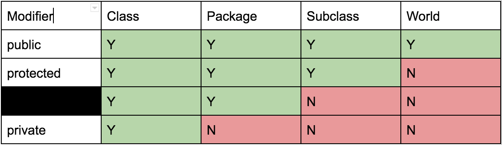

<!-- Generated by scripts/import-cs61b.mjs. Do not edit. -->


---

## 7.1 包

世界上存在海量代码，不同项目很可能创建同名类。怎样组织这些类，减少访问和使用时的歧义？程序怎样知道你想使用自己的 `Dog.class`，而不是 Josh Hug 的 `Dog.class`？

这正是**包（package）**的作用：包是组织类与接口的命名空间。通常，包名应以组织的网站域名反向书写作为开头。

例如，Josh Hug 若要发布一个包含多种动物类的 `animal` 包，可以命名为：

```java
ug.joshh.animal  // 他的网站是 joshh.ug
```

在 CS61B 作业中，代码并不用于正式分发，所以不强制遵守该命名约定。

### 使用包

如果访问同一个包中的类，可以直接使用简单类名：

```java
Dog d = new Dog(...);
```

如果从包外访问，可以使用完整规范名称：

```java
ug.joshh.animal.Dog d = new ug.joshh.animal.Dog(...);
```

为了简化代码，可以先导入该类，再使用简单名称：

```java
import ug.joshh.animal.Dog;

Dog d = new Dog(...);
```

### 创建包

创建包需要两步。

1. 在包中每个源文件顶部写出包声明：

```java
package ug.joshh.animal;

public class Dog {
    private String name;
    private String breed;
    ...
}
```

2. 把文件存放在与包名对应的目录结构中。例如，包 `ug.joshh.animal` 应位于：

```text
ug/joshh/animal
```

#### 在 IntelliJ 中创建包

1. 选择 `File → New Package`；
2. 输入包名，例如 `ug.joshh.animal`。

#### 向包中添加新的 Java 文件

1. 右键包名；
2. 选择 `New → Java Class`；
3. 输入类名。IntelliJ 会自动把文件放到正确目录，并添加 `package ug.joshh.animal;`。

#### 把旧 Java 文件移入包

1. 在文件顶部添加 `package 包名;`；
2. 把 `.java` 文件移动到对应目录。

### 默认包

源文件顶部没有显式包声明的 Java 类，会自动属于**默认包**。编写真正的程序时，应尽量避免使用默认包，除非只是非常小的演示程序。

原因包括：

- 默认包中的代码不能被其他有名包正常导入；
- 所有未命名包中的类都混在一起，更容易发生类名冲突。

例如，若在默认包中创建 `DogLauncher.java`，包外代码无法通过一个合法的规范名称访问它：

```java
DogLauncher.launch();          // 在其他包中不能这样用
// default.DogLauncher.launch();  // 根本不存在名为 default 的包
```

因此，实际 Java 源文件通常都应以明确的包声明开头。

### JAR 文件

程序通常包含多个 `.class` 文件。若要分发程序，与其把全部类文件连同特殊目录逐一发送，不如创建一个 JAR 文件，把它们打包在一起。单个 `.jar` 文件会包含所有 `.class` 文件以及一些附加元数据。

JAR 本质上很像 ZIP 压缩包，可以解压并检查内部类文件，也可能通过反编译恢复近似源代码。JAR 并不能保护你的代码，因此不要把课程项目 JAR 分享给其他学生。

#### 在 IntelliJ 中创建 JAR

1. 进入 `File → Project Structure → Artifacts → JAR → From modules with dependencies`；
2. 连续确认相关设置；
3. 选择 `Build → Build Artifacts`，JAR 通常会生成在 `Artifacts` 目录；
4. 其他 Java 程序员可以把该 JAR 导入自己的项目。

### 构建系统

如果每次创建项目都要手动导入大量库并放置文件，会非常麻烦。**构建系统**可以自动完成项目结构、依赖获取、编译与打包等步骤。

在大型团队和项目中，自动化项目搭建过程尤其重要。它在 CS61B 小项目中的优势没有那么明显，但部分课程项目使用过 Maven。其他常见构建系统还包括 Ant 和 Gradle。

---

## 7.2 访问控制

### 访问修饰符

现在考虑：公开和私有成员在包与子类中究竟怎样工作？子类能访问父类的私有成员吗？同一包中的两个类能访问彼此的私有成员吗？

Java 提供四种主要访问级别。

#### `private`

只有声明该成员的类内部代码可以访问。子类、同包其他类以及所有外部类都不能访问。

简而言之：**只有这个类自己需要知道。**

#### 包私有（package-private）

成员没有显式访问修饰符时，默认就是包私有。同一个包中的类可以访问它，但仅仅作为子类并不能获得访问权。

这很有用，因为同一个包通常由同一组开发者维护，他们了解内部实现；而其他人可能继承你的类，却不应随意修改某些内部成员。

简而言之：**只有同一个包中的类可以访问。**

#### `protected`

同一个包中的类以及子类都可以访问，但普通包外类不能访问。

简而言之：**子类型可能需要，但子类型的普通使用者不需要。**

#### `public`

任何地方都可以访问。包的使用者通常依赖公开成员。一旦公开发布，公开 API 的签名不应随意改变，因为它构成了对使用者的承诺。

如果开发者希望逐步淘汰某个公开功能，通常不会立即删除，而是先标记为“已弃用（deprecated）”。

简而言之：**向全世界开放并作出兼容承诺。**

**练习 7.2.1。** 凭记忆画出访问权限表。列为：修饰符、同一类、同一包、子类、全世界；行为：`public`、`protected`、包私有、`private`。



### 访问控制的细节

#### 默认包

没有包声明的代码自动属于默认包。如果这些类拥有未写访问修饰符的包私有成员，由于它们都属于同一个未命名默认包，彼此仍然可以访问这些成员。

#### 访问判断只依据静态类型

接口中的方法默认是 `public`，不是包私有。另外，能否访问某个成员，编译器只根据表达式的**静态类型**判断。

**练习 7.2.2。** 对下面代码，`demoAccess` 中哪些行会在编译时出错？

```java
package universe;

public interface BlackHole {
    void add(Object x); // 接口方法是 public，不是包私有
}
```

```java
package universe;

public class CreationUtils {
    public static BlackHole hirsute() {
        return new HasHair();
    }
}
```

```java
package universe;

class HasHair implements BlackHole {
    Object[] items;

    public void add(Object o) { ... }
    public Object get(int k) { ... }
}
```

```java
import static universe.CreationUtils.hirsute;

class Client {
    void demoAccess() {
        BlackHole b = hirsute();
        b.add("horse");
        b.get(0);
        HasHair hb = (HasHair) b;
    }
}
```

**答案：**

- `b.get(0);` 会出错。`b` 的静态类型是 `BlackHole`，而该接口没有声明 `get`。即使我们知道它运行时指向 `HasHair`，编译器仍按静态类型检查。
- `HasHair hb = (HasHair) b;` 也会出错。`HasHair` 没有声明为 `public`，因此它是包私有类。位于 `universe` 包外的 `Client` 连这个类名都无权访问，所以不能进行该类型转换。

---

> 原作：Josh Hug，UC Berkeley CS61B Spring 2021 配套读本。<br>
> 中文翻译版，仅供非商业学习；采用 CC BY-NC-SA 4.0 许可。<br>
> 原始网站：https://joshhug.gitbooks.io/hug61b/content/
