<!-- Generated by scripts/import-cs61b.mjs. Do not edit. -->


---

## 8.1 封装、API 与 ADT

> “工程师会用一角钱完成任何傻瓜花一美元才能完成的事。”——Paul Hilfinger

效率可以分成两类。

1. **编程成本**
   - 开发程序需要多长时间？
   - 代码是否容易阅读、修改和维护？
2. **执行成本**
   - 程序运行需要多长时间？
   - 程序需要多少内存？

本节先关注降低编程成本。低编程成本不仅意味着更快写完代码，也意味着开发者更少受挫；而人在烦躁时通常写不出高质量代码。

课程已经讨论过一些有帮助的 Java 特性：

- 包：
  - 优点：组织代码、提供包私有访问；
  - 缺点：结构比较具体，可能增加使用负担。
- 静态类型检查：
  - 优点：更早发现错误，代码更像一段清晰叙事；
  - 缺点：灵活性较低，有时需要强制类型转换。
- 继承：
  - 优点：代码复用；
  - 缺点：必须满足“是一种”关系；调试调用链可能麻烦；接口不能实例化，实现类必须实现要求的方法。

本章继续探索其他设计手段。

### 封装

先定义两个术语：

- **模块（module）**：一组协同工作、共同完成某项任务或一组相关任务的方法；
- **封装良好（encapsulated）**：模块的实现被完整隐藏，外界只能通过有文档说明的接口访问它。

### API

抽象数据类型的 **API（Application Programming Interface，应用程序编程接口）**，就是其构造方法和公开方法的列表，以及每项功能的简短说明。

API 同时包括语法规范与语义规范：

- 编译器验证**语法**：API 中承诺的类型、方法和参数是否存在；
- 测试帮助验证**语义**：这些方法是否真的按约定工作。

语义规范通常用自然语言描述，并可能带有使用示例。完全形式化、数学精确的规范虽然可行，但在普通软件项目中并不常见。

### 抽象数据类型

**ADT（Abstract Data Type，抽象数据类型）**是由**行为**而不是具体实现定义的高层类型。

例如，项目 1 中的 `Deque` 是一种 ADT，它规定 `addFirst`、`addLast` 等操作。真正实现这些行为的数据结构可以是 `ArrayDeque` 或 `LinkedListDeque`。

某些 ADT 是其他 ADT 的特殊形式。例如，栈和队列都可以看作行为受到更多约束的列表。

**练习 8.1.1。** 使用链表作为底层结构编写泛型 `Stack<Item>`，只需实现 `push(Item x)`。

常见方案有三种。

#### 继承

```java
public class ExtensionStack<Item> extends LinkedList<Item> {
    public void push(Item x) {
        add(x);
    }
}
```

该方案让 `ExtensionStack` 继承 `LinkedList`，直接借用父类方法。

#### 委托

```java
public class DelegationStack<Item> {
    private LinkedList<Item> L = new LinkedList<Item>();

    public void push(Item x) {
        L.add(x);
    }
}
```

该方案在类内部持有一个链表，并把具体工作委托给它。

#### 适配器

```java
public class StackAdapter<Item> {
    private List<Item> L;

    public StackAdapter(List<Item> worker) {
        L = worker;
    }

    public void push(Item x) {
        L.add(x);
    }
}
```

它与委托相似，但构造方法接收任意 `List` 实现，因此底层可以是 `LinkedList`、`ArrayList` 等。

请始终注意“是一种”与“拥有一个”的区别：

- 猫**拥有**爪子；
- 猫**是一种**猫科动物。

继承适用于真正的“是一种”关系；委托则适用于“当前对象使用另一个对象完成工作”，但并不希望把二者视作同一种类型的情况。

#### 委托与继承

当你充分了解父类内部实现，并且子类确实可以被视为父类的一种特殊形式时，可以使用继承。

当你只是希望复用另一个类的能力，却不想声称当前类就是那个类的一种时，委托通常更合适。委托降低耦合，也使底层实现更容易替换。

### 视图

**视图（view）**是已有对象的另一种表示。视图通常限制用户能够访问的范围，但通过视图完成的修改会作用于原对象。

例如：

```java
List<String> L = new ArrayList<>();
L.add("at");
L.add("ax");
...
```

若只想查看索引 1 到 4 的部分，可以使用 `subList`：

```java
List<String> SL = L.subList(1, 4);
SL.set(0, "jug");
```

`SL` 不是独立副本，而是原列表的一段视图，所以修改 `SL` 会改变 `L`。

视图的一个用途是复用通用算法。假设我们已经有“反转整个列表”的函数，现在只想反转原列表的一部分。无需给反转函数额外增加起止索引逻辑，只要先获得该区间的 `subList` 视图，再对视图执行通用反转即可。

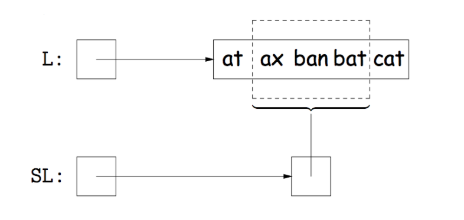

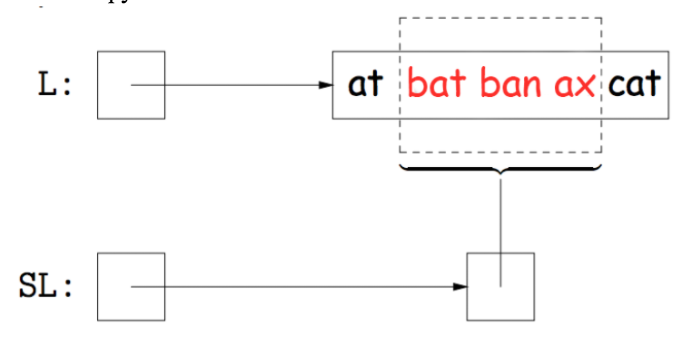

“返回一个 `List`，但修改它又会影响另一个 `List`”听起来有些奇怪。其实现依赖访问方法和内部类。

概念代码类似：

```java
List<Item> subList(int start, int end) {
    return new SubList(start, end);
}
```

`SubList` 可以是外部列表类的内部类，并继承 `AbstractList<Item>`：

```java
private class SubList extends AbstractList<Item> {
    private int start;
    private int end;

    SubList(int start, int end) {
        ...
    }
}
```

由于 `AbstractList` 实现 `List`，`SubList` 也是一种 `List`。其 `get` 和 `add` 会把视图中的索引转换为原列表索引：

```java
public Item get(int k) {
    return AbstractList.this.get(start + k);
}

public void add(int k, Item x) {
    AbstractList.this.add(start + k, x);
    end += 1;
}
```

视图中的第 `k` 个元素，就是原列表中的第 `start + k` 个元素。因为方法最终调用外部原列表的操作，所以原列表会被真正修改。

### 要点

- API 很难设计，但一致的设计理念可以让代码更清晰、更容易维护；
- 继承很诱人，却会增加耦合和复杂性。只有当类型关系和父子类属性都足够明确时才应使用；
- 委托、适配器和视图往往能以更松耦合的方式复用功能。

---

## 8.2 渐近分析 I

编写高效程序可以从两个角度考虑：

1. **编程成本**
   - 开发需要多久？
   - 代码是否容易阅读和修改？
   - 是否容易长期维护和扩展？实际软件的大量成本来自维护，而不只是第一次开发。
2. **执行成本**
   - **时间复杂度**：程序运行需要多久？
   - **空间复杂度**：程序需要多少内存？

### 算法成本示例

目标：判断一个**有序数组**中是否存在重复元素。

- **笨办法**：比较每一对元素，只要发现相等就返回 `true`；
- **更好办法**：利用数组有序这一事实。若存在重复，它们一定相邻，因此只需比较相邻元素。

笨办法显然进行了大量冗余工作，但究竟多多少？我们需要正式工具量化算法效率。

### 描述运行时间

下面比较两个函数：

```java
// 比较所有元素对
public static boolean dup1(int[] A) {
    for (int i = 0; i < A.length; i += 1) {
        for (int j = i + 1; j < A.length; j += 1) {
            if (A[i] == A[j]) {
                return true;
            }
        }
    }
    return false;
}

// 只比较相邻元素
public static boolean dup2(int[] A) {
    for (int i = 0; i < A.length - 1; i += 1) {
        if (A[i] == A[i + 1]) {
            return true;
        }
    }
    return false;
}
```

理想的运行时间描述应满足：

- 简单且数学严谨；
- 能清楚展示 `dup2` 优于 `dup1`。

### 衡量计算成本的方法

#### 方法一：直接计时

可以用秒表、Unix 的 `time` 命令或计时类测量真实执行时间。

优点：

- 简单；
- 含义直观，直接得到实际耗时。

缺点：

- 大输入可能测试很久；
- 结果依赖机器、编译器、运行环境和具体输入；
- 不一定能揭示算法本身的普遍规律。

#### 方法二 A：对固定规模输入计数

例如令 `N = 10,000`，逐项统计赋值、比较、自增、数组访问等操作执行次数。

优点：

- 大体独立于机器；
- 能把输入对操作次数的影响纳入模型。

缺点：

- 统计繁琐；
- 固定的 10,000 很任意，无法直接说明其他规模；
- 不同操作的实际耗时并不相同。

#### 方法二 B：使用符号 `N` 计数

把操作次数表示为输入规模 `N` 的函数。这样可以描述算法怎样随输入增长而扩展，但精确统计更加繁琐，而且仍不能给出真实秒数。

对 `dup2`，最坏情况下大致有：

| 操作 | 符号计数 | `N=10000` |
|---|---:|---:|
| `i = 0` | 1 | 1 |
| `<` | 0 到 `N` | 0 到 10000 |
| `+= 1` | 0 到 `N-1` | 0 到 9999 |
| `==` | 1 到 `N-1` | 1 到 9999 |
| 数组访问 | 2 到 `2N-2` | 2 到 19998 |

这里只需要数量级正确，不必纠结相差一两个操作。

相比之下，`dup1` 的比较和数组访问次数大约随 `N²` 增长；当 `N=10000` 时，可能达到数千万甚至近亿次。`dup2` 只随 `N` 线性增长。

### 为什么扩展规律重要

`dup2` 更好，不只是因为某个固定输入下操作更少，而是因为：

- `dup1` 最坏情况近似二次函数；
- `dup2` 最坏情况近似直线；
- 当 `N` 变大时，`N²` 比 `N` 增长快得多。

算法常用于处理海量数据，例如：

- 数十亿粒子的模拟；
- 数十亿用户的社交网络；
- 数十亿字节的视频编码。

这时我们最关心非常大的 `N`，也就是**渐近行为**。

常数在小输入下可能改变谁更快。例如 `2N²` 在 `N=4` 时比 `500N` 小；但随着 `N` 增长，二次项最终一定占主导。我们关心的是图像的“形状”，也叫**增长阶**。

### 四个直观简化

#### 1. 只考虑最坏情况

比较算法时，经常先关注最坏情况，虽然课程后面也会讨论例外。

例如，若某段代码的操作次数包含：

- `100N² + 3N` 次 `<`；
- `N³ + 1` 次 `>`；
- 5000 次 `&&`；

那么总体增长阶是 `N³`，因为对足够大的 `N`，三次项压倒其他项。

#### 2. 只关注一种代表性操作

选择一种能够代表整体工作的操作作为代理，例如比较、数组访问或循环自增。这称为**成本模型（cost model）**。

应选择随输入规模变化、处于核心循环中的操作。像只执行一次的 `i = 0`，通常不是好成本模型。

#### 3. 忽略低阶项

例如 `N³ + 100N² + 3N` 的增长主要由 `N³` 决定。

#### 4. 忽略乘法常数

`3N²`、`N²/2` 和 `100N²` 都属于同一种二次增长形状。选择单一成本模型时，我们本来就已经舍弃了不同操作常数耗时的信息，因此继续保留固定倍数通常没有意义。

四步总结：

- 只考虑最坏情况；
- 选择代表性操作；
- 忽略低阶项；
- 忽略乘法常数。

对 `dup2`，无论选择比较、自增还是数组访问作为成本模型，最坏情况增长阶都是 `N`。

### 简化后的分析流程

无需先构建所有操作的精确表格，可以直接：

1. 选择成本模型；
2. 求该操作次数的增长阶：
   - 可以先精确计数再简化；
   - 也可以通过图形或结构直观判断，熟练后会更快。

#### 嵌套循环的精确计数

对 `dup1`，令成本模型为 `==` 的次数。最坏情况下：

```text
1 + 2 + 3 + ... + (N - 1)
```

把它与逆序和相加：

```text
C = 1 + 2 + ... + (N - 1)
C = (N - 1) + (N - 2) + ... + 1
2C = N + N + ... + N   （共 N-1 项）
```

因此：

```text
C = N(N - 1) / 2
```

忽略低阶项和常数后，增长阶为 `N²`。

#### 几何论证

也可以把所有比较看成边长约为 `N` 的直角三角形中的格点，其面积随 `N²` 增长。

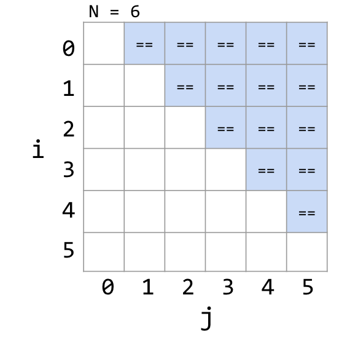

### 正式表示增长阶

例如：

```text
Q(N) = 3N³ + N²
```

应用“去掉低阶项和常数”后，增长阶为 `N³`。

常见例子：

| 函数 | 增长阶 |
|---|---|
| `N³ + 3N⁴` | `N⁴` |
| `1/N + N³` | `N³` |
| `1/N + 5` | `1` |
| `Neᴺ + N` | `Neᴺ` |
| `40sin(N) + 4N²` | `N²` |

### 大 Theta：`Θ`

若函数 `R(N)` 的增长阶为 `f(N)`，写作：

```text
R(N) ∈ Θ(f(N))
```

例如：

- `N³ + 3N⁴ ∈ Θ(N⁴)`；
- `1/N + N³ ∈ Θ(N³)`；
- `1/N + 5 ∈ Θ(1)`；
- `Neᴺ + N ∈ Θ(Neᴺ)`；
- `40sin(N) + 4N² ∈ Θ(N²)`。

#### 正式定义

`R(N) ∈ Θ(f(N))` 表示存在正常数 `k₁`、`k₂` 和某个 `N₀`，使得对所有 `N ≥ N₀`：

```text
k₁ f(N) ≤ R(N) ≤ k₂ f(N)
```

也就是 `R` 最终被 `f` 的两个常数倍从上下夹住。

在普通运行时间分析中，不需要真的求出 `k₁` 和 `k₂`；仍按前面的成本模型与简化过程分析，只是用 `Θ` 正式表示结果。

### 大 O：`O`

`Θ` 同时给出上界和下界，可以非正式地理解为渐近“等于”。`O` 只给出上界，可以理解为渐近“小于等于”。

例如，下列说法都正确：

```text
N³ + 3N⁴ ∈ O(N⁴)
N³ + 3N⁴ ∈ O(N⁶)
N³ + 3N⁴ ∈ O(N!)
```

一旦某函数被 `N⁴` 从上方界定，它当然也会被增长得更快的函数从上方界定。

#### 正式定义

`R(N) ∈ O(f(N))` 表示存在正常数 `k₂` 和某个 `N₀`，使得对所有 `N ≥ N₀`：

```text
R(N) ≤ k₂ f(N)
```

它不要求下界，因此比 `Θ` 更宽松。

### 总结

- 可以把代码运行时间写成输入某个性质 `N` 的函数 `R(N)`，通常 `N` 表示输入规模；
- 实际分析通常不求精确 `R(N)`，只关心增长阶；
- 一种常见方法是：
  1. 选择代表性操作；
  2. 令 `C(N)` 为它执行的次数；
  3. 求 `C(N) ∈ Θ(f(N))`；
  4. 若单次操作为常数时间，则整体运行时间通常也属于 `Θ(f(N))`；
- 很多时候分析最坏情况，但这不是绝对规则。

---

## 8.3 渐近分析 II

### 循环示例一

继续通过更难的例子练习运行时间分析。这个主题需要大量实践，才能熟悉其中的结构和技巧。

上一节的 `dup1`：

```java
int N = A.length;
for (int i = 0; i < N; i += 1)
    for (int j = i + 1; j < N; j += 1)
        if (A[i] == A[j])
            return true;
return false;
```

有两种常见分析方式。

#### 操作计数

选 `==` 次数作为成本模型。外层循环第一次执行时，内层比较 `N-1` 次；随后是 `N-2`、`N-3`，直到 1。最坏情况下：

```text
C = 1 + 2 + ... + (N - 1) = N(N - 1) / 2
```

它属于 `N²` 家族，而单次比较是常数时间，因此最坏运行时间为 `Θ(N²)`。

#### 几何分析

把 `(i, j)` 组合画在网格中，实际比较区域是边长约为 `N-1` 的直角三角形。

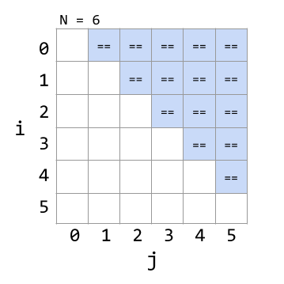

三角形面积属于 `Θ(N²)`，得到相同结论。

### 循环示例二

考虑：

```java
public static void printParty(int N) {
    for (int i = 1; i <= N; i = i * 2) {
        for (int j = 0; j < i; j += 1) {
            System.out.println("hello");
            int ZUG = 1 + 1;
        }
    }
}
```

外层的 `i` 每次乘 2；内层从 0 执行到当前 `i-1`。循环体中的两个操作都是常数时间，所以只需统计打印次数。

- `N=1`：打印 1 次；
- `N=2`：打印 `1+2=3` 次；
- `N=3`：`i` 仍只取 1、2，所以也是 3 次；
- `N=4`：打印 `1+2+4=7` 次。

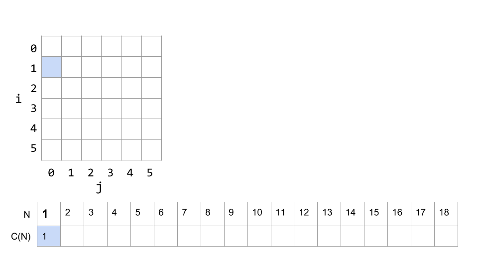

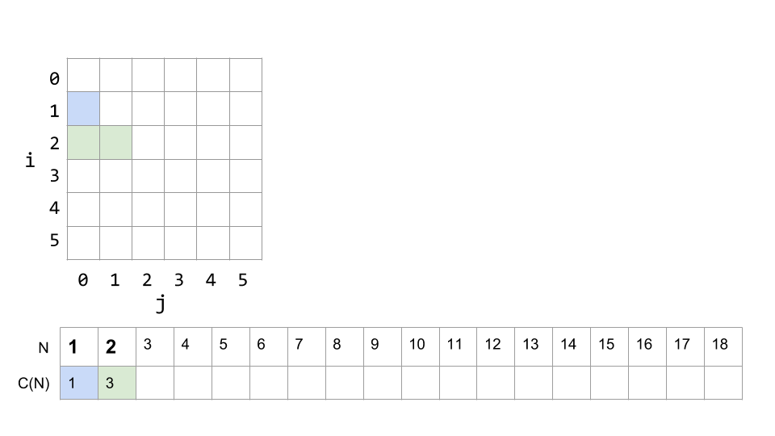

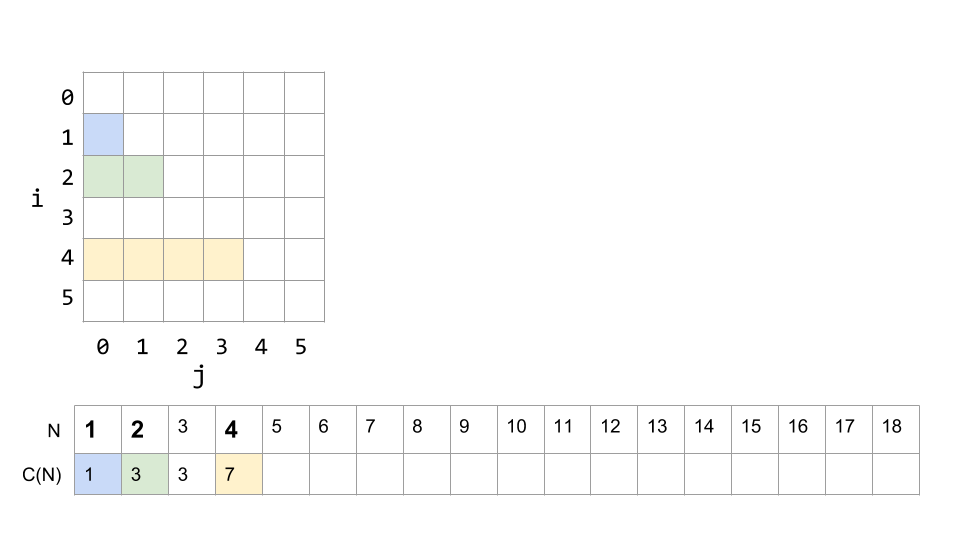

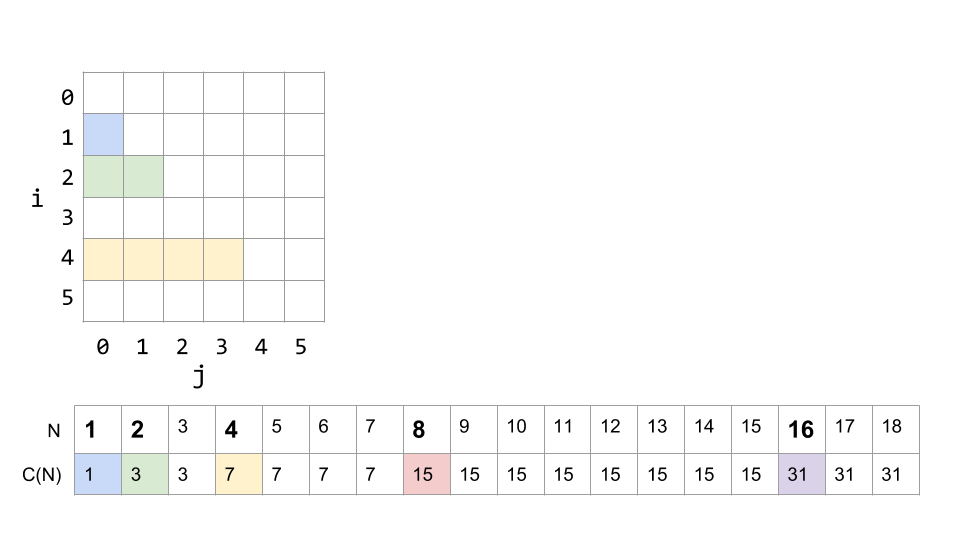

当 `N` 是 2 的幂时：

```text
C(N) = 1 + 2 + 4 + ... + N = 2N - 1
```

忽略常数与低阶项后是 `Θ(N)`。从图像上看，阶梯函数始终夹在两个线性函数之间：

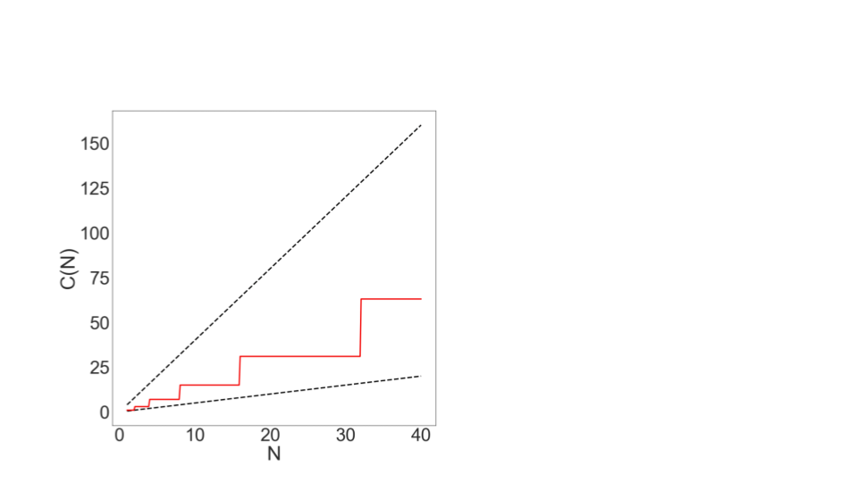

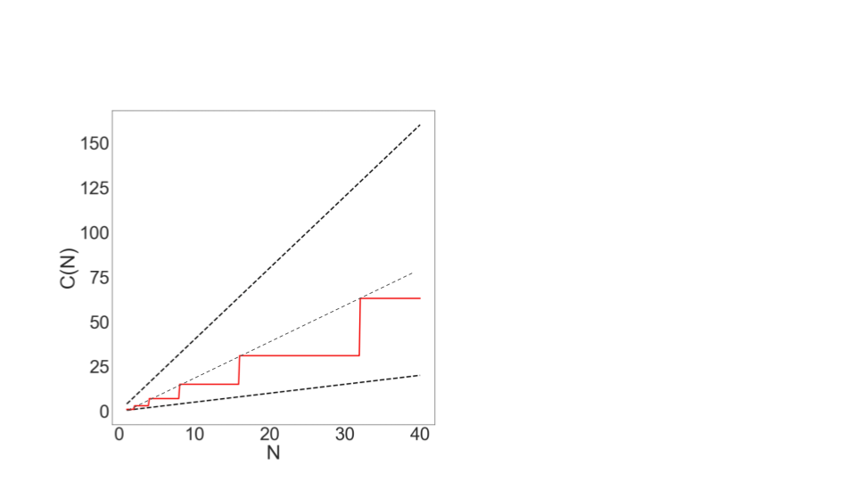

尽管代码含两层循环，运行时间仍是线性的。这说明：**不能看到嵌套循环就机械判断为 `N²`。**

### 没有神奇捷径

运行时间分析需要认真推理，没有一个万能表面规则。常用技巧包括：

- 求出精确和式；
- 写出若干小输入示例；
- 画图或递归树。

两个常见和式应当熟悉：

```text
1 + 2 + 3 + ... + Q = Q(Q + 1) / 2 = Θ(Q²)
```

```text
1 + 2 + 4 + 8 + ... + Q = 2Q - 1 = Θ(Q)
```

### 递归

考虑：

```java
public static int f3(int n) {
    if (n <= 1) {
        return 1;
    }
    return f3(n - 1) + f3(n - 1);
}
```

调用 `f3(4)` 会生成两次 `f3(3)`，每个 `f3(3)` 又生成两次 `f3(2)`，依此类推。递归调用形成一棵二叉树：

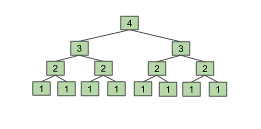

该函数返回 `2^(N-1)`。

#### 直观方法

`N` 每增加 1，工作量大约翻倍，因此运行时间属于 `Θ(2ᴺ)`。

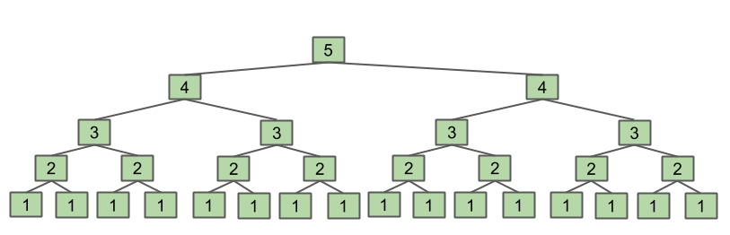

#### 代数方法

令 `C(N)` 为函数调用次数：

```text
C(1) = 1
C(2) = 1 + 2
C(3) = 1 + 2 + 4
...
C(N) = 1 + 2 + 4 + ... + 2^(N-1)
```

利用等比和：

```text
C(N) = 2ᴺ - 1
```

每次调用本身的非递归工作为常数，所以总运行时间为 `Θ(2ᴺ)`。

也可以写递推关系：

```text
C(1) = 1
C(N) = 2C(N-1) + 1
```

展开后得到相同结果。递推关系的系统求解不属于本课程要求。

### 二分查找

二分查找用于在**有序**列表中寻找目标。

1. 检查中间元素；
2. 若目标更小，只保留左半部分；
3. 若目标更大，只保留右半部分；
4. 不断把候选范围减半，直到找到目标或范围为空。

最坏情况是目标根本不存在，需要一直排除到没有元素。

候选数量变化为：

```text
N, N/2, N/4, ... , 1
```

减半约 `log₂N` 次。每一步找中点和比较都是常数时间，所以直观运行时间为 `Θ(log N)`。

若精确统计递归调用次数：

| `N` | 1 | 2 | 3 | 4 | 5 | 6 | 7 | 8 | 9 | 10 | 11 | 12 | 13 |
|---:|---:|---:|---:|---:|---:|---:|---:|---:|---:|---:|---:|---:|---:|
| 次数 | 1 | 2 | 2 | 3 | 3 | 3 | 3 | 4 | 4 | 4 | 4 | 4 | 4 |

更精确地：

```text
C(N) = floor(log₂N) + 1
```

渐近分析中有：

```text
floor(f(N)) ∈ Θ(f(N))
ceil(f(N)) ∈ Θ(f(N))
log_p(N) ∈ Θ(log_q(N))
```

所以对数底数和取整都不影响增长阶，最终仍为 `Θ(log N)`。

对数时间非常优秀，接近常数时间，并远好于线性扫描。例如：

| `N` | `log₂N` |
|---:|---:|
| 100 | 6.6 |
| 100,000 | 16.6 |
| 100,000,000 | 26.5 |
| 100,000,000,000 | 36.5 |
| 100,000,000,000,000 | 46.5 |

即使数据规模增长一万亿倍，二分查找只增加几十次操作。

### 归并排序

先回顾选择排序：

1. 在未排序部分找到最小元素，把它移到最前面并固定；
2. 对剩余未排序部分重复。

选择排序运行时间为 `Θ(N²)`。

为了直观比较，可以使用任意时间单位（AU）。它不是现实秒数，只表示相对工作量。例如 `N=64` 的选择排序，大致需要与 `64²` 同阶的工作。

#### 合并两个有序数组

若有两个已经有序的数组，可以在线性时间内合并：

- 两个数组的最小剩余元素一定分别位于各自开头；
- 比较两个开头，把较小者写入结果；
- 重复直到一个数组为空，再复制另一个数组的剩余部分。

每个元素只写入结果一次，因此合并运行时间为 `Θ(N)`。

#### 从分治得到归并排序

把长度 64 的数组直接选择排序，代价约与 `64²` 同阶。若先分成两个长度 32 的数组，分别排序再线性合并，工作量明显下降。继续不断对半拆分，最终得到长度 1 的数组，而单元素数组天然有序。

归并排序的结构：

1. 若列表大小为 1，直接返回；
2. 递归归并排序左半部分；
3. 递归归并排序右半部分；
4. 合并两个结果。

分析每一层：

- 顶层合并全部 `N` 个元素，总工作 `Θ(N)`；
- 下一层有两个大小 `N/2` 的合并，总工作仍为 `Θ(N)`；
- 再下一层有四个大小 `N/4` 的合并，总工作仍为 `Θ(N)`。

共有约 `log₂N` 层，所以总运行时间：

```text
Θ(N log N)
```

它远好于 `Θ(N²)`。

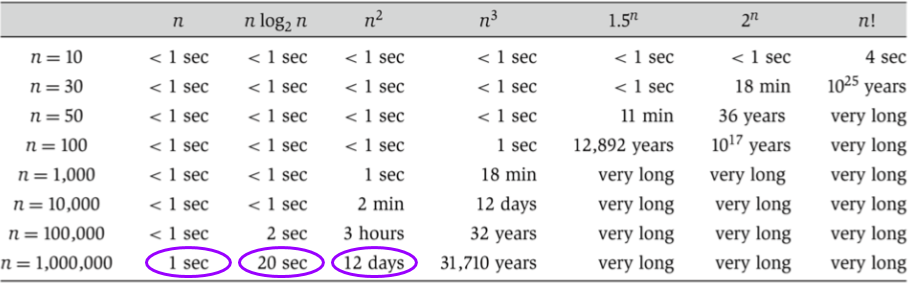

### 总结

- 运行时间分析没有魔法捷径；
- 可以使用精确计数，也可以使用有充分依据的直观分析；
- 需要熟悉自然数和与 2 的幂之和；
- 本课程不要求书写严格数学证明，但要求能解释分析依据；
- 大量练习能显著提高这项能力；
- 同一问题的不同算法可能有巨大性能差异；
- `N²` 与 `N log N` 的差距极大；
- 从 `N log N` 改进为 `N` 当然很好，但通常没有从 `N²` 到 `N log N` 那么根本。

---

## 8.4 大 Omega 与摊还分析

本节结束渐近分析的基础讨论。部分内容会在课程后续再次展开。我们将进一步理解大 O，引入大 Omega，讨论摊还运行时间，最后简要接触实验分析与复杂性思想。

### 运行时间分析的细节

考虑：

```java
public boolean dup3(int[] a) {
    int N = a.length;
    for (int i = 0; i < N; i += 1) {
        for (int j = 0; j < N; j += 1) {
            if (a[i] == a[j]) {
                return true;
            }
        }
    }
    return false;
}
```

**问题：** `dup3` 的运行时间增长阶是什么？

**答案：** `Θ(1)`。代码有错误：第一次循环时 `i=j=0`，它把第一个元素与自身比较并立即返回 `true`。

修正后：

```java
public boolean dup4(int[] a) {
    int N = a.length;
    for (int i = 0; i < N; i += 1) {
        for (int j = i + 1; j < N; j += 1) {
            if (a[i] == a[j]) {
                return true;
            }
        }
    }
    return false;
}
```

这次运行时间不仅依赖数组长度，还依赖数组内容：

- 最好情况：若前两个元素相同，立即返回，`Θ(1)`；
- 最坏情况：若完全没有重复，执行所有元素对比较，`Θ(N²)`。

这体现了大 Theta 的一个使用细节：它描述某一明确情形下的精确增长阶。如果运行时间还依赖输入内容，就必须先说明最好、最坏或平均情形。

大 O 可以给出统一上界：无论具体内容如何，`dup4` 都不会比二次更差，所以可以说它是 `O(N²)`。

### 不要滥用大 O

比较两句话：

1. 酒店最贵房间每晚 639 美元；
2. 酒店所有房间价格都不超过每晚 639 美元。

第一句信息更多，因为它不仅给出上界，还说明这个上界确实达到。一个最贵房间只要 89 美元的廉价酒店也满足第二句。

运行时间同理：

1. 最坏运行时间是 `Θ(N²)`；
2. 运行时间是 `O(N²)`。

第一句更精确。例如：

```java
public static void printLength(int[] a) {
    System.out.println(a.length);
}
```

这个常数时间方法也是 `O(N²)`，因为常数函数当然不超过二次上界。但它不是 `Θ(N²)`。所以只给宽松大 O 可能掩盖巨大差异。

现实交流中，人们经常在本应使用 Theta 时口语化地说“大 O”。请记住：

- 大 O **不等于**最坏情况；
- 它只是上界，但经常用于描述最坏情况上界。

大 O 的价值包括：

- 输入不同时运行时间不同，可以不逐个限定情形，直接给出统一上界；
- 某些困难问题的精确复杂度未知，只能给出已知上界；
- 证明上界通常比证明精确 Theta 容易。

### 大 Omega：`Ω`

大 O 描述上界；大 Omega 描述下界，可以理解为渐近“大于等于”。

若：

```text
N³ + 3N⁴ ∈ Θ(N⁴)
```

那么以下也都正确：

```text
N³ + 3N⁴ ∈ Ω(N⁴)
N³ + 3N⁴ ∈ Ω(N³)
N³ + 3N⁴ ∈ Ω(log N)
N³ + 3N⁴ ∈ Ω(1)
```

因为该函数至少像 `N⁴` 一样快地增长，也自然至少像更慢的函数那样增长。

大 Omega 常见用途：

1. 证明大 Theta。若 `R(N) ∈ O(f(N))` 且 `R(N) ∈ Ω(f(N))`，则 `R(N) ∈ Θ(f(N))`；
2. 证明问题本身的最低难度。例如，任何在普通数组中判断重复的正确算法至少要检查输入元素，因此存在 `Ω(N)` 下界。

| 记号 | 非正式含义 | 示例 |
|---|---|---|
| `Θ(f(N))` | 增长阶等于 `f(N)` | `N²/2`、`2N²`、`N²+38N` 都属于 `Θ(N²)` |
| `O(f(N))` | 增长阶不超过 `f(N)` | `log N`、`N`、`N²` 都属于 `O(N²)` |
| `Ω(f(N))` | 增长阶不低于 `f(N)` | `N²`、`N³`、`5ᴺ` 都属于 `Ω(N²)` |

### 摊还分析：直观解释

#### Grigometh 的草料罐

Grigometh 是一只恶魔狗。作为交换能力的贡品，你需要定期向它提供一罐草料。它给出两种收费方式：

- 方案一：每天吃 3 蒲式耳；
- 方案二：每次吃得指数增加，但出现频率指数降低：
  - 第 1 天吃 1；
  - 第 2 天再吃 2；
  - 第 4 天再吃 4；
  - 第 8 天再吃 8；
  - 依此类推。

如果希望每天固定放入草料：

- 方案一每天必须放 3；
- 方案二每天只需放 2，就足以覆盖偶尔发生的大额消耗。

虽然方案二某些天开销巨大，但平均到每天后仍是常数。这称为**摊还常数成本**。

#### `AList` 扩容

这与动态数组扩容非常相似。底层数组满时，`addLast` 必须创建更大数组、复制旧元素，再写入新元素。

固定增加容量：

```java
public void addLast(int x) {
    if (size == items.length) {
        resize(size + RFACTOR);
    }
    items[size] = x;
    size += 1;
}
```

按比例扩容：

```java
public void addLast(int x) {
    if (size == items.length) {
        resize(size * RFACTOR);
    }
    items[size] = x;
    size += 1;
}
```

第一种方法会越来越频繁地复制巨大数组，性能很差。第二种几何扩容效果很好，Python 列表等动态数组也采用类似思想。

假设扩容倍数为 2：

- 大多数添加只需一次写入，是 `Θ(1)`；
- 在容量为 1、2、4、8……时，某次添加要复制整个数组，单次可能是线性；
- 但昂贵操作越来越稀疏，把成本平均到所有添加后，每次添加的摊还成本仍是 `Θ(1)`。

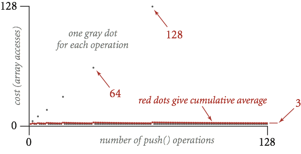

### 摊还分析：更严格的解释

一般步骤：

1. 选择成本模型；
2. 计算一系列操作的总成本或第 `i` 次操作成本；
3. 证明平均的摊还成本被某个常数界定。

假设动态数组初始容量为 1，只统计数组读写：

- `add(0)`：写新元素，成本 1；
- `add(1)`：复制 1 个旧元素（1 读 1 写），再写新元素，成本 3；
- `add(2)`：复制 2 个旧元素，再写新元素，成本 5；
- `add(3)`：无需扩容，成本 1；
- `add(4)`：复制 4 个旧元素，再写新元素，成本 9。

| 插入编号 | 0 | 1 | 2 | 3 | 4 | 5 | 6 | 7 | 8 | 9 | 10 | 11 | 12 | 13 |
|---:|---:|---:|---:|---:|---:|---:|---:|---:|---:|---:|---:|---:|---:|---:|
| 新元素写入 | 1 | 1 | 1 | 1 | 1 | 1 | 1 | 1 | 1 | 1 | 1 | 1 | 1 | 1 |
| 扩容复制 | 0 | 2 | 4 | 0 | 8 | 0 | 0 | 0 | 16 | 0 | 0 | 0 | 0 | 0 |
| 本次总成本 | 1 | 3 | 5 | 1 | 9 | 1 | 1 | 1 | 17 | 1 | 1 | 1 | 1 | 1 |
| 累计成本 | 1 | 4 | 9 | 10 | 19 | 20 | 21 | 22 | 39 | 40 | 41 | 42 | 43 | 44 |

平均成本始终保持在一个小常数附近，但只观察有限项不足以构成完整证明。

#### 势能方法

令：

- `cᵢ`：第 `i` 次操作的真实成本；
- `aᵢ`：人为指定的摊还成本，对所有操作取同一个常数；
- `Φᵢ`：第 `i` 次操作后的势能，即累计“预收成本减去真实成本”：

```text
Φᵢ = Φᵢ₋₁ + aᵢ - cᵢ
```

如果能选择一个固定常数 `aᵢ`，使势能从不为负，那么累计摊还成本始终不小于累计真实成本，因而 `aᵢ` 是真实平均成本的上界。

在草料例子中，势能可以理解为罐中剩余草料。每天放入固定数量，Grigometh 来时消耗。如果余额永不为负，就证明该固定日均投入足够。

对动态数组，若令每次添加的摊还成本为 5：

| 插入编号 | 0 | 1 | 2 | 3 | 4 | 5 | 6 | 7 | 8 | 9 | 10 | 11 | 12 | 13 |
|---:|---:|---:|---:|---:|---:|---:|---:|---:|---:|---:|---:|---:|---:|---:|
| 真实成本 `cᵢ` | 1 | 3 | 5 | 1 | 9 | 1 | 1 | 1 | 17 | 1 | 1 | 1 | 1 | 1 |
| 摊还成本 `aᵢ` | 5 | 5 | 5 | 5 | 5 | 5 | 5 | 5 | 5 | 5 | 5 | 5 | 5 | 5 |
| 势能变化 | 4 | 2 | 0 | 4 | -4 | 4 | 4 | 4 | -12 | 4 | 4 | 4 | 4 | 4 |
| 势能 `Φᵢ` | 4 | 6 | 6 | 10 | 6 | 10 | 14 | 18 | 6 | 10 | 14 | 18 | 22 | 26 |

低成本添加积攒势能，随后支付偶尔出现的昂贵扩容。势能不为负，因此添加操作的摊还成本被常数界定。

最终说明：几何扩容使动态数组 `add` 具有摊还 `Θ(1)` 时间。

### 总结

- 大 O 是上界，类似“渐近小于等于”；
- 大 Omega 是下界，类似“渐近大于等于”；
- 大 Theta 同时给出上下界，类似“渐近等于”；
- 大 O 不代表最坏情况，大 Omega 也不代表最好情况；最好/最坏情况本身都可以使用 Theta 描述；
- 日常交流常把“大 O”用在本应说“大 Theta”的地方；
- 摊还分析证明一系列操作的平均成本；
- 若选择固定 `aᵢ`，并能保证势能 `Φᵢ` 永不为负，则摊还成本是实际累计成本的上界。

---

> 原作：Josh Hug，UC Berkeley CS61B Spring 2021 配套读本。<br>
> 中文翻译版，仅供非商业学习；采用 CC BY-NC-SA 4.0 许可。<br>
> 原始网站：https://joshhug.gitbooks.io/hug61b/content/
