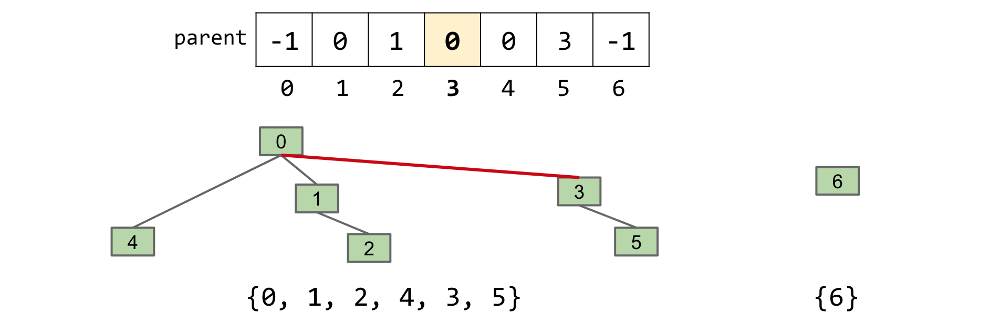
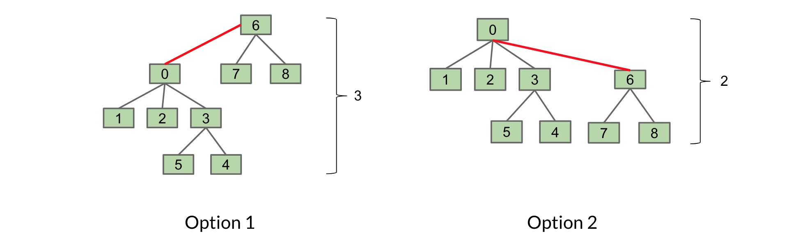

<!-- Generated by scripts/import-cs61b.mjs. Do not edit. -->


---

## 9.1 介绍

如果两个集合没有共同元素，就称它们互不相交。**并查集（Disjoint Sets / Union-Find）**维护一组固定元素，并把它们划分为若干互不相交的集合。它支持两个核心操作：

1. `connect(x, y)`：连接 `x` 和 `y`，也称 `union`；
2. `isConnected(x, y)`：若 `x` 与 `y` 属于同一集合，返回 `true`。

开始时，每个元素各自形成一个集合。调用 `connect` 会合并集合。

例如有 A、B、C、D 四个元素，初始状态：


调用 `connect(A, B)` 后：


此时：

```text
isConnected(A, B) -> true
isConnected(A, C) -> false
```

再调用 `connect(A, D)`：


程序找到 A 所在集合与 D 所在集合并合并，得到 `{A, B, D}`，C 仍然独立。

```text
isConnected(A, D) -> true
isConnected(A, C) -> false
```

先正式定义接口。接口只规定数据结构应具备**什么行为**，不规定**怎样实现**。这里先只处理非负整数元素；实际工程中可以给任意对象分配整数编号，所以这不构成本质限制。

```java
public interface DisjointSets {
    /** 连接 p 与 q。 */
    void connect(int p, int q);

    /** 判断 p 与 q 是否连通。 */
    boolean isConnected(int p, int q);
}
```

本章还将展示一个数据结构设计怎样逐步演化：

```text
Quick Find → Quick Union → 加权 Quick Union → 带路径压缩的加权 Quick Union
```

你会看到，设计选择会显著影响渐近运行时间与代码复杂度。

---

## 9.2 Quick Find

现在考虑怎样实现 `DisjointSets` 所要求的行为。核心挑战是记录每个元素属于哪个集合。

### 集合列表方案

最直接的想法是使用集合列表：

```java
List<Set<Integer>>
```

若有 7 个尚未连接的元素：

```text
[{0}, {1}, {2}, {3}, {4}, {5}, {6}]
```

但执行 `connect(5, 6)` 时，可能需要遍历接近 `N` 个集合寻找 5，再遍历接近 `N` 个集合寻找 6，运行时间是 `O(N)`，代码也会比较复杂。

> 初始设计决定了代码复杂度和运行时间。

### Quick Find

换一种方案：只使用一个整数数组。

- 数组**索引**表示元素；
- 索引处的**值**表示该元素所属集合编号。

例如 `{0, 1, 2, 4}`、`{3, 5}`、`{6}` 可以表示为：


数组索引 0 到 6 是元素，`id[i]` 是其集合编号。具体编号取什么并不重要，只要同一集合中的元素拥有相同编号即可。

#### `connect(x, y)`

假设 `id[2] = 4`、`id[3] = 5`。调用 `connect(2, 3)` 后，原来编号为 4 和 5 的所有元素都应使用同一个编号。可以把所有 4 改为 5：


为完成该操作，需要扫描整个数组并替换集合编号，所以是 `Θ(N)`。

#### `isConnected(x, y)`

只需检查：

```java
id[x] == id[y]
```

这是常数时间，因此该实现称为 **Quick Find**：查询连通关系非常快。

| 实现 | 构造 | `connect` | `isConnected` |
|---|---:|---:|---:|
| 集合列表 | `Θ(N)` | `O(N)` | `O(N)` |
| Quick Find | `Θ(N)` | `Θ(N)` | `Θ(1)` |

其中 `N` 是元素数量。

```java
public class QuickFindDS implements DisjointSets {
    private int[] id;

    public QuickFindDS(int N) {
        id = new int[N];
        for (int i = 0; i < N; i += 1) {
            id[i] = i;
        }
    }

    public void connect(int p, int q) {
        int pid = id[p];
        int qid = id[q];
        for (int i = 0; i < id.length; i += 1) {
            if (id[i] == pid) {
                id[i] = qid;
            }
        }
    }

    public boolean isConnected(int p, int q) {
        return id[p] == id[q];
    }
}
```

---

## 9.3 Quick Union

如果我们更重视加快 `connect`，可以仍然使用一个数组，但改变其含义：每个位置保存该元素的**父结点索引**。根结点没有父结点，可以用负值标记。

这样，每个集合都可以想象成一棵树。例如 `{0, 1, 2, 4}`、`{3, 5}`、`{6}`：


实际存储仍然只有数组，树只是对父指针关系的可视化。

定义辅助方法 `find(item)`，沿父指针向上找到根。例如上图中：

```text
find(4) == 0
find(1) == 0
find(5) == 3
```

每个元素所属集合由其唯一根结点代表。

#### `connect(x, y)`

先找到两者所在树的根，再把一个根设为另一个根的子结点。

例如 `connect(5, 2)`：

1. `find(5) -> 3`；
2. `find(2) -> 0`；
3. 令 `parent[3] = 0`。



元素 3 现在指向 0，两棵树合并为一棵。

若 `x` 与 `y` 本来就是根，连接只需一次赋值，是 `Θ(1)`，这就是 Quick Union 名称的由来。

#### `isConnected(x, y)`

同一集合中的元素位于同一棵树，因此拥有同一个根：

```java
find(x) == find(y)
```

### 性能问题

Quick Union 可能形成非常高的细长树：


最坏情况下，寻找根要经过所有 `N` 个元素，是 `Θ(N)`。`connect` 和 `isConnected` 都依赖 `find`，所以二者最坏上界都是 `O(N)`。

| 实现 | 构造 | `connect` | `isConnected` |
|---|---:|---:|---:|
| Quick Find | `Θ(N)` | `Θ(N)` | `Θ(1)` |
| Quick Union | `Θ(N)` | `O(N)` | `O(N)` |

单看最坏上界，Quick Union 似乎更差。但若树保持平衡，两个操作都会相当快。下一节将保证树不会过高。

```java
public class QuickUnionDS implements DisjointSets {
    private int[] parent;

    public QuickUnionDS(int num) {
        parent = new int[num];
        for (int i = 0; i < num; i += 1) {
            parent[i] = -1;
        }
    }

    private int find(int p) {
        while (parent[p] >= 0) {
            p = parent[p];
        }
        return p;
    }

    @Override
    public void connect(int p, int q) {
        int i = find(p);
        int j = find(q);
        parent[i] = j;
    }

    @Override
    public boolean isConnected(int p, int q) {
        return find(p) == find(q);
    }
}
```

---

## 9.4 加权 Quick Union（WQU）

改进 Quick Union 的关键观察是：`find` 必须沿树向上走到根，所以树越矮，操作越快。

引入新规则：

> 每次 `connect`，始终把**较小树的根**连接到**较大树的根**。

这个规则保证最大树高为 `Θ(log N)`，其中 `N` 是总元素数。

考虑连接两棵树 `T1` 和 `T2`：


有两种方向：



第二种更好，因为树高只有 2，而不是 3。它也符合新规则：大小为 3 的 `T2` 被挂到大小为 6 的 `T1` 下。

为了判断树大小，需要在根结点记录权重。可以让根位置保存树大小的负数，例如大小 6 的树根保存 `-6`，非根位置仍保存父结点索引。

#### 为什么最大高度是 `log N`

考虑树中的任意元素 `x`。只有当 `x` 所在的整棵树被挂到另一棵至少同样大的树下时，`x` 的深度才增加 1。

每发生一次深度增加，包含 `x` 的新树大小至少翻倍。树最多从 1 翻倍到 `N`，只能翻倍 `log₂N` 次，因此任意元素深度最多增加 `log₂N` 次。

所以：

- 最大树高为 `Θ(log N)`；
- `connect` 与 `isConnected` 都被 `O(log N)` 界定。

也可以按树高而不是树大小连接，但实现更复杂，最终仍只得到同样的对数高度保证。

| 实现 | 构造 | `connect` | `isConnected` |
|---|---:|---:|---:|
| Quick Find | `Θ(N)` | `Θ(N)` | `Θ(1)` |
| Quick Union | `Θ(N)` | `O(N)` | `O(N)` |
| 加权 Quick Union | `Θ(N)` | `O(log N)` | `O(log N)` |

具体代码是[实验 6](https://sp19.datastructur.es/materials/lab/lab6/lab6)的任务。

---

## 9.5 带路径压缩的加权 Quick Union

加权 Quick Union 已经很好，但还能进一步改进。

每次调用 `find(x)`，本来就要沿路径从 `x` 走到根。既然已经访问了路径上的所有结点，就可以顺便把它们全部直接连接到根，而不增加渐近复杂度。

路径压缩会在每次 `find` 后使树变矮。

请注意：`connect(x, y)` 与 `isConnected(x, y)` 都会调用 `find(x)` 和 `find(y)`。经过足够多次操作后，绝大多数结点都会几乎直接指向根。

因此，长期来看，`connect` 和 `isConnected` 的摊还运行时间接近常数。

更精确的分析涉及反阿克曼函数 `α(N)`。它增长极其缓慢，对任何现实输入都小于一个很小常数。因此通常把带路径压缩 WQU 的操作视为“实际常数时间”。

| 实现 | `isConnected` | `connect` |
|---|---:|---:|
| Quick Find | `Θ(1)` | `Θ(N)` |
| Quick Union | `O(N)` | `O(N)` |
| 加权 Quick Union | `O(log N)` | `O(log N)` |
| 加权 Quick Union + 路径压缩 | 摊还 `O(α(N))` | 摊还 `O(α(N))` |

`α(N)` 在长期表现上近似常数。具体实现同样属于[实验 6](https://sp19.datastructur.es/materials/lab/lab6/lab6)。

---

> 原作：Josh Hug，UC Berkeley CS61B Spring 2021 配套读本。<br>
> 中文翻译版，仅供非商业学习；采用 CC BY-NC-SA 4.0 许可。<br>
> 原始网站：https://joshhug.gitbooks.io/hug61b/content/
