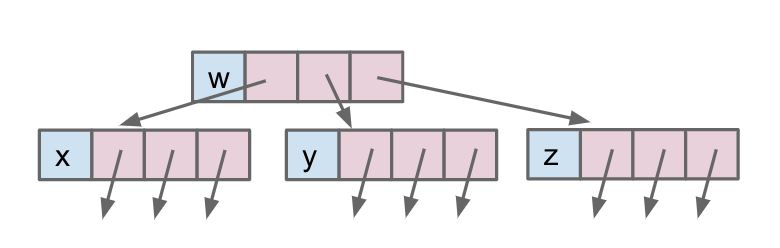
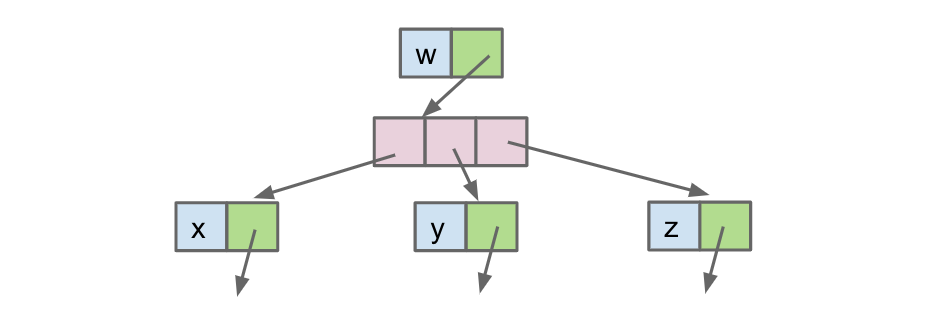
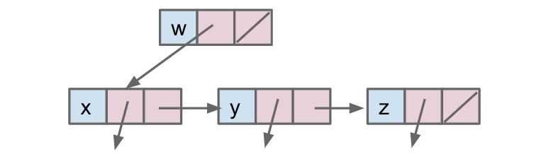
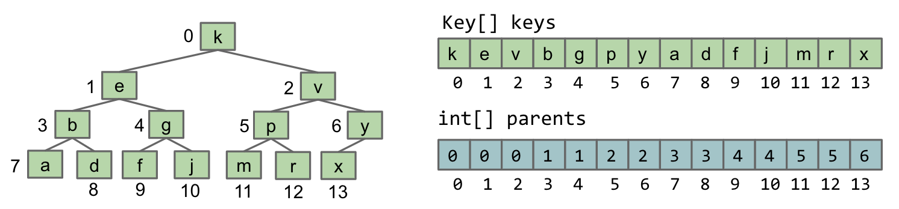
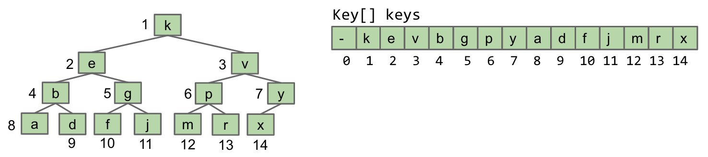

<!-- Generated by scripts/import-cs61b.mjs. Do not edit. -->


---

## 13.1 优先队列接口

我们前面学习的二叉搜索树可以在 $\log N$ 时间内完成高效搜索，因为每一步都能排除一半元素。但如果我们更关心的是快速找到**最小**或**最大**元素，而不是搜索任意元素呢？

### 优先队列 ADT

优先队列（Priority Queue）是一种抽象数据类型。可以把它想成一个袋子：我们可以加入和移除物品，但只能直接访问其中优先级最高的元素。对于最小优先队列，优先级最高的就是最小元素。

```java
/** 最小优先队列：跟踪并删除最小元素。 */
public interface MinPQ<Item> {
    /** 向优先队列加入元素。 */
    void add(Item x);

    /** 返回最小元素，但不删除。 */
    Item getSmallest();

    /** 删除并返回最小元素。 */
    Item removeSmallest();

    /** 返回元素数量。 */
    int size();
}
```

### 使用场景

假设我们持续收集一天内的短信，并希望用 `HarmoniousnessComparator` 找出最“不和谐”的 $M$ 条消息。

一种简单方法是保存当天全部 $N$ 条消息，排序后返回前 $M$ 条：

```java
public List<String> unharmoniousTexts(Sniffer sniffer, int M) {
    ArrayList<String> allMessages = new ArrayList<>();
    for (Timer timer = new Timer(); timer.hours() < 24; ) {
        allMessages.add(sniffer.getNextMessage());
    }

    Comparator<String> cmptr = new HarmoniousnessComparator();
    Collections.sort(allMessages, cmptr.reversed());
    return allMessages.subList(0, M);
}
```

问题是它需要 $\Theta(N)$ 空间，而我们真正关心的只有 $M$ 条消息。使用优先队列，可以在扫描消息的过程中始终只保留当前最值得关注的 $M$ 条，因此只需 $\Theta(M)$ 空间。

**练习 13.1.1：**重写上述方法，使其只使用 $\Theta(M)$ 额外空间。

### 可能的实现

ADT 只定义行为，尚未规定底层结构。考虑已经学过的数据结构，其最坏情况复杂度如下。

#### 有序数组

- `add`：$\Theta(N)$，插入时需要移动元素。
- `getSmallest`：$\Theta(1)$。
- `removeSmallest`：$\Theta(N)$，删除后需要移动元素。

#### 茂密的 BST

- `add`：$\Theta(\log N)$。
- `getSmallest`：$\Theta(\log N)$，需要沿左链下降。
- `removeSmallest`：$\Theta(\log N)$。

#### 哈希表

- `add`：摊还 $\Theta(1)$。
- `getSmallest`：$\Theta(N)$，哈希表不保留顺序。
- `removeSmallest`：$\Theta(N)$。

**练习 13.1.2：**解释每个复杂度，并思考如何修改其中一种结构来改善性能。

### 总结

- 优先队列是专门优化最小值或最大值访问的 ADT。
- 针对问题选用更专门的结构，往往能节省空间。
- 已知结构都不能同时高效完成三个核心操作；其中平衡 BST 最接近目标。
- 下一节将介绍更合适的实现：堆。

---

## 13.2 堆

前一节中，已知结构里最适合实现优先队列的是二叉搜索树。通过改变树的约束，我们还能进一步提高相关操作的效率。

定义一个**二叉最小堆（binary min-heap）**，它必须同时满足：

- **最小堆性质：**每个结点都小于或等于它的两个孩子。
- **完全性：**除最底层外每一层都填满；最底层的结点尽量靠左排列。


图中的绿色结构是合法堆，红色结构至少违反了一个条件。

### 堆操作

优先队列最关心三个操作：`add`、`getSmallest` 和 `removeSmallest`。

#### `add`

1. 临时把新元素放在堆的末尾，以保持完全性。
2. 若它小于父结点，就与父结点交换。
3. 重复向上交换，直到堆序恢复。

这个过程称为**上浮（swim）**。

#### `getSmallest`

直接返回根结点。最小堆性质保证根一定是最小元素，因此耗时 $\Theta(1)$。

#### `removeSmallest`

1. 用堆中最后一个元素替换根。
2. 删除原来的最后位置。
3. 若当前结点大于孩子，就与两个孩子中较小的那个交换。
4. 重复向下交换，直到堆序恢复。

这个过程称为**下沉（sink）**。

**练习 13.2.1：**根据以上描述，为三个操作写出伪代码。

**练习 13.2.2：**分别给出这些操作的最好和最坏情况复杂度。

- `add`：最好 $\Theta(1)$，最坏 $\Theta(\log N)$。
- `getSmallest`：$\Theta(1)$。
- `removeSmallest`：最好 $\Theta(1)$，最坏 $\Theta(\log N)$。

### 树的表示方法

树可以用多种方式表示。

#### 方法 1A：固定孩子指针

```java
public class Tree1A<Key> {
    Key k;
    Tree1A<Key> left;
    Tree1A<Key> middle;
    Tree1A<Key> right;
}
```



结点直接保存孩子引用，结构直观，但每个结点的最大孩子数量固定。

#### 方法 1B：孩子数组

```java
public class Tree1B<Key> {
    Key k;
    Tree1B<Key>[] children;
}
```



孩子数量可变，但遍历和内存管理更复杂。

#### 方法 1C：第一个孩子与兄弟指针

```java
public class Tree1C<Key> {
    Key k;
    Tree1C<Key> favoredChild;
    Tree1C<Key> sibling;
}
```



每个结点只保存一个孩子和一个兄弟引用，也能表达任意宽度的树。

以上方法都显式存储孩子引用。下面考虑不直接保存孩子指针的方案。

#### 方法 2：键数组与父结点数组

类似加权 Quick Union，可以分别保存键与父结点编号：

```java
public class Tree2<Key> {
    Key[] keys;
    int[] parents;
}
```



观察可发现：

1. 图中的树是完全树。
2. 父结点编号呈现规律性的重复模式。
3. 按层序读取树，顺序恰好与 `keys` 数组一致。

因此，对于完全二叉树，`parents` 数组其实是冗余的。

#### 方法 3：只用数组存完全树

若树保证完全，就可以按层序把二维树结构压平到一维数组中：

```java
public class TreeC<Key> {
    Key[] keys;
}
```



这正是数组堆的核心表示方法。

### 上浮代码

```java
public void swim(int k) {
    if (keys[parent(k)].compareTo(keys[k]) > 0) {
        swap(k, parent(k));
        swim(parent(k));
    }
}
```

`parent(k)` 根据数组位置计算父结点索引。

**练习 13.2.3：**实现 `parent`。进一步实现 `leftChild` 和 `rightChild`。

---

## 13.3 实现细节

实际采用的数组堆与上一节的方法 3 基本相同。唯一的重要区别是：数组索引 0 留空，从索引 1 开始存放根。这样父子编号计算会非常简单：

- `leftChild(k) = 2 * k`
- `rightChild(k) = 2 * k + 1`
- `parent(k) = k / 2`（整数除法）

### 与其他实现比较

| 操作 | 有序数组 | 茂密 BST | 哈希表 | 堆 |
|---|---:|---:|---:|---:|
| `add` | $\Theta(N)$ | $\Theta(\log N)$ | $\Theta(1)$ | $\Theta(\log N)$ |
| `getSmallest` | $\Theta(1)$ | $\Theta(\log N)$ | $\Theta(N)$ | $\Theta(1)$ |
| `removeSmallest` | $\Theta(N)$ | $\Theta(\log N)$ | $\Theta(N)$ | $\Theta(\log N)$ |

堆让三个核心优先队列操作都获得了很好的性能。

需要注意：

- 数组可能扩容，因此堆中某些复杂度应按摊还分析理解。
- 若 BST 额外保存指向最小结点的引用，也能让 `getSmallest` 达到常数时间。
- 数组堆通常只需直接指针树表示法约三分之一的内存。

### 尚待决定的问题

1. 优先队列如何知道元素的排列方式？例如 `Dog` 应按体重还是品种排序？
2. 如何让同一种元素支持多种顺序？
3. 怎样把 `MinPQ` 改成 `MaxPQ`？

常见答案是让元素实现 `Comparable`，或在构造优先队列时传入 `Comparator`。最大堆则反转比较关系即可。

**练习 13.3.1：**完整回答以上三个问题。

---

> 原作：Josh Hug，UC Berkeley CS61B Spring 2021 配套读本。<br>
> 中文翻译版，仅供非商业学习；采用 CC BY-NC-SA 4.0 许可。<br>
> 原始网站：https://joshhug.gitbooks.io/hug61b/content/
