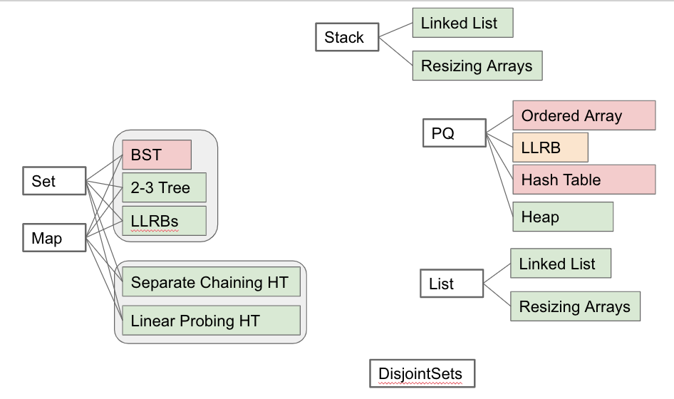

<!-- Generated by scripts/import-cs61b.mjs. Do not edit. -->

---

## 14.1 数据结构总结

### 搜索问题

我们面对的基本问题是：给定持续到来的数据流，如何取回自己关心的信息？

例如：

- 用户在个人主页发布内容，但只向好友展示。
- 根据成千上万个气象站的日志，显示某个日期和时刻的天气地图。
- 宠物主人寻找“最好”的宠物店，而“最好”可能按价格、质量或氛围定义。

目前学习的各种数据结构，本质上都在解决搜索问题。它们采用不同的组织方式，让特定场景下的检索更高效。

#### 常见搜索 ADT

| 名称 | 存储操作 | 主要取回操作 | 取回依据 |
|---|---|---|---|
| List | `add(key)`、`insert(key, index)` | `get(index)` | 索引 |
| Map | `put(key, value)` | `get(key)` | 键的身份 |
| Set | `add(key)` | `contains(key)` | 键的身份 |
| Priority Queue | `add(key)` | `getSmallest()` | 键的顺序或优先级 |
| Disjoint Sets | `connect(a, b)` | `isConnected(a, b)` | 两个元素的连通性 |

这些都是**抽象数据类型**：它们定义行为，而不是实现。前面各章已经讨论了许多可能的底层结构。

同一种实现可以服务多个 ADT，但并不是每种组合都高效。图中性能较差的实现提醒我们：能实现某种行为，不代表它就是合适的选择。

**练习 14.1.1：**思考如何修改每种实现以适配目标 ADT。例如，哈希表怎样勉强实现优先队列？为什么性能不理想？

### 抽象的层次

抽象经常分层出现。一个 ADT 的实现本身，也可能依赖另一个 ADT。

- 优先队列可以用堆序树实现；而堆序树又可以用直接结点指针、父结点数组或层序数组等多种方式表示。
- 拉链哈希表由“桶数组”组成；每个桶又可以使用 `ArrayList`、动态数组、链表或 BST。

因此，我们常常用一个 ADT 来构建另一个 ADT。每一层抽象只规定自己关心的行为，并把更底层的实现细节隐藏起来。这种分层让程序更容易替换实现、比较权衡和控制复杂度。

---

> 原作：Josh Hug，UC Berkeley CS61B Spring 2021 配套读本。 
> 中文翻译版，仅供非商业学习；采用 CC BY-NC-SA 4.0 许可。 
> 原始网站：https://joshhug.gitbooks.io/hug61b/content/
