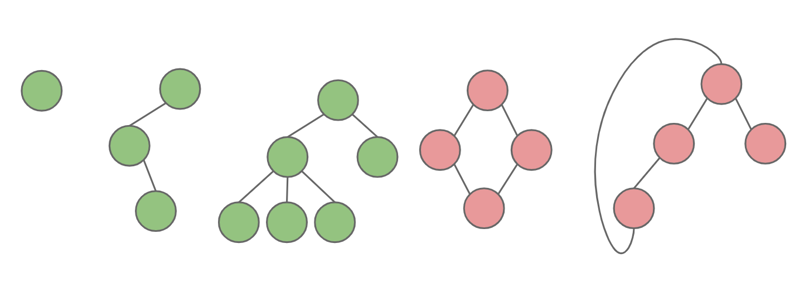
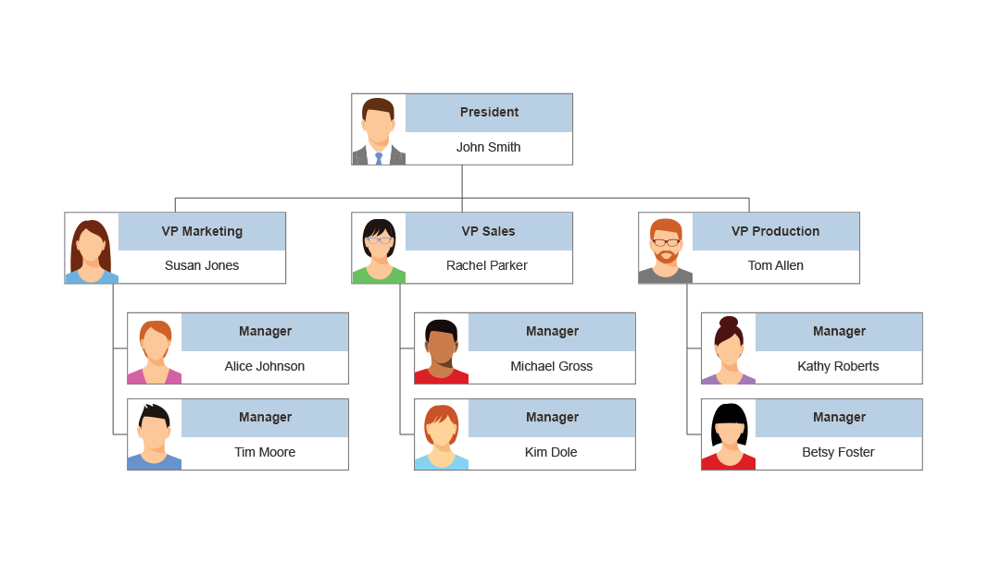
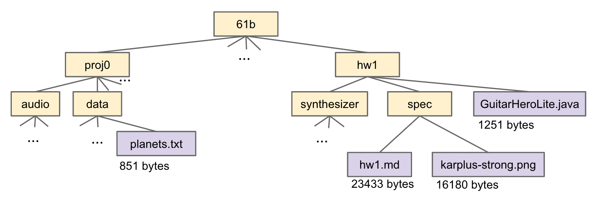
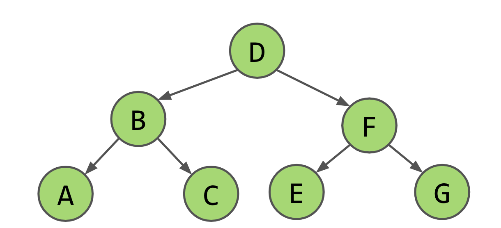
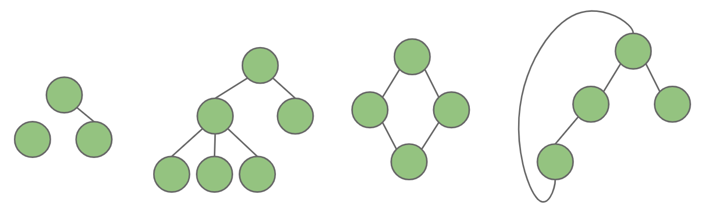
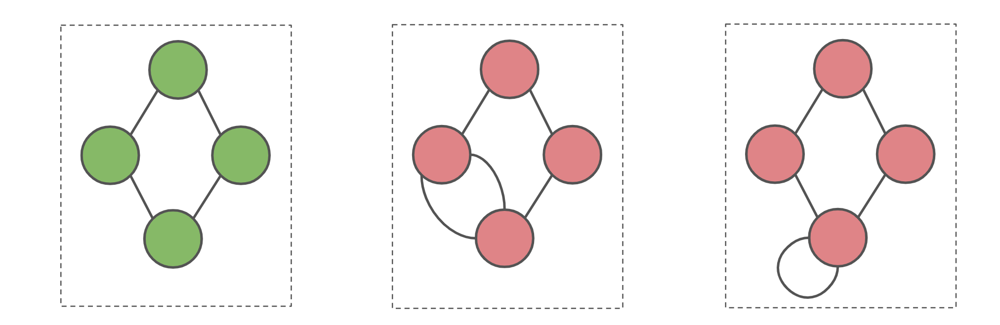
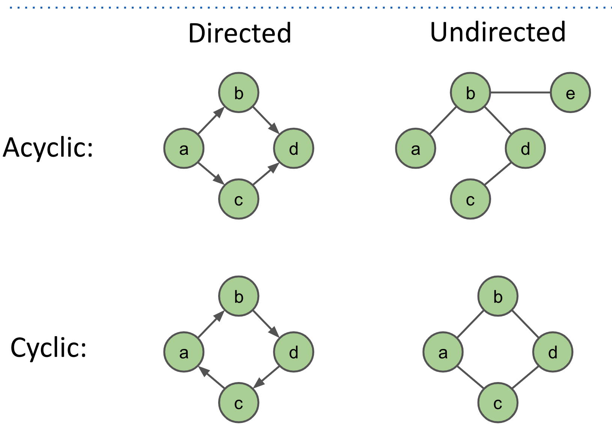
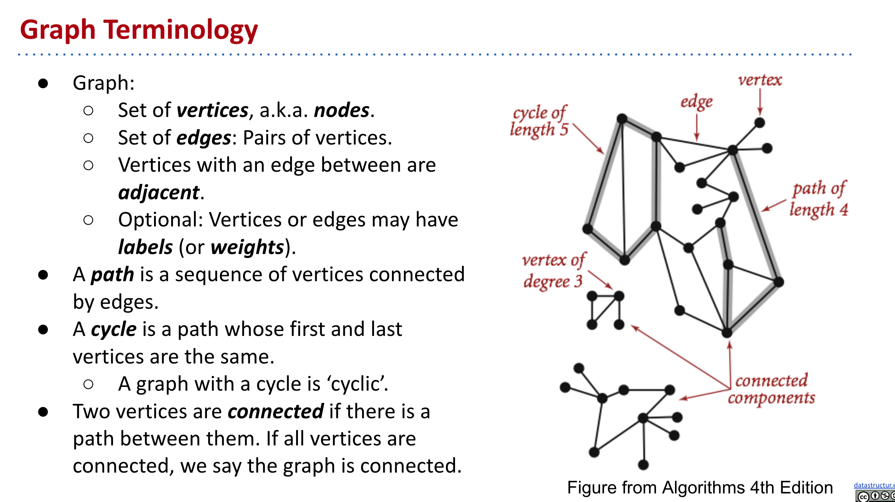
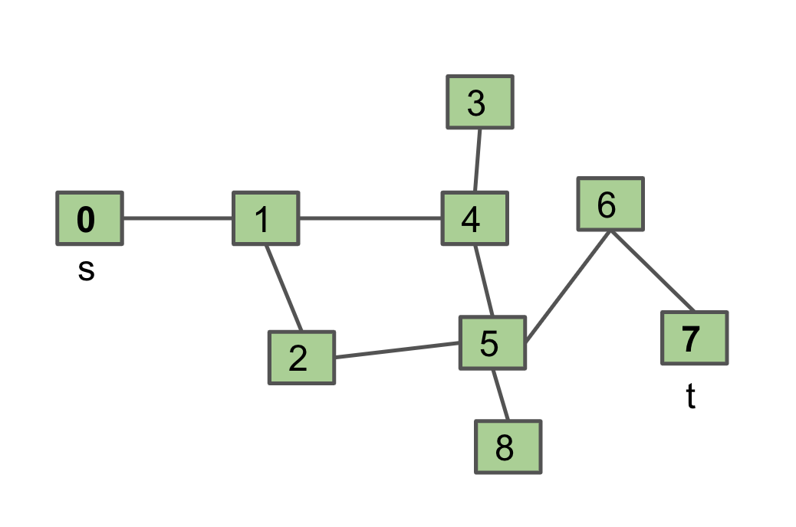

<!-- Generated by scripts/import-cs61b.mjs. Do not edit. -->


---

## 17.1 树的回顾

### 什么是树？

一棵树由以下部分组成：

- 一组结点（node），也称顶点（vertex）。
- 一组连接结点的边（edge）。
- **约束：任意两个结点之间恰好只有一条路径。**



图中最左边只有一个结点、没有边，它仍然是一棵合法树。第二、第三个结构也是树。第四个结构不是树，因为顶部到底部之间存在两条不同路径。

**练习 17.1.1：**说明第五个结构为什么不是树，并尝试通过删除或修改边把无效结构变成树。

### 什么是有根树？

有根树是在树中指定一个根结点，通常画在最上方。指定根之后，就有了父子关系：

- 除根外，每个结点恰好有一个父结点。
- 一个结点可以有零个或多个孩子。
- 没有孩子的结点称为**叶子（leaf）**。

如果一个结点有两个父结点，就会产生不止一条通向根的路径，因此不再是树。

### 树有什么用途？

前面已经接触过许多树结构：搜索树、Trie、堆、并查集中的树等。它们帮助我们实现快速搜索、前缀匹配、连通性判断和优先级操作。

树也广泛存在于现实系统中：

- 组织架构图：总裁是根，副总裁是孩子，部门继续向下展开。
- 文件系统目录：目录包含子目录和文件，形成层次结构。





**练习 17.1.2：**再列举一些常见树结构，并思考它们的结点、边以及可能的实现方式。

---

## 17.2 树遍历

列表有一个很自然的遍历顺序：从头到尾。但树没有唯一的线性顺序，因此存在多种常见**遍历（traversal）**方式：

1. 层序遍历。
2. 深度优先遍历：前序、中序、后序。

以下面的树为例：



### 层序遍历

逐层、从左到右访问：

- 第 0 层：D
- 第 1 层：B、F
- 第 2 层：A、C、E、G

结果为：

```text
D B F A C E G
```

通常使用队列实现：先把根入队；每次取出队首结点并访问，再把它的孩子依次入队。

```java
void levelOrder(Node root) {
    if (root == null) return;
    Queue<Node> fringe = new ArrayDeque<>();
    fringe.add(root);
    while (!fringe.isEmpty()) {
        Node x = fringe.remove();
        print(x.key);
        if (x.left != null) fringe.add(x.left);
        if (x.right != null) fringe.add(x.right);
    }
}
```

**练习 17.2.1：**自己实现层序遍历，并思考如何按层分别输出。

### 前序遍历

顺序是：

1. 访问当前结点。
2. 递归遍历左子树。
3. 递归遍历右子树。

示例结果：

```text
D B A C F E G
```

```java
void preOrder(BSTNode x) {
    if (x == null) return;
    print(x.key);
    preOrder(x.left);
    preOrder(x.right);
}
```

“前序”中的“前”，表示当前结点在两个子树**之前**访问。

### 中序遍历

顺序是：

1. 递归遍历左子树。
2. 访问当前结点。
3. 递归遍历右子树。

示例结果：

```text
A B C D E F G
```

```java
void inOrder(BSTNode x) {
    if (x == null) return;
    inOrder(x.left);
    print(x.key);
    inOrder(x.right);
}
```

对于二叉搜索树，中序遍历会按键的升序输出所有元素，这是它的重要性质。

也可以把结果递归地理解为：

```text
[左子树的结果] 当前结点 [右子树的结果]
```

### 后序遍历

顺序是：

1. 递归遍历左子树。
2. 递归遍历右子树。
3. 访问当前结点。

示例结果：

```text
A C B E G F D
```

```java
void postOrder(BSTNode x) {
    if (x == null) return;
    postOrder(x.left);
    postOrder(x.right);
    print(x.key);
}
```

后序遍历先处理孩子，再处理父结点，因此适合删除整棵树、计算子树信息或自底向上汇总结果。

---

## 17.3 图

树非常有用，但“任意两个结点之间只有一条路径”的限制并不适合所有问题。去掉这个限制，就得到更一般的结构：图。

### 什么是图？

图由以下部分组成：

- 一组结点或顶点。
- 零条或多条边，每条边连接两个顶点。

除此之外没有树那样的额外限制。



图中所有绿色结构都是合法图。其中第二个同时也是树，其他则不是。

**所有树都是图，但并非所有图都是树。**

### 简单图

本课程默认讨论**简单图（simple graph）**：

- 任意一对顶点之间至多有一条同类型的边。
- 不允许顶点连接自身的自环。



若两个顶点之间允许多条平行边，这种结构称为**多重图（multigraph）**。允许自环的图有时也被归入多重图的广义定义。

### 有向图与无向图

- **无向图：**边 `(u, v)` 可以从 `u` 走到 `v`，也可以从 `v` 走到 `u`。
- **有向图：**边 `(u, v)` 只表示从 `u` 指向 `v`。除非另有 `(v, u)`，否则不能反向走。

有向边通常画成箭头。

### 有环与无环

- **无环图：**不存在从某个顶点出发，沿一系列边最终回到自身的环。
- **有环图：**至少存在一个环。

在有向图中，沿路径时必须遵循箭头方向。



例如，从 `a` 出发能够沿不同边回到 `a`，说明图有环。若箭头方向阻止返回，则不是有向环。

### 其他常用概念



后续常见术语包括：

- 顶点的邻居（neighbor）或相邻顶点。
- 路径（path）：首尾相接的一系列边。
- 路径长度：通常按边数计算；加权图中可按边权之和计算。
- 度数（degree）：无向图中与顶点相连的边数。
- 入度与出度：有向图中进入和离开顶点的边数。
- 连通分量：彼此之间存在路径的一组最大顶点集合。

---

## 17.4 图问题

图上可以提出许多问题：

- **s-t 路径：**顶点 `s` 与 `t` 之间是否存在路径？
- **连通性：**图是否连通，即任意两个顶点之间都有路径？
- **双连通性：**是否存在一个顶点，删除它后图会断开？
- **最短 s-t 路径：**从 `s` 到 `t` 的最短路径是什么？
- **环检测：**图中是否存在环？
- **欧拉回路：**是否存在恰好使用每条边一次的回路？
- **哈密顿回路：**是否存在恰好访问每个顶点一次的回路？
- **平面性：**能否在平面上画出图且边互不交叉？
- **图同构：**两个图是否只是顶点名字不同，本质结构相同？

图问题的难度很难只凭外观看出。欧拉回路可以在线性于边数的时间内解决；而哈密顿回路没有已知的多项式时间通用算法，是经典的 NP 完全问题之一。

### 从 s-t 连通性开始

先解决最基本的问题：给定源点 `s` 与目标点 `t`，是否存在路径？

最直接的递归思路：

```text
if s == t:
    return true

for child in neighbors(s):
    if connected(child, t):
        return true

return false
```

**练习 17.4.1：**分析这段算法是否正确，会不会终止。

它在有环图上会失败。例如 `connected(0, 7)` 访问邻居 1，随后 `connected(1, 7)` 又返回访问 0，形成无限递归。



### 记录已经访问的顶点

解决办法是维护 `marked` 集合：每个顶点第一次访问时做标记，之后跳过已标记邻居。

```text
mark s
if s == t:
    return true

for child in unmarkedNeighbors(s):
    if connected(child, t):
        return true

return false
```

更接近 Java 的版本：

```java
boolean connected(Graph G, int s, int t, boolean[] marked) {
    marked[s] = true;
    if (s == t) return true;

    for (int v : G.neighbors(s)) {
        if (!marked[v] && connected(G, v, t, marked)) {
            return true;
        }
    }
    return false;
}
```

这种算法能够正确终止，因为每个顶点最多被访问一次。

### 我们刚刚发明了什么？

这就是图上的**深度优先遍历（DFS）**：

1. 标记当前顶点。
2. 选择一个尚未访问的邻居并深入递归。
3. 把这条分支走到底后再回退，访问下一个邻居。

它会先沿某条“家族血统”不断深入，再访问当前顶点的第二个邻居。

DFS 可以用递归实现，也可以显式使用栈。下一章将介绍相反的策略：先访问所有邻居，再访问距离更远的顶点，即广度优先搜索。

---

> 原作：Josh Hug，UC Berkeley CS61B Spring 2021 配套读本。<br>
> 中文翻译版，仅供非商业学习；采用 CC BY-NC-SA 4.0 许可。<br>
> 原始网站：https://joshhug.gitbooks.io/hug61b/content/
