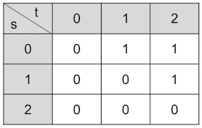
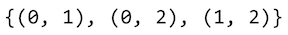
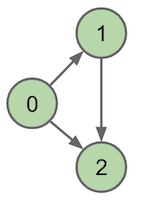
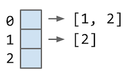

<!-- Generated by scripts/import-cs61b.mjs. Do not edit. -->


---

## 18.1 广度优先搜索（BFS）

上一章开发了图的深度优先搜索（DFS）。DFS 会先沿第一个邻居不断深入，走完整条分支后才考虑第二个邻居。

广度优先搜索（Breadth-First Search，BFS）也称层序遍历。它先访问源点的所有直接邻居，再访问距离源点两条边的顶点，随后是三条边，以此类推。

### BFS 伪代码

```text
创建 fringe：一个含起点的队列，并标记起点。
当 fringe 非空时重复：
    从队首取出顶点 v。
    对 v 的每个未标记邻居 n：
        标记 n。
        把 n 加入队尾。
        edgeTo[n] = v。
        distTo[n] = distTo[v] + 1。
```

`fringe` 表示遍历的**边界集合**：已经发现、但还在等待处理的顶点。BFS 使用队列，因此先发现的顶点先处理。

- `edgeTo[n] = v` 记录第一次发现 `n` 时是从 `v` 走过来的。沿 `edgeTo` 反向追踪，可以恢复从起点到 `n` 的路径。
- `distTo[n]` 记录从起点到 `n` 的边数。若每条边长度为 1，那么从 `v` 到邻居 `n` 只需再走一步，所以 `distTo[n] = distTo[v] + 1`。

BFS 按距离递增顺序发现顶点，因此在**无权图**中，第一次发现某个顶点时得到的就是最短路径。

示例过程见[课程幻灯片](https://docs.google.com/presentation/d/1JoYCelH4YE6IkSMq_LfTJMzJ00WxDj7rEa49gYmAtc4/edit#slide=id.g76e0dad85_2_380)。

### DFS 与 BFS

**问题 18.1：**哪种图遍历使用栈作为 fringe？

**答案：**DFS。

不过，DFS 与 BFS 的差别不只在 fringe：

- BFS 通常在**加入队列时**立刻标记顶点，防止同一个顶点重复入队。
- 某些迭代式 DFS 写法是在**弹出栈时**才标记，因此同一顶点在正式访问前可能被多个邻居重复压栈。
- 递归 DFS 借助调用栈自然实现“深入后回退”。

迭代式 DFS 的典型伪代码：

```text
创建空栈 fringe
把起点压栈
当栈非空时：
    弹出顶点 v
    如果 v 未标记：
        标记 v
        访问 v
        对 v 的每个邻居 n：
            若 n 未标记，把 n 压栈
```

DFS 适合连通性、环检测、拓扑结构分析等问题；BFS 适合无权最短路径和按层扩展的问题。

---

## 18.2 图的表示

图算法在代码中的难易程度和效率，受到两个设计选择影响：

1. 对外提供怎样的 API。
2. 底层用什么数据结构表示图。

这些选择会显著影响运行时间、内存使用和算法实现复杂度。

### Graph API

API 是类向使用者提供的方法列表，包括方法签名以及行为说明。

常见做法是给每个顶点分配唯一整数编号。若原始顶点使用字符串或其他对象，可以额外维护一个对象到整数编号的 Map。这样图的核心 API 无需泛型，可以统一使用整数。

```java
public class Graph {
    public Graph(int V);              // 创建含 V 个顶点的空图
    public void addEdge(int v, int w);// 添加边 v-w
    public Iterable<Integer> adj(int v); // v 的邻接顶点
    public int V();                   // 顶点数
    public int E();                   // 边数
}
```

客户端只依赖这些方法即可实现 DFS、BFS、最短路径等算法。API 是否提供恰当操作，会直接决定算法写起来是否自然。

### 图的底层表示

#### 邻接矩阵

使用一个 $V\times V$ 的二维数组。若存在从 `s` 到 `t` 的边，则 `matrix[s][t]` 为 `true` 或 1。

无向图的邻接矩阵沿主对角线对称。




特点：

- 判断某条边是否存在：$\Theta(1)$。
- 枚举一个顶点的所有邻居：$\Theta(V)$。
- 空间：$\Theta(V^2)$。
- 适合边非常多的稠密图。

#### 边集合

维护一个包含全部边的集合，每条边保存两个端点。





这种表示便于遍历全部边，但若要快速找某个顶点的所有邻居，通常需要扫描大量边。

#### 邻接表

维护一个长度为 $V$ 的数组，每个位置保存一个邻居列表。存在边 `s -> t` 当且仅当 `adj[s]` 中包含 `t`。




特点：

- 空间：$\Theta(V+E)$。
- 枚举 `v` 的邻居：$\Theta(\deg(v))$。
- 判断特定边是否存在，取决于邻居容器；普通列表最坏为 $O(\deg(v))$。
- 对现实中常见的稀疏图非常合适，因此最常用。

### 遍历效率

若使用邻接表，DFS 和 BFS 会：

- 每个顶点最多处理一次；
- 每条边最多检查常数次。

因此总时间为：

$$O(V+E)$$

若使用邻接矩阵，为每个访问到的顶点都要扫描整行 $V$ 个位置，总时间为：

$$O(V^2)$$

课程[表示法效率表](https://docs.google.com/presentation/d/143WntPl7CG5Po3utVK0jYSA0Jd6XKppT5h1juWEWhUU/edit#slide=id.g54593997ea_0_422)总结了不同操作的权衡。不要只背结论，应理解每个复杂度来自实际访问了多少数组位置、邻居或边。

---

> 原作：Josh Hug，UC Berkeley CS61B Spring 2021 配套读本。<br>
> 中文翻译版，仅供非商业学习；采用 CC BY-NC-SA 4.0 许可。<br>
> 原始网站：https://joshhug.gitbooks.io/hug61b/content/
