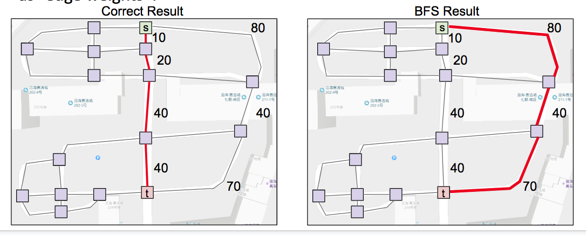
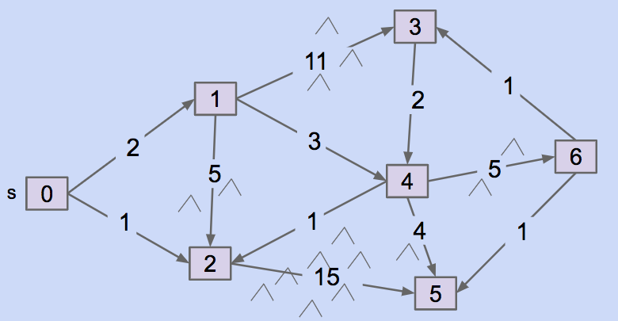
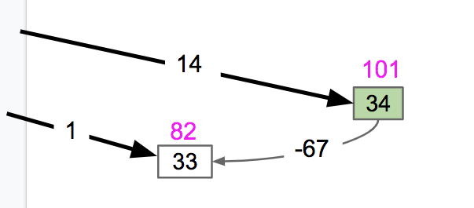
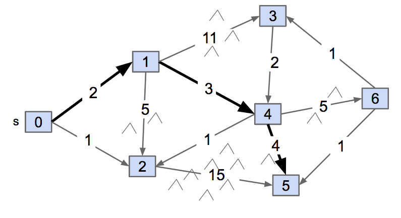
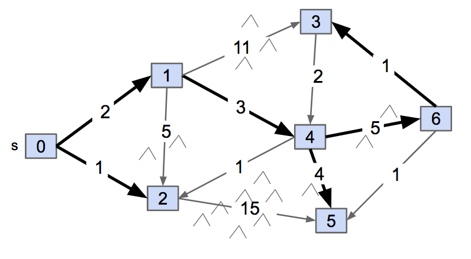
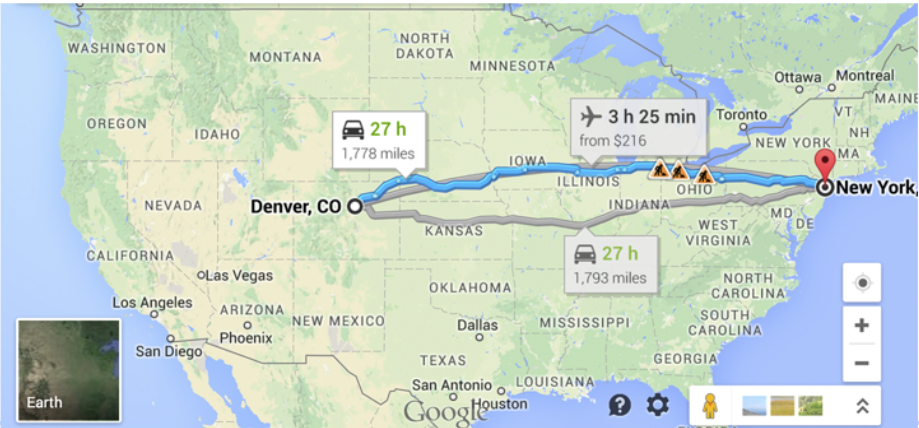

<!-- Generated by scripts/import-cs61b.mjs. Do not edit. -->


---

## 19.1 回顾

目前我们已经会：

- 从给定源点 $s$ 出发，找到通往所有可达顶点的路径。
- 从 $s$ 出发，找到通往所有可达顶点的“最短”路径——但这里的“最短”需要进一步澄清。

### DFS 与 BFS

DFS 和 BFS 都能判断可达性并构建路径树，但结果不同：

- DFS 找到的是某条路径，不保证最短。
- BFS 在无权图中会找到边数最少的路径。
- 使用邻接表时，两者时间复杂度都是 $O(V+E)$。

空间方面：

- DFS 对非常细长的图可能产生很深的递归栈，例如一条含 10,000 个顶点的链。
- BFS 对分支极多的图可能让队列同时保存大量顶点。

### BFS 的“最短”是什么意思？

BFS 找到的是**边数最少**的路径。若所有边的代价都相同，这正是我们想要的最短路径。

但许多图的边带有权重：道路有长度或通行时间，网络链路有延迟，航班有价格。此时边数较少的路径不一定权重之和更小。

例如，一条直接边权重为 10，而经过三条边的路线总权重只有 6。BFS 会偏爱一条边的路线，但真正的加权最短路径是三条边的路线。



下一节将研究非负权图上的单源最短路径算法：Dijkstra 算法。

---

## 19.2 Dijkstra 算法

### 先手工求解



尝试完成：

1. 找一条从顶点 0 到顶点 5 的路径。
2. 找出以 0 为源点的最短路径树，即从 0 到每个顶点的最短路径。
3. 设计一个自动完成这件事的算法。

答案图在本节末尾。

### 观察

加权图中的最短路径可能包含很多条边。我们要最小化的是路径上所有边权之和，而不是边数。

从源点 $s$ 出发的**最短路径树（Shortest Path Tree）**可以这样理解：

1. 对每个顶点 $v\ne s$，找到一条从 $s$ 到 $v$ 的最短路径。
2. 把这些路径使用的边合并起来。

若每个可达顶点在 `edgeTo` 中只有一个前驱，则得到的结构有 $V-1$ 条父边，不含环，因此是一棵树。

### Dijkstra 算法

Dijkstra 算法输入源点 $s$，输出从 $s$ 到所有可达顶点的最短路径树。

1. 创建最小优先队列。
2. `distTo[s] = 0`，其余顶点距离设为无穷大。
3. 把顶点按当前 `distTo` 作为优先级加入队列。
4. 不断取出当前距离最小的未确定顶点 `v`。
5. 对 `v` 的所有出边执行**松弛（relaxation）**。

#### 什么是松弛？

考虑边 $(v,w)$，其权重为 `weight(v, w)`。

当前已知从源点到 `w` 的最好距离是：

```text
distTo[w]
```

如果改为先到 `v`，再沿边 $(v,w)$ 到 `w`，候选距离是：

```text
distTo[v] + weight(v, w)
```

若候选更小，就更新：

```java
distTo[w] = distTo[v] + weight(v, w);
edgeTo[w] = v;
priorityQueue.changePriority(w, distTo[w]);
```

这个“计算候选、比较并可能更新”的过程就是松弛。


#### 伪代码

```text
dijkstra(source):
    distTo[source] = 0
    其余 distTo = infinity
    把所有顶点加入最小优先队列，优先级为 distTo

    while PQ 非空:
        v = PQ.removeSmallest()
        标记 v 的最短距离已经确定
        对 v 的每条出边 (v, w):
            relax(v, w)
```

```text
relax(v, w):
    如果 w 已经被确定：
        return

    candidate = distTo[v] + weight(v, w)
    如果 candidate < distTo[w]:
        distTo[w] = candidate
        edgeTo[w] = v
        PQ.changePriority(w, candidate)
```

实现也可以不预先把所有顶点加入队列，而是在距离第一次变为有限值时加入，并允许旧条目留在队列中；弹出过期条目时跳过即可。

### 正确性条件

只要所有边权都**非负**，Dijkstra 算法保证正确。

直觉如下：

- 源点距离 0 显然最优。
- 优先队列每次弹出当前 `distTo` 最小的顶点 `v`。
- 假设还存在一条未发现的更短路径到 `v`。这条路径必须先经过某个尚未弹出的顶点 `u`。
- 但 `u` 当前距离不小于 `v`，而后续边权又非负，因此经 `u` 到 `v` 不可能变得更短。
- 所以 `v` 一旦弹出，其距离就已是最终最短距离。
- 对每次弹出重复同样论证，就得到完整正确性。

这可以形式化为归纳证明。

### 为什么负边会破坏算法？



若存在负边，一个已经弹出并“确定”的顶点，之后可能通过负边获得更短路径。例如到顶点 33 的距离先被确定为 82，后来从距离 101 的顶点 34 经过权重 -67 的边，可得到 34。但普通 Dijkstra 不再更新已确定顶点，于是返回错误答案。

**Dijkstra 对含负权边的图不保证正确。**

一个有趣的特殊情况：若所有负边都只从源点发出，源点第一次松弛后它们就已经被处理，之后剩余边非负，因此算法仍可正常工作。

### 一个重要不变量

顶点一旦从优先队列弹出，其 `distTo` 就是最终最短距离，不会再改变。

因此，如果只需要从源点到某个目标点的最短路径，而不是整棵最短路径树，那么目标点一旦弹出就可以立即停止。这称为**提前终止（short-circuiting）**。

### 手工题答案





---

## 19.3 A* 算法

Dijkstra 可以在目标点弹出时提前停止，但它仍可能探索大量与目标方向无关的顶点。

可以把 Dijkstra 想成以源点为圆心不断扩大同心圆：先确定距离源点 1 单位的顶点，再确定 2 单位、3 单位……

若从 Denver 寻找 New York，算法会同时向所有方向扩展。它可能先扫过 Las Vegas、Los Angeles、Dallas 等大量城市，尽管目标明显在东部。



我们希望利用“目标大致在哪个方向”的先验知识，让搜索更偏向目标。

### A* 的核心思想

Dijkstra 的优先级是：

$$g(v)=\text{从源点到 }v\text{ 的当前最好已知距离}$$

A* 再加入一个启发式估计：

$$h(v)=\text{从 }v\text{ 到目标的估计距离}$$

优先队列使用：

$$f(v)=g(v)+h(v)$$

其中：

- `g(v)` 来自实际已走路径。
- `h(v)` 是对剩余代价的预测。
- `f(v)` 是经过 `v` 到达目标的估计总代价。

因此，A* 是把 Dijkstra 的真实已知距离与目标导向的启发信息结合起来。

演示见[A* 课程幻灯片](https://docs.google.com/presentation/d/177bRUTdCa60fjExdr9eO04NHm0MRfPtCzvEup1iMccM/edit#slide=id.g771336078_0_180)。

### 启发式从哪里来？

我们正是为了求真实最短距离才运行 A*，因此不可能事先知道准确的剩余距离。`h` 必须是一个容易计算的近似。

在地图问题中，可使用两地 GPS 坐标的直线距离。道路不一定能沿直线走，因此这通常不是实际道路距离，但它能提供方向和合理下界。

其他例子：

- 网格地图使用曼哈顿距离或欧几里得距离。
- 拼图问题使用错位方块数或每块到目标位置的距离和。
- 游戏寻路使用几何距离。

### 糟糕的启发式会怎样？

假设真正最短路径必须经过城市 $C$，但错误启发式把到 $C$ 的估计设为无穷大。A* 几乎永远不会选择这条路线，最终可能返回错误答案。

为保证最优性，启发式通常需要两个性质。

#### 可采纳性（admissibility）

启发式不能高估真实剩余距离：

$$h(v)\le d(v,\text{target})$$

也就是说，它必须是一个乐观下界。

#### 一致性（consistency）

对每条边 $(v,w)$：

$$h(v)\le \operatorname{weight}(v,w)+h(w)$$

这类似三角不等式。一致性保证沿路径前进时，估计总成本不会出现不合理下降，也使顶点弹出后无需重新打开。

一致启发式一定可采纳（在目标点 `h(target)=0` 的常见设定下）。

### 与 Dijkstra 的关系

若令所有顶点的启发式都为 0：

$$h(v)=0$$

则 A* 的优先级退化为 `g(v)`，它就是 Dijkstra 算法。

启发式越准确，A* 往往探索越少的顶点；但计算启发式本身也有成本。实际设计需要在“估计质量”与“计算开销”之间权衡。

---

> 原作：Josh Hug，UC Berkeley CS61B Spring 2021 配套读本。<br>
> 中文翻译版，仅供非商业学习；采用 CC BY-NC-SA 4.0 许可。<br>
> 原始网站：https://joshhug.gitbooks.io/hug61b/content/
