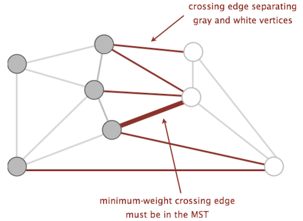
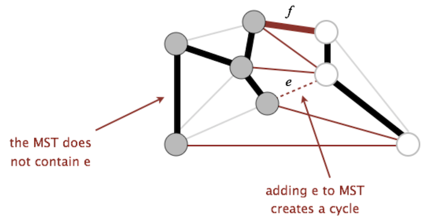

<!-- Generated by scripts/import-cs61b.mjs. Do not edit. -->


---

## 20.1 最小生成树与割性质

**最小生成树（Minimum Spanning Tree，MST）**是连通加权无向图中一组总权重最小的边，它必须：

- 连接图中的全部顶点，因此是“生成”的；
- 保持连通；
- 不含环，因此是一棵树；
- 对 $V$ 个顶点恰好包含 $V-1$ 条边。

本章将学习 Prim 和 Kruskal 两种寻找 MST 的算法。理解它们之前，先介绍证明安全边的核心工具：**割性质（Cut Property）**。

### 割

一个**割（cut）**把图的全部顶点分到两个非空集合中。

一条边若两个端点分别属于割的两侧，就称为这条割的**跨越边（crossing edge）**。

### 割性质

对任意一个割，权重最小的跨越边都可以属于某棵最小生成树。若所有边权互不相同，则这条最轻跨越边必然属于唯一的 MST。



### 交换论证

用反证法证明。设某个割的最轻跨越边为 $e$，并假设一棵 MST $T$ 不含 $e$。

1. 向 $T$ 加入 $e$。由于树中任意两点已有唯一路径，加入一条边必然形成一个环。
2. $e$ 从割的一侧跨到另一侧。环要回到起点，环中必然还存在另一条跨越边 $f$。
3. 删除 $f$，环被打断，图仍然连通并含 $V-1$ 条边，因此仍是一棵生成树。
4. 因为 $e$ 是最轻跨越边，$w(e)\le w(f)$，替换后总权重不会增加。
5. 若 $w(e)<w(f)$，新树甚至更轻，与 $T$ 是 MST 矛盾；若相等，也说明存在一棵包含 $e$ 的 MST。

因此，选择最轻跨越边是安全的。



Prim 和 Kruskal 看起来不同，但它们每一步本质上都在构造一个割，并选择该割上的安全最轻边。

---

## 20.2 Prim 与 Kruskal 算法

### Prim 算法

Prim 算法从任意起点开始，让一棵树逐步向外生长：

1. 任选一个起始顶点加入树。
2. 在“一端位于当前树内、另一端位于树外”的所有边中，选择权重最小者。
3. 把该边及其外侧顶点加入树。
4. 重复，直到选出 $V-1$ 条边。

正确性来自割性质：当前已在树中的顶点形成一个集合，其余顶点形成另一个集合。Prim 每一步都选择跨越这个割的最轻边，因此选择是安全的。

#### 与 Dijkstra 的关系

Prim 与 Dijkstra 的控制结构非常相似，都使用优先队列维护尚未确定的顶点。

- Dijkstra 的优先级：源点到该顶点的当前最短路径距离。
- Prim 的优先级：该顶点连接到当前生成树的最轻边权。

Prim 维护：

- `distTo[v]`：当前树连接到 `v` 的最轻边权。
- `edgeTo[v]`：实现这个最轻连接的边。

使用邻接表和二叉堆优先队列时，复杂度通常写作：

$$O((V+E)\log V)$$

对于连通图，$E\ge V-1$，常简化为 $O(E\log V)$。

### Kruskal 算法

Kruskal 不从某个顶点扩展，而是让许多小连通分量逐步合并：

1. 按权重从小到大排序全部边。
2. 依次考察每条边 $(u,v)$。
3. 若 `u` 与 `v` 当前不连通，加入这条边并合并两个分量。
4. 若已经连通，加入会形成环，因此跳过。
5. 选满 $V-1$ 条边后结束。

Kruskal 也依赖割性质。当前不同连通分量之间存在一个割；按权重顺序遇到的、能够连接两个不同分量的边，是相关割上的最轻安全边。

Prim 与 Kruskal 可能得到不同的边集合，但总权重都最小。若 MST 唯一，两者结果相同。

#### 用并查集检测环

维护加权 Quick Union + 路径压缩：

```text
for edge (u, v) in edges sorted by weight:
    if !isConnected(u, v):
        add edge to MST
        connect(u, v)
```

`isConnected` 判断加入边是否会在当前森林中形成环，`connect` 合并两个分量。

#### 复杂度

- 排序全部边：$O(E\log E)$。
- 每条边进行常数次并查集操作：总计近似 $O(E\alpha(V))$。

因此瓶颈通常是排序：

$$O(E\log E)$$

由于简单图中 $E\le V^2$，有 $\log E=O(\log V)$，也常写作 $O(E\log V)$。

若边已经排序，则剩余工作接近线性：

$$O(E\alpha(V))$$

其中 $\alpha$ 是反 Ackermann 函数，在现实输入规模下可视作小于 5 的常数。

### 对比

- Prim 更像“从一个点长出一棵树”，适合邻接表和稠密局部探索。
- Kruskal 更像“从轻边开始合并森林”，实现直观，天然结合并查集。
- 两者都通过割性质保证正确。

---

> 原作：Josh Hug，UC Berkeley CS61B Spring 2021 配套读本。<br>
> 中文翻译版，仅供非商业学习；采用 CC BY-NC-SA 4.0 许可。<br>
> 原始网站：https://joshhug.gitbooks.io/hug61b/content/
