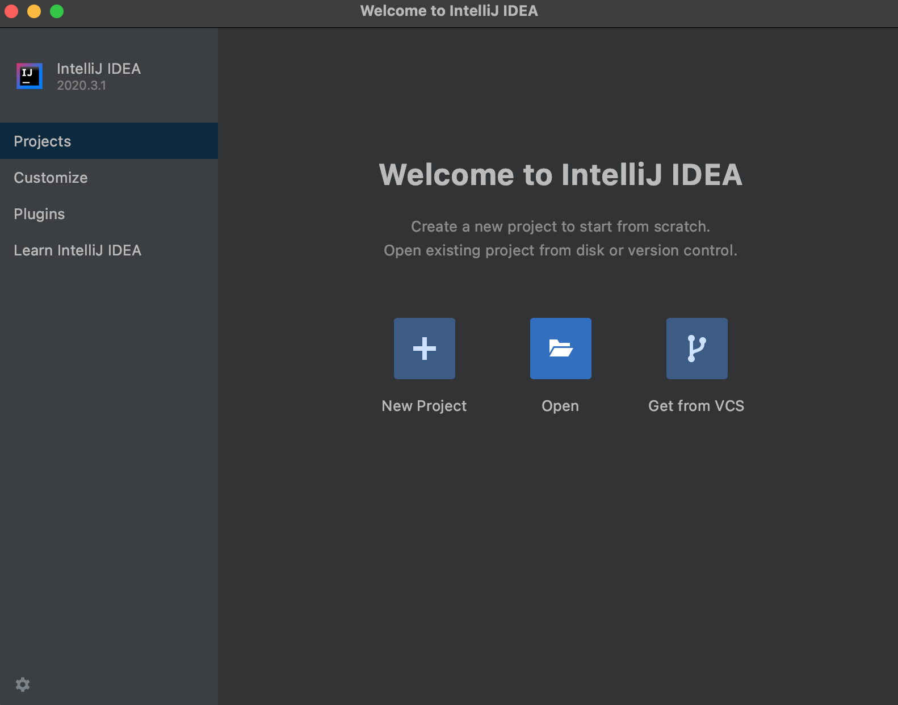
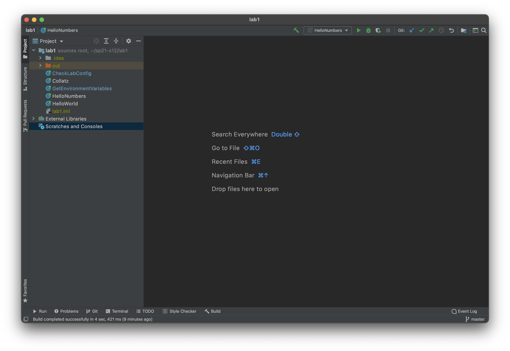
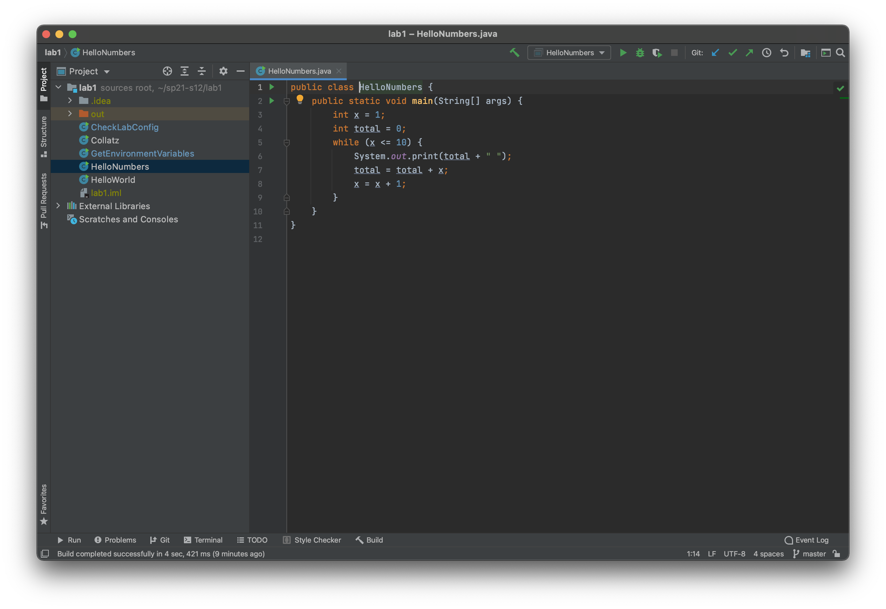
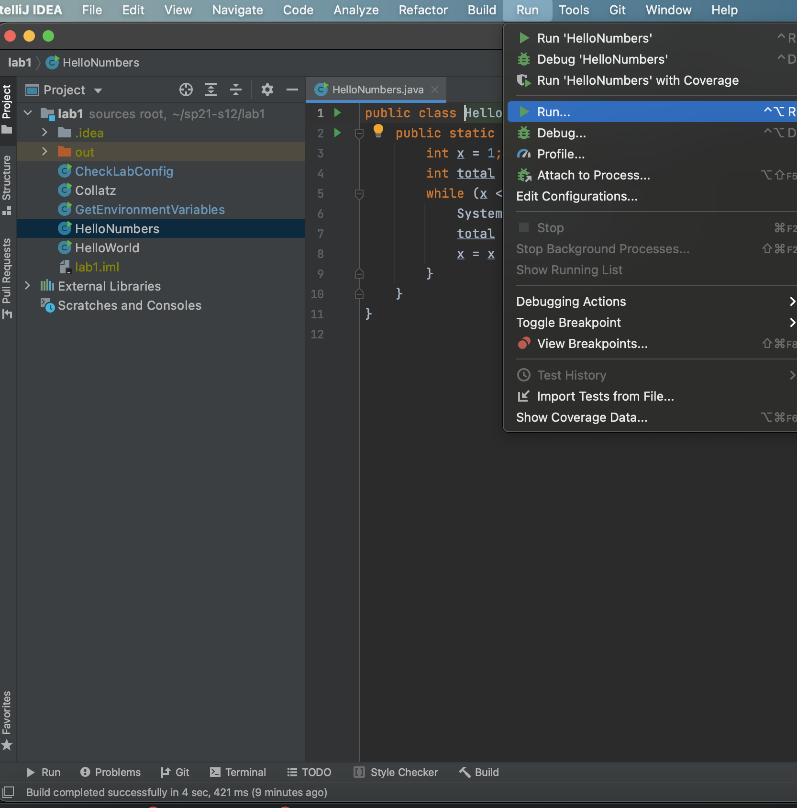
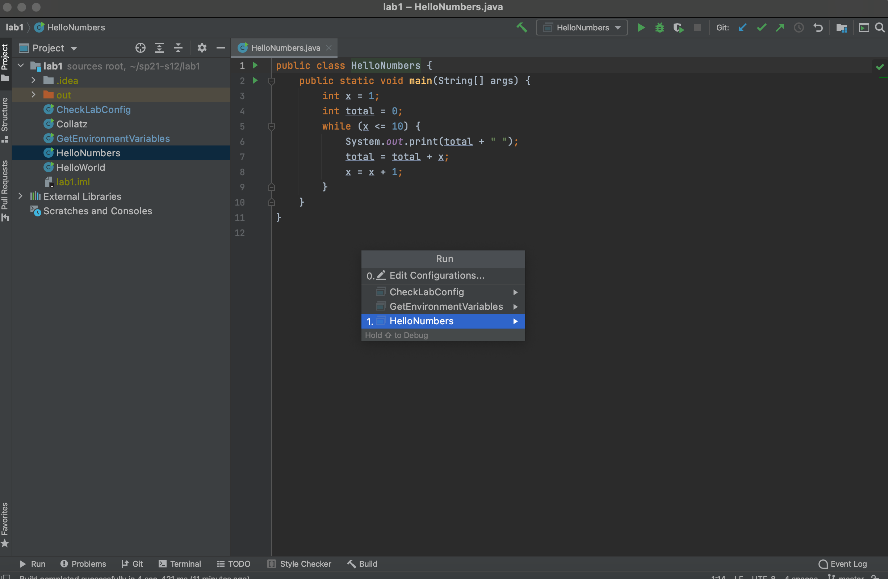
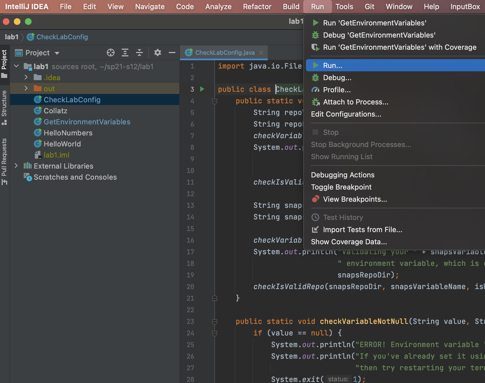
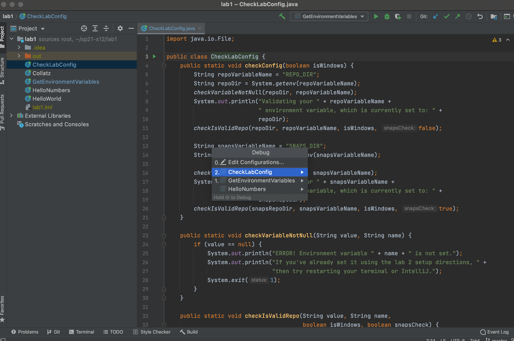
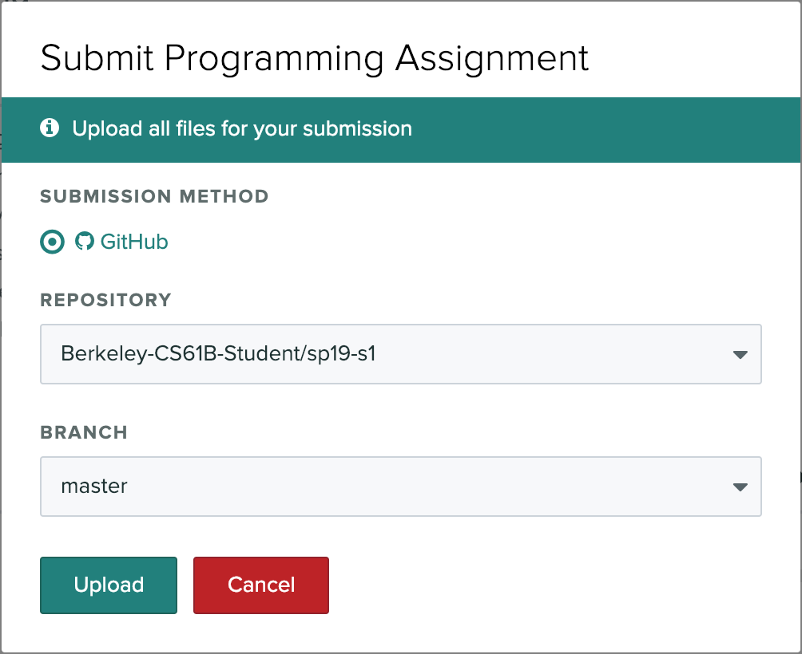

<!-- Generated by scripts/import-cs61b.mjs. Do not edit. -->


- [开始之前](#开始之前)
- [GitHub 与 Beacon](#github-与-beacon)
  - [关于你的仓库的更多细节](#关于你的仓库的更多细节)
- [A. 获取起始文件](#a-获取起始文件)
- [B. 在 IntelliJ 中运行代码](#b-在-intellij-中运行代码)
- [C. 配置 Snaps](#c-配置-snaps)
  - [获取 Snaps 仓库](#获取-snaps-仓库)
  - [设置环境变量](#设置环境变量)
    - [安装 Snaps 插件](#安装-snaps-插件)
      - [Mac OS 和 Linux](#mac-os-和-linux)
      - [Windows](#windows)
    - [测试你的环境变量](#测试你的环境变量)
- [D. 编程练习](#d-编程练习)
- [E. 将你的工作推送到 GitHub](#e-将你的工作推送到-github)
- [F. 提交 Lab 1](#f-提交-lab-1)
- [G. 验证 Snaps 安装](#g-验证-snaps-安装)
- [回顾](#回顾)
- [Josh Hug 的配色方案（可选）](#josh-hug-的配色方案可选)

<a id="开始之前"></a>
## 开始之前

- 在开始本实验之前，请先完成 [lab1setup](https://sp21.datastructur.es/materials/lab/lab1setup/lab1setup)，安装 61B 所需的软件。如果你在任何地方卡住，都可以在 Ed 上发帖、参加实验课，或来 Office Hours。
- 请注意，第一周有大量配置步骤。不要灰心；如果卡住了，一定要寻求帮助！
- 警告：本实验有一点长。如果你没有在实验课时段内完成，这是正常的，尤其是在你遇到棘手的配置问题、需要大量帮助时。
- 你在完成本实验（或其他任何实验）时，可以与其他学生交谈，但最终所有输入、编程和命令操作都应当由你自己完成。本实验包含大量重要的配置信息，你需要独立于其他人亲自完成这些配置。

<a id="github-与-beacon"></a>
## GitHub 与 Beacon

CS61B 不使用 bCourses，而是使用一个名为 Beacon 的内部系统来集中管理你的成绩和学生信息。

在本节中，我们会配置你的 Beacon 账户以及你的 CS 61B GitHub 仓库（“repo”）。提交所有编程作业时，你都会用到这个仓库。

1. 在 [GitHub.com](https://github.com/) 创建账户。如果你已经有账户，则不需要新建账户。
2. 前往 [Beacon 网站](https://sp21.beacon.datastructur.es/)，系统会引导你完成几个步骤，以完成 GitHub 仓库注册。请认真按照这些步骤操作！要完成 Google Form 测验，你必须登录自己的 Berkeley 账户。如果在执行这些步骤时出现任何错误，请立即告诉你的 TA。
3. 完成全部步骤后，你应该会收到一封电子邮件，邀请你协作使用课程 GitHub 仓库。接受两封邮件中的邀请，之后就可以了。这封邮件会发送到你创建 GitHub 账户时使用的邮箱，该邮箱不一定是你的 Berkeley 邮箱。太好了！不要按照 GitHub 所说的“你可能想执行”的说明操作——请改为按照本实验后面给出的说明操作。

<a id="关于你的仓库的更多细节"></a>
### 关于你的仓库的更多细节

你的仓库名称会包含一个对你而言唯一的编号！例如，如果你的仓库名是 `sp21-s42`，那么登录 GitHub 后，你可以通过 https://github.com/Berkeley-CS61B-Student/sp21-s42 访问自己的私有仓库。如果你的仓库编号不是 `42`，这个链接对你就不起作用。把 `42` 替换成你自己的编号，即可在 GitHub 上查看自己的仓库。

此外，讲师、TA 和 Tutor 也能查看你的仓库。这意味着，你在 Ed 上私下询问调试问题时，可以（而且应该）链接到自己的代码。其他学生都无法查看你的仓库。再次提醒，即使课程结束后，你也不得公开发布本课程的代码。这样做违反课程政策，你可能会受到纪律处分。

如果你与实验伙伴合作，你还会收到一个单独的共享仓库，实验中应使用该仓库。更多细节请参阅 Course Info 页面中的 Partnerships Guide。

此外，在 Beacon 中注册后，你还会收到另一个形如 `snaps-sp21-sXXX` 的仓库的协作邀请——现在不用担心这个仓库的用途，只需接受邀请，确保自己能够访问它即可。本实验后面的章节会提供更多关于这个仓库的信息！

<a id="a-获取起始文件"></a>
## A. 获取起始文件

对于本课程中的大多数作业（包括本实验），我们会提供一组起始文件。

为了获取起始文件，我们将使用 Git 版本控制系统。你会在本实验后面以及整个课程中进一步学习 Git。现在，我们先简单地使用 Git 获取本实验的文件。

如果你需要有关创建目录、创建文件、更改目录等操作的帮助，请参阅 [lab1setup](https://sp21.datastructur.es/materials/lab/lab1setup/lab1setup) 的 C 节。

1. 首先，告诉 Git 你的姓名和电子邮箱地址，以便 Git 能够正确地把提交归属给你。运行以下命令：

   把 `Your Name` 替换成你的姓名，把 `you@berkeley.edu` 替换成你的电子邮箱地址。你应该使用注册 GitHub 时使用的邮箱。如果它不是你的 `@berkeley.edu` 邮箱，也没有关系。

   ```bash
   $ git config --global user.email "you@berkeley.edu"
   $ git config --global user.name "Your Name"
   ```

2. 克隆你在 [Berkeley-CS61B-Student 组织](https://github.com/Berkeley-CS61B-Student)中的仓库。

   - 在电脑的文件夹中，导航到你想要开始放置仓库的位置。在下面的示例中，我假设你希望把所有内容放在名为 `cs61b` 的文件夹中，但你也可以选择其他名称。

     ```bash
     $ cd cs61b
     ```

   - 输入以下命令克隆你的 GitHub 仓库。一定要把 `s**` 替换成你注册仓库时获得的课程 ID。

     ```bash
     $ git clone https://github.com/Berkeley-CS61B-Student/sp21-s**.git
     ```

     如果你想使用 SSH 而不是 HTTPS（并[设置自己的 SSH 密钥](https://help.github.com/en/github/authenticating-to-github/connecting-to-github-with-ssh)），也完全可以。如果你不知道这些是什么意思，直接使用上面的命令即可。SSH 的优点是，你每次使用仓库时都不必输入 GitHub 密码。

   - 进入你新创建的仓库！（一定要完成这一步，否则下面剩余步骤无法正常工作。）

     ```bash
     $ cd sp21-s**
     ```

3. 添加 `skeleton` 远程仓库。你将从这个远程仓库“拉取”代码，以获得作业的起始代码。继续执行这些命令前，请确保你位于新创建的仓库文件夹中。

   - 输入以下命令添加 `skeleton` 远程仓库。

     ```bash
     $ git remote add skeleton https://github.com/Berkeley-CS61B/skeleton-sp21.git
     ```

   - 现在列出远程仓库时，应当同时看到 `origin` 和 `skeleton`。

     ```bash
     $ git remote -v
     ```

   - 如果你收到 `Not a git repository` 错误，请确保自己位于 `sp21-s**` 目录中。

4. 现在，你必须从 `skeleton` 远程仓库“拉取”，以获得 Lab 1 的起始代码。每当发布新的项目和作业时，你也会执行这一操作。为此，请使用整个 Git 工具箱中最吓人的命令：

   ```bash
   $ git pull skeleton master
   ```

   这条命令会抓取名为 `skeleton` 的仓库中的所有远程文件（该仓库位于 `https://github.com/Berkeley-CS61B/skeleton-sp21.git`），并把它们复制到当前文件夹中。

   如果你收到类似 `fatal: refusing to merge unrelated histories` 的错误，那么你可能在创建仓库时运行了 GitHub 建议的命令。要修复这一问题，本次可以改为运行：

   ```bash
   $ git pull --rebase --allow-unrelated-histories skeleton master
   ```

   只在这一次这样做。

5. 如果你列出当前目录中的文件，会看到现在有一个名为 `lab1` 的文件夹。查看 `lab1` 文件夹，你会看到 `HelloWorld.java`、`HelloNumbers.java`、`Collatz.java` 以及其他文件；你会在本实验后面的部分中使用它们。

<a id="b-在-intellij-中运行代码"></a>
## B. 在 IntelliJ 中运行代码

IntelliJ 是一个 IDE（集成开发环境，Integrated Development Environment）。它包含文本编辑器，以及大量能够让编写代码变得更容易的额外功能。让我们先在 `lab1` 文件夹上试用它。

1. 打开 IntelliJ 后，点击 **Open** 选项。

   

2. 找到并选择你的 `lab1` 目录，然后按下 **OK** 按钮。按下完成后，你应该会看到与下图非常相似的内容。你可能需要点击左上角 `lab1` 旁边的小三角形，才能显示源文件（`HelloWorld`、`HelloNumbers`、`Collatz`、`GetEnvironmentVariables` 和 `CheckLabConfig`）。如果你没有看到侧边栏，请前往 **View → Tool Windows → Project**，或选择左侧工具栏中的 **Project**。

   

   注意：第一次启动 IntelliJ 时，它可能需要一些时间来索引文件。这可能会花费几分钟。右下角应该有一个小进度条。在索引完成前，某些步骤可能无法工作。

3. 双击 `HelloNumbers`，你会看到 `HelloNumbers` 代码出现。你的配色方案不会与下图相同（下图使用的是 Josh Hug 官方批准的配色方案，名为 Sunburst）。如果你觉得自己想使用 Sunburst，请参阅本实验最后的可选配置。此处不应当出现任何错误（代码不应以红色高亮）。如果看到错误，请在 Ed 上发帖或询问实验课 TA。

   

4. 接下来，让我们运行 `HelloNumbers`。为此，请点击 **Run**，然后点击 **Run…** 选项。

   

5. 这会显示两个选项，一个叫作 **Edit Configuration**，另一个叫作 **HelloNumbers**。你可能还会看到本实验后面将要使用的文件对应的其他选项。IntelliJ 支持各种复杂的 Java 程序运行配置选项，但默认配置已经满足我们的需要，因此直接点击写着 **HelloNumbers** 的选项即可。

   

看看程序生成的输出！你应该会看到一些漂亮的数字被打印出来！Hello Numbers！

<a id="c-配置-snaps"></a>
## C. 配置 Snaps

你有两个课程仓库：一个标准仓库（例如 `sp21-s33`），以及一个 Snaps 仓库（`snaps-sp21-s33`）。标准仓库中的提交需要手动创建；Snaps 仓库中的提交会自动创建。

如果你忘记使用 Git 手动创建提交，Snaps 仓库会作为你的工作内容的安全备份。每完成一个项目后，你都会推送 Snaps 仓库；这使我们能够发布统计数据，例如学生完成每个项目（或项目中每个部分）所花费的平均时间。它还让我们能够找出项目中比预期更令人困惑或更耗时的部分。

它还会让我们了解所布置的工作量是否过高；如果我们给你的负担过重，就可以调低课程难度。如果你强烈反对推送自己的 Snaps 仓库，请届时联系你的 Mentor GSI。课程第二周会提供更多关于 Mentor GSI 的信息。

我们不希望你感觉自己一直被监视！因此，我们不会人工分析 Snaps 仓库，也不会使用 Snaps 仓库中的任何信息进行抄袭检测。也就是说，所有分析都会通过不知道你身份的批量分析工具完成，并且 Snaps 仓库中的任何内容都不会以任何方式被用于对你不利的事情。

在学期结束时，你还将有机会选择加入一个研究项目。届时会提供详细信息。

在本实验的这一节中，你会配置自己的电脑，使其能够创建 Snaps 备份。

<a id="获取-snaps-仓库"></a>
### 获取 Snaps 仓库

你应该已经收到并接受了一个 `snaps-sp21-s***` 仓库的协作邀请。如果你尚未接受，请不要继续，直到你接受为止。如果在电子邮箱收件箱中找不到邀请（请记住，它发送到与你的 GitHub 账户关联的邮箱，该邮箱不一定是你的 Berkeley 邮箱），请在 Ed 上发帖，或来实验课或 Office Hours，以便我们帮助你。

首先，我们会把 Snaps 仓库克隆到你的电脑。在终端中（Windows 上使用 Git Bash），导航到主目录：`cd ~`。然后运行以下命令，把 `***` 替换成你的仓库编号：

```bash
git clone https://github.com/Berkeley-CS61B-Student/snaps-sp21-s***
```

如果运行 `ls`，现在应该能够看到 `snaps-sp21-s***` 文件夹。

**重要：绝对不要在这个文件夹中完成作业。如果你从 Snaps 文件夹提交代码，Gradescope 测试一定会失败。你只应当操作自己的 `sp21-s***` 文件夹。**

<a id="设置环境变量"></a>
### 设置环境变量

接下来，你需要设置一些环境变量。具体步骤取决于你的操作系统。

- [Windows 说明](https://sp21.datastructur.es/materials/lab/lab1/lab1SnapsSetupWindows.html)
- [macOS 和 Linux 说明](https://sp21.datastructur.es/materials/lab/lab1/lab1SnapsSetupMacAndLinux.html)

<a id="安装-snaps-插件"></a>
#### 安装 Snaps 插件

<a id="mac-os-和-linux"></a>
##### Mac OS 和 Linux

1. 按照上面的说明设置环境变量后，重新启动 IntelliJ 和所有终端窗口（关闭它们，然后重新打开），使变量生效。
2. 前往 IntelliJ 欢迎窗口（你可能必须点击 **File → Close Project** 才能回到欢迎窗口）。
3. 选择 **Plugins**（左侧面板）→ **Marketplace**（顶部中间）→ 搜索 `CS 61B Snaps`，然后安装。
4. IntelliJ 可能会要求你重启 IDE（会出现绿色的 **Restart IDEA** 按钮）。如果出现，请重启。
5. 不要忽略下一步。
6. 退出 IntelliJ（无论它是否已经在第 4 步重启）。没错，即使你可能刚刚重启它，也要再次完全退出。
7. 打开终端窗口，通过运行 `idea` 启动 IntelliJ。不要通过操作系统 GUI（例如 Mac OS 的 Finder）运行 IntelliJ。
8. 继续下一节，测试你的环境变量。

<a id="windows"></a>
##### Windows

1. 按照上面的说明设置环境变量后，重新启动 IntelliJ 和所有终端窗口（关闭它们，然后重新打开），使变量生效。
2. 前往 IntelliJ 欢迎窗口（你可能必须点击 **File → Close Project** 才能回到欢迎窗口）。
3. 选择 **Plugins**（左侧面板）→ **Marketplace**（顶部中间）→ 搜索 `CS 61B Snaps`，然后安装。
4. IntelliJ 可能会要求你重启 IDE（会出现绿色的 **Restart IDEA** 按钮）。如果出现，请重启。
5. 不要忽略下一步。
6. 再次重启 IntelliJ。没错，即使你可能刚刚重启它，也要完全退出，然后重新打开。

<a id="测试你的环境变量"></a>
#### 测试你的环境变量

重新打开 IntelliJ 后，请确保 IntelliJ 中打开的是 `lab1` 文件夹。打开 `CheckLabConfig`，验证环境变量是否设置正确。然后点击 **Run**，向下选择写着 **Run…** 的选项。



现在点击包含 `CheckLabConfig` 的选项：



这应该会运行 `CheckLabConfig` 类的 `main` 方法。如果一切正常，你会看到一条消息，确认你已经完成 Lab 1 的配置！

<a id="d-编程练习"></a>
## D. 编程练习

打开名为 `Collatz.java` 的文件。尝试运行它，你会看到数字 `5` 被打印出来。

这个程序应当从给定数字开始，打印 [Collatz 序列](https://en.wikipedia.org/wiki/Collatz_conjecture)。Collatz 序列的定义如下：

如果 `n` 是偶数，下一个数字是 `n / 2`。如果 `n` 是奇数，下一个数字是 `3n + 1`。如果 `n` 是 `1`，序列结束。

例如，假设从 `5` 开始。因为 `5` 是奇数，下一个数字是 `3 × 5 + 1 = 16`。因为 `16` 是偶数，下一个数字是 `8`。因为 `8` 是偶数，下一个数字是 `4`。因为 `4` 是偶数，下一个数字是 `2`。因为 `2` 是偶数，下一个数字是 `1`。到这里就结束了。序列是 `5, 16, 8, 4, 2, 1`。

你的第一个任务是编写如下方法：`public static int nextNumber(int n)`，它返回下一个数字。例如，`nextNumber(5)` 应当返回 `16`。Gradescope 自动评分器会测试这个方法。务必使用注释提供方法描述。你的描述应当包含在 `/**` 和 `*/` 之间。包含在 `/**` 和 `*/` 之间的注释也叫作“Javadoc 注释”，或简称“Javadocs”。如果需要额外空间，这些注释可以跨越多行，例如 `nextNumber` 的 Javadocs。

Javadocs 可以包含可选标签，例如 `@param`。在 61B 中，除 `@source` 标签外，我们不要求你使用这些标签。每当你在项目中获得了实质性帮助时，都应使用 `@source` 标签。HW 或 Lab 并不要求 `@source` 标签，但我们仍建议你使用，因为引用来源是一种良好的学术和职业习惯。

一些 Java 提示：

- `%` 运算符实现取余。例如，`x % 4` 的值会是 `0`、`1`、`2` 或 `3`。
- `==` 运算符比较两个值是否相等。代码片段 `if (n % 4 == 1)` 的意思是：“如果 `n` 除以 `4` 的余数等于 `1`”。

编写 `nextNumber` 后，补全 `main` 方法，使其打印从 `n = 5` 开始的 Collatz 序列。例如，如果 `n = 5`，程序应当打印 `5 16 8 4 2 1`。`1` 后面多出一个空格也没有关系。

趣闻：对于所有数字，Collatz 序列似乎都会终止于 `1`。然而到目前为止，还没有人能够证明这对所有可能的起始值都成立，不过大约到 `2^68` 为止的所有值都已经检查过了。正如 Wikipedia 文章中所述，数学家 Jeffrey Lagarias 指出，Collatz 猜想“是一个极其困难的问题，完全超出了当代数学的能力范围”。

<a id="e-将你的工作推送到-github"></a>
## E. 将你的工作推送到 GitHub

在本课程中，我们会使用 Git 工具，把你的工作副本存储在所谓的“仓库”中。正如我们会在后面的实验中看到的那样，你也能够使用 Git 从仓库中取回旧版本的工作。事实上，Git 是现实世界中最流行的代码版本控制软件；如果你进入软件工程领域，几乎可以肯定每天都会使用这个工具。

私营公司 GitHub 拥有能够存储 Git 仓库的服务器，其网站 github.com 提供了一个方便的 Web 界面来查看仓库。

在本节中，我们会了解如何把你的仓库“推送”到 GitHub。

首先，前往与你的仓库对应的 GitHub URL。例如，如果你的仓库编号是 `343`，你应访问 https://github.com/Berkeley-CS61B-Student/sp21-s343。前往与你自己的仓库对应的 URL。你会看到那里什么也没有。如果尝试其他仓库编号，会发现自己没有访问权限。也就是说，只有你（以及课程工作人员）能够查看你的仓库。

为了推送代码，我们将使用以下三个命令：`add`、`push` 和 `commit`。现在不用担心细节，只需按照下面的步骤操作：

1. 打开终端窗口，导航到包含你的 `sp21-s***` 仓库的文件夹，**不要**进入 `snaps-sp21-s***` 仓库。如果输入 `ls` 命令，应当能看到 `lab1` 文件夹。

2. 输入以下命令，确认你位于正确目录中。

   ```bash
   $ git status
   ```

   如果一切正常，应当会看到类似下面的内容：

   ```text
   On branch master
   Changes not staged for commit:
     (use "git add <file>..." to update what will be committed)
     (use "git restore <file>..." to discard changes in working directory)
       modified:   lab1/Collatz.java
   ```

   Git 正在告诉你，你对 `lab1/Collatz.java` 做了某些更改，但 GitHub 尚未记录这些更改。确保其中显示的是 `lab1/Collatz.java`，而不只是 `Collatz.java`。如果只显示 `Collatz.java`，应使用 `cd ..` 返回上一级目录。

3. 输入命令：

   ```bash
   $ git add lab1/*
   ```

4. 输入以下命令，确认 `add` 正常工作。

   ```bash
   $ git status
   ```

   如果一切正常，应当会看到类似下面的内容：

   ```text
   On branch master
   Changes to be committed:
     (use "git restore --staged <file>..." to unstage)
           modified:   lab1/Collatz.java
   ```

   现在，Git 正在告诉你，它已经知道你希望记录对 `Collatz.java` 所做的更改。

5. 输入命令：

   ```bash
   $ git commit -m "done with Collatz"
   ```

   执行这条命令后，Git 会记录你对 `Collatz.java` 所做的更改。它还会把消息 `done with Collatz` 与这份记录一起保存。如果你将来想查找过去的某项特定更改，这些消息会非常有用。我们会在后面的实验中进一步讨论。终端还会打印一些输出，你会看到类似下面的内容，不过插入和删除的数量可能不同。

   ```text
   [master e2c138b] done with Collatz
    1 file changed, 15 insertions(+), 1 deletion(-)
   ```

6. 与之前一样，输入 `git status` 命令。

   ```bash
   $ git status
   ```

   如果 `commit` 正常工作，应当会看到类似下面的内容：

   ```text
   On branch master
   nothing to commit, working tree clean
   ```

   “working tree” 是 “clean” 的，意味着你的所有工作都已经备份。

7. 刷新 GitHub.com 上你的仓库 URL。你会看到更改**仍然**没有出现。这是因为我们还差最后一步。

8. 输入命令：

   ```bash
   $ git push origin master
   ```

9. 刷新 GitHub.com 上你的仓库 URL。现在你应当能够看到对 `Collatz.java` 的更改，以及你输入的消息。

请注意，正常情况下，你不会在每一条命令后都输入 `git status`。这里这样做只是为了确保你正确输入了这些命令。真正将代码上传到 GitHub 所必需的三条命令总结如下：

```bash
git add lab1/*
git commit -m "done with Collatz"
git push origin master
```

你可能会想到很多问题：

- 与 Dropbox 这类自动创建备份的工具相比，为什么必须手动跟踪更改会更有用？
- 这些单独的命令分别做什么？如果 `commit` 记录了我的工作，但直到输入 `push` 后它才可见，那么备份究竟存到了哪里？
- 为什么需要三条命令，而不是一条？为什么不直接使用类似 `git upload -m "done with Collatz"` 的单条命令？

让我们依次回答这些问题：

**问：为什么人们不直接使用 Dropbox（或类似工具）？**<br>
Dropbox 会不定期地备份所有内容。编写程序时，我们往往希望在特定时刻、只对特定文件创建备份。例如，当你终于让程序正常工作时，可能希望立刻备份，以便之后把程序弄坏时能够回到这个版本。另外，能够添加消息也让备份更容易整理，从而帮助你找到所需版本。

**`add` 做什么？**<br>
`add` 会标记一个文件（或一组文件），表明你希望备份它们。

**`commit` 做什么？**<br>
`commit` 会使用给定消息创建一个备份。

**如果 `commit` 创建了备份，但没有备份到 GitHub，它把文件备份到了哪里？**<br>
你自己的电脑上！

**在自己的电脑上创建备份有什么用？**<br>
如果你想回到旧版本，可以使用 Git 的其他命令完成。把备份存储在本地，可以非常快速地恢复旧备份，而且不需要互联网连接。

**如果我的电脑坏了，`commit` 创建的备份不就丢了吗？**<br>
是的。这正是为什么还有 `push` 命令。

**为什么不把 `add`、`commit` 和 `push` 合并成一条命令？**<br>
有时你只想添加少量文件，因此可能只对这些文件调用 `add`，最后再执行 `commit`。有时你想创建提交，却不想推送，例如因为你没有互联网连接，或者因为你正在处理过于敏感、不能放在任何互联网网站上的代码。

**如何查看旧备份的历史，以及如何恢复它们？**<br>
如果想查看旧提交，可以使用 `git log`；可以使用 `git checkout` 恢复代码的旧副本。我们之后会介绍这些命令。你也可以使用 GitHub.com 的 Web 界面浏览甚至下载旧副本。

整个学期中，我们会逐渐更好地理解 Git。

额外内容：给看过 1984 年电影《Ghostbusters》（我小时候真的每天都会看）的人打个比方，`add` 命令有点像用质子加速器对准一个幽灵（或多个幽灵），`commit` 命令有点像把幽灵拉进捕捉器，而 `push` 命令有点像把捕捉器卸载到收容单元中。

<a id="f-提交-lab-1"></a>
## F. 提交 Lab 1

最后一步是使用 Gradescope 提交你的工作。Gradescope 是你提交 Homework、Lab 和 Project 作业的网站。要注册 Gradescope（如果尚未注册），请前往 [gradescope.com](https://www.gradescope.com/)，点击中间白色的 **Sign up for free** 按钮。你应使用自己的 Berkeley 邮箱。你应该已经通过 Berkeley 邮箱加入了我们的 Gradescope 课程页面。

如果你尚未被添加到 Gradescope，可以查看 Ed 上的欢迎帖子，获取课程加入代码。

加入 Gradescope 上的课程后，点击 **Lab 1: Welcome to Java** 提交代码。

点击该按钮后，你会进入一个选择仓库和分支的页面（如下图所示）。第一次执行此操作时，必须把 GitHub 账户连接到 Gradescope（类似你在注册网站上所做的操作）。点击 **Connect to GitHub** 按钮，并按照说明操作。

现在选择你的仓库和分支。如果你的仓库是 `sp21-s57`，就在上面的框中选择 `sp21-s57`，并在下面的框中选择 `master`。

以后，你可以创建自己的“分支”（后面某个 61B Lab 的可选部分会介绍），并选择让 Gradescope 评测该分支，不过 61B 不会要求你这样做。



现在按下 **Upload** 进行提交！

请在 Ed 上报告你遇到的任何问题。欢迎附上完整错误消息和/或截图。

**重要：我们强烈鼓励你频繁创建提交！缺乏适当的版本控制不能成为工作丢失的理由，尤其是在课程开始几周之后。**

<a id="g-验证-snaps-安装"></a>
## G. 验证 Snaps 安装

在终端中逐条运行以下命令：

```bash
cd $SNAPS_DIR
git push
```

现在，在 Gradescope 中，你会看到 Lab 1 还有一个名为 **Lab 1A: Snaps Checkoff** 的评分器。点击该按钮，然后在 **Submission Method** 下选择 **Github**。

这一次，请选择你的 `snaps-sp21-s***` 仓库，而**不要**选择 `sp21-s***` 仓库，然后点击 **Submit**。

如果通过这些评分器测试，说明你已经正确配置了电脑。太棒了！如果没有通过，请更仔细地重复本实验 C 部分和/或本节中的步骤，或者来 Office Hours。要获得 Lab 1 的全部分数，必须通过这个评分器。

请注意，这是少数几次你会使用 Snaps 仓库进行提交的情况之一；每当确有必要时，我们都会明确告诉你。除此之外，始终应当在 `sp21-s***` 仓库中完成并提交作业。

<a id="回顾"></a>
## 回顾

1. IntelliJ IDE 是本学期运行 Java 代码时将使用的工具。
2. Git 是一个版本控制系统，它以提交的形式跟踪一组文件的历史。
3. 经常提交，并使用信息明确的提交消息。
4. 从 `skeleton` 远程仓库拉取，以获取或更新作业的起始代码。
5. 使用 Gradescope 提交 Homework、Lab 和 Project。

<a id="josh-hug-的配色方案可选"></a>
## Josh Hug 的配色方案（可选）

我不太喜欢 IntelliJ 默认的颜色，因此制作了自己的配色方案。它非常接近 Sublime 中极其优秀的 Sunburst 主题。要使用我的主题，请下载 [hug_sunburst](https://sp21.datastructur.es/materials/lab/lab1/hug_sunburst.jar)，然后在 IntelliJ 中使用 **File → Manage IDE Settings → Import Settings** 导入。最后你看到的文字可能会很大，因为我录制视频时使用大号文字。要按照自己的喜好调整 IntelliJ 字体大小，请参阅[此链接](https://www.jetbrains.com/help/idea/settings-editor-font.html)。

---

原始页面：[https://sp21.datastructur.es/materials/lab/lab1/lab1](https://sp21.datastructur.es/materials/lab/lab1/lab1)
