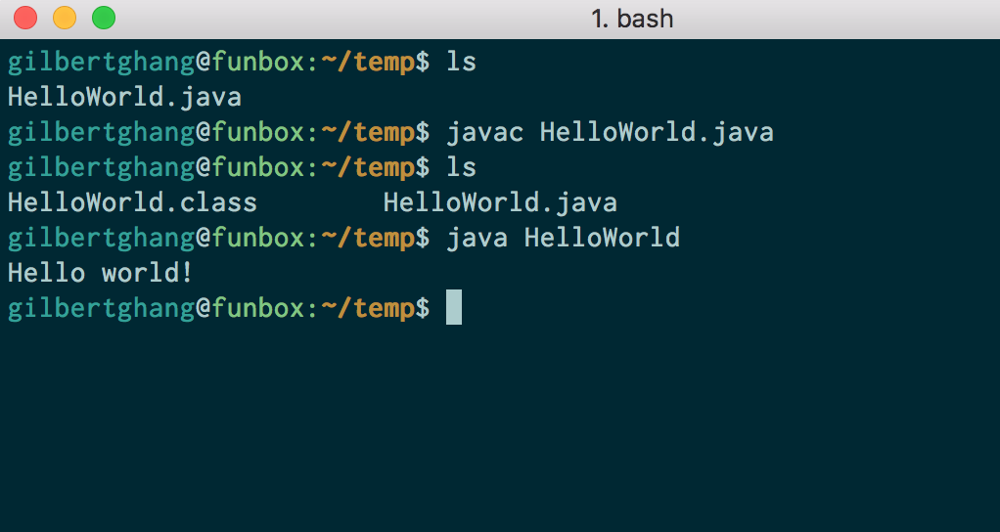
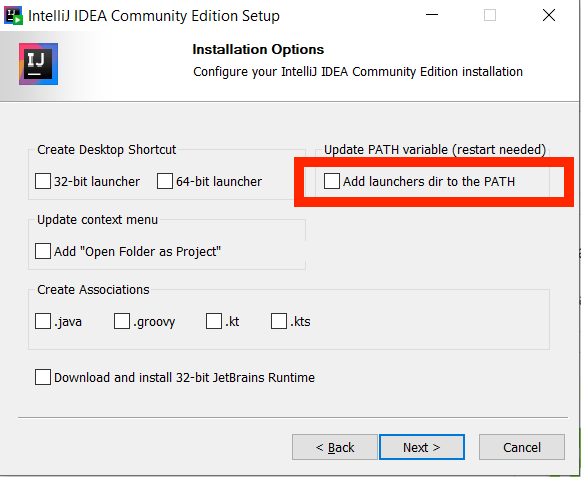
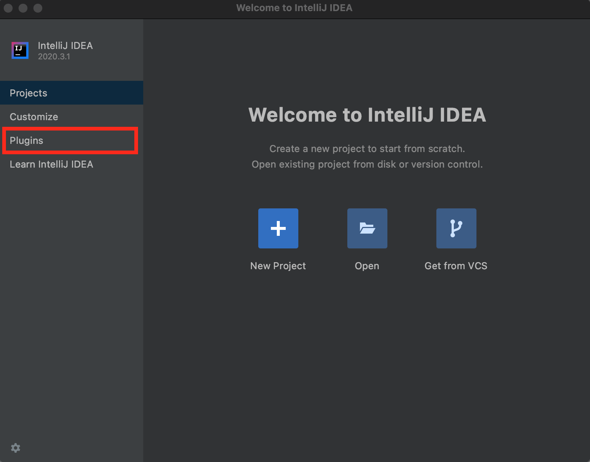
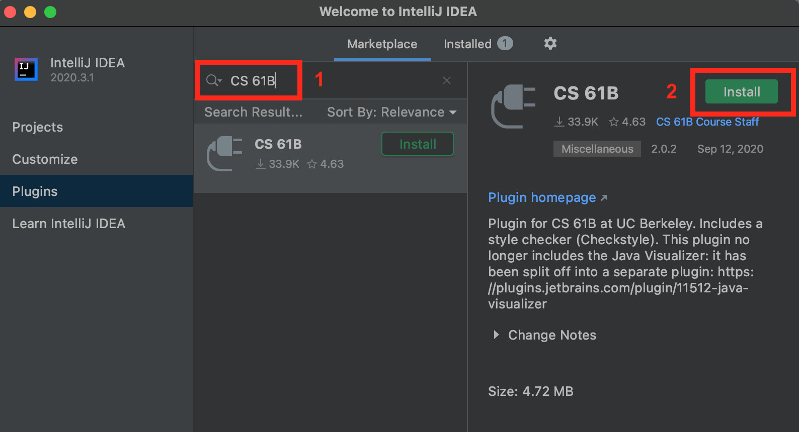
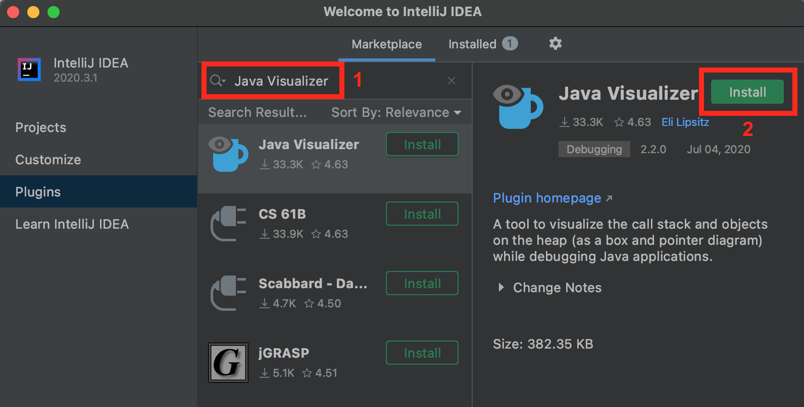

<!-- Generated by scripts/import-cs61b.mjs. Do not edit. -->


- [A. 安装文本编辑器（可选）](#a-安装文本编辑器可选)
- [B. 配置你的电脑](#b-配置你的电脑)
- [C. 学习使用终端（可选）](#c-学习使用终端可选)
- [D. 对步骤 B 中的配置进行试运行](#d-对步骤-b-中的配置进行试运行)
- [E. 安装 IntelliJ](#e-安装-intellij)
- [F. 安装 IntelliJ CS 61B 插件](#f-安装-intellij-cs-61b-插件)
- [G. 庆祝](#g-庆祝)

我们鼓励你在来参加 Lab 1 之前，尽可能独立完成这里的配置。如果你卡住了，请来 Office Hours 或实验课寻求帮助。

<a id="a-安装文本编辑器可选"></a>
## A. 安装文本编辑器（可选）

如果你还没有自己喜欢的文本编辑器，我们建议安装一个。

如今最流行的三个 GUI 文本编辑器似乎是：

1. Sublime Text（免费，但在你付费前会不断提醒你）：https://www.sublimetext.com/
2. Atom（免费）：https://atom.io/
3. Visual Studio Code（免费）：https://code.visualstudio.com/

要更全面地了解这些以及其他文本编辑器，请参阅[这篇文本编辑器评测](https://www.techradar.com/best/best-text-editors)。

具体选择并不十分重要，因为整门课程中我们只会使用文本编辑器几次。大多数时候，我们会使用另一种叫作 IDE 的工具。

你不必从上面的三个选项中选择。完全可以使用其他文本编辑器（系统内置文本编辑器、vim、emacs 等）。

<a id="b-配置你的电脑"></a>
## B. 配置你的电脑

根据你的操作系统，为了给电脑配置好 61B 环境，我们需要做几件事情。

你需要采取的具体步骤取决于你的操作系统。

- [Windows 说明](https://sp21.datastructur.es/materials/lab/lab1setup/windows.html)（[视频讲解](https://youtu.be/W6cBueC25mM)）
- [macOS 说明](https://sp21.datastructur.es/materials/lab/lab1setup/mac.html)
- [Linux 说明](https://sp21.datastructur.es/materials/lab/lab1setup/linux.html)

只有在完成上面与你的操作系统对应的说明后，才继续下一节。Windows 上的高级用户也可以使用新的 Bash for Windows 功能，但我们不会提供官方操作说明。请注意，如果你使用 Bash for Windows，就需要安装两次 Java（一次安装在 Bash for Windows 内部，另一次安装在 Windows 本身中，并按照上面的说明操作）。

<a id="c-学习使用终端可选"></a>
## C. 学习使用终端（可选）

如果你已经知道如何打开并使用终端，请跳过本节。

终端是一个应用程序，它既允许你运行各种程序，也允许你操作自己电脑中的文件。它是一个强大但也危险的工具，因此使用其中某些命令时请务必小心。在类 Unix 操作系统上，Terminal 应用程序会提供你所需的一切。例如在 macOS 上，你可以使用 Spotlight 搜索 Terminal 应用程序。

下面是一些你可能会在本课程中用到的重要命令：

- `cd`：更改你的工作目录

  ```bash
  cd hw
  ```

  这条命令会把你的目录切换到 `hw`。

- `pwd`：当前工作目录（present working directory）

  ```bash
  pwd
  ```

  如果你不确定自己当前在哪里，这条命令会告诉你当前所在目录的完整绝对路径。

- `.`：表示你的当前目录

  ```bash
  cd .
  ```

  这条命令会把你的目录切换到当前目录（也就是不做任何事情）。

- `..`：表示当前目录上一级的父目录

  ```bash
  cd ..
  ```

  这条命令会把你的目录切换到它的父目录。如果你位于 `/workspace/day1/`，该命令会把你放到 `/workspace/` 中。

- `ls`：列出目录中的文件/文件夹

  ```bash
  ls
  ```

  这条命令会列出当前目录中的所有文件和文件夹。

  ```bash
  ls -l
  ```

  这条命令会列出当前目录中的所有文件和文件夹，并显示时间戳和文件权限。它可以帮助你再次确认文件是否正确更新，或者更改文件的读、写、执行权限。

- `mkdir`：创建目录

  ```bash
  mkdir dirname
  ```

  这条命令会在当前目录内创建一个名为 `dirname` 的目录。

- `rm`：删除文件

  ```bash
  rm file1
  ```

  这条命令会从当前目录中删除 `file1`。如果 `file1` 不存在，它将不起作用。

  ```bash
  rm -r dir1
  ```

  这条命令会递归删除 `dir1` 目录。换句话说，它不仅会删除 `dir1` 本身，还会删除 `dir1` 中的所有文件和目录。使用这条命令时请小心！

- `cp`：复制文件

  ```bash
  cp lab1/original lab2/duplicate
  ```

  这条命令会复制 `lab1` 目录中的 `original` 文件，并在 `lab2` 目录中创建一个 `duplicate` 文件。

- `mv`：移动或重命名文件

  ```bash
  mv lab1/original lab2/original
  ```

  这条命令会把 `original` 从 `lab1` 移动到 `lab2`。与 `cp` 不同，`mv` 不会在 `lab1` 目录中留下原来的文件。

  ```bash
  mv lab1/original lab1/newname
  ```

  这条命令不会移动文件，而是把它从 `original` 重命名为 `newname`。

在命令行中导航时，还有一些其他有用的技巧：

- 你的 shell 可以通过 Tab 补全来帮你补全文件名和目录名。当你输入了一个不完整的名称（并且对应的内容已经存在）时，尝试按 `Tab` 键进行自动补全，或查看可能的名称列表。
- 如果你想重新输入最近使用过的同一条指令，请按键盘上的 `↑` 键，直到看到正确的指令。如果你正在重复执行指令，这可以节省输入时间。

<a id="d-对步骤-b-中的配置进行试运行"></a>
## D. 对步骤 B 中的配置进行试运行

让我们确保所有东西都能正常工作。

1. 首先打开终端。输入以下命令，检查 Git 是否是一个可识别的命令：

   ```bash
   git --version
   ```

   应该会打印出 Git 的版本号。如果你看到 `git: command not found` 或类似内容，请尝试打开一个新的终端窗口、重新启动电脑，或者重新安装 Git。

2. 接下来，让我们检查 `javac` 和 `java` 是否正常工作。`javac` 和 `java` 支持命令行编译，也就是说，它们让你能够直接从命令行运行 Java 程序。在实践中，大多数开发者会通过 IntelliJ 这样的 IDE 运行 Java 程序，因此本学期除了测试你的配置外，我们不会经常使用命令行编译。首先，在终端运行以下命令：

   ```bash
   mkdir ~/temp
   cd ~/temp
   ```

   1. 然后，在这个目录中打开你的操作系统文件浏览器。可以从命令行执行：
      - Mac：`open .`
      - Windows：`explorer .`
      - Ubuntu：`gnome-open .`
      - Linux Mint：`xdg-open .` 或 `mate .`

   2. 在这个新打开的目录中，创建一个名为 `HelloWorld.java` 的文件，内容如下：

      ```java
      public class HelloWorld {
          public static void main(String[] args) {
              System.out.println("Hello world!");
          }
      }
      ```

   3. 在终端中输入 `ls`（列出这个目录中的文件/文件夹）。你应该会看到列出的 `HelloWorld.java`。

   4. 运行 `javac HelloWorld.java`。如果这条命令产生了任何输出，那么你的配置可能出了问题。请尝试打开一个新的终端窗口或重新启动电脑。如果仍然不起作用，请参阅与你的操作系统对应的说明中的 Troubleshooting 一节。

   5. 输入 `ls`，你应该会同时看到 `HelloWorld.java` 和一个刚刚创建的 `HelloWorld.class`（`javac` 命令创建了这个文件）。

   6. 运行 `java HelloWorld`。它应该为你打印 `Hello world!`。如果没有打印，那么你的配置有问题！

   7. 完成了！你也可以根据需要删除 `temp` 文件夹及其内容。

下面的截图展示了我们在执行步骤 4–7 时希望看到的结果。如果你看到了与此类似的内容，那么 Java 配置就完成了。



<a id="e-安装-intellij"></a>
## E. 安装 IntelliJ

1. 从 [JetBrains](https://www.jetbrains.com/idea/download/) 网站下载 IntelliJ 的 Community Edition。

2. 选择适合你操作系统的版本后，点击下载，并等待几分钟让文件下载完成。

3. 运行安装程序。如果你安装了旧版本的 IntelliJ，此时应当卸载旧版本，并用这个较新的版本替换它。你可以使用所有默认安装选项，只有一个例外：如果你使用 Windows，请务必勾选 **Add launchers dir to the PATH**。如果你不小心漏掉了它，最简单的修复办法是卸载 IntelliJ，然后再次运行安装程序，并确保第二次勾选该选项。下面的图片只适用于 Windows。



<a id="f-安装-intellij-cs-61b-插件"></a>
## F. 安装 IntelliJ CS 61B 插件

启动 IntelliJ，开始配置过程。然后按照下面的步骤操作。

继续之前，请确保你运行的是 IntelliJ `2020.3.1` 或更高版本。较旧版本也可能能够工作，但我们自己没有测试过。

1. 在 Welcome 窗口中，点击左侧菜单里的 **Plugins** 按钮。

   

2. 在出现的窗口中，点击 **Marketplace**，然后在顶部的搜索栏中输入 `CS 61B`。此时应该会出现 CS 61B 插件条目。如果你点击了自动补全建议，出现的窗口可能与下图略有不同——这没有问题。

3. 点击绿色的 **Install** 按钮，等待插件下载并安装。

   

4. 现在搜索 `Java Visualizer`，然后点击绿色的 **Install** 按钮安装该插件。

   

5. 如果出现绿色的 **Restart IDE** 按钮，请点击它以完成安装。如果你没有看到 **Restart IDE** 按钮，直接继续即可。

要了解更多关于插件使用的信息，请阅读[插件指南](https://sp21.datastructur.es/materials/guides/plugin.html)。你现在不必阅读它。

<a id="g-庆祝"></a>
## G. 庆祝

呼！你终于完成所有配置了。现在可以继续 Lab 1。

---

原始页面：[https://sp21.datastructur.es/materials/lab/lab1setup/lab1setup](https://sp21.datastructur.es/materials/lab/lab1setup/lab1setup)
