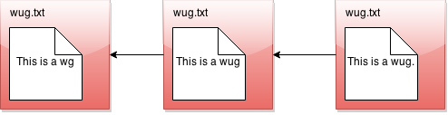
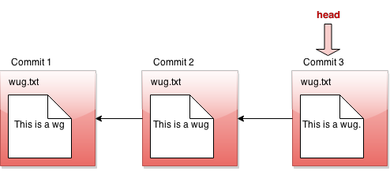
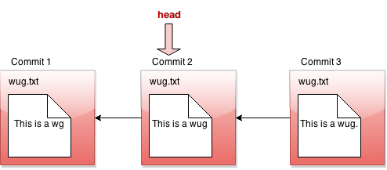
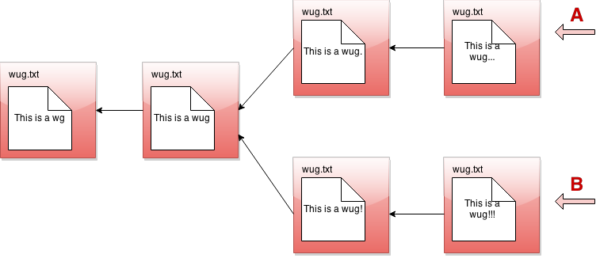
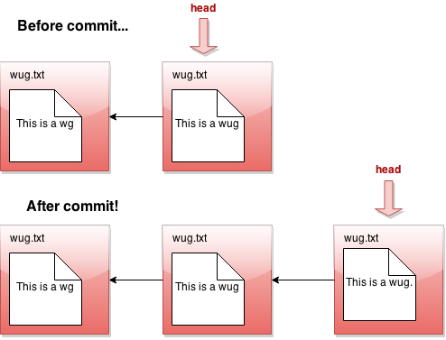
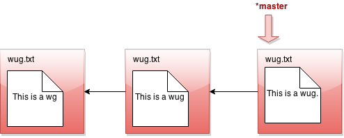
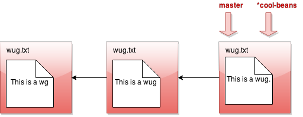
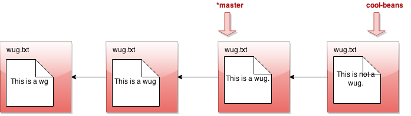
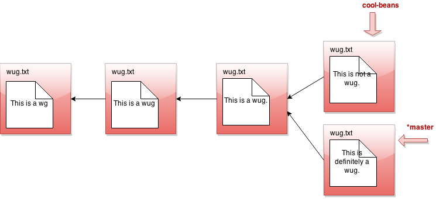
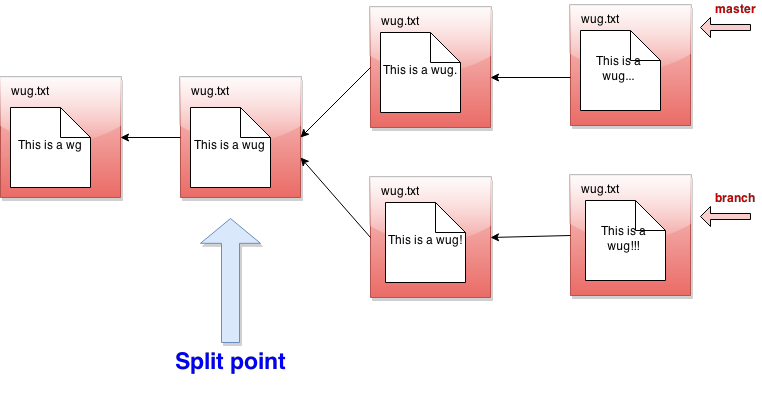

<!-- Generated by scripts/import-cs61b.mjs. Do not edit. -->


## 目录

- [关于本说明文档的一点说明](#关于本说明文档的一点说明)
- [Gitlet 概览](#gitlet-概览)
- [内部结构](#内部结构)
- [行为的详细规范](#行为的详细规范)
  - [总体规范](#总体规范)
- [命令](#命令)
  - [`init`](#init)
  - [`add`](#add)
  - [`commit`](#commit)
  - [`rm`](#rm)
  - [`log`](#log)
  - [`global-log`](#global-log)
  - [`find`](#find)
  - [`status`](#status)
  - [`checkout`](#checkout)
  - [`branch`](#branch)
  - [`rm-branch`](#rm-branch)
  - [`reset`](#reset)
  - [`merge`](#merge)
- [骨架代码](#骨架代码)
- [设计文档](#设计文档)
- [评分器说明](#评分器说明)
  - [阶段检查评分器](#checkpoint-grader)
  - [完整评分器](#完整评分器)
  - [Snaps 评分器](#snaps-评分器)
  - [额外加分](#额外加分)
- [关于本项目的其他注意事项](#关于本项目的其他注意事项)
- [文件处理](#文件处理)
- [序列化细节](#序列化细节)
- [测试](#测试)
- [在课程组参考实现上测试](#在课程组参考实现上测试)
- [理解集成测试](#理解集成测试)
  - [示例测试](#示例测试)
  - [为测试准备环境](#为测试准备环境)
  - [使用模式匹配输出](#使用模式匹配输出)
  - [测试小结](#测试小结)
- [调试集成测试](#调试集成测试)
  - [找到真正需要调试的那一次程序执行](#找到真正需要调试的那一次程序执行)
- [远程功能（额外加分）](#远程功能额外加分)
- [远程命令](#远程命令)
  - [`add-remote`](#add-remote)
  - [`rm-remote`](#rm-remote)
  - [`push`](#push)
  - [`fetch`](#fetch)
  - [`pull`](#pull)
- [I. 应避免的做法](#i-应避免的做法)
- [J. 致谢](#j-致谢)

<a id="关于本说明文档的一点说明"></a>
## 关于本说明文档的一点说明

这份说明文档相当长。前半部分会用较为冗长、细致的方式描述你需要支持的每一条命令；后半部分主要介绍测试细节，并给出一些建议。为了帮助你消化这些内容，我们准备了许多高质量视频，用来讲解说明文档中的不同部分，并建议你应该如何、从哪里开始。所有视频都会在文档中与其内容相关的位置给出链接；为了方便，我们也在这里统一列出。

请注意：其中一些视频制作于 2020 年春季，当时 Gitlet 是 Project 3，而 Capers 是 Lab 12；另一些视频会短暂提到 Hilfinger 教授版本的 CS 61B 配置，例如名为 `shared` 的远程仓库、名为 `repo` 的仓库等。请忽略这些内容，因为它们对本学期没有帮助。作业本身的实际内容并未改变。

- [Git 介绍——第 1 部分](https://www.youtube.com/watch?v=yWBzCAY_5UI)
- [Git 介绍——第 2 部分](https://www.youtube.com/watch?v=CnMpARAOhFg)
- [第 12 讲现场课程](https://youtu.be/fvhqn5PeU_Q)
- Gitlet 介绍播放列表
    - [第 1 部分](https://www.youtube.com/watch?v=-1gE2cNFhPA)
    - [第 2 部分](https://www.youtube.com/watch?v=GfmH9_8tM5w)
    - [第 3 部分](https://www.youtube.com/watch?v=dv5VdbIZKF8)
    - [第 4 部分](https://www.youtube.com/watch?v=k8jwbG8bE7Y)
    - [Itai 使用的幻灯片](https://cdn-uploads.piazza.com/attach/k5eevxebzpj25b/jqr7jm9igtc7l5/k97ipfmgmb3n/Gitlet_Slides.pdf)
- [Merge 概览与示例](https://www.youtube.com/watch?v=JR3OYCMv9b4&t=929s)
- [分支概览与示例](https://youtu.be/desB3AS6aZg)
- [测试](https://www.youtube.com/watch?v=uMYpuQuHGu0&t=752s)
- [设计持久化机制（文字笔记）](https://paper.dropbox.com/doc/Gitlet-Persistence--AyM0lOEaezWrTi7gG_Pt~bXcAg-zEnTGJhtUMtGr8ILYhoab)
- 2021 年春季答疑时间演示：
    - Gitlet 入门
        - [第 1 部分](https://youtu.be/6JVdbNZm0cM)
        - [第 2 部分](https://youtu.be/1d1yOSoTVAM)
    - [设计 Gitlet](https://youtu.be/G3YU9oY8PcU)
        - [笔记](https://sp21.datastructur.es/materials/proj/proj2/gitlet-design-notes.pdf)
    - [Merge](https://youtu.be/l0X5NgzAWYQ)

随着更多资源被制作出来，我们会继续在这里添加，因此请经常刷新页面！

<a id="gitlet-概览"></a>
## Gitlet 概览

**警告：** 在开始这个项目之前，请确保你已经完成 [Lab 6：Canine Capers](https://sp21.datastructur.es/materials/lab/lab6/lab6)。Lab 6 的目的就是作为本项目的入门练习，它会非常有助于你开始项目，并确保你的环境已经准备妥当。你还应该观看 [Lecture 12：Gitlet](https://youtu.be/fvhqn5PeU_Q)，其中介绍了许多对本项目很有用的思想。

在这个项目中，你将实现一个版本控制系统，它模仿流行版本控制系统 Git 的一部分基本功能。不过，我们的系统更小、更简单，因此我们把它命名为 **Gitlet**。

版本控制系统本质上是一个针对一组相关文件的备份系统。Gitlet 支持的主要功能包括：

1. **保存整个文件目录中的内容。**<br>
    在 Gitlet 中，这一操作称为 *committing（提交）*，保存下来的内容本身称为 *commits（提交）*。

2. **恢复一个或多个文件的某个版本，或者恢复整个提交。**<br>
    在 Gitlet 中，这称为 *checking out（检出）* 这些文件或该提交。

3. **查看备份历史。**<br>
    在 Gitlet 中，你通过一种叫做 *log（日志）* 的内容查看历史。

4. **维护彼此相关的提交序列，这些序列称为 *branches（分支）*。**

5. **把一个分支中所做的修改合并到另一个分支中。**

版本控制系统的意义在于：当你创建复杂项目——甚至并不复杂的项目——或者与其他人协作开发项目时，它能够帮助你。你会定期保存项目的不同版本。如果之后某个时间点你不小心把代码弄坏了，就可以把源码恢复到之前提交过的版本，同时不会丢失在那之后做过的所有修改。如果你的协作者在某个提交中做出了修改，你也可以把这些修改整合（*merge，合并*）到自己的版本中。

在 Gitlet 中，你并不是每次只提交单独一个文件。相反，你可以同时提交一组逻辑上相关的文件。我们喜欢把每个提交看作项目在某个时间点的完整**快照**。不过，为了简化说明，本文后面的许多例子一次只修改一个文件。你只需要始终记住：每次提交完全可以同时修改多个文件。

在这个项目中，把随时间产生的提交可视化会很有帮助。假设我们有一个项目，其中只有文件 `wug.txt`。我们先往里面添加一些文本并提交，然后修改文件并提交这些修改，再修改一次并再次提交。现在，我们总共保存了这个文件的三个版本，每个版本都比前一个更晚。可以把这些提交画成下面这样：



这里，我们画出的箭头表示：每个提交都包含某种指向前一个提交的引用。我们把前一个提交称为当前提交的 *parent commit（父提交）*，这个概念之后会非常重要。但现在，这张图看起来熟悉吗？没错，它就是一个链表！

Gitlet 背后的核心思想是：我们可以把文件不同版本的历史画成这样的列表。这样一来，恢复文件的旧版本就非常容易。你可以想象发出这样的命令：“Gitlet，请把文件恢复到提交 2 时的状态。”Gitlet 就会前往链表中的第二个结点，恢复其中保存的文件副本，同时删除第一个结点中存在但第二个结点中不存在的文件。

如果我们让 Gitlet 恢复到一个旧提交，那么链表最前端将不再反映文件的当前状态，这可能有些误导。为了解决这个问题，我们引入一种叫做 *head pointer（头指针，也写作 HEAD 指针）* 的东西。HEAD 指针记录我们当前位于链表中的哪个位置。通常，当我们不断创建提交时，HEAD 指针会一直停留在链表最前端，表示最新提交反映了文件的当前状态：



不过，假设我们恢复到提交 2 时的文件状态——严格来说，这对应你之后会在规范中看到的 `reset` 命令。我们会把 HEAD 指针向后移动来表示这一点：



这时，我们会说自己处于 *detached head state（分离 HEAD 状态）*。你以前可能遇到过这个说法，现在你知道它是什么意思了！

**3 月 5 日修订：** 请注意，在 Gitlet 中实际上没有办法进入分离 HEAD 状态，因为 Gitlet 不提供能够把 HEAD 指针直接移动到某个具体提交的 `checkout` 命令。`reset` 命令确实会移动到指定提交，但它同时也会移动分支指针。因此，在 Gitlet 中，你永远不会处于分离 HEAD 状态。

好了，如果 Gitlet 只能做到这些，它会是一个相当简单的系统。但 Gitlet 还有一项本领：它不仅能够维护文件较旧和较新的版本，还可以维护彼此**不同的发展版本**。假设你正在编写一个项目，并且对于接下来如何开发有两种想法：一种叫方案 A，另一种叫方案 B。Gitlet 允许你保存两个版本，并随时在它们之间切换。用图表示，大致如下：


这已经不再真正像链表，而更像一棵树。我们把它称为 *commit tree（提交树）*。继续沿用树的比喻，其中彼此分离的不同版本就称为树的 *branch（分支）*。你可以分别继续开发每一个版本：



这棵树中有两个指针，它们分别表示两个分支各自延伸到的最远位置。在任何时刻，只有其中一个指针处于当前激活状态，而它就是所谓的 HEAD 指针。HEAD 指针是位于当前分支最前端的指针。

以上就是对 Gitlet 系统的简要概览！如果你现在还没有完全理解，不必担心；上面的内容只是为了让你对系统要做什么有一个高层次的认识。下一节开始将详细说明这个项目具体要求你完成哪些内容。

不过，最后还要说明一点：提交树是**不可变的（immutable）**。一旦一个提交结点被创建，就永远不能销毁，也完全不能修改。我们只能向提交树中添加新内容，不能修改已有内容。这是 Gitlet 的一项重要特性！Gitlet 的目标之一，就是帮助我们保存内容，避免不小心把它们删除。

<a id="内部结构"></a>
## 内部结构

真实的 Git 会区分多种不同的**对象（objects）**。对我们而言，重要的对象包括：

- **blobs（数据对象）**：保存下来的文件内容。由于 Gitlet 会保存文件的许多版本，因此单个文件可能对应多个 blob；不同提交会跟踪其中不同的 blob。
- **trees（树对象）**：目录结构，把名称映射到 blob 和其他树（子目录）的引用。
- **commits（提交对象）**：由日志消息、其他元数据（提交日期、作者等）、对某棵树的引用，以及对父提交的引用组合而成。仓库还会维护从 *branch heads（分支头）* 到提交引用的映射，从而让某些重要提交拥有符号名称。

Gitlet 在 Git 的基础上做了进一步简化：

- 把 tree 的信息直接并入 commit，并且不处理子目录。因此，每个仓库只有一个“扁平”的普通文件目录。
- 只处理引用两个父提交的合并。在真实 Git 中，一个提交可以有任意数量的父提交。
- 元数据只包括时间戳和日志消息。因此，一个 commit 将由以下部分组成：日志消息、时间戳、从文件名到 blob 引用的映射、一个父提交引用，以及对于合并提交而言的第二个父提交引用。

在我们的场景中，每个对象——每个 blob 和每个 commit——都有一个唯一的整数 ID，用作该对象的引用。Git 有一项很有意思的特性：这些 ID 是**通用的**。这不同于典型的 Java 实现；两个内容完全相同的对象，在所有系统上都会拥有相同 ID。也就是说，我的电脑、你的电脑以及其他任何人的电脑都会为它们计算出完全相同的 ID。

对于 blob，“相同内容”意味着文件内容相同。对于 commit，它意味着元数据相同、名称到引用的映射相同，并且父提交引用也相同。因此，仓库中的对象被称为**内容可寻址（content addressable）**的对象。

Git 与 Gitlet 使用相同的方法实现这一点：它们使用一种叫做 **SHA-1（Secure Hash 1，安全散列算法 1）**的密码学哈希函数。SHA-1 可以从任意字节序列生成一个 160 位整数哈希值。密码学哈希函数具有这样的性质：想找到两个不同的字节流却让它们产生相同哈希值极其困难；事实上，仅仅给出一个哈希值，再反向找到任何能够生成该哈希值的字节流也极其困难。因此，我们基本上可以假设，任意两个不同内容的对象拥有相同 SHA-1 哈希值的概率为 $2^{-160}$，约等于 $10^{-48}$。简单来说，我们直接忽略发生哈希碰撞的可能性。因此，从理论上说，这个系统存在一个根本性缺陷，但在实践中它永远不会发生！

幸运的是，Java 已经提供了用于计算 SHA-1 值的库类，因此你不必处理实际算法。你只需要确保正确地为所有对象生成标识。特别是，这包括：

- 在对 commit 计算哈希时，把它的全部元数据和引用都包括进去。
- 通过某种方式区分 commit 的哈希与 blob 的哈希。一个不错的方法，是在 `.gitlet` 目录中设计经过认真考虑的目录结构。另一种方法，是在计算每种对象的哈希时额外加入一个单词，并让 blob 与 commit 使用不同的值。

顺便说一下，把 SHA-1 哈希值表示成 40 个字符的十六进制字符串后，它会非常适合作为文件名，用于在 `.gitlet` 目录中存储数据——后面还会进一步讨论。它也提供了一种方便的方法来比较两个文件（blob）是否内容相同：如果它们的 SHA-1 相同，我们就直接假定文件相同。

对于 remote（远程仓库，例如本学期一直使用的 `skeleton`），我们会直接使用其他 Gitlet 仓库。Push（推送）只意味着：把远程仓库中尚不存在的所有 commit 和 blob 复制到远程仓库，再重置一个分支引用。Pull（拉取）同理，只不过方向相反。在本项目中，远程功能属于额外加分内容，拿满基础分并不要求实现它们。

借助 Java 的**序列化（serialization）**设施，把内部对象从文件中读取出来或写入文件其实相当简单。接口 `java.io.Serializable` 本身没有任何方法，但只要一个类实现了它，Java 运行时就会自动提供一种方式，把该类对象转换为字节流，再把字节流恢复成对象。你可以使用 I/O 类 `java.io.ObjectOutputStream` 把字节流写入文件，再使用 `java.io.ObjectInputStream` 读取并反序列化。

“序列化”一词指的是：把某个任意结构——数组、树、图等——转换为顺序排列的字节序列。你应该已经在 Lab 6 中见过并练习过序列化。这里会采用非常相似的方法，因此在处理持久化和序列化时，请把自己的 Lab 6 代码作为参考资源。

下面是一张对本节所讨论结构的总结示意图。可以看到，每个 commit（矩形）都指向若干 blob（圆形），而 blob 中包含文件内容。commit 保存文件名、对这些 blob 的引用以及父提交链接。这些引用在 `.gitlet` 目录中使用 SHA-1 哈希值来表示，也就是图中 commit 上方以及 blob 下方的小型十六进制数字。较新的 commit 包含 `wug1.txt` 的更新版本，但它与较旧的 commit 共享 `wug2.txt` 的同一个版本。

你的 commit 类必须以某种方式存储图中展示的全部信息。认真选择内部数据结构，会让实现变得更容易或更困难，因此你非常值得花时间进行规划，思考保存一切内容的最佳方式。


<a id="行为的详细规范"></a>
## 行为的详细规范

<a id="总体规范"></a>
### 总体规范

我们对程序结构给出的唯一硬性要求是：必须存在一个名为 `gitlet.Main` 的类，并且它必须拥有 `main` 方法。

我们还为你提供了一些工具方法，用于完成多种主要与文件系统有关的任务，这样你可以把精力集中在项目逻辑上，而不是处理操作系统文件操作的各种特殊之处。

我们还添加了两个建议使用的类：`Commit` 和 `Repository`，帮助你开始。你当然可以编写额外的 Java 类来支持项目；如果愿意，也可以删除我们建议的类。不过，除了 JUnit 之外，不得使用任何外部代码，也不得使用 Java 之外的其他编程语言。你可以使用任何 Java 标准库内容，以及我们提供的工具。

**不要把所有事情都写在 `Main` 类中。** `Main` 类主要应该调用 `Repository` 类中的辅助方法。可以参考 Lab 6 中的 `CapersRepository` 和 `Main` 类，了解我们推荐的结构。

这份说明文档的大部分内容将描述 `Gitlet.java` 的 `main` 方法在收到不同 Gitlet 命令行参数时必须如何反应。不过，在逐条命令说明之前，下面先给出整个项目都应满足的一些总体规则：

- 为了让 Gitlet 工作，它需要一个位置存储文件的旧副本以及其他元数据。所有这些内容都**必须**保存在名为 `.gitlet` 的目录中，正如真实 Git 系统把此类信息保存在 `.git` 目录中一样。名称前带 `.` 的文件属于隐藏文件，在多数操作系统中默认不会显示。在 Unix 中，命令 `ls -a` 会显示这些文件。

    如果某个位置中存在 `.gitlet` 目录，就认为该位置已经初始化了 Gitlet 系统。大部分 Gitlet 命令——除 `init` 之外——只需要在已经初始化 Gitlet 的目录中工作，也就是存在 `.gitlet` 子目录的位置。不在 `.gitlet` 目录中的文件，包括你当前从仓库中取出并编辑的文件，以及打算加入仓库的文件，统称为**工作目录（working directory）**中的文件。

- 大多数命令都有运行时间或内存使用要求，你必须遵守这些要求。一些运行时间被描述为“相对于任何重要度量都是常数时间”。这里的重要度量包括：文件数量或文件大小的任意度量，以及提交数量的任意度量。

    你可以忽略序列化和反序列化所花费的时间，但有一个限制：序列化时间不能以任何方式依赖于曾经被添加、提交等操作处理过的全部文件的总大小。如果你不知道什么是序列化，请回顾 Lab 6。你也可以假设，从哈希表中取值是常数时间。

- 某些命令有规定的失败情况，并且要求输出指定错误消息。后面会给出这些消息的精确格式。所有错误消息都以句号结尾；由于自动评分会进行字面匹配，请务必包括句号。

    如果程序遇到其中任意失败情况，就必须打印对应错误消息，并且不能修改其他任何内容。**除列出的失败情况之外，你不需要处理其他错误情况。**

- 还有一些需要处理的失败情况并不属于某一条特定命令：

    - 如果用户没有输入任何参数，打印：

        ```text
        Please enter a command.
        ```

        然后退出。

    - 如果用户输入了不存在的命令，打印：

        ```text
        No command with that name exists.
        ```

        然后退出。

    - 如果用户输入命令时，操作数的数量或格式错误，打印：

        ```text
        Incorrect operands.
        ```

        然后退出。

    - 如果用户输入了一条要求位于已初始化 Gitlet 工作目录中的命令——也就是当前目录应包含 `.gitlet` 子目录——但当前并不在这样的目录中，打印：

        ```text
        Not in an initialized Gitlet directory.
        ```

- 某些命令会列出它们与真实 Git 的区别。说明文档不会穷尽 Gitlet 与 Git 的**全部**区别，但会指出一些较大、可能令人困惑或产生误导的区别。

- 除规范明确要求输出的内容外，**不要输出任何其他东西**。如果你输出了不必要的文字，自动评分器中的某些测试会失败。

- 如需立即退出程序，可以调用 `System.exit(0)`。例如，如果辅助函数执行到一半发生错误，而你希望 Gitlet 立即终止，可以调用这个函数。**注意：传入 `System.exit` 的参数始终应该是 `0`。** 在 CS 61C 中，你会学习这个参数——也叫错误码——的意义。

- 规范把某些命令归类为“危险命令”。危险命令可能覆盖普通文件，而不仅是元数据。例如，当用户要求 Gitlet 恢复文件的旧版本时，Gitlet 可能覆盖这些文件当前的版本。这只是提醒你一下，所以在测试这些命令前请戴好头盔 :)

<a id="命令"></a>
## 命令

下面将详细介绍你必须支持的每一条命令。请记住，优秀的程序员始终关心自己使用的数据结构。在阅读这些命令时，你首先应该思考：怎样存储数据，才能方便地支持这些命令；其次应该思考：是否有机会复用已经实现的命令或辅助逻辑。提示：在 Project 2 后面的部分中，你有大量机会复用前面已经写过的代码。

我们在一些命令旁列出了可能有帮助的课程讲次，但并不强制要求你使用这些课程中介绍的概念。一些更容易令人困惑的命令还配有概念测验，你绝对应该利用它们检查自己的理解。**这些测验不计分**，只是帮助你在尝试实现命令之前验证理解是否正确。

### `init`

- **用法：**

    ```bash
    java gitlet.Main init
    ```

- **描述：** 在当前目录中创建一个新的 Gitlet 版本控制系统。系统会自动从一个提交开始：这个提交不包含任何文件，其提交消息为：

    ```text
    initial commit
    ```

    必须完全如上书写，不添加标点。

    系统最初只有一个分支：`master`。`master` 一开始指向初始提交，并且 `master` 是当前分支。初始提交的时间戳应为 UTC 时间 1970 年 1 月 1 日星期四 00:00:00，日期格式可以自行选择。这个时间称为 “Unix Epoch（Unix 纪元）”，在内部用时间值 `0` 表示。

    由于 Gitlet 创建的所有仓库中的初始提交内容都完全相同，因此所有仓库会自动共享这个提交——它们的初始提交拥有相同 UID——并且所有仓库中的所有提交最终都会沿父提交追溯到它。

- **运行时间：** 相对于任何重要度量，都应为常数时间。

- **失败情况：** 如果当前目录中已经存在 Gitlet 版本控制系统，则中止操作。不得用新系统覆盖已有系统。输出：

    ```text
    A Gitlet version-control system already exists in the current directory.
    ```

- **危险吗？** 否。

- **课程组实现的代码行数：** 约 15 行。

### `add`

- **用法：**

    ```bash
    java gitlet.Main add [file name]
    ```

- **描述：** 把文件当前存在的内容副本加入**暂存区（staging area）**。暂存区会在 `commit` 命令的说明中进一步介绍。正因为如此，添加文件也叫做把文件 *stage for addition（暂存以待添加）*。

    如果一个已经暂存的文件再次被暂存，应该用新内容覆盖暂存区中原来的条目。暂存区必须位于 `.gitlet` 内部的某个位置。

    如果文件当前的工作目录版本，与当前提交中保存的版本完全相同，则不要把它暂存为待添加；如果它已经在暂存区中，则把它从暂存区移除。比如，某个文件先被修改并执行 `add`，然后又被改回原来的版本，就会出现这种情况。

    如果该文件在命令执行时被暂存为待删除——参见 `gitlet rm`——则执行 `add` 后，它不再处于待删除状态。

- **运行时间：** 最坏情况下，相对于所添加文件的大小应为线性时间，同时还可以有 $\lg N$ 的开销，其中 $N$ 是当前提交中的文件数量。

- **失败情况：** 如果文件不存在，输出：

    ```text
    File does not exist.
    ```

    然后退出，不能修改任何内容。

- **危险吗？** 否。

- **课程组实现的代码行数：** 约 20 行。

- **与真实 Git 的区别：** 在真实 Git 中，可以一次添加多个文件；在 Gitlet 中，一次只能添加一个文件。

- **建议复习的课程：** Lecture 16（集合、映射与抽象数据类型），Lecture 19（哈希）。

### `commit`

- **用法：**

    ```bash
    java gitlet.Main commit [message]
    ```

- **描述：** 保存当前提交以及暂存区中的被跟踪文件快照，以便将来恢复，同时创建一个新提交。我们说这个提交正在**跟踪（tracking）**这些已保存文件。

    默认情况下，每个提交中的文件快照与它的父提交完全相同：它会保持文件版本不变，不会自动更新它们。只有某个被跟踪文件在提交时已经暂存为待添加，新提交才会更新该文件的内容；此时，新提交会保存暂存的文件版本，而不是从父提交继承的版本。

    如果某个暂存为待添加的文件此前没有被父提交跟踪，新提交会保存它并开始跟踪它。最后，如果当前提交所跟踪的某个文件，通过下方的 `rm` 命令被**暂存为待删除（staged for removal）**，那么新提交可以不再跟踪它。

    最核心的结论是：默认情况下，一个提交与它的父提交拥有相同的文件内容。暂存的添加和删除，就是对新提交所做的更新。当然，提交日期以及通常情况下的提交消息也会与父提交不同。

    关于 `commit`，还有以下几点需要注意：

    - 创建提交后，清空暂存区。

    - `commit` 命令永远不会添加、修改或删除工作目录中的普通文件，`.gitlet` 目录中的内容除外。`rm` 命令则会删除普通文件，并把它们暂存为待删除，使它们在下一次 `commit` 后不再被跟踪。

    - 文件被暂存为待添加或待删除之后，工作目录中对这些文件所做的任何进一步修改都会被 `commit` 忽略。`commit` 只修改 `.gitlet` 目录中的内容。例如，如果你使用 Unix 的 `rm` 命令——而不是 Gitlet 自己的同名命令——删除了一个被跟踪文件，这不会影响下一次提交；下一次提交仍然会包含该文件此前被跟踪的版本。

    - 执行 `commit` 后，新提交作为新结点加入提交树。

    - 刚刚创建的提交成为“当前提交”，HEAD 指针现在指向它。之前的 HEAD 提交成为新提交的父提交。

    - 每个提交都应包含创建它时的日期和时间。

    - 每个提交都有一条与之关联的日志消息，用来描述提交中文件的修改。这条消息由用户指定。整条消息在传给 `main` 的 `args` 数组中必须只占一个元素。若消息中含有多个单词，用户必须用引号把它包起来。

    - 每个提交都由自己的 SHA-1 ID 标识。该 ID 的计算必须包括：提交中的文件 blob 引用、父提交引用、日志消息以及提交时间。

- **运行时间：** 相对于提交数量的任何度量，运行时间都应为常数。相对于提交正在跟踪的所有文件的总大小，运行时间不得差于线性时间。

    此命令还有一项内存要求：执行提交后，`.gitlet` 目录增加的大小不得超过提交时被暂存为待添加的文件总大小，额外元数据不计在内。这意味着，不要重复存储从父提交继承而来的文件版本。提示：blob 是内容可寻址的，请充分利用 SHA-1。

    你可以保存文件的完整副本；不需要担心只保存 diff（差异）之类的优化。

- **失败情况：** 如果没有任何文件被暂存，则中止并输出：

    ```text
    No changes added to the commit.
    ```

    每个提交都必须拥有非空白消息。如果消息为空，输出：

    ```text
    Please enter a commit message.
    ```

    被跟踪文件在工作目录中缺失或被修改，并不属于失败情况。请完全忽略 `.gitlet` 目录之外的当前状态。

- **危险吗？** 否。

- **与真实 Git 的区别：** 在真实 Git 中，因为 merge 的存在，提交可以拥有多个父提交；真实提交还包含更多元数据。

- **课程组实现的代码行数：** 约 35 行。

- **建议复习的课程：** Lecture 19（集合、映射与抽象数据类型），Lecture 19（哈希）。

下面是一次提交执行前后的示意图：



### `rm`

- **用法：**

    ```bash
    java gitlet.Main rm [file name]
    ```

- **描述：** 如果文件当前被暂存为待添加，则取消它的暂存。如果当前提交正在跟踪该文件，则把它暂存为待删除；如果用户尚未手动删除工作目录中的该文件，还要从工作目录中删除它。**除非当前提交正在跟踪它，否则不要删除该文件。**

- **运行时间：** 相对于任何重要度量，都应为常数时间。

- **失败情况：** 如果文件既没有被暂存，也没有被 HEAD 提交跟踪，输出：

    ```text
    No reason to remove the file.
    ```

- **危险吗？** 是。不过，如果你使用课程组提供的工具方法，最多只会伤害仓库文件，不会删除目录中的所有其他文件。

- **课程组实现的代码行数：** 约 20 行。

### `log`

- **用法：**

    ```bash
    java gitlet.Main log
    ```

- **描述：** 从当前 HEAD 提交开始，沿着提交树向后显示每个提交的信息，直到初始提交。只跟随第一父提交链接，忽略合并提交中的第二父提交。在普通 Git 中，这相当于：

    ```bash
    git log --first-parent
    ```

    这组提交结点称为该提交的**历史（history）**。对于历史中的每个结点，应显示提交 ID、提交创建时间以及提交消息。必须严格遵循下面的格式：

    ```text
    ===
    commit a0da1ea5a15ab613bf9961fd86f010cf74c7ee48
    Date: Thu Nov 9 20:00:05 2017 -0800
    A commit message.

    ===
    commit 3e8bf1d794ca2e9ef8a4007275acf3751c7170ff
    Date: Thu Nov 9 17:01:33 2017 -0800
    Another commit message.

    ===
    commit e881c9575d180a215d1a636545b8fd9abfb1d2bb
    Date: Wed Dec 31 16:00:00 1969 -0800
    initial commit

    ```

    每个提交前都有 `===`，每个提交后都有一个空行。与真实 Git 一样，每个条目显示提交对象唯一的 SHA-1 ID。

    提交中显示的时间戳应反映当前时区，而不是 UTC。因此，初始提交的时间戳不一定显示为 1970 年 1 月 1 日星期四 00:00:00，而可能显示成对应的太平洋标准时间。根据你居住的位置，你的时区可能不同，这没有问题。

    按照从新到旧的顺序显示提交，最新提交位于最上方。顺便说一下，Java 类 `java.util.Date` 和 `java.util.Formatter` 对获取与格式化时间很有帮助。请研究这些类，而不要尝试手动拼接日期。

    当然，你生成的 SHA-1 标识符会与示例不同，不必担心。测试会确认你输出的内容“看起来像”SHA-1 标识符，测试章节会进一步介绍。

    对于拥有两个父提交的合并提交，在第一行下方额外加入一行，例如：

    ```text
    ===
    commit 3e8bf1d794ca2e9ef8a4007275acf3751c7170ff
    Merge: 4975af1 2c1ead1
    Date: Sat Nov 11 12:30:00 2017 -0800
    Merged development into master.

    ```

    `Merge:` 后面的两个十六进制数字，分别是第一父提交和第二父提交 ID 的前七位，并且顺序必须如此。第一父提交是执行 merge 时你所在分支的提交；第二父提交来自被合并进来的分支。这与普通 Git 相同。

- **运行时间：** 相对于 HEAD 历史中的结点数量，应为线性时间。

- **失败情况：** 无。

- **危险吗？** 否。

- **课程组实现的代码行数：** 约 20 行。

下图展示了某个特定提交的历史。如果当前分支的 HEAD 指针恰好指向该提交，`log` 会输出图中圈出的提交信息：


历史会忽略其他分支以及当前提交之后的未来结点。现在有了“历史”的概念，我们可以更精确地描述前面所说的提交树不可变：**拥有某个特定 ID 的提交，其历史永远都不能发生任何改变。** 如果你把提交树理解成许多历史的集合，那么真正的意思就是：每一段历史都是不可变的。

### `global-log`

- **用法：**

    ```bash
    java gitlet.Main global-log
    ```

- **描述：** 与 `log` 类似，但显示曾经创建过的所有提交的信息。提交输出顺序无所谓。提示：`gitlet.Utils` 中有一个很有用的方法，可以帮助你遍历目录中的文件。

- **运行时间：** 相对于曾经创建的提交数量，应为线性时间。

- **失败情况：** 无。

- **危险吗？** 否。

- **课程组实现的代码行数：** 约 10 行。

### `find`

- **用法：**

    ```bash
    java gitlet.Main find [commit message]
    ```

- **描述：** 输出所有提交消息与给定消息相同的提交 ID，每行一个。如果存在多个这样的提交，则分别占一行输出。提交消息是单个操作数；如果消息中包含多个单词，应像 `commit` 命令一样用引号包起来。

    提示：本命令的提示与 `global-log` 相同。

- **运行时间：** 相对于提交数量，应为线性时间。

- **失败情况：** 如果不存在这样的提交，输出：

    ```text
    Found no commit with that message.
    ```

- **危险吗？** 否。

- **与真实 Git 的区别：** 真实 Git 中没有这条命令。通过对 `log` 输出使用 `grep`，可以实现类似效果。

- **课程组实现的代码行数：** 约 15 行。

### `status`

- **用法：**

    ```bash
    java gitlet.Main status
    ```

- **描述：** 显示当前存在的所有分支，并使用 `*` 标记当前分支。同时显示哪些文件已经暂存为待添加或待删除。输出必须严格遵循以下格式：

    ```text
    === Branches ===
    *master
    other-branch

    === Staged Files ===
    wug.txt
    wug2.txt

    === Removed Files ===
    goodbye.txt

    === Modifications Not Staged For Commit ===
    junk.txt (deleted)
    wug3.txt (modified)

    === Untracked Files ===
    random.stuff

    ```

    最后两个部分——未暂存的修改与未跟踪文件——在 2021 年春季课程中属于额外加分内容，共值 32 分。你可以把它们留空，只保留标题。

    各部分之间有一个空行，并且整个 `status` 输出最后也必须有一个空行。各条目应按照 Java 字符串比较规则的字典序排列；分支名前面的星号不参与排序。

    如果工作目录中的某个文件符合以下任意情况，则它属于“已修改但未暂存（modified but not staged）”：

    - 当前提交正在跟踪该文件；工作目录中的文件内容发生了变化，但没有被暂存。
    - 文件已经暂存为待添加，但工作目录中的当前内容与暂存内容不同。
    - 文件已经暂存为待添加，但在工作目录中被删除。
    - 文件没有被暂存为待删除；当前提交正在跟踪它，但它已从工作目录中删除。

    最后一类“Untracked Files（未跟踪文件）”指的是：文件存在于工作目录中，但既没有暂存为待添加，也没有被当前提交跟踪。这也包括已经被暂存为待删除、但后来又在 Gitlet 不知情的情况下重新创建的文件。

    忽略可能被放入工作目录的所有子目录，因为 Gitlet 不处理子目录。

- **运行时间：** 运行时间应只依赖于工作目录中的数据量、暂存为待添加或待删除的文件数量，以及分支数量。

- **失败情况：** 无。

- **危险吗？** 否。

- **课程组实现的代码行数：** 约 45 行。

- [概念测验（不涉及分支）](https://forms.gle/LSgBK5RAdRwhAqKK8)
- [概念测验（涉及分支）](https://forms.gle/RHUiRkSrtgysC6En8)

### `checkout`

`checkout` 是一种较为通用的命令，它会根据参数形式完成不同操作。一共有三种使用方式。下面每一部分中都会看到三个编号，它们分别对应三种用法。

- **用法：**

    1. `java gitlet.Main checkout -- [file name]`

    2. `java gitlet.Main checkout [commit id] -- [file name]`

    3. `java gitlet.Main checkout [branch name]`

- **描述：**

    1. 取出 HEAD 提交中该文件的版本，并把它写入工作目录。如果工作目录中已经存在同名文件，就覆盖它。新写入的文件版本不进入暂存区。

    2. 取出给定 ID 对应提交中的该文件版本，并把它写入工作目录。如果工作目录中已经存在同名文件，就覆盖它。新写入的文件版本不进入暂存区。

    3. 取出给定分支 HEAD 提交中的所有文件，并把它们写入工作目录。如果工作目录中已经有这些文件，就覆盖原有版本。命令完成后，给定分支成为当前分支（HEAD）。当前分支正在跟踪、但被检出分支中不存在的所有文件都应被删除。清空暂存区；但如果用户试图检出当前分支，则按照下方失败情况处理，不能清空暂存区。

- **运行时间：**

    1. 相对于被检出文件的大小，应为线性时间。

    2. 对于涉及整个提交快照的操作，相对于提交快照中所有文件的总大小，应为线性时间；相对于提交数量的任何度量，应为常数；相对于分支数量，也应为常数。

- **失败情况：**

    1. 如果文件不存在于 HEAD 提交中，中止并输出：

        ```text
        File does not exist in that commit.
        ```

        不得改变当前工作目录（CWD）。

    2. 如果不存在给定 ID 的提交，输出：

        ```text
        No commit with that id exists.
        ```

        否则，如果该文件不存在于给定提交中，输出与失败情况 1 相同的消息。不得改变当前工作目录。

    3. 如果不存在该名称的分支，输出：

        ```text
        No such branch exists.
        ```

        如果给定分支就是当前分支，输出：

        ```text
        No need to checkout the current branch.
        ```

        如果工作目录中存在一个在当前分支中未被跟踪的文件，并且此次 checkout 会覆盖它，输出：

        ```text
        There is an untracked file in the way; delete it, or add and commit it first.
        ```

        然后退出。必须在做任何其他事情之前完成此检查。不得改变当前工作目录。

- **与真实 Git 的区别：** 真实 Git 不会清空暂存区，并且会把检出的文件加入暂存区。此外，如果 checkout 会覆盖或撤销已经暂存的添加或删除，真实 Git 不会执行该操作。

`[commit id]` 是前面介绍过的十六进制数字。真实 Git 有一项很方便的功能：可以使用唯一前缀来缩写提交 ID。例如，在不存在其他对象的 SHA-1 也以相同六位数字开头的常见情况下，可以把：

```text
a0da1ea5a15ab613bf9961fd86f010cf74c7ee48
```

缩写为：

```text
a0da1e
```

你也应该让长度少于 40 个字符的提交 ID 支持这种行为。遗憾的是，如果用朴素方式实现，使用缩短 ID 可能会减慢对象查找，使查找文件的时间相对于对象数量变成线性。因此，对于使用缩短 ID 的命令，我们不考核运行时间。

不过，我们建议你查看真实 Git 仓库中的 `.git` 目录，尤其是 `.git/objects`，研究 Git 如何加快搜索。你可能会看到一种熟悉的数据结构，只不过它使用文件系统而不是指针来实现。

只有第 3 种用法——检出完整分支——会修改暂存区。其他两种情况下，原本暂存为待添加或待删除的文件仍保持其暂存状态。

- **危险吗？** 是！

- **课程组实现的代码行数：**
    - 第 1 种：约 15 行。
    - 第 2 种：约 5 行。
    - 第 3 种：约 15 行。

- [概念测验（不涉及分支）](https://forms.gle/mfHLnrU9VX349jnr7)
- [概念测验（涉及分支）](https://forms.gle/tbZuqDz7x3u41JhM6)

### `branch`

- **用法：**

    ```bash
    java gitlet.Main branch [branch name]
    ```

- **描述：** 创建一个拥有给定名称的新分支，并让它指向当前 HEAD 提交。分支本质上只是一个名称，它对应一个指向提交结点的引用——也就是一个 SHA-1 标识符。

    与真实 Git 一样，这条命令**不会**立即切换到刚创建的新分支。在你第一次调用 `branch` 之前，程序应当已经运行在默认分支 `master` 上。

- **运行时间：** 相对于任何重要度量，都应为常数时间。

- **失败情况：** 如果给定名称的分支已经存在，输出：

    ```text
    A branch with that name already exists.
    ```

- **危险吗？** 否。

- **课程组实现的代码行数：** 约 10 行。

下面详细看看 `branch` 做了什么。假设当前状态如下：



现在执行：

```bash
java gitlet.Main branch cool-beans
```

得到：


嗯……好像没发生多少事情。接着使用下面的命令切换到新分支：

```bash
java gitlet.Main checkout cool-beans
```



怎么还是好像没发生什么？！好吧，现在我们创建一次提交：修改一些文件，然后运行 `java gitlet.Main add ...`，再运行 `java gitlet.Main commit ...`。


我明明听说这里会出现分叉，可我看到的仍然是一条直线。怎么回事？或许应该使用下面的命令回到另一个分支：

```bash
java gitlet.Main checkout master
```



现在，再创建一次提交……



呼！这就是分支的完整思想。你理解发生什么了吗？创建分支所做的全部事情，就是给我们添加一个新指针。在任何时刻，这些指针中的一个被视为当前激活指针，也叫做 HEAD 指针，图中使用 `*` 表示。

我们可以通过 `checkout [branch name]` 切换当前激活的 HEAD 指针。每当提交时，我们都会在当前激活的 HEAD 提交后添加一个子提交，即使该提交已经存在另一个子提交。这样，一个提交可以拥有多个子提交，自然就形成了分叉行为。

可以在[这里](https://youtu.be/desB3AS6aZg)查看分支的视频示例和概览。

请**务必**确保你的 `branch`、`checkout` 与 `commit` 行为与上面的描述完全一致。这是 Gitlet 的核心功能，许多其他命令都依赖它。如果这些核心功能中的任何一部分损坏，自动评分器中的大量测试都会失败！

### `rm-branch`

- **用法：**

    ```bash
    java gitlet.Main rm-branch [branch name]
    ```

- **描述：** 删除给定名称的分支。这里只是删除与该分支关联的指针，并不意味着删除在该分支下创建的所有提交，也不删除其他相关内容。

- **运行时间：** 相对于任何重要度量，都应为常数时间。

- **失败情况：** 如果给定名称的分支不存在，中止并输出：

    ```text
    A branch with that name does not exist.
    ```

    如果试图删除当前所在分支，中止并输出：

    ```text
    Cannot remove the current branch.
    ```

- **危险吗？** 否。

- **课程组实现的代码行数：** 约 15 行。

### `reset`

- **用法：**

    ```bash
    java gitlet.Main reset [commit id]
    ```

- **描述：** 检出给定提交所跟踪的全部文件。删除当前提交正在跟踪、但目标提交中不存在的文件。同时，把当前分支的 HEAD 移动到该提交结点。

    关于使用 `reset` 后 HEAD 指针发生什么变化，可以回看开头的示例。`[commit id]` 可以像 `checkout` 一样使用缩写。执行后清空暂存区。

    从本质上讲，这条命令就是：检出任意指定提交，同时修改当前分支的 HEAD。

- **运行时间：** 相对于给定提交快照中全部被跟踪文件的总大小，应为线性时间；相对于提交数量的任何度量，应为常数时间。

- **失败情况：** 如果不存在给定 ID 的提交，输出：

    ```text
    No commit with that id exists.
    ```

    如果工作目录中的某个文件在当前分支中未被跟踪，并且此次 `reset` 会覆盖它，输出：

    ```text
    There is an untracked file in the way; delete it, or add and commit it first.
    ```

    然后退出。必须在进行任何其他操作之前完成这项检查。

- **危险吗？** 是！

- **与真实 Git 的区别：** 这条命令最接近真实 Git 的 `--hard` 选项：

    ```bash
    git reset --hard [commit hash]
    ```

- **课程组实现的代码行数：** 约 10 行。为什么能这么短？请记住，你应该复用代码 :)

### `merge`

- **用法：**

    ```bash
    java gitlet.Main merge [branch name]
    ```

- **描述：** 把给定分支中的文件合并到当前分支中。这个方法有些复杂，下面给出更详细的说明。

首先，考虑当前分支与给定分支的 **split point（分叉点）**。例如，假设 `master` 是当前分支，而 `branch` 是给定分支：



分叉点是当前分支 HEAD 与给定分支 HEAD 的一个**最新公共祖先（latest common ancestor）**：

- **公共祖先（common ancestor）**是这样一个提交：从两个分支 HEAD 出发，分别沿 0 条或更多父指针路径，都能够到达它。
- **最新公共祖先**是一个公共祖先，并且它不能是其他任何公共祖先的祖先。

例如，在上图中，最左侧提交也是 `master` 和 `branch` 的公共祖先，但它同时是右边紧邻提交的祖先，所以它不是最新公共祖先。

如果分叉点与给定分支的 HEAD 是同一个提交，则什么也不做；合并已经完成，操作输出下面的消息并结束：

```text
Given branch is an ancestor of the current branch.
```

如果分叉点就是当前分支的 HEAD，则效果相当于检出给定分支，操作输出下面的消息并结束：

```text
Current branch fast-forwarded.
```

否则，继续执行下方步骤。

1. **只在给定分支中被修改的文件**<br>
    如果某个文件从分叉点之后在给定分支中被修改，但在当前分支中没有被修改，则应把它改成给定分支中的版本——也就是从给定分支最前端的提交中检出该文件——并自动暂存。

    为了说得更清楚，“文件从分叉点之后在给定分支中被修改”意味着：该文件在给定分支 HEAD 提交中的内容，与它在分叉点提交中的内容不同。请记住，blob 是内容可寻址的。

2. **只在当前分支中被修改的文件**<br>
    如果某个文件从分叉点之后在当前分支中被修改，但在给定分支中没有被修改，则保持当前状态不变。

3. **两个分支以相同方式修改的文件**<br>
    如果某个文件在当前分支与给定分支中以完全相同的方式被修改——也就是两边现在内容相同，或者两边都删除了它——则合并不改变该文件。

    如果文件在当前分支和给定分支中都被删除，但工作目录中存在同名文件，则不要碰这个工作目录文件；在合并提交中，该文件仍保持不存在，不被跟踪，也不被暂存。

4. **分叉点不存在、只在当前分支中存在的文件**<br>
    保持当前状态不变。

5. **分叉点不存在、只在给定分支中存在的文件**<br>
    检出该文件，并把它加入暂存区。

6. **分叉点存在、当前分支未修改、给定分支已删除的文件**<br>
    删除该文件，并停止跟踪，也就是把它暂存为待删除。

7. **分叉点存在、给定分支未修改、当前分支已删除的文件**<br>
    继续保持该文件不存在。

8. **两个分支以不同方式修改的文件：发生冲突**<br>
    “以不同方式修改”可以指以下情况：

    - 两边都修改了文件内容，但新内容彼此不同；
    - 一边修改了文件，另一边删除了文件；
    - 分叉点中不存在该文件，但当前分支和给定分支都新增了同名文件，并且内容不同。

    遇到这种情况时，用以下内容替换冲突文件：

    ```text
    <<<<<<< HEAD
    contents of file in current branch
    =======
    contents of file in given branch
    >>>>>>>
    ```

    其中 `contents of...` 应替换为相应文件的实际内容，然后把结果暂存。把某个分支中已经删除的文件视为空文件。

    这里直接进行字符串拼接。如果文件末尾没有换行符，最终结果可能会像这样：

    ```text
    <<<<<<< HEAD
    contents of file in current branch=======
    contents of file in given branch>>>>>>>
    ```

    这完全没问题。那些创建不符合标准的病态文件、并且分不清行终止符与行分隔符的人，只能承担相应结果。

文件按照上述规则更新完成后，只要分叉点既不是当前分支 HEAD，也不是给定分支 HEAD，`merge` 就会自动创建提交，其日志消息为：

```text
Merged [given branch name] into [current branch name].
```

接着，如果合并过程中出现冲突，在终端——不是提交日志——输出：

```text
Encountered a merge conflict.
```

合并提交与其他提交不同：它会把合并前当前分支的 HEAD 记录为**第一父提交（first parent）**，并把命令行中给定、被合并进来的分支 HEAD 记录为第二父提交。

可以在[这里](https://www.youtube.com/watch?v=JR3OYCMv9b4&t=929s)查看这条命令的视频演示。

顺便说一下，希望你已经注意到：提交集合最初是简单序列，后来变成树，现在终于成为完整的**有向无环图（directed acyclic graph，DAG）**。

- **运行时间：** $O(N\lg N + D)$。其中，$N$ 是两个分支全部祖先提交的总数量，$D$ 是这些提交中所有文件的数据总量。

- **失败情况：**

    - 如果暂存区中存在待添加或待删除内容，输出：

        ```text
        You have uncommitted changes.
        ```

        然后退出。

    - 如果给定名称的分支不存在，输出：

        ```text
        A branch with that name does not exist.
        ```

    - 如果试图把一个分支与它自己合并，输出：

        ```text
        Cannot merge a branch with itself.
        ```

    - 如果 `merge` 创建的提交没有任何变化，导致普通 `commit` 失败，则直接让正常的提交错误消息输出即可。

    - 如果当前工作目录中有未跟踪文件会被此次 merge 覆盖或删除，输出：

        ```text
        There is an untracked file in the way; delete it, or add and commit it first.
        ```

        然后退出。必须在进行任何其他操作之前完成此检查。

- **危险吗？** 是！

- **与真实 Git 的区别：**

    - 真实 Git 在合并文件时处理得更加精细，只会在两个文件从分叉点之后都修改过的具体位置显示冲突。

    - 如果存在多个可能的分叉点，真实 Git 使用不同的规则决定选择哪一个。

    - 真实 Git 会强制用户先解决合并冲突，然后才能提交并完成合并。Gitlet 会直接把包含冲突标记的结果提交，因此你必须再创建一个单独提交来解决问题。

    - 如果工作目录中某个文件存在未暂存修改，而 merge 会修改它，真实 Git 会拒绝合并。你也可以选择实现这一检查，但课程测试不会覆盖该情况。

- **课程组实现的代码行数：** 约 70 行。

- [概念测验](https://forms.gle/Gu4FcFf1kfC7HYBa6)

- **建议复习的课程：** Lecture 19（集合、映射与抽象数据类型），Lecture 22（图遍历）。

<a id="骨架代码"></a>
## 骨架代码

提供的骨架代码相当精简，大部分只是基本为空的类。我们在其中加入了有帮助的 Javadoc 注释，提示你可能希望在各文件中包含哪些内容。

**你应该采用与 Capers 类似的结构：** `Main` 类本身不负责大量实际工作，而只是根据 `args` 调用其他方法。你完全可以删除其他类或添加自己的类，**但 `Main` 类必须保留**，否则测试将无法找到你的代码。

如果你不知道从哪里开始，建议重新查看 [Lab 6：Canine Capers](https://sp21.datastructur.es/materials/lab/lab6/lab6)。

<a id="设计文档"></a>
## 设计文档

由于这一次你不是从一个内容丰富的骨架项目开始，**我们要求所有人提交一份设计文档，描述自己的实现策略**。设计文档本身不计分，但在答疑时间或 Gitbug 中获得帮助之前，你必须拥有一份最新并且完整的设计文档。

如果你没有设计文档，或者它不是最新状态、内容不完整，我们就不能帮助你。这样做同时是为了你和课程组：写出设计文档后，你就拥有了一份明确路线图，知道自己将如何处理这项作业。

如果你需要帮助创建设计文档，我们当然可以帮你 :) 这里提供了[一些指导原则](https://sp21.datastructur.es/materials/proj/proj2/design.html)，以及一个来自 Capers Lab 的[示例](https://sp21.datastructur.es/materials/proj/proj2/capers-example)。

<a id="评分器说明"></a>
## 评分器说明

Gitlet 一共有三个评分器：阶段检查评分器、完整评分器，以及 Snaps 评分器。

<a id="checkpoint-grader"></a>
### 阶段检查评分器

截止时间：3 月 12 日晚上 11:59，可获得 16 分额外加分。

请提交到 Gradescope 上的 `Project 2: Gitlet Checkpoint` 自动评分作业。

它会测试：

- 你的程序能够成功编译。
- 你能够通过骨架代码中的示例测试：`testing/samples/*.in`。这些测试要求你实现：
    - `init`
    - `add`
    - `commit`
    - `checkout -- [file name]`
    - `checkout [commit id] -- [file name]`
    - `log`

此外，它还会对以下内容发表评论，但暂时不计分：

- 你是否通过代码风格检查。现阶段它会忽略 `TODO` 一类的注释；最终提交时不会忽略。

这些项目在最终提交中**会**计分。

**3 月 4 日修订：** 编译器警告没有问题。

你的 token 最大容量为 1，每 20 分钟恢复一个 token。测试失败时不会提供完整日志——也就是说，系统会告诉你失败了哪个测试，但不会给出额外消息。不过，由于这些测试文件本身已经提供，你可以直接在本地调试。

<a id="完整评分器"></a>
### 完整评分器

截止时间：4 月 2 日晚上 11:59，共 1600 分。

完整评分器是一套更加实质、更加全面的测试。你的 token 最大容量为 1，恢复速率如下：

- **2 月 20 日至 3 月 19 日：** 每 6 小时恢复一次。
- **3 月 20 日至 3 月 26 日：** 每 3 小时恢复一次。
- **3 月 26 日至 4 月 2 日：** 每 20 分钟恢复一次。

可以看到，与 Project 1 一样，使用评分器的次数受到限制。请善待自己，在开发过程中持续编写测试，不要过度依赖自动评分器来检查工作。

与阶段检查类似，完整评分器会用英文提示说明每个测试大致在做什么，但不会提供实际 `.in` 文件。

<a id="snaps-评分器"></a>
### Snaps 评分器

截止时间：4 月 9 日晚上 11:59。**在你推送 snaps 仓库并提交到 Snaps Gradescope 作业之前，Gradescope 分数不会转移到 Beacon。**

要推送 snaps 仓库，请运行：

```bash
cd $SNAPS_DIR
git push
```

推送 snaps 仓库后，Gradescope 上会有一项作业，要求你提交 `snaps-sp21-s***` 仓库，与 Project 1 类似。该要求只适用于完整评分器，不适用于阶段检查或额外加分作业。

即使忘记了，你也可以在截止日期之后的一周内完成。如果一周后仍未推送，就必须使用 slip days（延期天数）。

<a id="额外加分"></a>
### 额外加分

总共有 $16 + 32 + 64 = 112$ 分额外加分：

1. 阶段检查：16 分。
2. `status` 命令正确输出 `Modifications Not Staged For Commit` 与 `Untracked Files` 两个部分：32 分。
3. 远程命令：64 分。

本说明文档剩余部分包含帮助你开始项目的各种资源，请认真阅读。**关于测试和调试的章节会对你极其有帮助**，因为本项目的测试与调试方式和以前的项目不同，但也没有那么复杂。

<a id="关于本项目的其他注意事项"></a>
## 关于本项目的其他注意事项

呼！刚刚介绍了很多命令。不过不用担心，不是所有命令的难度都相同。每条命令旁边都标出了课程组完成该部分大约使用的代码行数——这里只计算该命令专属代码，不会重复计算多条命令共同复用的代码。

你不必担心让自己的实现与课程组方案完全一致，但这些行数能够帮助你了解各命令相对需要多少时间。`merge` 比其他命令更长，所以不要拖到最后一刻再实现！

这是一个很有挑战性的项目，如果你感到迷茫，不知道从哪里开始，完全不奇怪。因此，与平时相比，你可以和其他同学进行稍微更密切的合作，但要遵守以下限制：

- 在 `gitlet/Main.java` 文件开头附近的注释中，列出所有与你合作过的人。
- 不要共享具体代码。所有合作成员都必须独立写出自己版本的算法，这样课程组才能看出各实现有所不同。

Gitlet 的 Ed 汇总讨论串通常会变得非常长，但里面包含很多关于具体提交和实现方法的优质讨论。在这个项目中，你尤其应该利用班级人数多这一点，看看能否在汇总讨论串中找到与自己问题相似的人。你的问题极少会独特到从来没有其他人遇到过——除非它是与你个人设计有关的 Bug，这时应该提交 Gitbug。

到这里，说明文档已经给了你足够的信息，可以开始项目。不过，为了进一步帮助你，还有几件事需要了解。

<a id="文件处理"></a>
## 文件处理

本项目需要读取和写入文件。完成这些操作时，你可能会发现 `java.io.File` 和 `java.nio.file.Files` 很有帮助。事实上，`java.io` 与 `java.nio` 包中的许多内容都可能有用。

一定要阅读 `gitlet.Utils`，看看课程组还为你编写了哪些工具。稍微深入研究这些内容，你可能会找到几个能够让本项目 I/O 部分**简单得多**的方法。

有一项警告：如果你发现自己在使用 reader、writer、scanner 或 stream，那么很可能已经把事情弄得比实际需要更复杂。

<a id="序列化细节"></a>
## 序列化细节

仔细想想 Gitlet，你会发现每次运行程序只能执行一条命令。为了成功完成版本控制系统，你需要在多次命令运行之间记住整棵提交树。

这意味着，你不仅要设计一组类，在程序执行期间表示 Gitlet 的内部结构；还必须在 `.gitlet` 目录中设计一套对应的文件表示，使这些状态能够跨越程序的多次运行保存下来。

正如前面所说，一个方便的方法是：把需要永久存储的运行时对象序列化到文件中。Java 运行时会负责判断哪些字段需要转换为字节，以及如何转换。

你已经在 Lab 6 中完成过序列化，所以这里不会重复相关信息。如果对序列化的某个方面仍然不清楚，请重新阅读 Lab 6 说明文档的相关部分，并回看自己的代码。

不过，这里有一个令人烦恼的细节需要注意：**Java 序列化会顺着指针继续进行。** 也就是说，被传给 `writeObject` 的对象会被序列化并写入，它指向的任何对象也会一起被序列化。

例如，如果你在 commit 的内部表示中，直接使用指向其他 commit 对象的指针保存父提交，那么写入某个分支的 HEAD 时，会把整个提交子图中的所有 commit 和 blob 一起写进一个文件。这通常不是你想要的结果。

为了避免这一点，在运行时对象中不要使用 Java 对象指针引用 commit 和 blob，而应该使用 SHA-1 哈希字符串。在 Gitlet 运行期间，可以维护一个从这些字符串到相应运行时对象的映射。程序启动后创建并填充这张映射，但永远不要把它读取自文件或写入文件。

为了避免每次都查找对象所带来的麻烦和执行时间，你可能会觉得，在保存 SHA-1 字符串之外，再冗余地保存一些指向 commit 的对象指针会很方便。可以把这些指针保存在对象中，同时通过声明为 `transient` 避免将其写入文件，例如：

```java
private transient MyCommitType parent1;
```

这种字段不会被序列化。对象重新读入并反序列化后，它们会被设置为默认值——对引用类型来说就是 `null`。读取包含 transient 字段的对象后，你必须小心地把这些字段重新设置为正确值。

遗憾的是，用文本编辑器查看程序生成的序列化文件，对调试没有多少帮助，因为内容使用 Java 私有序列化编码保存，会是一串难以理解的字节。

因此，课程组提供了一个可能有帮助的简单调试工具：`gitlet.DumpObj`。具体信息请查看 `gitlet/DumpObj.java` 中的 Javadoc 注释。

<a id="测试"></a>
## 测试

你应该完整阅读这一节；为了方便，也提供了一个[视频](https://www.youtube.com/watch?v=uMYpuQuHGu0&t=752s)。

与往常一样，测试是项目的一部分。请务必为每条命令编写自己的集成测试，覆盖规范中规定的全部功能。你也可以自由添加任何单元测试。课程组不提供单元测试，因为单元测试高度依赖你的具体实现。

课程组提供了一个测试程序，让编写集成测试相对容易：`testing/tester.py`。它会解释扩展名为 `.in` 的测试文件。可以使用下面的命令运行全部测试：

```bash
make check
```

如果希望看到失败测试的更多信息，例如程序实际输出了什么，可以运行：

```bash
make check TESTER_FLAGS="--verbose"
```

如果希望运行单个测试，请进入 `testing` 子目录并运行：

```bash
python3 tester.py --verbose FILE.in ...
```

其中，`FILE.in ...` 是希望检查的一个或多个具体 `.in` 文件。

**运行这条命令时务必小心，**因为它不会重新编译你的代码。每次运行 `python` 命令之前，都必须先通过 `make` 编译代码。

下面的命令：

```bash
python3 tester.py --verbose --keep FILE.in
```

除了运行测试外，还会保留 `tester.py` 创建的目录，这样你可以检查测试脚本检测到错误时目录中的文件。如果测试没有出错，该目录仍会保留，并包含测试结束时的最终内容。

从效果上说，测试器实现了一种非常简单的**领域特定语言（domain-specific language，DSL）**，它包含以下命令：

- 在测试目录中设置或删除文件；
- 运行 `java gitlet.Main`；
- 把 Gitlet 的输出与指定输出或描述可能输出的正则表达式进行比较；
- 检查文件是否存在、是否不存在，以及文件内容是否正确。

运行：

```bash
python3 testing/tester.py
```

不提供任何操作数，程序会输出一条消息，说明这种测试语言的使用方法。

课程组在 `testing/samples` 目录中提供了一些示例。不要把自己的测试放进该子目录中，否则你可能会混淆课程组测试与你自己的测试——而你自己的测试也可能存在 Bug！

请把自己的全部 `.in` 文件放在 `testing` 目录下另一个名为 `student_tests` 的文件夹中。骨架代码里这个文件夹最初为空。

课程组还在 Makefile 中加入了一些内容，以适应不同人的系统设置。如果你的系统用 `python` 而不是 `python3` 来调用 Python 3，可以不修改 Makefile，直接使用：

```bash
make PYTHON=python check
```

也可以向 `tester.py` 传递额外参数，例如：

```bash
make TESTER_FLAGS="--keep --verbose"
```

<a id="在课程组参考实现上测试"></a>
## 在课程组参考实现上测试

从 2 月 28 日星期日开始，课程组提供了一种方法，让你可以使用课程组参考实现验证自己对命令的理解，也可以验证自己编写的测试！具体指南在[这里](https://sp21.datastructur.es/materials/guides/staff-gitlet)。

<a id="理解集成测试"></a>
## 理解集成测试

当你提交 Gitbug 或在答疑时间寻求帮助时，课程组首先会要求你提供一个失败的测试，因此学会在这个项目中编写测试至关重要。课程组投入了很多工作，让这一过程尽可能不痛苦，所以请花时间阅读本节，理解提供的测试，并学会自己编写高质量测试。

集成测试的格式与 Capers 中类似。如果你不知道 Capers 集成测试——也就是 `.in` 文件——如何工作，请先阅读 [Capers 说明文档](https://sp21.datastructur.es/materials/lab/lab6/lab6)中的相关部分。

提供的测试远远谈不上全面。如果想在项目中拿到满分，你肯定需要编写自己的测试。在写测试之前，先理解整个机制如何工作。

`testing` 目录的结构如下：

```text
.
├── Makefile
├── student_tests                    <==== 你的 .in 文件放在这里
├── samples                          <==== 课程组提供的示例 .in 文件
│   ├── test01-init.in               <==== 一个示例测试
│   ├── test02-basic-checkout.in
│   ├── test03-basic-log.in
│   ├── test04-prev-checkout.in
│   └── definitions.inc
├── src                              <==== 包含测试时使用的文件
│   ├── notwug.txt
│   └── wug.txt
├── runner.py                        <==== 帮助调试程序的脚本
└── tester.py                        <==== 测试程序的脚本
```

与 Capers 一样，这些测试会在 `testing` 目录中创建一个临时目录，并在其中运行 `.in` 文件指定的命令。如果使用 `--keep` 参数，这个临时目录会在测试结束后保留下来，供你检查。

与 Capers 不同的是，这一次需要处理工作目录中文件的**内容**。因此，`testing` 文件夹中多了一个名为 `src` 的目录。该目录保存许多预先填好内容的 `.txt` 文件，测试会使用这些特定内容。

后面会再次讨论它。现在只需要知道：`src` 保存实际文件内容；`samples` 保存示例测试——也就是阶段检查测试——的 `.in` 文件。编写自己的测试时，应把它们添加到骨架中最初为空的 `student_tests` 文件夹。

Gitlet 的 `.in` 文件拥有更多功能。下面是直接来自 `tester.py` 的说明：

```text
# ...  A comment, producing no effect.
I FILE Include.  Replace this statement with the contents of FILE,
      interpreted relative to the directory containing the .in file.
C DIR  Create, if necessary, and switch to a subdirectory named DIR under
      the main directory for this test.  If DIR is missing, changes
      back to the default directory.  This command is principally
      intended to let you set up remote repositories.
T N    Set the timeout for gitlet commands in the rest of this test to N
      seconds.
+ NAME F
      Copy the contents of src/F into a file named NAME.
- NAME
      Delete the file named NAME.
> COMMAND OPERANDS
LINE1
LINE2
...
<<<
      Run gitlet.Main with COMMAND ARGUMENTS as its parameters.  Compare
      its output with LINE1, LINE2, etc., reporting an error if there is
      "sufficient" discrepency.  The <<< delimiter may be followed by
      an asterisk (*), in which case, the preceding lines are treated as
      Python regular expressions and matched accordingly. The directory
      or JAR file containing the gitlet.Main program is assumed to be
      in directory DIR specifed by --progdir (default is ..).
= NAME F
      Check that the file named NAME is identical to src/F, and report an
      error if not.
* NAME
      Check that the file NAME does not exist, and report an error if it
      does.
E NAME
      Check that file or directory NAME exists, and report an error if it
      does not.
D VAR "VALUE"
      Defines the variable VAR to have the literal value VALUE.  VALUE is
      taken to be a raw Python string (as in r"VALUE").  Substitutions are
      first applied to VALUE.
```

对应的中文解释如下：

- `# ...`：注释，不产生任何效果。
- `I FILE`：Include（包含）。使用 `FILE` 的内容替换这一语句；文件路径相对于当前 `.in` 文件所在目录解释。
- `C DIR`：必要时创建测试主目录下名为 `DIR` 的子目录，并切换进去。如果省略 `DIR`，则切回默认目录。主要用于设置远程仓库。
- `T N`：把本测试余下部分中 Gitlet 命令的超时时间设置为 `N` 秒。
- `+ NAME F`：把 `src/F` 的内容复制到名为 `NAME` 的文件中。
- `- NAME`：删除名为 `NAME` 的文件。
- `> COMMAND OPERANDS ... <<<`：以命令及参数运行 `gitlet.Main`，然后把输出与中间的各行进行比较；如果差异足够明显则报告错误。`<<<` 后可以跟 `*`，表示把前面的各行作为 Python 正则表达式进行匹配。包含 `gitlet.Main` 的目录或 JAR 文件假定在 `--progdir` 指定的目录中，默认为 `..`。
- `= NAME F`：检查名为 `NAME` 的文件是否与 `src/F` 完全相同，否则报告错误。
- `* NAME`：检查 `NAME` 文件不存在；如果存在则报告错误。
- `E NAME`：检查名为 `NAME` 的文件或目录存在；如果不存在则报告错误。
- `D VAR "VALUE"`：定义变量 `VAR`，使其字面值为 `VALUE`。`VALUE` 会被视为原始 Python 字符串——类似 `r"VALUE"`——并且会先进行变量替换。

不用担心上面提到的 Python 正则表达式。后面会说明它其实相当直接，并展示一个使用示例。

下面通过一个测试，从头到尾看看会发生什么。我们分析 `test02-basic-checkout.in`。

<a id="示例测试"></a>
### 示例测试

第一次运行这个测试时，系统会创建一个最初为空的临时目录。目录结构现在如下：

```text
.
├── Makefile
├── student_tests
├── samples
│   ├── test01-init.in
│   ├── test02-basic-checkout.in
│   ├── test03-basic-log.in
│   ├── test04-prev-checkout.in
│   └── definitions.inc
├── src
│   ├── notwug.txt
│   └── wug.txt
├── test02-basic-checkout_0          <==== 刚刚创建
├── runner.py
└── tester.py
```

这个临时目录就是本次测试执行所使用的 Gitlet 仓库，因此测试会在其中添加内容，也会在其中运行全部 Gitlet 命令。

如果不删除该目录便第二次执行测试，系统会创建一个名为 `test02-basic-checkout_1` 的新目录，依此类推。每次测试执行都使用独立目录，所以不必担心不同测试相互干扰；这种情况不会发生。

测试的第一行是注释，因此忽略。

下一部分为：

```text
> init
<<<
```

这条命令不应有任何输出，因为 `>` 开头的第一行与 `<<<` 之间没有文字。不过，正如我们所知，它应该创建 `.gitlet` 文件夹。因此，目录结构现在是：

```text
.
├── Makefile
├── student_tests
├── samples
│   ├── test01-init.in
│   ├── test02-basic-checkout.in
│   ├── test03-basic-log.in
│   ├── test04-prev-checkout.in
│   └── definitions.inc
├── src
│   ├── notwug.txt
│   └── wug.txt
├── test02-basic-checkout_0
│   └── .gitlet                     <==== 刚刚创建
├── runner.py
└── tester.py
```

下一部分为：

```text
+ wug.txt wug.txt
```

这一行使用 `+` 命令。它会把右侧文件——来自 `src` 目录——的内容复制到临时目录中左侧名称对应的文件中；如果该文件不存在，则创建它。

这里左右两边恰好名称相同，但这不重要，因为它们位于不同目录。执行后，目录结构变为：

```text
.
├── Makefile
├── student_tests
├── samples
│   ├── test01-init.in
│   ├── test02-basic-checkout.in
│   ├── test03-basic-log.in
│   ├── test04-prev-checkout.in
│   └── definitions.inc
├── src
│   ├── notwug.txt
│   └── wug.txt
├── test02-basic-checkout_0
│   ├── .gitlet
│   └── wug.txt                     <==== 刚刚创建
├── runner.py
└── tester.py
```

现在可以看出 `src` 目录的用途：它包含测试可用的文件内容，使测试能够按需要设置 Gitlet 仓库。如果希望向某个文件加入特殊内容，应把这些内容写入 `src` 中一个名称合适的文件，然后使用与上面相同的 `+` 命令。

参数顺序很容易弄混，所以请记住：右侧引用 `src` 目录中的文件；左侧引用临时目录中的文件。

下一部分为：

```text
> add wug.txt
<<<
```

可以看到，它不应产生任何输出。此时，临时目录中的 `wug.txt` 已暂存为待添加。

你的 `test02-basic-checkout_0/.gitlet` 内部目录结构很可能会发生变化，因为你必须以某种方式持久化 `wug.txt` 已经暂存的事实。

下一部分为：

```text
> commit "added wug"
<<<
```

同样没有输出，`.gitlet` 内部的目录结构可能再次变化。

下一部分为：

```text
+ wug.txt notwug.txt
```

由于临时目录中已经存在 `wug.txt`，它的内容会被修改成 `src/notwug.txt` 中的内容。

下一部分为：

```text
> checkout -- wug.txt
<<<
```

同样不产生输出。不过，它应该把临时目录中 `wug.txt` 的内容恢复为最初的内容，也就是与 `src/wug.txt` 完全相同。下一条命令会对此进行断言：

```text
= wug.txt wug.txt
```

这是一条断言：如果左侧文件——仍然位于临时目录——与右侧文件——位于 `src` 目录——内容不完全相同，测试脚本就会报错，指出文件内容不正确。

还有另外两条可用的断言命令：

```text
E NAME
```

它断言临时目录中存在名为 `NAME` 的文件或文件夹。它不检查内容，只检查是否存在。如果不存在，测试失败。

```text
* NAME
```

它断言临时目录中**不存在**名为 `NAME` 的文件或文件夹。如果存在，测试失败。

这恰好是本测试的最后一行，所以测试结束。如果提供了 `--keep` 参数，临时目录会被保留；否则它会被删除。

如果你怀疑 `.gitlet` 目录没有被正确设置，或者持久化机制存在问题，通常应保留这个目录进行检查。

<a id="为测试准备环境"></a>
### 为测试准备环境

你很快会发现，测试某条命令可能需要大量重复的准备工作。例如，测试 `checkout` 命令时，可能需要：

1. 初始化 Gitlet 仓库。
2. 创建一个提交，其中包含某个文件的第一个版本（v1）。
3. 再创建一个提交，其中包含该文件的另一个版本（v2）。
4. 把文件检出为 v1。

如果还想测试某些文件在第二个提交中未被跟踪、但在第一个提交中被跟踪的情况，准备步骤可能更多。

节省时间的方法是：把所有这些准备操作放入一个文件，然后使用 `I` 命令。假设准备内容如下：

```text
# Initialize, add, and commit a file.
> init
<<<
+ a.txt wug.txt
> add a.txt
<<<
> commit "a is a wug"
<<<
```

应该把这个文件与其他测试放在 `samples` 目录中，但扩展名使用 `.inc`，例如命名为：

```text
samples/commit_setup.inc
```

如果使用 `.in` 扩展名，测试脚本会把它误认为一项独立测试并尝试单独运行。

在真正的测试文件中，只需要写：

```text
I commit_setup.inc
```

测试脚本就会运行该文件中的全部命令，并继续使用它创建的临时目录。这样能让测试保持简短，更容易阅读。

课程组提供了一个名为 `definitions.inc` 的 `.inc` 文件，其中为你设置了若干方便使用的模式。下面理解什么是模式。

<a id="使用模式匹配输出"></a>
### 使用模式匹配输出

测试中最容易令人困惑的部分，是 `log` 一类命令的输出。原因有几个：

1. 随着你修改代码、把更多内容纳入哈希，提交 SHA 会变化，因此如果写死 SHA，就必须不断修改测试。
2. 日期每次都会变化，因为时间只会向前移动。
3. 完整写出所有内容会让测试非常长。

实际上，我们并不关心精确文字是什么，只关心输出中是否存在某个 SHA，以及日期格式是否正确。因此，测试使用**模式匹配（pattern matching）**。

你不需要深入理解这一概念。高层次地说，我们会为某类文本——例如提交 SHA——定义一个模式，然后只检查输出是否符合该模式，而不关心实际字母和数字是什么。

下面展示怎样检查 `log` 输出是否符合模式：

```text
# First "import" the pattern defintions from our setup
I definitions.inc
# You would add your lines here that create commits with the
# specified messages. We'll omit this for this example.
> log
===
${COMMIT_HEAD}
added wug

===
${COMMIT_HEAD}
initial commit

<<<*
```

这与普通 Gitlet 命令块相同，区别是结尾使用 `<<<*`，告诉测试脚本使用模式。模式写成 `${PATTERN_NAME}`。

所有模式都定义在 `samples/definitions.inc` 中。你不需要理解模式本身，只需要知道它匹配什么。例如，`HEADER` 会匹配类似下面这样的提交头：

```text
commit fc26c386f550fc17a0d4d359d70bae33c47c54b9
```

这只是某个随机提交 SHA。

因此，在为测试创建预期输出时，只需要知道日志中有多少条记录，以及各提交消息是什么。

也可以对 `status` 命令使用类似方法：

```text
I definitions.inc
# Add commands here to setup the status. We'll omit them here.
> status
=== Branches ===
\*master

=== Staged Files ===
g.txt

=== Removed Files ===

=== Modifications Not Staged For Commit ===

=== Untracked Files ===
${ARBLINES}

<<<*
```

这里使用的模式是 `ARBLINES`，表示任意多行。如果你确实关心哪些文件未被跟踪，可以直接写出具体内容，不使用模式；但在这个例子中，我们可能更关心 `g.txt` 是否被暂存为待添加。

请注意 `master` 前写的是 `\*`。回忆一下，`status` 命令要求在 HEAD 分支前加 `*`。如果使用模式，就需要在预期输出中把 `*` 写成 `\*`。原因超出本课程范围，这叫做对星号进行“转义（escaping）”。

如果不使用模式——也就是命令块以 `<<<` 而不是 `<<<*` 结束——则可以直接写 `*`，不需要反斜杠。

这些模式还能完成的最后一件事，是“保存”匹配到的一部分。

**警告：** 这可能看起来像魔法，课程组完全不在意你是否理解它如何工作。只需要知道它有效，并且可以使用。可以直接复制提供测试中的相关部分，不必从零编写。

如果执行 `checkout`，需要使用 SHA 标识符指定检出哪个提交或从哪个提交取文件。但前面使用了模式，因此创建测试时并不知道实际 SHA。这会造成问题。下面利用 `test04-prev-checkout.in` 看看怎样“捕获”或“保存” SHA：

```text
I definitions.inc
# Each ${COMMIT_HEAD} captures its commit UID.
# Not shown here, but the test sets up the log by making many commits
# with specific messages.
> log
===
${COMMIT_HEAD}
version 2 of wug.txt

===
${COMMIT_HEAD}
version 1 of wug.txt

===
${COMMIT_HEAD}
initial commit

<<<*
```

这会在 `log` 命令执行时捕获 UID（SHA）。命令运行结束后，可以使用 `D` 命令把这些 UID 定义为变量：

```text
# UID of second version
D UID2 "${1}"
# UID of first version
D UID1 "${2}"
```

请注意编号看起来是反过来的：编号从 1 开始，并从日志最上方开始。因此，当前版本——也就是第二个版本——被定义为 `${1}`。我们不关心初始提交，所以不用捕获它的 UID。

现在，可以在 checkout 中使用这个定义捕获到的 SHA：

```text
> checkout ${UID1} -- wug.txt
<<<
```

接着就可以添加断言，确认 checkout 是否成功。

<a id="测试小结"></a>
### 测试小结

测试脚本还支持许多更复杂的操作，不过上面这些已经足够让你编写非常好的测试。可以参考提供的测试开始编写，也可以在 Ed 上讨论测试某项功能的高层思路。

你还可以分享自己的 `.in` 文件，但在发布之前请确保它们正确，并添加注释，使其他学生和课程组人员能够看懂测试过程。

<a id="调试集成测试"></a>
## 调试集成测试

回忆 [Lab 6](https://sp21.datastructur.es/materials/lab/lab6/lab6) 中的内容：在这种新测试环境下，调试集成测试与以往稍有不同。`runner.py` 脚本的工作方式与 Capers 中完全相同，因此应该阅读 Lab 6 说明文档中的相应部分，并观看那里链接的视频。

下面介绍一些调试策略。

<a id="找到真正需要调试的那一次程序执行"></a>
### 找到真正需要调试的那一次程序执行

每个测试会多次运行你的程序，而其中每一次运行都有可能引入 Bug。首要任务，是识别真正引入 Bug 的那一次程序执行。

这句话的意思是：假设你没有通过一个检查 `status` 命令的测试。输出中只有一个文件存在差异：你的程序说它是未跟踪文件，而测试认为它应该已经暂存为待添加。

**这并不意味着 `status` 命令一定存在 Bug。** `status` 当然有可能出错，但并不能保证问题就在这里。也可能是 `add` 命令没有正确持久化“该文件已经暂存为待添加”这一事实！如果问题在 `add` 中，那么即使 `status` 的实现完全正确，程序仍然会失败。

因此，找到正确的——也就是真正有 Bug 的——那一次执行非常重要。应该怎样做？使用 `runner.py` 脚本逐次执行测试中的每一条程序命令，并在每次执行后查看临时目录，确认所有内容都已经正确写入文件。

对于序列化对象，这会更困难，因为正如我们所知，它们的内容是一串无法直接理解的字节。对此，可以在序列化发生时检查对象是否拥有正确内容。你甚至可能发现：自己**根本没有执行序列化**！

最终，你应该能够找到 Bug。如果仍然找不到，这时才应该前往答疑时间或提交 Gitbug。

请注意：答疑时间中，每位学生最多只能获得 10 分钟帮助。如果你遇到一个很难处理的 Bug，认为助教需要超过 10 分钟才能解决，就应该改为提交 Gitbug，并提供**尽可能多的信息**。Gitbug 写得越好，得到的回复就会越好、越快。

不要忘记更新设计文档。课程组会拒绝处理没有最新、完整设计文档的 Gitbug。

<a id="远程功能额外加分"></a>
## 远程功能（额外加分）

本项目的主要目标是模仿 Git 的本地功能。这些功能很有用，因为它们让你能够备份自己的文件，并维护同一文件的多个版本。

不过，Git 真正强大的地方其实在于它的**远程功能（remote features）**，因为这些功能允许人们通过互联网协作。基本思想是：你和朋友可以共同开发同一个代码库。如果你修改了文件，就可以把变化发送给朋友，反之亦然。你们还可以共享由双方所有修改组成的历史。

为了获得额外加分，可以实现一些基本远程命令：

- `add-remote`
- `rm-remote`
- `push`
- `fetch`
- `pull`

完成这些命令可获得 64 分额外加分。

在完成项目其他全部内容之前，不要尝试或规划额外加分功能。

根据你在主项目中采用的设计有多灵活，这 64 分额外加分可能并不值得相应工作量。课程组当然也不期望所有人都完成它。

课程组会优先帮助学生完成主项目。如果你在做额外加分，就需要比大多数学生更独立一些。

<a id="远程命令"></a>
## 远程命令

关于远程命令，先说明几点：

- 不考核运行时间。不过，为了自己的成长，请不要采用明显荒谬的实现。
- 所有命令都比真实 Git 中对应命令简单得多，因此通常不会逐项列出与 Git 的具体差异，但请意识到这些差异确实存在。

下面介绍各条命令。

### `add-remote`

- **用法：**

    ```bash
    java gitlet.Main add-remote [remote name] [name of remote directory]/.gitlet
    ```

- **描述：** 使用给定的远程名称，保存给定的登录或位置信息。之后，如果使用该远程名称执行 push 或 pull，程序就会尝试使用对应的 `.gitlet` 目录。

    例如：

    ```bash
    java gitlet.Main add-remote other ../testing/otherdir/.gitlet
    ```

    这样可以编写在任何位置——无论是个人电脑还是评分程序环境——都能工作的远程仓库测试。

    在这些命令中始终使用正斜杠 `/`。程序应把所有正斜杠转换为当前系统的路径分隔符：Unix 中为正斜杠，Windows 中为反斜杠。Java 很贴心地通过类变量 `java.io.File.separator` 提供了这个字符。

- **失败情况：** 如果给定名称的 remote 已存在，输出：

    ```text
    A remote with that name already exists.
    ```

    不需要检查用户名和服务器信息是否合法。

- **危险吗？** 否。

### `rm-remote`

- **用法：**

    ```bash
    java gitlet.Main rm-remote [remote name]
    ```

- **描述：** 删除与给定远程名称关联的信息。其思想是：如果以后希望修改一个已经添加的 remote，必须先删除它，再重新添加。

- **失败情况：** 如果给定名称的 remote 不存在，输出：

    ```text
    A remote with that name does not exist.
    ```

- **危险吗？** 否。

### `push`

- **用法：**

    ```bash
    java gitlet.Main push [remote name] [remote branch name]
    ```

- **描述：** 尝试把当前分支中的提交追加到给定远程仓库的给定分支末尾。具体如下。

    只有当远程分支的 HEAD 位于当前本地 HEAD 的历史中时，这条命令才能工作。这意味着，本地分支中存在一些位于远程分支之后的未来提交。

    此时，把这些未来提交追加到远程分支。然后，远程仓库应重置到被追加提交的最前端，使远程 HEAD 与本地 HEAD 相同。这个过程称为 **fast-forwarding（快进）**。

    如果远程机器上的 Gitlet 系统存在，但没有输入的分支，则直接在远程 Gitlet 中添加该分支。

- **失败情况：** 如果远程分支的 HEAD 不在当前本地 HEAD 的历史中，输出：

    ```text
    Please pull down remote changes before pushing.
    ```

    如果远程 `.gitlet` 目录不存在，输出：

    ```text
    Remote directory not found.
    ```

- **危险吗？** 否。

### `fetch`

- **用法：**

    ```bash
    java gitlet.Main fetch [remote name] [remote branch name]
    ```

- **描述：** 从远程 Gitlet 仓库把提交下载到本地 Gitlet 仓库。

    从根本上说，它会复制远程仓库给定分支中的所有 commit 与 blob，只复制当前仓库中尚不存在的对象，并在本地 `.gitlet` 中把它们放进一个名为：

    ```text
    [remote name]/[remote branch name]
    ```

    的分支中，这与真实 Git 相同。

    然后，让 `[remote name]/[remote branch name]` 指向远程分支的 HEAD 提交，从而把远程分支的内容复制到当前仓库。如果本地此前不存在这个分支，就创建它。

- **失败情况：** 如果远程 Gitlet 仓库中不存在给定分支，输出：

    ```text
    That remote does not have that branch.
    ```

    如果远程 `.gitlet` 目录不存在，输出：

    ```text
    Remote directory not found.
    ```

    > 原说明文档中的 HTML 注释指出：这里可能还需要为“remote 名称没有定义”补充失败情况，但规范正文没有正式给出对应消息。

- **危险吗？** 否。

### `pull`

- **用法：**

    ```bash
    java gitlet.Main pull [remote name] [remote branch name]
    ```

- **描述：** 按照 `fetch` 命令的行为获取分支 `[remote name]/[remote branch name]`，然后把获取到的分支合并进当前分支。

- **失败情况：** `fetch` 与 `merge` 的全部失败情况合并在一起。

- **危险吗？** 是！

<a id="i-应避免的做法"></a>
## I. 应避免的做法

经验表明，下面这些做法会让你遭受无穷无尽的痛苦：程序无法工作、Bug 很难找到，有时甚至无法稳定复现——也就是所谓的 “Heisenbugs（海森堡 Bug）”。

1. 由于你可能会把各种信息——例如提交——保存在文件中，因此可能想使用看起来很方便的文件系统操作，例如列出目录内容，来依次遍历它们。

    请小心。`File.list` 和 `File.listFiles` 等方法会以**未定义顺序**返回文件名。如果用这些方法实现 `log` 命令，尤其可能得到随机结果。

2. Windows 用户尤其要注意：Unix 或 macOS 的文件分隔符是 `/`，Windows 中则是 `\`。

    如果程序通过手动拼接目录名、文件名以及显式的 `/` 或 `\` 来构造路径，那么可以确定，它至少会在其中一种系统上无法工作。

    Java 提供了与系统相关的文件分隔符：

    ```java
    System.getProperty("file.separator")
    ```

    也可以使用 `File` 的多参数构造函数。

3. 序列化时要小心使用 `HashMap`！`HashMap` 内部元素的顺序是不确定的。解决方法是使用 `TreeMap`，它始终保持相同顺序。更多信息见[这里](https://stackoverflow.com/questions/5993752/hashmap-serialization-and-deserialization-changes)。

<a id="j-致谢"></a>
## J. 致谢

感谢 Alicia Luengo、Josh Hug、Sarah Kim、Austin Chen、Andrew Huang、Yan Zhao、Matthew Chow，尤其是 Alan Yao、Daniel Nguyen 和 Armani Ferrante 为本项目提供反馈。也感谢 Git 如此优秀。

本项目在很大程度上受到 Philip Nilsson 撰写的一篇优秀文章启发。原页面在此处使用了未能正常解析的引用标记 `[this][Nilsson Article]`。

本项目由 Joseph Moghadam 创建。2015 年秋季、2017 年秋季和 2019 年秋季的修改由 Paul Hilfinger 完成。

---

原始页面：[https://sp21.datastructur.es/materials/proj/proj2/proj2](https://sp21.datastructur.es/materials/proj/proj2/proj2)
